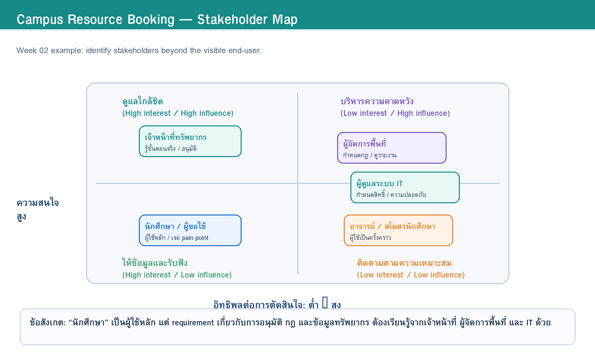
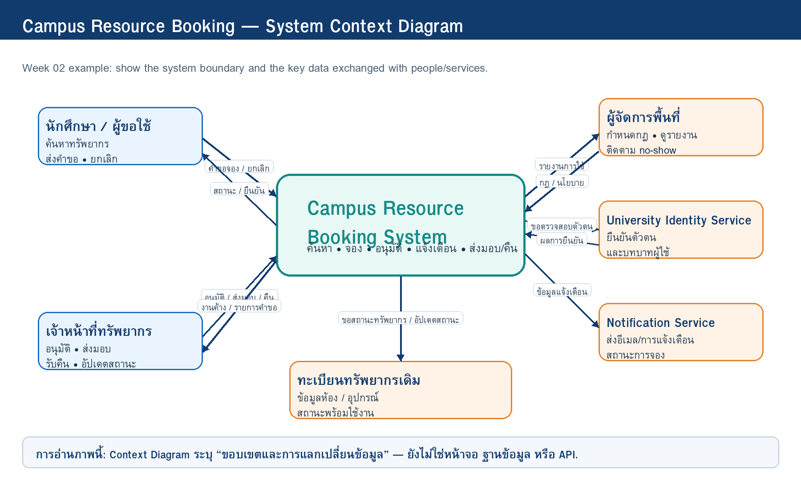

# Week 02 — Stakeholder, Context and Scope

> **Team:** Team Example — Campus Resource Booking  
> **Case:** ระบบจองพื้นที่ทำงานกลุ่มและอุปกรณ์การเรียนรู้ในมหาวิทยาลัย  
> **Version:** v0.1 (Teaching Example)  
> **Last updated:** 2026-07-05  
> **Diagram source of truth:** Draw.io files in `diagrams/`

---

## 1. Problem Frame (revised)

### 1.1 สถานการณ์ปัจจุบัน

นักศึกษาที่ต้องการใช้ห้องทำงานกลุ่มหรือยืมอุปกรณ์ เช่น โปรเจกเตอร์ สาย HDMI และจอเสริม ต้องสอบถามสถานะผ่านหลายช่องทาง เช่น ป้ายหน้าห้อง กลุ่ม LINE หรือเจ้าหน้าที่ ทำให้ข้อมูลว่างไม่เป็นปัจจุบัน มีการจองซ้ำ และไม่ทราบว่าใครต้องอนุมัติหรือเงื่อนไขใดใช้กับทรัพยากรแต่ละประเภท

### 1.2 ใครได้รับผลกระทบ

- **นักศึกษา / ผู้ขอใช้:** เสียเวลาสอบถามหลายช่องทาง และอาจเดินทางไปแล้วพบว่าห้องหรืออุปกรณ์ไม่ว่าง
- **เจ้าหน้าที่ทรัพยากร:** ต้องตอบคำถามเดิมซ้ำ ตรวจสอบตารางจากหลายไฟล์ และติดตามการส่งคืนด้วยมือ
- **ผู้จัดการพื้นที่:** มองไม่เห็นภาพรวมการใช้งาน อัตราการไม่มาตามนัด และปัญหาการใช้ทรัพยากร
- **ผู้ดูแลระบบ IT:** ต้องคุมสิทธิ์ผู้ใช้ ความปลอดภัย และการเชื่อมบัญชีสถาบัน

### 1.3 Problem Statement

> กระบวนการจองพื้นที่ทำงานกลุ่มและอุปกรณ์การเรียนรู้ยังไม่มีข้อมูลสถานะที่รวมศูนย์และตรวจสอบได้ ทำให้เกิดการจองชนกัน การสื่อสารล่าช้า ภาระงานเจ้าหน้าที่สูง และผู้ใช้ไม่ทราบกฎหรือสถานะคำขออย่างชัดเจน

### 1.4 ผลลัพธ์ที่ต้องการ (โดยยังไม่กำหนด solution)

- ผู้ใช้เห็นข้อมูลทรัพยากรและเวลาว่างที่น่าเชื่อถือ
- เจ้าหน้าที่จัดการคำขอและติดตามสถานะได้เป็นระบบ
- ผู้จัดการพื้นที่มองเห็นข้อมูลการใช้ทรัพยากรและปัญหาเชิงภาพรวม
- กฎการจอง การอนุมัติ และการยกเลิกมีความโปร่งใส

### 1.5 สิ่งที่ทีมยังต้องเรียนรู้

- การจองประเภทใดต้องผ่านการอนุมัติ และใครมีสิทธิ์อนุมัติ
- กำหนดเวลาจองล่วงหน้า ระยะเวลาใช้งาน และกติกายกเลิกคืออะไร
- การส่งมอบและคืนอุปกรณ์ต้องมีหลักฐานหรือการตรวจสอบระดับใด
- ช่องทางแจ้งเตือนที่เหมาะสมและข้อมูลที่ควรแจ้งมีอะไรบ้าง

---

## 2. Stakeholder Inventory and Map

> **Source:** [`w02-stakeholder-map.drawio`](../diagrams/stakeholders/w02-stakeholder-map.drawio)

| Stakeholder / External System | Role / Current work | Goal / Need | Influence | Interest | Why it matters |
|---|---|---|---|---|---|
| นักศึกษา / ผู้ขอใช้ | ค้นหาห้องหรืออุปกรณ์ ส่งคำขอ และยกเลิก | รู้สถานะจริง จองง่าย และได้รับแจ้งเตือนทันเวลา | Medium | High | เป็นผู้ใช้หลักและพบ pain point โดยตรง |
| เจ้าหน้าที่ทรัพยากร | ตรวจคำขอ อนุมัติ ส่งมอบ รับคืน และแก้ปัญหาเฉพาะหน้า | ลดงานซ้ำ ตรวจสอบกฎง่าย และเห็นรายการค้าง | High | High | รู้ workflow จริง กฎ และกรณียกเว้น |
| ผู้จัดการพื้นที่ / เจ้าของกระบวนการ | กำหนดนโยบาย ติดตามการใช้พื้นที่ และตัดสินใจ | เห็นรายงานและควบคุมกติกาให้เป็นธรรม | High | Medium | มีอำนาจกำหนดกฎและขอบเขตการเปลี่ยนแปลง |
| ผู้ดูแลระบบ IT | ดูแลสิทธิ์ บัญชีผู้ใช้ ความปลอดภัย และบริการสนับสนุน | ใช้บัญชีสถาบัน ลดความเสี่ยงด้านข้อมูล | High | Medium | กำหนดข้อจำกัดเชิงเทคนิคและการเข้าถึงข้อมูล |
| อาจารย์ / สโมสรนักศึกษา | ใช้ห้องหรืออุปกรณ์เป็นครั้งคราว | จองสำหรับกิจกรรม/การสอนและทราบสถานะ | Low | Medium | เป็นผู้ใช้รองที่อาจมีเงื่อนไขต่างจากนักศึกษา |
| University Identity Service | ยืนยันตัวตนและบทบาทผู้ใช้ | ให้ข้อมูลตัวตนเท่าที่จำเป็น | High | Low | เป็นระบบภายนอกที่กำหนดการ login และสิทธิ์ |
| Notification Service | ส่งอีเมลหรือการแจ้งเตือน | ส่งข้อมูลที่ถูกต้องและตรงเวลา | Medium | Low | รองรับการสื่อสารสถานะกับผู้ใช้ |
| ทะเบียนทรัพยากรเดิม | เก็บข้อมูลห้อง/อุปกรณ์และสถานะเบื้องต้น | ข้อมูลทรัพยากรสอดคล้องกัน | Medium | Medium | เป็นแหล่งข้อมูลที่ต้องตรวจสอบความพร้อมใช้งาน |

### 2.1 Stakeholder Profiles

#### Stakeholder: นักศึกษา / ผู้ขอใช้

- **Goal / need:** ค้นหาห้องหรืออุปกรณ์ที่ว่าง จองได้รวดเร็ว และทราบผลการจองโดยไม่ต้องติดตามหลายช่องทาง
- **Pain point:** ข้อมูลว่างไม่ตรงกัน จองชนกัน และไม่แน่ใจว่าต้องรออนุมัติหรือไม่
- **Concern / risk:** กลัวพลาดเวลาส่งงานหรือกิจกรรมเพราะไม่ได้รับสถานะที่ชัดเจน
- **Information this stakeholder knows:** ช่วงเวลาที่ต้องใช้จริง รูปแบบการค้นหาปัจจุบัน และปัญหาที่เกิดจากการจองซ้ำ
- **Influence / decision power:** Medium — ใช้งานมาก แต่ไม่ได้กำหนดกฎการจอง
- **Open questions for Week 3:** ผู้ใช้ต้องการเห็นข้อมูลใดก่อนตัดสินใจจอง? การแจ้งเตือนแบบใดช่วยลดการพลาดสถานะ?

#### Stakeholder: เจ้าหน้าที่ทรัพยากร

- **Goal / need:** ตรวจคำขอ อนุมัติ และติดตามการคืนทรัพยากรได้โดยไม่ต้องเปิดหลายไฟล์หรือแชตหลายกลุ่ม
- **Pain point:** ได้รับคำถามซ้ำ ข้อมูลกระจัดกระจาย และต้องจำกฎ/ข้อยกเว้นด้วยตนเอง
- **Concern / risk:** การอนุมัติผิดทรัพยากร การลืมติดตามคืน หรือผู้ใช้ไม่ทราบเงื่อนไข
- **Information this stakeholder knows:** ขั้นตอนปัจจุบัน กฎจริง กรณียกเว้น และเหตุผลที่คำขอบางรายการถูกปฏิเสธ
- **Influence / decision power:** High — เป็นผู้ดำเนินงานและอาจอนุมัติคำขอ
- **Open questions for Week 3:** ทรัพยากรชนิดใดต้องอนุมัติ? เกณฑ์ใดใช้ตัดสินใจ? ต้องบันทึกการส่งมอบ/คืนระดับใด?

#### Stakeholder: ผู้จัดการพื้นที่ / เจ้าของกระบวนการ

- **Goal / need:** ให้ทรัพยากรถูกใช้อย่างคุ้มค่า เป็นธรรม และตรวจสอบได้
- **Pain point:** ไม่มีรายงานภาพรวมเรื่องการใช้ห้อง การยกเลิก หรือ no-show
- **Concern / risk:** การกำหนดกฎที่ไม่สอดคล้องกับการใช้งานจริง และการใช้ทรัพยากรโดยไม่เป็นธรรม
- **Information this stakeholder knows:** นโยบาย กฎการจอง ข้อจำกัดด้านเวลา และตัวชี้วัดที่ต้องการติดตาม
- **Influence / decision power:** High — กำหนดกฎและอนุมัติแนวทางการทำงาน
- **Open questions for Week 3:** ต้องการรายงานแบบใด? กฎการจองล่วงหน้าและ no-show เป็นอย่างไร? มีทรัพยากรใดต้องสงวนสิทธิ์?

#### Stakeholder: ผู้ดูแลระบบ IT

- **Goal / need:** ระบบใช้บัญชีสถาบัน มีสิทธิ์ตามบทบาท และไม่เก็บข้อมูลเกินจำเป็น
- **Pain point:** ระบบใหม่อาจขอข้อมูลมากเกินไป หรือทำให้เกิดภาระดูแลหลายบัญชี
- **Concern / risk:** ข้อมูลส่วนบุคคลรั่วไหล สิทธิ์ไม่เหมาะสม หรือการเชื่อมระบบภายนอกทำไม่ได้
- **Information this stakeholder knows:** ข้อจำกัดด้าน identity, access control, integration และ security baseline
- **Influence / decision power:** High — อนุญาตหรือจำกัดแนวทางเชิงเทคนิค
- **Open questions for Week 3:** ใช้ข้อมูลบัญชีใดได้บ้าง? ระบบควรเก็บข้อมูลใดเอง? ผู้ใช้แต่ละบทบาทเห็นข้อมูลอะไรได้?

---

## 3. System Context

> **Source:** [`w02-system-context.drawio`](../diagrams/context/w02-system-context.drawio)

### 3.1 System Boundary

ขอบเขตของ **Campus Resource Booking System** ครอบคลุมการค้นหาทรัพยากร การส่งคำขอจอง การตรวจสอบ/อนุมัติ การแจ้งสถานะ และการบันทึกการส่งมอบ–คืนในระดับที่กำหนด ระบบ **ไม่ใช่** ระบบจัดซื้อ ซ่อมบำรุง หรือระบบควบคุมประตูอาคาร

### 3.2 Key Data Flows

| From → To | Data / Request | Why it matters |
|---|---|---|
| นักศึกษา → ระบบ | คำขอจอง ยกเลิก/แก้ไขคำขอ | เป็นจุดเริ่ม workflow ของผู้ใช้หลัก |
| ระบบ → นักศึกษา | สถานะ ยืนยัน กฎ/เงื่อนไข และการแจ้งเตือน | ลดความไม่แน่นอนและการถามซ้ำ |
| เจ้าหน้าที่ → ระบบ | อนุมัติ ปฏิเสธ ส่งมอบ รับคืน และอัปเดตสถานะ | แสดงงานปฏิบัติจริงที่ต้องรองรับ |
| ระบบ → เจ้าหน้าที่ | รายการคำขอ งานค้าง และข้อมูลทรัพยากร | ช่วยลดงานจากหลายไฟล์/หลายแชต |
| ผู้จัดการพื้นที่ ↔ ระบบ | กฎ/นโยบาย และรายงานภาพรวม | ทำให้ requirement เชื่อมกับเป้าหมายระดับหน่วยงาน |
| ระบบ ↔ Identity Service | คำขอตรวจสอบบัญชีและบทบาท | ลดการสร้างบัญชีใหม่ และรองรับ access control |
| ระบบ → Notification Service | ข้อมูลแจ้งเตือนสถานะ | ทำให้ผู้ใช้ทราบสถานะตามเวลาที่เหมาะสม |
| ระบบ ↔ ทะเบียนทรัพยากรเดิม | ข้อมูลทรัพยากรและสถานะ | ลดความคลาดเคลื่อนระหว่างข้อมูลทรัพยากรกับการจอง |

---

## 4. Scope Statement

### In Scope

1. ผู้ใช้ที่ยืนยันตัวตนด้วยบัญชีสถาบันสามารถค้นหาห้องและอุปกรณ์ตามประเภท วันที่ และช่วงเวลาได้
2. ผู้ใช้สามารถส่งคำขอจอง ดูสถานะ และยกเลิกคำขอตามกติกาที่กำหนดได้
3. เจ้าหน้าที่สามารถตรวจสอบ อนุมัติ/ปฏิเสธ และบันทึกการส่งมอบ/คืนในระดับพื้นฐานได้
4. ระบบแจ้งสถานะการจองที่สำคัญแก่ผู้ใช้ผ่านช่องทางที่หน่วยงานกำหนด
5. ผู้จัดการพื้นที่ดูรายงานเบื้องต้น เช่น จำนวนการจอง การยกเลิก และ no-show ได้

### Out of Scope

1. ระบบรับชำระเงินหรือค่าปรับออนไลน์
2. ระบบควบคุมประตูหรือการเข้าถึงพื้นที่ด้วย hardware จริง
3. ระบบจัดซื้อ ซ่อมบำรุง หรือจัดการคลังพัสดุเต็มรูปแบบ
4. การพยากรณ์การใช้งานด้วย AI หรือระบบแนะนำทรัพยากรขั้นสูง
5. การเชื่อมต่อปฏิทินภายนอกทุกแพลตฟอร์มในระยะเริ่มต้น

### Constraints

- เป็นโครงงานเพื่อการเรียนรู้ภายใน 1 ภาคการศึกษา
- ไม่ใช้ข้อมูลส่วนบุคคลจริงหรือเชื่อมต่อระบบมหาวิทยาลัยจริงในระยะเรียน
- ข้อมูลทะเบียนทรัพยากรเดิมอาจไม่ครบหรือมีรูปแบบไม่มาตรฐาน
- ทีมมีสมาชิก 3–4 คน และเวลาพัฒนา/ออกแบบจำกัด

### Assumptions

- ห้องและอุปกรณ์มีรหัสที่ระบุได้ และมีผู้รับผิดชอบสถานะเบื้องต้น
- ผู้ใช้สามารถยืนยันตัวตนด้วยบัญชีสถาบันได้
- มีเจ้าหน้าที่หรือผู้แทนที่สามารถทำหน้าที่อนุมัติหรือส่งมอบได้
- หน่วยงานยอมรับการใช้การแจ้งเตือนทางอีเมลหรือช่องทางจำลองในโครงงาน

### Open Questions

| ID | Open Question | Why it matters | Priority | ส่งต่อ Week 03 อย่างไร |
|---|---|---|---|---|
| OQ-01 | การจองประเภทใดต้องผ่านการอนุมัติ และใครเป็นผู้อนุมัติ? | กำหนด workflow และ role ของระบบ | High | สัมภาษณ์เจ้าหน้าที่ + วิเคราะห์กฎ/เอกสาร |
| OQ-02 | ผู้ใช้จองล่วงหน้าได้กี่วัน และจองได้นานเท่าใด? | กำหนด validation rule | High | สัมภาษณ์ผู้จัดการพื้นที่ + เอกสารนโยบาย |
| OQ-03 | หากผู้ใช้ยกเลิก late หรือไม่มาตามนัด ต้องจัดการอย่างไร? | กระทบความเป็นธรรมและรายงาน | High | สัมภาษณ์เจ้าหน้าที่/ผู้จัดการ + role-play case |
| OQ-04 | การรับ–คืนอุปกรณ์ต้องเก็บหลักฐานอะไร และใครยืนยัน? | กำหนดข้อมูล/ความรับผิดชอบ | Medium | สังเกต workflow จำลอง + สัมภาษณ์เจ้าหน้าที่ |
| OQ-05 | ช่องทางและจังหวะการแจ้งเตือนใดเหมาะสม? | กระทบ usability และลดการพลาดสถานะ | Medium | สัมภาษณ์นักศึกษา + ทดลองคำถามกับ peer |

---

## 5. Privacy, Ethics, Security and Responsible AI

| ประเด็น | การตัดสินใจ/ข้อควรระวังใน Case นี้ |
|---|---|
| Data minimization | เก็บเฉพาะรหัสผู้ใช้ บทบาท ข้อมูลคำขอ และหลักฐานที่จำเป็นต่อการจอง ไม่เก็บข้อมูลส่วนบุคคลที่ไม่เกี่ยวข้อง |
| Role-based access | นักศึกษาเห็นเฉพาะคำขอของตน เจ้าหน้าที่เห็นคำขอที่รับผิดชอบ ผู้จัดการเห็นรายงานรวม |
| Transparency | ผู้ใช้ควรเห็นว่าใคร/กฎใดทำให้คำขอเปลี่ยนสถานะ และควรเห็นเหตุผลเมื่อถูกปฏิเสธ |
| Fairness | กฎการจองและ no-show ต้องบังคับใช้สม่ำเสมอ และมีข้อยกเว้นที่อธิบายได้ |
| Responsible AI | AI อาจช่วยตรวจถ้อยคำหรือสรุปโครงเอกสารได้ แต่ห้ามสร้าง “ข้อเท็จจริงจาก stakeholder” แทนหลักฐาน และทุกข้อความต้องตรวจทานกับ Case/role card |

---

## 6. Tabletop Studio Feedback Action

### Feedback received

- **Reviewer Team:** แนะนำให้แยก “เจ้าหน้าที่ทรัพยากร” ออกจาก “ผู้จัดการพื้นที่” เพราะทั้งสองบทบาทมีข้อมูลและอำนาจตัดสินใจต่างกัน
- **Reviewer Team:** ถามว่าการอนุมัติอาจต่างกันตามประเภททรัพยากรหรือไม่ จึงควรระบุเป็น open question
- **Instructor cue:** ระบบยังไม่ควรครอบคลุมการซ่อมบำรุงและจัดซื้อ เพราะจะขยาย scope เกินโจทย์การจอง

### What the team changed

1. เพิ่ม stakeholder profile ของผู้จัดการพื้นที่และ IT administrator
2. แยก OQ-01 เรื่องกฎอนุมัติออกจาก OQ-04 เรื่องหลักฐานรับ–คืน
3. ย้ายการซ่อมบำรุงและจัดซื้อไป Out of Scope

### What remains uncertain for Week 3

- เงื่อนไขอนุมัติรายทรัพยากร
- กฎจองล่วงหน้า / ยกเลิก / no-show
- หลักฐานการรับ–คืนอุปกรณ์
- ช่องทางแจ้งเตือนและเวลาแจ้งที่เหมาะสม
