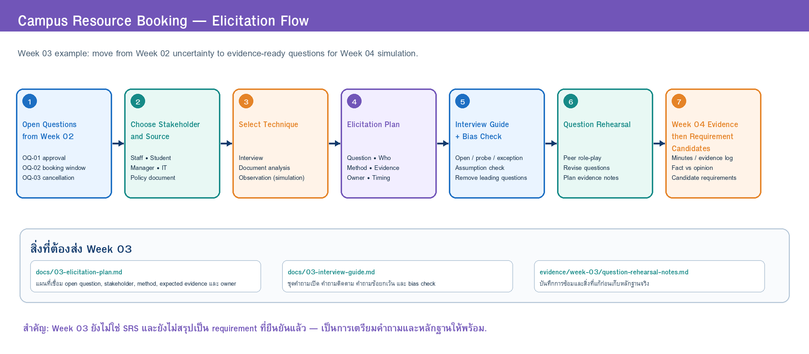

# Week 03 — Elicitation Plan

> **Team:** Team Example — Campus Resource Booking  
> **Case:** ระบบจองพื้นที่ทำงานกลุ่มและอุปกรณ์การเรียนรู้ในมหาวิทยาลัย  
> **Version:** v0.1 (Teaching Example)  
> **Last updated:** 2026-07-05

---

## 1. Learning Goals

ใน Week 02 ทีมมี Open Questions หลายข้อ งานของ Week 03 คือวางแผนให้แต่ละคำถามมี **ผู้ให้ข้อมูล/แหล่งข้อมูล วิธีการ หลักฐานที่คาดหวัง และผู้รับผิดชอบ** ชัดเจน

| ID | Open Question / Assumption | Why it matters | Priority |
|---|---|---|---|
| OQ-01 | การจองประเภทใดต้องอนุมัติ และใครเป็นผู้อนุมัติ? | กำหนด workflow, role และสิทธิ์ในระบบ | High |
| OQ-02 | ผู้ใช้จองล่วงหน้าได้กี่วัน และจองได้นานเท่าใด? | กำหนด validation rule และความเป็นธรรมในการใช้ทรัพยากร | High |
| OQ-03 | การยกเลิก late หรือ no-show ต้องจัดการอย่างไร? | กระทบการใช้ทรัพยากร การแจ้งเตือน และรายงาน | High |
| OQ-04 | การรับ–คืนอุปกรณ์ต้องเก็บหลักฐานอะไร? | กำหนดข้อมูลที่ต้องบันทึกและผู้รับผิดชอบ | Medium |
| OQ-05 | ช่องทางแจ้งเตือนใดเหมาะสม และควรแจ้งเวลาใด? | กระทบ usability และลดการพลาดสถานะ | Medium |
| AS-01 | ผู้ใช้ทุกคนสามารถใช้บัญชีสถาบันเดียวกันเพื่อเข้าสู่ระบบได้ | กระทบ authentication และ role-based access | Medium |

---

## 2. Elicitation Plan

> **Source:** [`w03-elicitation-flow.drawio`](../diagrams/w03-elicitation-flow.drawio)

| ID | Stakeholder / Source | Method | Goal | Expected Evidence | Team Role | Timing | Risk & Mitigation |
|---|---|---|---|---|---|---|---|
| EP-01 | เจ้าหน้าที่ทรัพยากร | Semi-structured interview + workflow walkthrough | ตอบ OQ-01, OQ-03, OQ-04 | ลำดับงานจริง เกณฑ์อนุมัติ กรณียกเว้น หลักฐานส่งมอบ/คืน | Member A: interviewer; Member C: note-taker | Week 04 simulation | เสี่ยงได้คำตอบกว้าง → เตรียม follow-up และ example scenario |
| EP-02 | ผู้จัดการพื้นที่ + เอกสารนโยบายจำลอง | Interview + document analysis | ตอบ OQ-02, OQ-03 | กฎการจองล่วงหน้า ระยะเวลา จำกัดจำนวน และ no-show policy | Member B: interviewer; Member D: document analyst | Week 04 simulation | เสี่ยง policy ไม่ครบ → ระบุส่วนที่ยังต้องตรวจสอบเป็น issue |
| EP-03 | นักศึกษา / ผู้ขอใช้ | Interview + pain-point walkthrough | ตอบ OQ-05 และตรวจ workflow จากมุมผู้ใช้ | ขั้นตอนปัจจุบัน จุดสับสน ช่องทางที่ใช้ ความคาดหวังต่อการแจ้งเตือน | Member C: interviewer; Member A: note-taker | Week 04 simulation | เสี่ยงเสนอ solution เร็ว → เริ่มจากประสบการณ์จริงก่อน |
| EP-04 | ผู้ดูแลระบบ IT | Interview + constraint checklist | ตรวจ AS-01 และข้อจำกัด security/access | ข้อมูลที่ยืนยันตัวตนได้ บทบาทผู้ใช้ ข้อมูลที่ไม่ควรเก็บ | Member D: interviewer; Member B: note-taker | Week 04 simulation | เสี่ยงภาษาทางเทคนิคมาก → เตรียมคำถามเป็นภาษากระบวนการก่อน |
| EP-05 | Role cards + Context Diagram | Workshop / cross-check | ตรวจความสอดคล้องของข้อมูลจากหลายฝ่าย | ข้อขัดแย้ง ข้อยกเว้น และคำถามที่ยังไม่ตอบ | ทุกคน | หลัง simulation | เสี่ยงสรุปเร็วเกินไป → แยก fact, opinion, assumption ก่อนสร้าง candidate |

---

## 3. Technique Selection Rationale

### Why Interview?

การสัมภาษณ์เหมาะกับคำถามที่ต้องรู้เหตุผล ประสบการณ์ ข้อกังวล และกรณียกเว้น เช่น เจ้าหน้าที่ใช้เกณฑ์ใดอนุมัติ หรือผู้ใช้พลาดการแจ้งเตือนในสถานการณ์ใด

### Why Document Analysis?

กฎการจองและนโยบายอาจมีอยู่ในเอกสาร แบบฟอร์ม หรือประกาศเดิม การใช้เอกสารช่วยลดความเสี่ยงจากความจำที่ไม่ครบ และช่วยเทียบว่า “สิ่งที่เล่า” สอดคล้องกับ “สิ่งที่ระบุไว้” หรือไม่

### Why Workflow Walkthrough / Simulation?

การให้ stakeholder proxy เดินเล่าเหตุการณ์ เช่น “มีผู้ใช้ต้องการจองห้องคืนนี้ แต่ห้องถูกจองแล้ว” ช่วยเปิดเผย decision points, exception และข้อมูลที่จำเป็นต่อ requirement มากกว่าการถามเชิงนามธรรม

### Why not use Questionnaire as the main technique now?

Questionnaire เหมาะกับการเก็บข้อมูลจากคนจำนวนมาก แต่ในระยะเริ่มต้นทีมยังต้องเข้าใจ workflow และกฎเชิงลึกก่อน จึงเลือก interview และ simulation เป็นแกนหลัก

---

## 4. Readiness for Week 04 Simulation

### Stakeholder roles needed

1. นักศึกษา / ผู้ขอใช้ทรัพยากร
2. เจ้าหน้าที่ทรัพยากร
3. ผู้จัดการพื้นที่ / ผู้กำหนดนโยบาย
4. ผู้ดูแลระบบ IT

### Material / role card needed

- บทบาท เป้าหมาย ข้อมูลที่รู้ และข้อจำกัดของแต่ละ stakeholder
- สถานการณ์จำลองอย่างน้อย 3 เหตุการณ์: จองปกติ, จองชนกัน, ยกเลิก late/no-show
- ตัวอย่างกฎหรือเอกสารนโยบายแบบสั้นเพื่อใช้ทำ document analysis

### Planned note-taking format

- จดหลักฐานในรูปแบบ: `Evidence ID | Source | Statement/Observation | Type | Related Open Question | Initial Interpretation`
- แยก **Fact / Opinion / Assumption / Solution Proposal** ชัดเจน
- ใช้คำพูดหรือข้อความสรุปที่ตรวจสอบย้อนกลับไปยัง stakeholder role ได้

### Team agreement for facilitation

- Interviewer ถามตาม guide แต่สามารถใช้ follow-up ได้เมื่อพบประเด็นสำคัญ
- Note-taker ไม่ตีความ requirement ระหว่างการจดบันทึก
- Quality observer ทำหน้าที่จับคำถามชี้นำและจดประเด็นที่ต้องทวนความเข้าใจ
- ผู้สัมภาษณ์สรุปสิ่งที่ได้ยินก่อนจบ เพื่อให้ stakeholder proxy ยืนยัน/แก้ไข
