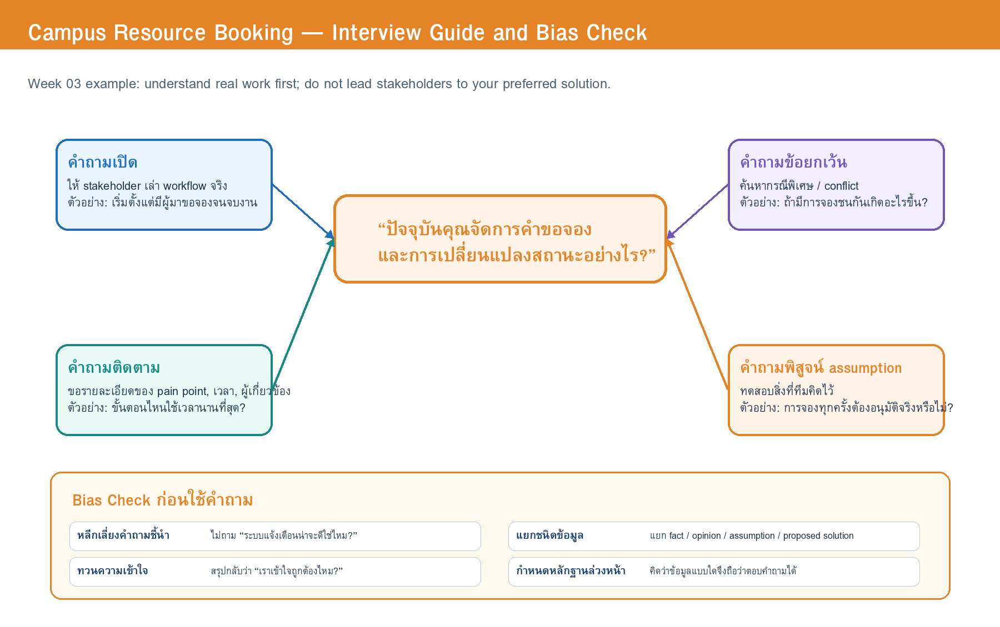

# Week 03 — Interview Guide and Bias Check

> **Team:** Team Example — Campus Resource Booking  
> **Case:** ระบบจองพื้นที่ทำงานกลุ่มและอุปกรณ์การเรียนรู้ในมหาวิทยาลัย  
> **Target stakeholder(s):** เจ้าหน้าที่ทรัพยากร (primary), นักศึกษา / ผู้ขอใช้ (secondary)  
> **Version:** v0.1 (Teaching Example)

---

## 1. Opening and Consent Script

> ขอบคุณที่ร่วมกิจกรรมจำลองนี้ เราต้องการเรียนรู้กระบวนการจองพื้นที่และอุปกรณ์ในปัจจุบัน เพื่อวิเคราะห์ความต้องการของระบบอย่างเป็นระบบ ข้อมูลที่บันทึกจะใช้เพื่อการเรียนรู้และจะไม่เก็บข้อมูลส่วนบุคคลจริง เราจะจดเฉพาะขั้นตอน กฎ ปัญหา และข้อเสนอที่เกี่ยวข้องกับกรณีศึกษาเท่านั้น หากเราเข้าใจสิ่งใดไม่ถูกต้อง เราจะสรุปกลับเพื่อขอให้ช่วยยืนยัน

---

## 2. Interview Questions

> **Source:** [`w03-interview-question-map.drawio`](../diagrams/w03-interview-question-map.drawio)

| ID | Main / Follow-up Question | Type | Why this question is asked | Open Question / Assumption | Expected Evidence |
|---|---|---|---|---|---|
| Q-01 | **[Staff]** ปัจจุบันเมื่อมีคนต้องการจองห้องหรืออุปกรณ์ คุณดำเนินการตั้งแต่รับคำขอจนจบงานอย่างไร? | Open | เริ่มจาก workflow จริงโดยไม่บังคับให้พูดถึงระบบใหม่ | OQ-01, OQ-04 | ขั้นตอนปัจจุบัน ผู้เกี่ยวข้อง และจุดตัดสินใจ |
| Q-02 | **[Staff]** ขั้นตอนใดใช้เวลามากที่สุด หรือทำให้เกิดข้อผิดพลาดบ่อยที่สุด เพราะอะไร? | Probe | ค้นหา pain point และ root cause | OQ-01, OQ-03 | Pain point, ความถี่ และผลกระทบ |
| Q-03 | **[Staff]** มีคำขอประเภทใดที่คุณอนุมัติได้ทันที และประเภทใดต้องขออนุมัติจากคนอื่น? | Open + probe | เก็บเกณฑ์อนุมัติตามประเภททรัพยากร | OQ-01 | Approval rule, role และเงื่อนไข |
| Q-04 | **[Staff]** เมื่อมีคำขอจองชนกัน คุณใช้ข้อมูลใดและตัดสินใจอย่างไร? | Exception | หา conflict resolution rule | OQ-01, OQ-02 | Priority rule, notification need, exception |
| Q-05 | **[Staff]** หากผู้ใช้ยกเลิกช้า หรือไม่มาตามนัด ปัจจุบันหน่วยงานทำอย่างไร และอะไรเป็นข้อกังวล? | Exception | หา no-show / cancellation policy | OQ-03 | Policy, action, fairness concern |
| Q-06 | **[Staff]** เวลาส่งมอบและรับคืนอุปกรณ์ คุณต้องตรวจหรือบันทึกข้อมูลอะไรบ้าง? | Open | ระบุหลักฐานและผู้รับผิดชอบช่วง handover/return | OQ-04 | Asset condition, signature/record, status update |
| Q-07 | **[Student]** ก่อนตัดสินใจจอง คุณต้องการทราบข้อมูลอะไรเกี่ยวกับห้องหรืออุปกรณ์? | Open | เข้าใจข้อมูลที่ผู้ใช้ต้องใช้ตัดสินใจ | OQ-05 | Availability, capacity, equipment, location, rules |
| Q-08 | **[Student]** เมื่อสถานะคำขอเปลี่ยน คุณทราบข่าวอย่างไร และมีกรณีใดที่คุณพลาดข้อมูล? | Open + probe | หา notification pain point โดยไม่ชี้นำ solution | OQ-05 | Current channels, timing, missed-status scenarios |
| Q-09 | **[Manager]** หน่วยงานกำหนดระยะเวลาจองล่วงหน้าและระยะเวลาใช้งานอย่างไร? มีเหตุผลหรือข้อยกเว้นใด? | Assumption check | พิสูจน์กฎที่ทีมยังไม่รู้ | OQ-02 | Policy/rule, exception, decision owner |
| Q-10 | **[IT]** หากใช้บัญชีสถาบัน ระบบควรได้รับข้อมูลใดบ้าง และข้อมูลใดไม่ควรเก็บซ้ำ? | Assumption check | ตรวจ AS-01 และ privacy/access constraint | AS-01 | Authentication data, roles, data minimization |
| Q-11 | **[All]** ขอสรุปว่า ... [กล่าวสรุป workflow/rule ที่ได้ยิน] ... ถูกต้องไหม? มีส่วนใดต้องแก้หรือเพิ่ม? | Validation | ทวนความเข้าใจและลด recording bias | ทุก OQ ที่เกี่ยวข้อง | Confirmed / corrected interpretation |

---

## 3. Bias Check

### 3.1 Team assumptions to watch

| Assumption | Risk if wrong | How the team will test it |
|---|---|---|
| ทุกการจองต้องผ่านเจ้าหน้าที่ | Workflow อาจซับซ้อนเกินจริง | ถาม Q-03 และตรวจเอกสารนโยบาย |
| ผู้ใช้ต้องการแจ้งเตือนทันทีทุกสถานะ | อาจทำให้แจ้งเตือนมากเกินไป | ถาม Q-08 เกี่ยวกับช่วงเวลาที่สำคัญจริง |
| การคืนอุปกรณ์ต้องมีภาพถ่ายเสมอ | อาจเพิ่มภาระโดยไม่จำเป็น | ถาม Q-06 และดูเหตุผลของหลักฐานที่ต้องการ |
| บัญชีสถาบันส่ง role ได้ครบทุกคน | อาจไม่ครอบคลุมผู้ใช้บางกลุ่ม | ถาม Q-10 กับ IT proxy |

### 3.2 Questions rewritten because they were leading

| Original leading question | Why it is problematic | Revised question |
|---|---|---|
| “ระบบแจ้งเตือนอัตโนมัติคงช่วยได้ใช่ไหม?” | ชวนให้ตอบเห็นด้วยกับ solution ที่ทีมคิดไว้ | “เมื่อสถานะเปลี่ยน คุณทราบข่าวอย่างไร และมีจุดใดที่ทำให้คุณพลาดข้อมูล?” |
| “ทุกการจองควรให้เจ้าหน้าที่อนุมัติใช่ไหม?” | ตีความกฎล่วงหน้าและอาจสร้าง workflow ที่ไม่จำเป็น | “มีคำขอประเภทใดที่คุณอนุมัติได้ทันที และประเภทใดต้องขออนุมัติ?” |
| “ถ่ายรูปตอนคืนอุปกรณ์น่าจะปลอดภัยกว่าหรือไม่?” | เสนอวิธีแก้ก่อนรู้ความจำเป็น | “ตอนรับคืนอุปกรณ์ คุณต้องตรวจหรือบันทึกข้อมูลอะไรบ้าง เพราะอะไร?” |

### 3.3 Information still without evidence

- เงื่อนไขอนุมัติรายทรัพยากร
- ระยะเวลาจองล่วงหน้าและกฎ no-show
- หลักฐานรับ–คืนที่เพียงพอ
- ช่องทางแจ้งเตือนที่เหมาะสมและความถี่ที่ไม่รบกวนผู้ใช้

### 3.4 How the team will avoid bias

1. เริ่มด้วยคำถามเปิดเกี่ยวกับงานจริงก่อนพูดถึง solution
2. จดข้อความ/เหตุการณ์พร้อม source ให้ตรวจสอบย้อนกลับได้
3. แยกสิ่งที่ stakeholder **บอกว่าเกิดขึ้น** ออกจากสิ่งที่ทีม **ตีความ**
4. ทวนความเข้าใจด้วย Q-11 ก่อนจบแต่ละ stakeholder simulation
5. เปรียบเทียบข้อมูลจากอย่างน้อยสองแหล่งเมื่อเป็นกฎสำคัญ

---

## 4. Question Rehearsal Revision

| Question ID | What happened in rehearsal | What was unclear / leading | Revision made |
|---|---|---|---|
| Q-03 | Stakeholder proxy ตอบว่า “บางครั้งก็อนุมัติเลย” แต่ยังไม่ชัดว่า “บางครั้ง” หมายถึงอะไร | คำถามยังไม่ขอเงื่อนไขและตัวอย่าง | เพิ่ม follow-up: “ขอเล่าเหตุการณ์ล่าสุดที่อนุมัติทันทีได้ไหม? เพราะอะไร?” |
| Q-05 | ผู้ตอบพูดถึง no-show แต่ไม่กล่าวถึง late cancellation | คำถามรวมสองเหตุการณ์มากเกินไป | แยกเป็น Q-05a late cancellation และ Q-05b no-show |
| Q-08 | ผู้ตอบเริ่มเสนอ “อยากได้ LINE notification” | เสี่ยง solution bias ถ้าทีมจดเป็น requirement ทันที | เพิ่มคำถาม: “ปัญหาของช่องทางปัจจุบันคืออะไร?” และ “เวลาใดที่ต้องทราบสถานะมากที่สุด?” |
| Q-10 | IT proxy ตอบเชิงเทคนิคเร็วเกินไป | Interviewer อาจไม่เข้าใจผลกระทบต่อ role/data | เพิ่มคำถามติดตาม: “ข้อมูลนั้นจะช่วยให้ระบบตัดสินใจเรื่องใด และข้อมูลใดไม่จำเป็น?” |
