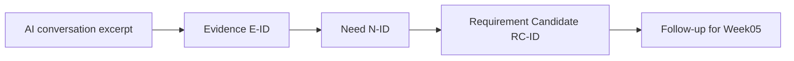

# Week 04 Campus Resource Booking Example — AI Evidence Rehearsal

ตัวอย่างนี้แสดง “ระหว่างทำจนสำเร็จ” สำหรับกรณี **Campus Resource Booking** เพื่อให้นักศึกษาดูว่า requirement candidate ได้มาจากหลักฐานอย่างไร

## ใช้ตัวอย่างนี้อย่างไร

1. อ่าน `evidence/week-04/ai-conversation-excerpt.md` เพื่อดูบทสนทนาที่คัดมา
2. เปิด `docs/04-evidence-log.md` เพื่อดูว่าแต่ละคำตอบถูกเลือกเป็น evidence อย่างไร
3. เปิด `docs/04-requirement-candidates.md` เพื่อดูการแปลง need เป็น RC
4. เทียบกับ case ของกลุ่มตนเอง แล้วเปลี่ยน **เหตุผลและ evidence** ไม่ใช่เปลี่ยนเฉพาะชื่อระบบ

## ไฟล์ในตัวอย่าง

| ไฟล์ | ใช้ดูอะไร |
|---|---|
| `evidence/week-04/ai-conversation-excerpt.md` | ช่วงบทสนทนาที่เลือกมาใช้เป็น evidence |
| `docs/04-evidence-log.md` | Evidence → Need พร้อมคำอธิบายว่าทำไมเลือก |
| `docs/04-requirement-candidates.md` | Need → Requirement Candidate พร้อม trace |
| `project-management/ai-use-log.md` | บันทึกการใช้ AI อย่างรับผิดชอบ |
| `submissions/week-04-submission.md` | ตัวอย่าง summary ก่อนส่ง |

## จุดสังเกตสำหรับนักศึกษา

- Evidence ไม่จำเป็นต้องยาว แต่ต้องอ้างอิงได้
- Need ไม่ควรเป็นปุ่มหรือหน้าจอทันที ควรเป็นปัญหา/เป้าหมายของผู้ใช้
- Requirement Candidate ต้องอ้าง E-ID เสมอ
- ถ้าข้อมูลยังไม่ชัด ให้ใส่ `Needs Validation` และตั้ง follow-up

> ตัวอย่างนี้เป็น simulation เพื่อการเรียนรู้ ไม่ใช่ข้อกำหนดจริงของมหาวิทยาลัย
