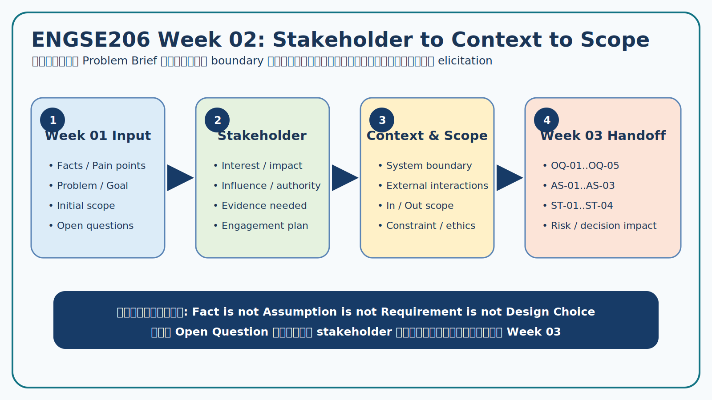

# Campus Resource Booking — Example Completed Work (Week 2–4)

> **สถานะ:** Canonical teaching example สำหรับ ENGSE206  
> **Case:** Case 01 — ระบบจองพื้นที่ทำงานกลุ่มและอุปกรณ์การเรียนรู้  
> **หลักการใช้งาน:** อ่านตัวอย่างจาก Course Repo แต่ทำและส่งหลักฐานของทีมใน Team Repo

ชุดนี้แสดงหน้าตาของ “งานที่ทำเสร็จในระดับพร้อมส่ง” โดยใช้กรณีศึกษาเดียวต่อเนื่องสามสัปดาห์ จุดสำคัญไม่ใช่จำนวนข้อความ แต่คือการอธิบายที่มาของข้อสรุปและการตามรอยได้ตั้งแต่คำถามจนถึง Requirement Candidate



## เส้นทางหลักฐาน

| ช่วง | คำถามที่ต้องตอบ | ผลงานตัวอย่าง | ส่งต่อไปสัปดาห์ถัดไป |
|---|---|---|---|
| [Week 02](week-02/02-stakeholder-context-scope.md) | ใครเกี่ยวข้อง ระบบอยู่ตรงไหน และอะไรอยู่ใน/นอกขอบเขต | Stakeholder Register, System Context, Scope, Assumption, Open Question | `OQ-*`, `AS-*`, stakeholder และ boundary |
| [Week 03](week-03/03-elicitation-plan.md) | ต้องหาความรู้อะไร จากใคร ด้วยวิธีใด และจะถามอย่างไร | Elicitation Objectives/Plan และ [Interview Guide](week-03/03-interview-guide.md) | `EO-*`, `EP-*`, `Q-*`, expected evidence |
| [Week 04](week-04/04-evidence-log.md) | ได้หลักฐานอะไร ขัดแย้งกันตรงไหน และแปลงเป็น candidate อย่างไร | Evidence Log, [Negotiation Record](week-04/04-negotiation-record.md), [Requirement Candidates](week-04/04-requirement-candidates.md) | `E-*`, `N-*`, `RC-*` สำหรับ Week 5 analysis/prioritization |

## แผนที่ไฟล์

```text
examples/campus-resource-booking/
├── README.md
├── week-02/
│   ├── 02-stakeholder-context-scope.md
│   ├── submission-week-02.md
│   └── images/
├── week-03/
│   ├── 03-elicitation-plan.md
│   ├── 03-interview-guide.md
│   ├── submission-week-03.md
│   └── images/
└── week-04/
    ├── 04-evidence-log.md
    ├── 04-negotiation-record.md
    ├── 04-requirement-candidates.md
    ├── submission-week-04.md
    └── images/
```

## กติกาการอ่านตัวอย่าง

1. ข้อเท็จจริงจาก Case Card ใช้รหัส `F-*` หรือ evidence tag `CF` และอ้างแหล่งที่มา
2. คำตอบจาก stakeholder simulation ใช้ tag `SN` และยังไม่ถือเป็นนโยบายจริง
3. ข้อที่ยังไม่มีหลักฐานอยู่ใน `AS-*` หรือ `OQ-*`; ห้ามเปลี่ยนเป็น requirement แบบ Approved
4. Requirement Candidate ทุกข้ออ้าง `E-*` และระบุสถานะ ความเชื่อมั่น และสิ่งที่ต้องตรวจต่อ
5. ชื่อบุคคล นโยบาย ตัวเลข และข้อมูลใช้งานเป็นข้อมูลจำลองเท่านั้น

## Definition of Done ของชุดตัวอย่าง

- [x] ลิงก์ภาพใช้ relative path และเปิดจาก Markdown ได้
- [x] ID เชื่อม Week 2 → 3 → 4 อย่างสม่ำเสมอ
- [x] แยก Fact, Assumption, Simulated Need, Constraint, Opinion และ Proposed Solution
- [x] มี conflict/option/rationale/status โดยไม่อ้างว่าเป็นนโยบายจริง
- [x] มี submission summary และ checklist ของแต่ละสัปดาห์

> นักศึกษาควรใช้ชุดนี้เพื่อเทียบ “โครงสร้างและคุณภาพ” เท่านั้น งานจริงต้องอ้าง Case และหลักฐานของกลุ่ม พร้อมแสดง revision history ใน Team Repo
