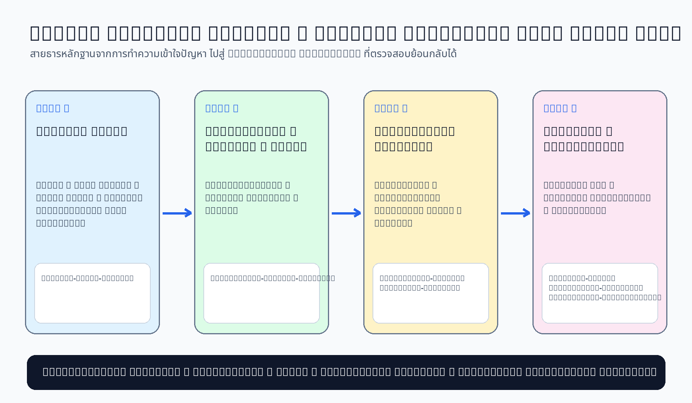

# Example Completed Work — Campus Resource Booking (Week 1–4)

> ตัวอย่างนี้เป็น **worked example สำหรับการเรียนรู้** ไม่ใช่คำตอบสำเร็จรูปที่ให้นักศึกษาคัดลอกไปส่งงาน  
> นักศึกษาต้องอ่านโจทย์จาก Course Repo แล้วสร้าง artefact ของ Case Project ตนเองใน Team Repo



## วัตถุประสงค์

ชุดตัวอย่างนี้แสดงให้เห็นว่า artefact ระหว่าง Week 1–4 เชื่อมต่อกันอย่างไร

```text
Week 1: Problem Brief v0.1 — Facts / Pain Points / Goals / Scope / Open Questions
        ↓ ขยาย stakeholder, context และ boundary
Week 2: Stakeholder / Context / Scope
        ↓ แปลง Open Questions เป็นแผนเก็บข้อมูล
Week 3: Elicitation Plan / Interview Guide
        ↓ เก็บและจัดระเบียบหลักฐาน
Week 4: Evidence Log → Negotiation → Requirement Candidates
```

## โครงสร้างไฟล์

```text
examples/campus-resource-booking/
├── README.md
├── MANIFEST.md
├── images/
│   └── example-completed-work-overview.png
├── week-01/
│   ├── README.md
│   ├── problem-brief-v0.1.md
│   ├── team-worklog.md
│   ├── problem-framing-overview.png
│   └── facts-assumptions-map.png
├── week-02/
│   ├── stakeholder-context-scope.md
│   ├── stakeholder-map.png
│   ├── system-context.png
│   └── scope-boundary.png
├── week-03/
│   ├── elicitation-plan.md
│   ├── interview-guide.md
│   ├── elicitation-flow.png
│   └── interview-question-funnel.png
└── week-04/
    ├── evidence-log.md
    ├── negotiation-record.md
    ├── requirement-candidates.md
    ├── evidence-traceability.png
    └── negotiation-options.png
```

## จุดเชื่อมโยงสำคัญ

| จาก | ไป | กลไกเชื่อมโยง |
|---|---|---|
| Week 1 Facts/Pain Points | Week 2 Context/Stakeholder | ใช้ F-ID/P-ID ตรวจว่าขอบเขตและ stakeholder มาจากปัญหาใด |
| Week 1 Open Questions | Week 3 Elicitation Plan | ใช้ OQ-ID ตั้ง elicitation objective และคำถามสัมภาษณ์ |
| Week 2 Stakeholder | Week 3 Participant Plan | เลือกผู้ให้ข้อมูลตามอำนาจ ความสนใจ และบทบาท |
| Week 3 Evidence | Week 4 Evidence Log | ทุก insight มี E-ID และแหล่งที่มา |
| Week 4 Evidence/Negotiation | Requirement Candidates | Candidate แต่ละข้ออ้าง E-ID/Decision ID ได้ |

## วิธีใช้สำหรับผู้สอน

1. เปิดตัวอย่างบางส่วนก่อน Workshop เพื่อสาธิตโครงสร้างและเกณฑ์คุณภาพ
2. ซ่อนส่วนคำตอบบางตาราง แล้วให้นักศึกษาช่วยกันเติม
3. ใช้ F-ID, P-ID, A-ID, OQ-ID, E-ID และ RC-ID เพื่อสาธิต traceability
4. ชวนอภิปรายว่าข้อใดเป็น **fact, simulated need, constraint, opinion, assumption หรือ proposed solution**
5. ย้ำว่าข้อมูลจำลองและ Requirement Candidates ยังไม่ใช่ requirement ที่อนุมัติจริง

## ข้อจำกัดของตัวอย่าง

- ชื่อบุคคลทั้งหมดเป็นบทบาทสมมติ
- ไม่มีข้อมูลส่วนบุคคลจริง
- ข้อกำหนด นโยบาย และตัวเลขบางส่วนเป็น **สมมติฐานเพื่อการสอน** และติดป้ายไว้
- Requirement Candidates ใน Week 4 ยังต้องตรวจสอบใน Week 5 ก่อนจัดลำดับและเขียน specification
