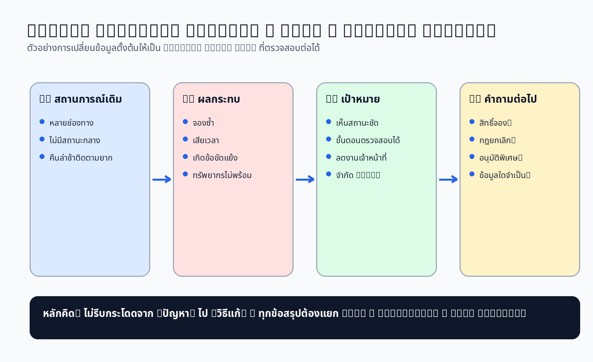
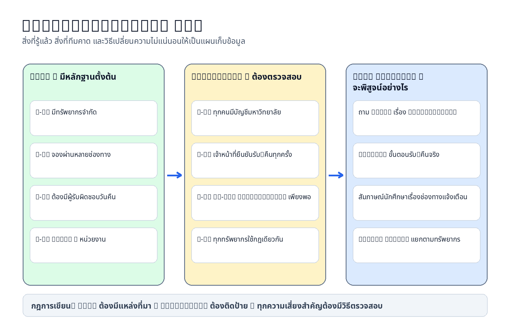

# Problem Brief v0.1 — Campus Resource Booking (Example Completed Work)

> **สถานะ:** ตัวอย่างงานที่เสร็จสมบูรณ์สำหรับการเรียนรู้ Week 1  
> **ข้อควรระวัง:** ข้อมูลทั้งหมดเป็นกรณีจำลอง นักศึกษาต้องสร้างงานจาก Case Project ของกลุ่มตนเองและไม่คัดลอกไปส่ง

## 0. ข้อมูลทีม

- รหัสกลุ่ม: `Group 03`
- ชื่อโครงการชั่วคราว: **Campus Resource Booking**
- Case Card: **Case 01 — ระบบจองพื้นที่ทำงานกลุ่มและอุปกรณ์การเรียนรู้**
- สมาชิกและบทบาท:
  - วรินทร์ — Facilitator / Document Editor
  - ณัฐพล — Stakeholder Analyst
  - ชลิตา — Evidence and Scope Analyst
  - ปวีณา — Requirement Drafter
- วันที่ปรับปรุง: `2569-06-22`
- เวอร์ชัน: `v0.1`

## 1. ภาพรวมปัญหา

นักศึกษาต้องใช้ห้องทำงานกลุ่มและอุปกรณ์ประกอบการเรียน เช่น HDMI adapter กล้องเว็บแคม และไมโครโฟน แต่ปัจจุบันต้องถามเจ้าหน้าที่หรือส่งข้อความผ่านหลายช่องทาง การจองจึงไม่มีสถานะกลางที่ทุกฝ่ายเชื่อถือร่วมกัน เกิดการจองซ้ำ และเมื่อมีการคืนล่าช้า เจ้าหน้าที่ต้องค้นหาผู้รับผิดชอบจากข้อความเดิมหลายแหล่ง

ปัญหาหลักจึงไม่ใช่ “ยังไม่มีแอป” แต่คือ **ข้อมูลสถานะกระจัดกระจาย กระบวนการจองไม่โปร่งใส และการติดตามความรับผิดชอบทำได้ยาก**

## 2. ข้อเท็จจริงที่ยืนยันได้ (Facts)

| รหัส | ข้อเท็จจริง/หลักฐาน | แหล่งที่มา | ความมั่นใจ |
|---|---|---|---|
| F-01 | มีห้องทำงานกลุ่มหลายขนาดและอุปกรณ์จำนวนจำกัด | Case Card | สูง |
| F-02 | การจองบางส่วนเกิดผ่านการพูดคุยหรือแชต จึงไม่มีรายการกลาง | Case Card | สูง |
| F-03 | การยืมบางรายการต้องระบุผู้รับผิดชอบและวันคืน | Case Card | สูง |
| F-04 | เจ้าหน้าที่ต้องใช้หลายแหล่งข้อมูลเพื่อดูว่าว่างหรือไม่ | Case Card | สูง |
| F-05 | การใช้งานเริ่มจากหนึ่งอาคาร/หนึ่งหน่วยงาน | Constraint ใน Case Card | สูง |

## 3. Pain Points

| รหัส | Pain Point | ผู้ได้รับผลกระทบ | ผลกระทบ |
|---|---|---|---|
| P-01 | ผู้ใช้ไม่ทราบว่าห้องหรืออุปกรณ์ว่างจริงหรือไม่ | นักศึกษา | เสียเวลาเดินไปตรวจหรือติดต่อหลายช่องทาง |
| P-02 | มีโอกาสจองทรัพยากรเดียวกันในช่วงเวลาเดียวกัน | นักศึกษา, เจ้าหน้าที่ | เกิดข้อขัดแย้งและต้องแก้ไขเร่งด่วน |
| P-03 | การคืนล่าช้าไม่มีการติดตามชัดเจน | เจ้าหน้าที่, ผู้ใช้ถัดไป | ทรัพยากรไม่พร้อมใช้และค้นหาผู้รับผิดชอบยาก |
| P-04 | การเปลี่ยนแปลง/ยกเลิกไม่ถูกสื่อสารถึงทุกฝ่าย | ผู้จอง, เจ้าหน้าที่ | เกิดช่องว่างของตารางและความเข้าใจไม่ตรงกัน |

## 4. Stakeholder เริ่มต้น

| บทบาท | ความต้องการ/ความกังวลตั้งต้น | อำนาจตัดสินใจ | วิธีเก็บข้อมูลต่อ |
|---|---|---|---|
| นักศึกษา | ค้นหาและจองได้เร็ว เห็นสถานะชัด | ผู้ใช้งาน | Interview + Observation |
| เจ้าหน้าที่ห้อง | ลดงานตอบคำถามและติดตามคืน | จัดการรายการประจำวัน | Interview |
| อาจารย์/ผู้ดูแลห้อง | ไม่ให้กระทบตารางเรียนหรือกิจกรรม | อนุมัตินโยบายบางส่วน | Interview + Document Review |
| ผู้ดูแลระบบ | สิทธิผู้ใช้และข้อมูลการใช้งานปลอดภัย | กำหนดสิทธิ/ตั้งค่าระบบ | Interview |
| ผู้บริหารหน่วยงาน | ต้องการภาพรวมการใช้ทรัพยากร | อนุมัติขอบเขต/นโยบาย | Workshop/Review |

> Week 1 ระบุเพียง stakeholder ตั้งต้น รายละเอียดอำนาจ ความสนใจ และช่องทางสื่อสารจะวิเคราะห์ต่อใน Week 2

## 5. เป้าหมายของระบบ

- **Goal 1:** ลดความไม่ชัดเจนเกี่ยวกับสถานะว่าง/ไม่ว่างของพื้นที่และอุปกรณ์
- **Goal 2:** ให้ผู้ใช้ส่งคำขอ ยกเลิก รับ และคืนทรัพยากรผ่านขั้นตอนที่ตรวจสอบย้อนหลังได้
- **Goal 3:** ให้เจ้าหน้าที่เห็นรายการปัจจุบันและรายการคืนล่าช้าจากแหล่งข้อมูลเดียว
- **Goal 4:** ลดข้อขัดแย้งจากการจองซ้ำโดยไม่ขยายระบบเกินหนึ่งหน่วยงานในรุ่นแรก

### Success Indicators เบื้องต้น

| ตัวชี้วัด | แนวทางสังเกต/วัด | สถานะ |
|---|---|---|
| SI-01 ผู้ใช้ตรวจสถานะได้โดยไม่ต้องถามหลายช่องทาง | ทดสอบสถานการณ์ค้นหาทรัพยากร | ต้องยืนยันเกณฑ์ใน Week 3–4 |
| SI-02 ไม่มีรายการจองที่ได้รับการยืนยันซ้อนกัน | ตรวจ conflict rule | ต้องยืนยันนโยบาย |
| SI-03 เจ้าหน้าที่ระบุผู้รับผิดชอบรายการยืมได้ | ตรวจจาก audit trail | ต้องยืนยันข้อมูลที่อนุญาตให้เก็บ |
| SI-04 เจ้าหน้าที่เห็นรายการเกินกำหนดในมุมมองเดียว | usability walkthrough | ต้องยืนยัน workflow |

## 6. Scope เบื้องต้น

### In Scope

- ค้นหาและดูสถานะห้องทำงานกลุ่ม/อุปกรณ์
- สร้าง ยกเลิก และติดตามสถานะคำขอจอง
- ตรวจสอบข้อขัดแย้งของเวลาในระดับระบบ
- บันทึกรับ–คืนอุปกรณ์โดยเจ้าหน้าที่
- แสดงรายการใกล้ถึงกำหนดและเกินกำหนด
- หน้าจอเจ้าหน้าที่สำหรับดูตารางการจองและสถานะทรัพยากร

### Out of Scope

- การชำระเงินหรือค่าปรับจริง
- ระบบจัดซื้อ/คลังพัสดุ
- ระบบซ่อมครุภัณฑ์เต็มรูปแบบ
- การควบคุมประตูหรือ IoT จริง
- การใช้งานทุกคณะ/ทุกวิทยาเขตในรุ่นแรก

### Constraints

- เริ่มจากหนึ่งอาคาร/หนึ่งหน่วยงาน
- ใช้ข้อมูลผู้ใช้จำลองในการเรียน
- ไม่เก็บเลขบัตรประชาชนหรือข้อมูลอ่อนไหวที่ไม่จำเป็น
- การจองพิเศษอาจต้องให้เจ้าหน้าที่หรืออาจารย์อนุมัติ

### Assumptions ที่ต้องตรวจสอบ

| รหัส | ข้อสมมติ | ความเสี่ยงถ้าผิด | วิธีตรวจสอบ |
|---|---|---|---|
| A-01 | ผู้ใช้ทุกคนมีบัญชีมหาวิทยาลัย | อาจต้องมี guest workflow | ถามผู้ดูแลระบบ |
| A-02 | เจ้าหน้าที่เป็นผู้ยืนยันรับ–คืนทุกรายการ | workflow จริงอาจเป็น self-service | สังเกตงาน + สัมภาษณ์ |
| A-03 | การแจ้งเตือนผ่านระบบเพียงพอ | ผู้ใช้อาจต้องการ email/LINE | สัมภาษณ์นักศึกษา |
| A-04 | ทรัพยากรทุกประเภทใช้กฎจองเดียวกัน | อาจมี policy ต่างกัน | document review |

## 7. ความต้องการผู้ใช้เริ่มต้น (Starter Requirements)

> รายการนี้เป็น **draft candidates** จากปัญหาและข้อมูลตั้งต้น ยังไม่ถือว่าได้รับการยืนยัน

| รหัส | ความต้องการเริ่มต้น | ประเภท | หลักฐาน/เหตุผล | สถานะ |
|---|---|---|---|---|
| UR-01 | นักศึกษาต้องดูสถานะว่างของห้องตามวันและเวลาได้ | Functional | F-01, F-04, P-01 | Draft |
| UR-02 | นักศึกษาต้องส่งคำขอจองห้องหรืออุปกรณ์ตามสิทธิ์ได้ | Functional | F-03, P-01 | Draft |
| UR-03 | เจ้าหน้าที่ต้องยืนยันการรับและคืนอุปกรณ์ได้ | Functional | F-03, P-03 | Draft |
| UR-04 | ระบบต้องป้องกันการยืนยันการจองทรัพยากรเดียวกันในช่วงเวลาซ้อนกัน | Functional | P-02 | Draft |
| UR-05 | เจ้าหน้าที่ต้องดูรายการใกล้ถึงกำหนดหรือเกินกำหนดได้ | Functional | P-03 | Draft |
| UR-06 | ผู้จองต้องยกเลิกคำขอและเห็นผลการยกเลิกได้ | Functional | P-04 | Draft |
| UR-07 | ระบบควรแสดงข้อมูลสำคัญได้เข้าใจง่ายทั้ง desktop และ mobile browser | NFR–Usability | บริบทผู้ใช้ | Draft |
| UR-08 | ระบบต้องแสดงข้อมูลส่วนบุคคลตามสิทธิ์และเท่าที่จำเป็น | NFR–Privacy/Security | Ethical concern | Draft |
| UR-09 | สถานะการจองต้องไม่ขัดแย้งกันเมื่อมีผู้ใช้หลายคน | NFR–Reliability | P-02 | Draft |

## 8. Non-functional Concerns เริ่มต้น

- **Usability:** ตรวจสถานะและสร้างคำขอได้โดยขั้นตอนไม่ซับซ้อน
- **Privacy/Security:** รายชื่อผู้จองและประวัติการใช้งานต้องเห็นตามบทบาทและเท่าที่จำเป็น
- **Reliability:** การยืนยันสถานะต้องไม่ทำให้เกิดการจองซ้อน และการรับ–คืนต้องมี audit trail
- **Accessibility:** ข้อมูลสำคัญไม่ควรสื่อด้วยสีเพียงอย่างเดียว
- **Performance:** การค้นหาสถานะในช่วงใช้งานสูงควรตอบสนองได้อย่างเหมาะสม แต่ตัวเลขต้องเก็บหลักฐานก่อนกำหนด

## 9. คำถามที่ต้องค้นหาคำตอบต่อ

| รหัส | คำถาม | เหตุผลที่ต้องรู้ | จะถามใคร/วิธีใด | ใช้ต่อในสัปดาห์ |
|---|---|---|---|---|
| OQ-01 | นักศึกษาจองล่วงหน้าได้กี่วันและนานเท่าไร | กำหนด policy/validation | เจ้าหน้าที่ + อาจารย์ | Week 3 |
| OQ-02 | การยกเลิกใกล้เวลาใช้งานควรมีเงื่อนไขใด | ลด no-show | นักศึกษา + เจ้าหน้าที่ | Week 3–4 |
| OQ-03 | อุปกรณ์ใดต้องได้รับอนุมัติพิเศษ | ออกแบบสิทธิ/workflow | เจ้าหน้าที่ | Week 3 |
| OQ-04 | เจ้าหน้าที่ต้องใช้ข้อมูลใดในหน้าจอหลัก | กำหนดข้อมูลจำเป็น | Observation + Interview | Week 3–4 |
| OQ-05 | เมื่ออาจารย์ต้องใช้ห้องเร่งด่วน ใครมีอำนาจเปลี่ยนการจอง | เตรียม conflict/negotiation | อาจารย์ + ผู้บริหาร | Week 4 |
| OQ-06 | แจ้งเตือนผ่านช่องทางใดและเวลาใดจึงเหมาะสม | ป้องกันการรบกวน/ข้อมูลเกินจำเป็น | นักศึกษา + เจ้าหน้าที่ | Week 3–4 |

## 10. ความเสี่ยงและประเด็นจริยธรรมเบื้องต้น

| ประเด็น | ความเสี่ยง | แนวทางป้องกันเบื้องต้น |
|---|---|---|
| Privacy | แสดงชื่อและประวัติผู้ใช้เกินความจำเป็น | ใช้ role-based access และ data minimization |
| Fairness | ผู้มีอำนาจอาจแทรกคิวโดยไม่มีหลักเกณฑ์ | บันทึก policy และเหตุผลการ override |
| Consent | เก็บภาพหรือเสียงการสัมภาษณ์โดยไม่ขออนุญาต | ขอความยินยอมก่อนบันทึก |
| Accuracy | นำสมมติฐานของทีมไปเขียนเป็น fact | ใช้ F-ID/A-ID และระบุแหล่งที่มา |
| AI Use | ส่งข้อมูลจริงของ stakeholder เข้า AI | ใช้ข้อมูลจำลอง/ทำ anonymization และเปิดเผยการใช้ AI |

## 11. Team Worklog (สรุป)

| วันที่ | สมาชิก | สิ่งที่ทำ | หลักฐาน/ลิงก์ | อุปสรรค/การตัดสินใจ |
|---|---|---|---|---|
| 2569-06-22 | วรินทร์ | สรุปบริบทและ scope | commit `docs: draft context and scope` | ลด scope จากทั้งมหาวิทยาลัยเหลือ 1 หน่วยงาน |
| 2569-06-22 | ณัฐพล | วิเคราะห์ stakeholder ตั้งต้น | commit `docs: add stakeholder table` | บทบาทอาจารย์ยังต้องยืนยัน |
| 2569-06-22 | ชลิตา | แยก facts/pain points/assumptions | `facts-assumptions-map.png` | แยก F-04 ออกจากความคิดเห็นทีม |
| 2569-06-22 | ปวีณา | ร่าง starter requirements/NFR | commit `docs: add starter requirements` | ยังไม่กำหนดตัวเลข performance |

ดูรายละเอียดเพิ่มที่ [`team-worklog.md`](team-worklog.md)

## 12. การใช้ AI

| เครื่องมือ/วิธีใช้ | ใช้ช่วยเรื่องใด | ทีมตรวจทาน/แก้ไขอะไรเอง |
|---|---|---|
| Generative AI (brainstorm) | ช่วยเสนอหมวดคำถามที่ควรถามต่อ | ทีมลบคำถามนำคำตอบและผูกแต่ละคำถามกับ OQ-ID |
| Generative AI (language review) | ตรวจความชัดของถ้อยคำ | ทีมตรวจกลับกับ Case Card และไม่ส่งข้อมูลส่วนบุคคลจริง |

## 13. Definition of Done สำหรับ Week 1

- [x] มี problem statement ที่ไม่เขียนเป็นรายชื่อฟีเจอร์
- [x] แยก facts, pain points และ assumptions
- [x] มี stakeholder ตั้งต้นอย่างน้อย 3 กลุ่ม
- [x] มี goals และ success indicators
- [x] แยก in scope / out of scope / constraints
- [x] มี starter requirements อย่างน้อย 5 ข้อและ NFR concerns อย่างน้อย 3 ด้าน
- [x] มี open questions ส่งต่อสู่ Week 2–4
- [x] มี worklog และ disclosure การใช้ AI
