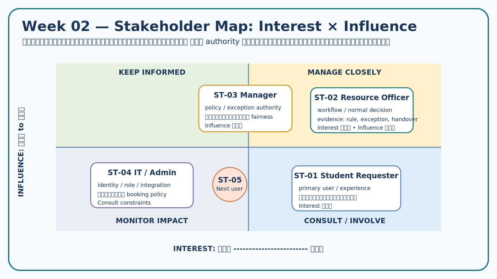
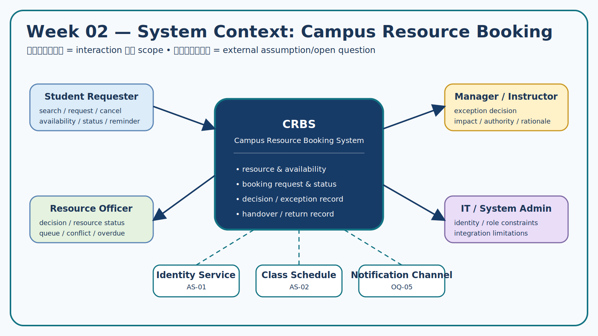
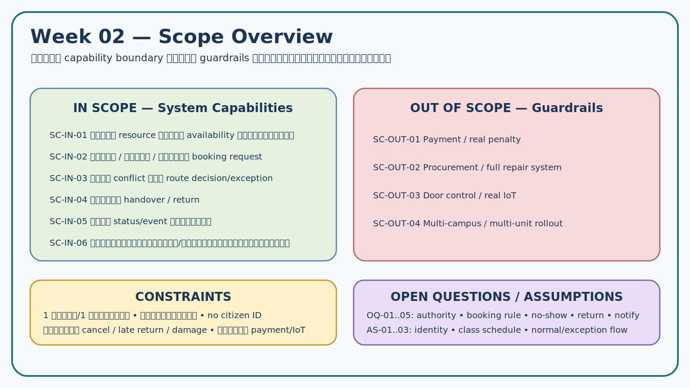

# Week 02 — Stakeholder, System Context and Scope

> **Team:** Team Example — Campus Resource Booking  
> **Case:** Case 01 — ระบบจองพื้นที่ทำงานกลุ่มและอุปกรณ์การเรียนรู้  
> **Assignment:** `W02-v1.0`  
> **Version:** v1.0 — Completed Teaching Example  
> **Input:** Week 01 Problem Brief v0.1

## 1. จุดประสงค์และผลลัพธ์

งานนี้ปรับ Problem Brief ให้ชัดว่าใครมีส่วนได้ส่วนเสีย ระบบแลกเปลี่ยนข้อมูลกับใคร และขอบเขตใดเหมาะกับโครงการรายวิชา ผลลัพธ์ที่ต้องส่งต่อให้ Week 03 คือ stakeholder ที่ควรถาม, assumptions และ open questions ที่มีผลต่อ scope/risk

## 2. Problem Frame ที่ยืนยันจาก Week 01

### 2.1 Problem statement

การจองห้องทำงานกลุ่มและอุปกรณ์เกิดผ่านการถามเจ้าหน้าที่หรือแชตหลายช่องทาง จึงตรวจสถานะร่วมกันได้ยาก เกิดการจองซ้ำ และติดตามการคืนล่าช้าได้ไม่ชัดเจน ปัญหานี้กระทบทั้งผู้ขอใช้ เจ้าหน้าที่ และผู้ใช้ทรัพยากรรายถัดไป

### 2.2 Facts และ pain points ที่นำมาใช้

| ID | Statement | Source | ใช้ตัดสินใจเรื่องใด |
|---|---|---|---|
| F-01 | มีห้องหลายขนาดและอุปกรณ์จำนวนจำกัด | Case Card §4 | ต้องเห็น resource และ availability |
| F-02 | บางการจองเป็นการเดินเข้ามาหรือคุยผ่านหลายช่องทาง | Case Card §4 | ต้องมีรายการกลางและ audit trail |
| F-03 | เจ้าหน้าที่ใช้หลายแหล่งข้อมูลเพื่อตรวจว่าว่างหรือไม่ | Case Card §4 | boundary ต้องรวมการจัดการสถานะ |
| F-04 | การยืมบางรายการต้องมีผู้รับผิดชอบและวันคืน | Case Card §4 | ต้องพิจารณา check-out/check-in |
| P-01 | ผู้ใช้ไม่ทราบสถานะว่างจริง | Week 01 Problem Brief | กำหนด outcome ด้าน discoverability |
| P-02 | มีโอกาสจองทรัพยากรเดียวกันซ้ำ | Week 01 Problem Brief | กำหนด conflict rule เป็น open question |
| P-03 | การคืนล่าช้าติดตามผู้รับผิดชอบยาก | Week 01 Problem Brief | กำหนด evidence ที่ต้องหาเรื่องการคืน |

## 3. Stakeholder Analysis

### 3.1 Stakeholder register

| ID | Stakeholder | Interest / Need | Influence / Authority | Evidence ที่มี | สิ่งที่ต้องค้นต่อ | Engagement |
|---|---|---|---|---|---|---|
| ST-01 | นักศึกษา/ผู้ขอใช้ | ค้นหาและจองได้โดยรู้สถานะ กฎ และผลการตัดสินใจ | Interest สูง; ไม่มีอำนาจอนุมัติ | Case Card, F-01–F-03 | ข้อมูลก่อนจอง, pain point, notification | Interview + scenario walkthrough |
| ST-02 | เจ้าหน้าที่ทรัพยากร | ตรวจความพร้อม ลดคำขอไม่ครบ ติดตามรับ–คืน | Influence สูงต่อ workflow; อนุมัติกรณีปกติหรือส่งต่อ | Case Card, F-02–F-04 | เกณฑ์อนุมัติ, required data, exception | Interview + workflow walkthrough |
| ST-03 | ผู้จัดการพื้นที่/อาจารย์ผู้ดูแล | รักษาตารางเรียน ความเป็นธรรม และจัดการกรณีพิเศษ | Authority สูงต่อ policy/exception | Case Card ระบุผู้ดูแลห้อง | กฎจองล่วงหน้า, conflict, emergency override | Interview + document analysis |
| ST-04 | ผู้ดูแลระบบ IT | สิทธิ บัญชี สถานะ และข้อมูลที่จำเป็น | Authority ด้านเทคนิค ไม่กำหนดนโยบายการจอง | Case Card ระบุผู้ดูแลระบบ | identity/role, integration, privacy | Constraint interview |
| ST-05 | ผู้ใช้ทรัพยากรรายถัดไป | ต้องได้รับทรัพยากรตรงเวลาและสภาพพร้อมใช้ | Influence ต่ำแต่ได้รับผลกระทบโดยตรง | P-03 | ผลกระทบจาก late return/no-show | ใช้ scenario และสอบถามผ่าน ST-01/ST-02 |

### 3.2 Priority for Week 03–04

- **Manage closely:** ST-02, ST-03 เพราะให้ข้อมูล workflow และมี decision rights
- **Involve deeply:** ST-01 เพราะเป็น primary user และเห็น pain points
- **Consult for constraints:** ST-04 เรื่อง identity, data minimization และระบบภายนอก
- **Represent impact:** ST-05 เพื่อไม่ให้การเจรจามองเฉพาะผู้จองคนแรก

## 4. System Context

### 4.1 System of interest

`Campus Resource Booking System (CRBS)` รับผิดชอบการแสดงทรัพยากรและสถานะ การรับ/ติดตามคำขอ การเปลี่ยนสถานะโดยผู้มีสิทธิ์ และการบันทึกรับ–คืนในระดับกรณีศึกษา

### 4.2 Context interaction register

| External actor/system | Data/Request เข้า CRBS | Information ออกจาก CRBS | Status |
|---|---|---|---|
| Student Requester | เงื่อนไขค้นหา คำขอจอง การยกเลิก | availability, request status, reminder | In scope |
| Resource Officer | resource status, decision, handover/return record | queue, conflict, overdue list | In scope |
| Area Manager/Instructor | special decision, reservation constraint | exception request, impact summary | In scope |
| Institutional Identity Service | user identifier/role เท่าที่จำเป็น | authentication request/result reference | Assumption `AS-01`; ต้องยืนยัน |
| Class Schedule Source | ช่วงเวลาที่ทรัพยากรถูกสงวนเพื่อการเรียน | conflict/availability query | Assumption `AS-02`; ยังไม่ยืนยัน integration |
| Notification Channel | — | status/reminder message | Channel/timing ยังเป็น `OQ-05` |

> Context Diagram แสดงคน/ระบบภายนอกและการแลกเปลี่ยนข้อมูล ไม่ใช่ Architecture Diagram และยังไม่กำหนด database, framework หรือ deployment

## 5. Scope Definition

### 5.1 In scope — capability level

| ID | Capability | Outcome ที่ต้องการ | ยังไม่ตัดสินใจด้านออกแบบ |
|---|---|---|---|
| SC-IN-01 | ค้นหาและดูสถานะห้อง/อุปกรณ์ตามช่วงเวลา | ลดการถามหลายช่องทาง | รูปแบบหน้าจอ/เทคโนโลยี |
| SC-IN-02 | สร้าง แก้ไข หรือยกเลิกคำขอจองตามสิทธิ์ | มีคำขอที่ตรวจสอบย้อนหลังได้ | จำนวน field และ rule ที่แน่นอน |
| SC-IN-03 | ตรวจ conflict และส่งคำขอไปยังผู้มีอำนาจ | ลด double booking และจัดการ exception | approval matrix |
| SC-IN-04 | บันทึกการส่งมอบและรับคืนอุปกรณ์ | เห็นผู้รับผิดชอบ เวลา และสถานะ | หลักฐานที่เพียงพอ |
| SC-IN-05 | แจ้งสถานะ/เหตุการณ์สำคัญ | ลดการพลาดการเปลี่ยนแปลง | ช่องทางและเวลาแจ้ง |
| SC-IN-06 | มุมมองเจ้าหน้าที่สำหรับรายการปัจจุบัน/ค้าง | ลดเวลารวมข้อมูลจากหลายแหล่ง | layout/report detail |

### 5.2 Out of scope

| ID | รายการ | เหตุผล |
|---|---|---|
| SC-OUT-01 | ชำระเงิน ค่าปรับ หรือเรียกเก็บเงินจริง | Case Card ระบุไม่รวม และเสี่ยงขยายขอบเขต |
| SC-OUT-02 | จัดซื้อ คลังพัสดุ และระบบซ่อมเต็มรูปแบบ | เป็นคนละ business capability |
| SC-OUT-03 | ควบคุมประตู/IoT จริง | เกินทรัพยากรและไม่จำเป็นต่อ learning outcome |
| SC-OUT-04 | หลายวิทยาเขต/หลายหน่วยงาน | เริ่มต้นเพียง 1 อาคาร/1 หน่วยงาน |

### 5.3 Constraints

| ID | Constraint | Source / authority | ผลกระทบ |
|---|---|---|---|
| CT-01 | เริ่มจาก 1 อาคาร/1 หน่วยงาน | Case Card | data และ policy อาจยังไม่ generalize |
| CT-02 | ใช้ข้อมูลผู้ใช้จำลอง ไม่เก็บเลขบัตรประชาชน | Case Card | ต้องออกแบบ data minimization |
| CT-03 | ต้องพิจารณาการยกเลิก คืนล่าช้า และทรัพยากรชำรุด | Case Card | interview ต้องมี exception questions |
| CT-04 | ไม่รวมระบบชำระเงิน/จัดซื้อ/IoT | Case Card | ใช้เป็น guardrail ของ scope |

### 5.4 Assumptions และ Open Questions

| ID | Type | Statement / Question | Risk if wrong | Owner/Method for Week 03–04 |
|---|---|---|---|---|
| AS-01 | Assumption | ผู้ใช้ใช้บัญชีสถาบันและระบบส่ง role ที่จำเป็นได้ | access model อาจใช้ไม่ได้ | ST-04 interview |
| AS-02 | Assumption | มีแหล่งตารางเรียนที่ตรวจ conflict ได้ | อาจต้องใช้การบันทึกด้วยเจ้าหน้าที่ | ST-03/ST-04 + document analysis |
| AS-03 | Assumption | คำขอปกติและคำขอพิเศษใช้ workflow ต่างกัน | approval อาจซับซ้อนเกินจริง | ST-02/ST-03 interview |
| OQ-01 | Open Question | ใครอนุมัติทรัพยากรแต่ละประเภท และกรณีใดต้องส่งต่อ? | scope/workflow/authority | ST-02, ST-03 |
| OQ-02 | Open Question | จองล่วงหน้าและใช้งานได้นานเท่าใด มีข้อยกเว้นอย่างไร? | validation/fairness | ST-03 + policy document |
| OQ-03 | Open Question | late cancellation และ no-show จัดการอย่างไร? | utilization/ethics | ST-01–ST-03 |
| OQ-04 | Open Question | รับ–คืนอุปกรณ์ต้องบันทึกหลักฐานใดและใครยืนยัน? | data/privacy/accountability | ST-02 |
| OQ-05 | Open Question | ต้องแจ้งเหตุการณ์ใด เมื่อใด ผ่านช่องทางใด? | usability/privacy | ST-01, ST-02 |

## 6. Ethics, Privacy and Security Check

| Concern | Risk | Decision/Action now |
|---|---|---|
| Data minimization | เก็บข้อมูลส่วนบุคคลมากเกินจำเป็น | ใช้ identifier/role จำลอง; ไม่เก็บเลขบัตรประชาชน |
| Visibility | รายชื่อผู้จองอาจถูกเปิดเผยแก่ผู้ไม่เกี่ยวข้อง | context ระบุข้อมูลตาม role; รายละเอียดทำต่อหลัง elicitation |
| Fairness | ผู้มีอำนาจอาจ override การจองโดยไม่มีเหตุผล | ต้องมี decision record และ authority source |
| Accountability | ภาพถ่ายหรือหลักฐานมากเกินไปอาจกระทบ privacy | OQ-04 ถาม “หลักฐานขั้นต่ำ” ก่อนเลือก solution |
| Responsible AI | คำตอบจำลองอาจถูกเข้าใจเป็นนโยบายจริง | ติดป้าย Simulation, แยก session รายบทบาท และทำ human review |

## 7. Handoff to Week 03

Week 03 ต้องเลือก `OQ-01..OQ-05` และ `AS-01..AS-03` ตามความเสี่ยง แล้วแปลงเป็น Elicitation Objective โดยเชื่อม stakeholder, technique, expected evidence และ decision ที่จะใช้

### Readiness gate

- [x] Stakeholder มี interest/influence/authority และ engagement plan
- [x] Context มี system boundary และ data flow ระดับแนวคิด
- [x] In/Out scope เขียนเป็น capability ไม่ใช่รายชื่อหน้าจอ
- [x] Constraint อ้าง Case Card; Assumption/Open Question แยกชัด
- [x] มี ethics/privacy/security action
- [x] ทุก OQ มี stakeholder/method สำหรับหาคำตอบต่อ

## 8. Revision note

หลัง peer critique ทีมเพิ่ม ST-05 เพื่อสะท้อนผลกระทบต่อผู้ใช้ถัดไป และเปลี่ยน “เชื่อมตารางเรียน” จาก In Scope ที่ฟันธงแล้วเป็น `AS-02` เพราะยังไม่มีหลักฐานว่า integration ทำได้
