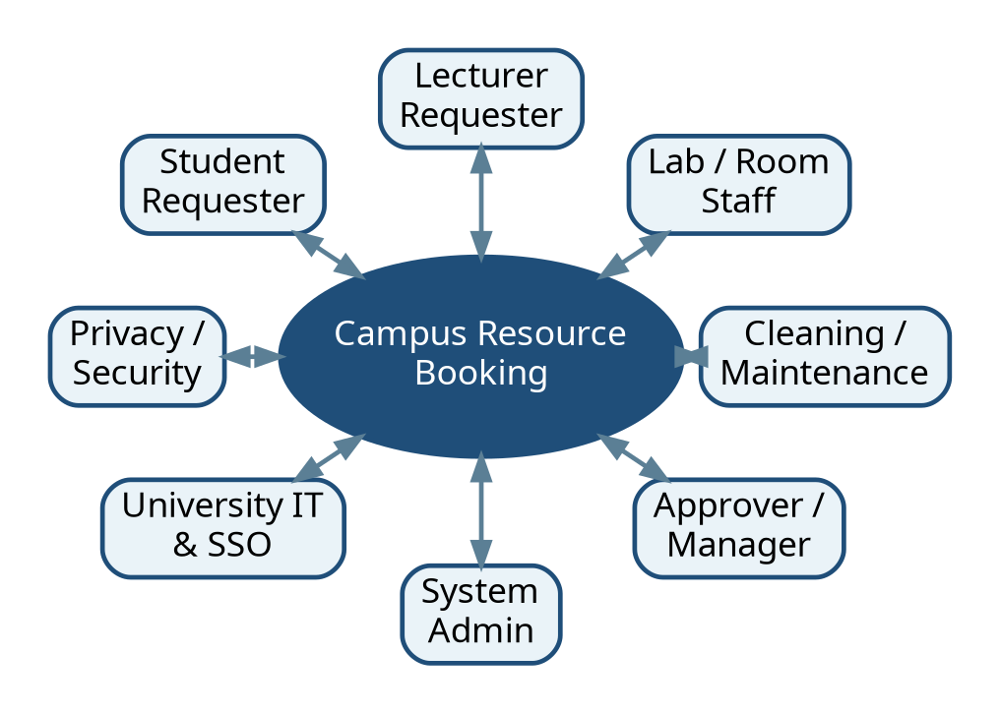
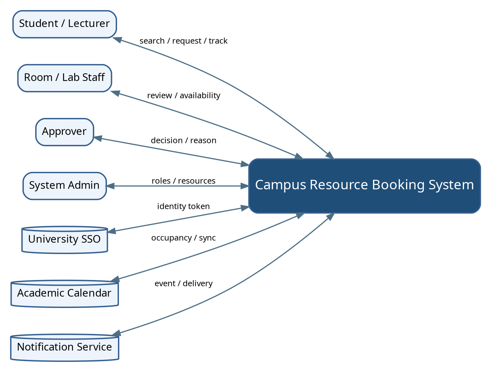
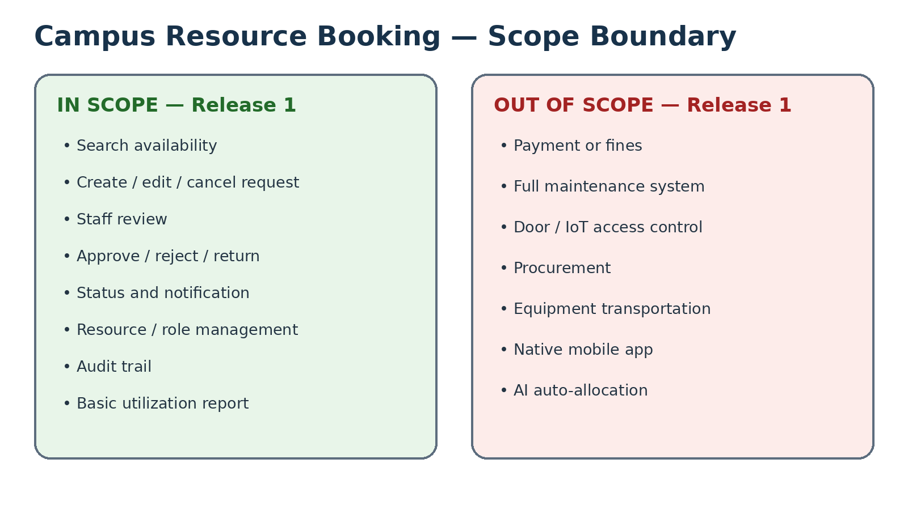

# Week 2 — Stakeholder, Context and Scope

**Case:** Campus Resource Booking  
**Assignment:** W02-v1.0  
**Status:** Example Completed Work  
**Prepared by:** Example Team Alpha  
**Version:** 1.0

> เป้าหมายของเอกสารนี้คือทำให้ทีมตอบได้ว่า **กำลังแก้ปัญหาอะไรให้ใคร ระบบอยู่ท่ามกลางบริบทใด และขอบเขตที่รับผิดชอบคืออะไร** ก่อนเริ่มเก็บ requirement เชิงลึก

---

## 1. Problem Framing

### 1.1 Problem statement

ปัจจุบันนักศึกษาและอาจารย์ต้องตรวจสอบห้องและอุปกรณ์ว่างผ่านหลายช่องทาง เช่น ตารางบนเว็บไซต์ ไฟล์สเปรดชีต ข้อความแชต และการสอบถามเจ้าหน้าที่ ทำให้ข้อมูลสถานะไม่สอดคล้องกัน เกิดการขอใช้ซ้ำ รอการอนุมัตินาน และติดตามหลักฐานย้อนหลังได้ยาก

### 1.2 Who is affected?

- นักศึกษาและอาจารย์ผู้ขอใช้ทรัพยากร
- เจ้าหน้าที่ห้องปฏิบัติการที่ตรวจสอบและจัดสรรทรัพยากร
- ผู้อนุมัติที่ต้องพิจารณาเงื่อนไขและความเหมาะสม
- ผู้ดูแลระบบที่จัดการบัญชี สิทธิ์ และข้อมูลทรัพยากร
- หน่วย IT ที่ดูแลการเชื่อมต่อระบบยืนยันตัวตนและระบบปฏิทิน

### 1.3 Why does it matter?

- ลดการจองซ้ำและเวลารอคำตอบ
- ทำให้ผู้ใช้เห็นสถานะอย่างโปร่งใส
- ลดงานซ้ำของเจ้าหน้าที่
- มีหลักฐานการอนุมัติและการเปลี่ยนแปลงที่ตรวจสอบย้อนหลังได้
- สนับสนุนการวางแผนใช้ทรัพยากรจากข้อมูลจริง

### 1.4 Desired outcomes

1. ผู้ใช้ค้นหาทรัพยากรว่างตามวัน เวลา ความจุ และประเภทได้
2. ผู้ใช้ส่งคำขอและติดตามสถานะได้จากช่องทางเดียว
3. เจ้าหน้าที่ตรวจสอบความพร้อมและเงื่อนไขได้รวดเร็วขึ้น
4. ผู้อนุมัติเห็นข้อมูลที่จำเป็นก่อนตัดสินใจ
5. ระบบเก็บประวัติการดำเนินการโดยไม่เปิดเผยข้อมูลเกินความจำเป็น

### 1.5 Facts, assumptions and open questions

| ID | Type | Statement | Source / Action |
|---|---|---|---|
| F-01 | Fact | มีการใช้หลายช่องทางในการตรวจสอบและขอใช้ทรัพยากร | Case card |
| F-02 | Fact | มีหลายบทบาทเกี่ยวข้องกับการขอใช้และอนุมัติ | Case card |
| AS-01 | Assumption | นักศึกษาทุกคนมีบัญชีมหาวิทยาลัยที่ใช้งานได้ | ต้องยืนยันกับหน่วย IT |
| AS-02 | Assumption | ตารางเรียนสามารถอ่านผ่าน API ได้ | ต้องยืนยันระบบต้นทาง |
| OQ-01 | Open Question | ใครมีอำนาจอนุมัติทรัพยากรแต่ละประเภท? | Interview: เจ้าหน้าที่/ผู้อนุมัติ |
| OQ-02 | Open Question | การจองล่วงหน้าได้สูงสุดกี่วันและมีข้อยกเว้นอะไร? | Interview + document review |
| OQ-03 | Open Question | ข้อมูลใดจำเป็นต้องแสดงต่อผู้ใช้แต่ละบทบาท? | Interview: ผู้ใช้/Privacy review |
| OQ-04 | Open Question | เมื่อเกิดการจองชนกัน ใช้หลักเกณฑ์ใดตัดสิน? | Workshop/negotiation |
| OQ-05 | Open Question | ช่องทางแจ้งเตือนใดจำเป็นและช่องทางใดเป็นเพียงความชอบ? | Interview: ผู้ใช้หลายบทบาท |

---

## 2. Stakeholder Analysis

### 2.1 Stakeholder register

| ST-ID | Stakeholder | Role / concern | Influence | Interest | Engagement strategy |
|---|---|---|---|---|---|
| ST-01 | Student requester | ค้นหา จอง ยกเลิก และติดตามสถานะ | Medium | High | Interview + usability walkthrough |
| ST-02 | Lecturer requester | จองเพื่อการสอน/กิจกรรมและอาจมีกรณีเร่งด่วน | Medium | High | Interview + scenario review |
| ST-03 | Lab/room staff | ตรวจความพร้อม กฎการใช้ และดูแลตาราง | High | High | Interview + observation |
| ST-04 | Approver / manager | ตัดสินใจตามนโยบาย ความเสี่ยง และความเป็นธรรม | High | Medium | Policy interview + negotiation workshop |
| ST-05 | System administrator | จัดการบัญชี สิทธิ์ master data และ audit | High | Medium | Technical interview |
| ST-06 | University IT | SSO, integration, security and availability | High | Medium | Interface/constraint review |
| ST-07 | Security / privacy representative | การเข้าถึงข้อมูลและการเก็บประวัติ | High | Medium | Privacy checklist + review |
| ST-08 | Cleaning/maintenance staff | ต้องทราบช่วงเวลาที่ห้องถูกใช้เพื่อเตรียมพื้นที่ | Low | Medium | Short interview / document review |

### 2.2 Power–interest interpretation

- **Manage closely:** ST-03, ST-04, ST-05, ST-06
- **Keep satisfied:** ST-07
- **Keep informed:** ST-01, ST-02
- **Monitor / consult as needed:** ST-08

### 2.3 Potential conflicts

1. ผู้ขอใช้ต้องการยืนยันเร็ว แต่เจ้าหน้าที่ต้องตรวจเงื่อนไขและความพร้อม
2. ผู้ใช้ต้องการข้อมูลละเอียด แต่หลัก privacy ต้องเปิดเผยเท่าที่จำเป็น
3. ผู้สอนอาจต้องการสิทธิ์เร่งด่วน แต่ต้องไม่ทำให้เกิดความไม่เป็นธรรม
4. หน่วย IT ต้องการลด integration complexity แต่ผู้ใช้ต้องการข้อมูลแบบ real-time

---

## 3. System Context

### 3.1 System of interest

**Campus Resource Booking System (CRBS)** ทำหน้าที่จัดการการค้นหา การส่งคำขอ การพิจารณา การแจ้งสถานะ และประวัติการใช้ห้อง/อุปกรณ์ภายในขอบเขตที่กำหนด

### 3.2 External actors and systems

| External entity | Interaction with CRBS | Data exchanged |
|---|---|---|
| Student/Lecturer | ค้นหา ส่งคำขอ ยกเลิก ติดตามสถานะ | user ID, search criteria, request details |
| Room/Lab Staff | ตรวจความพร้อม ขอข้อมูลเพิ่ม บันทึกข้อจำกัด | resource status, review note |
| Approver | อนุมัติ/ปฏิเสธ/ส่งกลับแก้ไข | decision, reason, condition |
| System Admin | จัดการสิทธิ์ ทรัพยากร และตั้งค่า | role, resource master data |
| University SSO | ยืนยันตัวตน | identity token / role claim |
| Academic Calendar | ให้ข้อมูลตารางเรียน/กิจกรรมที่เกี่ยวข้อง | date/time/resource occupancy |
| Notification Service | ส่งอีเมลหรือ in-app notification | recipient, template, status |

### 3.3 Trust and privacy boundaries

- CRBS ไม่เก็บรหัสผ่าน SSO
- แสดงข้อมูลผู้จองต่อบุคคลอื่นเท่าที่จำเป็นต่อการใช้งาน
- Audit log เข้าถึงได้เฉพาะบทบาทที่ได้รับอนุญาต
- ข้อมูล export ต้องผ่านสิทธิ์และบันทึกเหตุผล

---

## 4. Scope Statement

### 4.1 In scope — Release 1

1. ค้นหาห้องและอุปกรณ์ตามวัน เวลา ความจุ และประเภท
2. ดูรายละเอียดทรัพยากรและข้อจำกัดการใช้งาน
3. สร้าง แก้ไขก่อนส่ง ยกเลิก และติดตามคำขอ
4. เจ้าหน้าที่ตรวจสอบความพร้อมและบันทึกข้อคิดเห็น
5. ผู้อนุมัติอนุมัติ ปฏิเสธ หรือส่งกลับให้แก้ไขพร้อมเหตุผล
6. แจ้งเตือนสถานะผ่าน in-app และอีเมลตามการตั้งค่า
7. จัดการข้อมูลทรัพยากรและบทบาทพื้นฐาน
8. เก็บประวัติคำขอ การตัดสินใจ และการเปลี่ยนแปลง
9. รายงานสรุปการใช้ทรัพยากรระดับพื้นฐาน

### 4.2 Out of scope — Release 1

- การชำระเงินหรือค่าปรับ
- ระบบบำรุงรักษา/แจ้งซ่อมแบบเต็มรูปแบบ
- การควบคุมประตูหรือ IoT access control
- การจัดซื้อทรัพยากรใหม่
- ระบบขนส่งอุปกรณ์
- แอปมือถือ native แยกต่างหาก
- AI แนะนำการจัดสรรทรัพยากรอัตโนมัติ

### 4.3 Constraints

| C-ID | Constraint | Impact |
|---|---|---|
| C-01 | ต้องใช้บัญชีมหาวิทยาลัยผ่าน SSO | ผู้ใช้นอกองค์กรต้องมีกระบวนการเฉพาะในอนาคต |
| C-02 | ตารางเรียนต้นทางอาจอัปเดตไม่พร้อมกัน | ต้องแสดงเวลาซิงก์ล่าสุดและมี fallback |
| C-03 | ผู้อนุมัติแตกต่างตามทรัพยากร | ต้องกำหนด approval rule ที่ปรับค่าได้ |
| C-04 | ต้องปฏิบัติตามนโยบายข้อมูลส่วนบุคคลของมหาวิทยาลัย | จำกัดการแสดงและ export ข้อมูล |
| C-05 | ทีมมีเวลาพัฒนาแบบ Mini Project | Release 1 ต้องจำกัด scope และเน้น artefact ที่ตรวจสอบได้ |

### 4.4 Non-goals

- ไม่ได้แทนที่ระบบทะเบียนหรือระบบตารางเรียน
- ไม่รับประกันว่าทรัพยากรทุกประเภทจะใช้ workflow เดียวกัน
- ไม่อนุมัติคำขอโดยอัตโนมัติใน Release 1

### 4.5 Scope acceptance criteria

ขอบเขต Week 2 ถือว่าพร้อมต่อ Week 3 เมื่อ:

- stakeholder หลักครบทั้งผู้ใช้ ผู้ปฏิบัติงาน ผู้ตัดสินใจ และผู้ดูแลเทคนิค
- system context แสดง actor/system ภายนอกและ data flow หลัก
- in scope/out of scope ไม่ทับซ้อนกัน
- constraints มีผลต่อการเก็บ requirement หรือการออกแบบจริง
- มี Open Questions อย่างน้อย 3 ข้อที่นำไปสร้าง Elicitation Objective ได้

---

## 5. Ethics and Responsible AI Check

| Topic | Risk | Mitigation |
|---|---|---|
| Privacy | แสดงชื่อ/เหตุผลการจองต่อคนที่ไม่เกี่ยวข้อง | role-based access + data minimization |
| Fairness | ผู้มีอำนาจอาจแทรกคิวโดยไม่มีหลักเกณฑ์ | บันทึกเหตุผลและ decision rule |
| Accessibility | ผู้ใช้บางกลุ่มเข้าถึง UI ยาก | ใช้มาตรฐาน accessibility และทดสอบกับผู้ใช้ |
| Transparency | ผู้ใช้ไม่ทราบเหตุผลที่ถูกปฏิเสธ | บังคับ reason code + explanation |
| AI use | ทีมอาจถือคำตอบ AI เป็นข้อเท็จจริง | ติดป้าย Simulation และต้องยืนยันกับแหล่งจริง |

---

## 6. Transition to Week 3

Open Questions ที่เลือกไปทำ Elicitation Plan:

- OQ-01: authority และ approval path
- OQ-02: booking window และ exception
- OQ-03: visibility/privacy by role
- OQ-04: conflict resolution criteria
- OQ-05: notification need versus preference

ไฟล์ต่อเนื่อง: [`../week-03/elicitation-plan.md`](../week-03/elicitation-plan.md)
