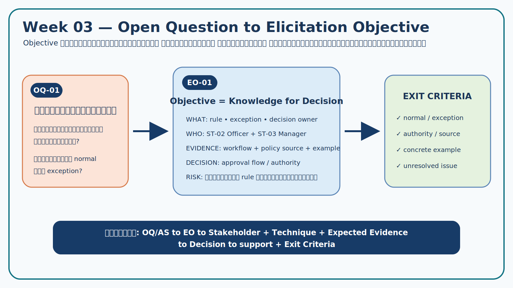
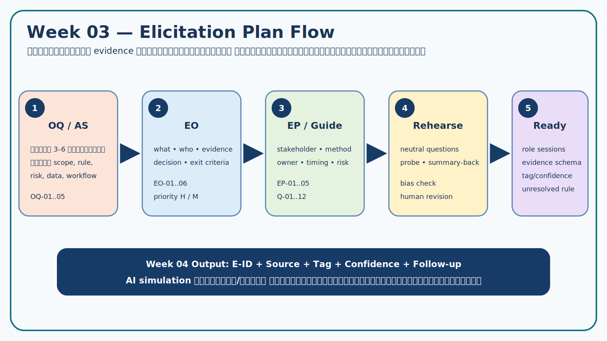

# Week 03 — Elicitation Plan

> **Team:** Team Example — Campus Resource Booking  
> **Assignment:** `W03-v2.0`  
> **Version:** v1.0 — Completed Teaching Example  
> **Inputs:** Week 02 `OQ-01..OQ-05`, `AS-01..AS-03`, `ST-01..ST-04`

## 1. Planning intent

แผนนี้เปลี่ยนสิ่งที่ทีม “ยังไม่รู้” ให้เป็น Elicitation Objectives ที่ตรวจจบได้ แล้วระบุ stakeholder, technique, expected evidence, owner, risk และ exit criteria เพื่อเตรียม Week 04 Stakeholder Panel



## 2. Open Question → Elicitation Objective

| EO ID | Source OQ/AS | Objective: ต้องรู้อะไร | จากใคร/แหล่งใด | ใช้ตัดสินใจเรื่องใด | Exit criteria |
|---|---|---|---|---|---|
| EO-01 | OQ-01, AS-03 | แยกคำขอปกติ/พิเศษ ผู้มีอำนาจ และเงื่อนไขส่งต่อ | ST-02, ST-03; workflow/policy artifact | approval flow และ authority | มี rule, exception, decision owner และจุดที่ยังไม่ยืนยัน |
| EO-02 | OQ-02, AS-02 | เข้าใจกฎจองล่วงหน้า ระยะเวลาใช้ และความสัมพันธ์กับตารางเรียน | ST-03, ST-04; policy/schedule source | validation และ conflict handling | ได้ source/authority; ถ้าไม่มีตัวเลขให้บันทึกเป็น unresolved |
| EO-03 | OQ-03 | เข้าใจเหตุการณ์ late cancellation/no-show ผลกระทบ และทางเลือกที่เป็นธรรม | ST-01, ST-02, ST-03 | cancellation/status/negotiation | มีอย่างน้อย 2 มุมมอง ผลกระทบ และ issue owner |
| EO-04 | OQ-04 | ระบุข้อมูลขั้นต่ำและผู้ยืนยันตอนส่งมอบ/รับคืนอุปกรณ์ | ST-02, ST-01 | handover record และ privacy | แยก must-have evidence กับ proposed solution ได้ |
| EO-05 | OQ-05 | ระบุเหตุการณ์ที่ต้องทราบ เวลาเร่งด่วน และข้อจำกัดช่องทาง | ST-01, ST-02 | notification outcome | มี event/timing/recipient; channel ยังระบุเป็น preference ได้ |
| EO-06 | AS-01 | ตรวจข้อมูล identity/role ที่ระบบต้องใช้และไม่ควรเก็บซ้ำ | ST-04 | access/privacy/system context | มี minimum data, authority boundary และ integration assumption |

### Prioritization

- **High:** EO-01, EO-02, EO-03 เพราะเปลี่ยน scope, rule และความเป็นธรรม
- **Medium:** EO-04, EO-05, EO-06 เพราะเปลี่ยน data, usability และ integration

## 3. Elicitation Plan



| EP ID | EO | Stakeholder/source | Method | Expected evidence | Owner/roles | Timing | Risk → mitigation |
|---|---|---|---|---|---|---|---|
| EP-01 | EO-01, EO-04 | ST-02 Resource Officer | Semi-structured interview + workflow walkthrough | normal/exception flow, required data, handover evidence | Interviewer A; Probe B; Note-taker C; Reviewer D | Week 04 Round 1 | ตอบกว้าง → ขอเหตุการณ์ล่าสุดและ decision point |
| EP-02 | EO-02, EO-03 | ST-03 Area Manager/Instructor + simulated policy note | Interview + document analysis | authority, schedule conflict, cancellation/no-show rationale | Interviewer B; Analyst D; Note-taker A | Week 04 Round 2 | จำลองตัวเลขเป็นนโยบาย → ห้ามเดา; tag `OQ` ถ้าไม่มี source |
| EP-03 | EO-03, EO-05 | ST-01 Student Requester | Interview + pain-point/scenario walkthrough | user outcome, missed-status event, fairness concern | Interviewer C; Probe A; Note-taker B | Week 04 Round 1 | solution bias → ถาม current event/outcome ก่อน channel |
| EP-04 | EO-06, EO-02 | ST-04 IT/System Admin | Constraint interview + context check | minimum identity/role data, schedule integration limitation | Interviewer D; Note-taker B; Reviewer C | Week 04 Round 2 | technical jargon → ถามผลต่อ business decision |
| EP-05 | ทุก EO | Case Card + separated role sessions | Evidence triangulation workshop | conflicts, corroboration, unresolved issues | ทุกคน; Reviewer เป็น gatekeeper | หลัง panel | merge คำตอบเงียบ ๆ → เก็บ source และ contradiction ทั้งสองด้าน |

## 4. Evidence capture design

ใช้ตารางต่อไปนี้ใน Week 04:

```text
E-ID | Source/Role | Session/Context | Statement or Observation
Tag | Related EO/OQ | Confidence | Interpretation | Follow-up/Owner
```

### Evidence tags

| Tag | Meaning | ตัวอย่างในกรณีศึกษา |
|---|---|---|
| `CF` | Case Fact | ทรัพยากรมีจำนวนจำกัด |
| `SN` | Simulated Need | นักศึกษาจำลองต้องการรู้สถานะก่อนเดินทาง |
| `CT` | Constraint ที่มี authority/source | ไม่เก็บเลขบัตรประชาชนตาม Case Card |
| `OP` | Opinion/preference | “อยากได้ข้อความผ่านช่องทาง X” |
| `AS` | Assumption | identity service ส่ง role ได้ครบ |
| `PS` | Proposed Solution | ใช้ QR หรือถ่ายภาพตอนคืน |
| `OQ` | Unresolved | จำนวนวันจองล่วงหน้ายังไม่มีเอกสารยืนยัน |

## 5. Quality, ethics and responsible-AI controls

1. เปิดด้วย objective/consent และใช้ข้อมูลจำลองเท่านั้น
2. จำลอง stakeholder หนึ่งบทบาทต่อ session เพื่อไม่ให้ความรู้ข้ามบทบาท
3. ผู้สัมภาษณ์ไม่เห็น hidden role detail ล่วงหน้า; AI operator ควบคุม role card
4. คำตอบ AI ติดป้าย `Simulation` และไม่ถือเป็น policy/approved requirement
5. Note-taker จด statement แยกจาก interpretation
6. Quality reviewer ตรวจ leading/solution/confirmation/authority bias
7. ปิด session ด้วย summary-back และรายการ unresolved

## 6. Risk register and readiness

| Risk ID | Risk | Impact | Control | Readiness status |
|---|---|---|---|---|
| R-01 | Interview guide ถามหลายประเด็นในข้อเดียว | ข้อมูลไม่ครบ/เทียบยาก | แยก Q-05a/Q-05b และใช้ probes | Closed |
| R-02 | Stakeholder เสนอ solution แล้วทีมบันทึกเป็น requirement | solution fixation | tag `PS`; ถาม underlying need/outcome | Controlled |
| R-03 | ตัวเลขจาก simulation ถูกใช้เป็น policy | false authority | ไม่ invent; tag `OQ`; ขอ document owner | Controlled |
| R-04 | ข้อมูลขัดแย้งถูกสรุปรวม | สูญเสีย conflict evidence | เก็บ E-ID แยกและเปิด negotiation record | Controlled |
| R-05 | เก็บข้อมูลส่วนบุคคลเกินจำเป็น | privacy risk | ใช้ role/identifier จำลอง | Closed |

### Week 04 readiness gate

- [x] EO ทุกข้อเชื่อม OQ/AS และ decision
- [x] Plan มี stakeholder/method/evidence/owner/time/risk/exit criteria
- [x] มี interview guide 12 ข้อและ probes
- [x] มี evidence schema/tag/confidence rule
- [x] มี consent, role isolation, privacy และ human review
- [x] รู้ว่าข้อใดต้องคงสถานะ unresolved ถ้าไม่มี authority

## 7. Handoff

Week 04 จะใช้ `EP-01..EP-05` และ [Interview Guide](03-interview-guide.md) เพื่อสร้าง `E-*`; จากนั้นเปิด `N-*` เมื่อพบ conflict และสร้าง `RC-*` เฉพาะข้อที่อ้าง evidence ได้
