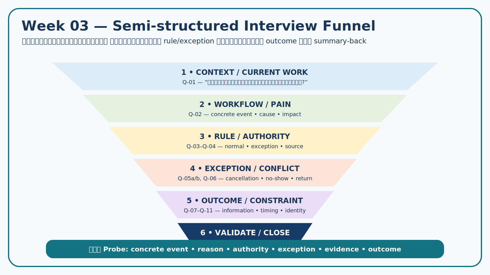

# Week 03 — Interview Guide and Bias Check

> **Case:** Campus Resource Booking  
> **Use:** Week 04 controlled stakeholder simulation  
> **Version:** v1.0 — Revised after rehearsal

## 1. Opening and consent script

> ขอบคุณที่ร่วมกิจกรรมจำลอง ทีมต้องการเข้าใจกระบวนการจองพื้นที่และอุปกรณ์ กฎ ปัญหา ข้อยกเว้น และผลลัพธ์ที่ผู้เกี่ยวข้องต้องการ เราจะใช้ข้อมูลจำลอง ไม่บันทึกชื่อจริงหรือข้อมูลส่วนบุคคล คำตอบจะถูกเก็บพร้อมบทบาทและสถานะ Simulation หากประเด็นใดเกินอำนาจของบทบาท กรุณาระบุว่าใครหรือเอกสารใดควรเป็นผู้ยืนยัน ก่อนจบทีมจะสรุปกลับเพื่อให้ตรวจแก้ความเข้าใจ

## 2. Interview funnel

ลำดับคำถามเริ่มจากบริบทจริง → workflow → pain/rule → exception → outcome → validation เพื่อไม่กระโดดไปหา feature เร็วเกินไป

## 3. Question guide

| Q ID | Target role | EO/OQ | Main question | Probes | Expected evidence |
|---|---|---|---|---|---|
| Q-01 | ST-02 | EO-01/OQ-01 | ปัจจุบันคำขอจองหนึ่งรายการเดินทางตั้งแต่รับคำขอจนจบอย่างไร? | ใครทำอะไร? ใช้ข้อมูลจากที่ใด? สถานะเปลี่ยนเมื่อไร? | workflow, role, decision point |
| Q-02 | ST-02 | EO-01 | ขั้นตอนใดใช้เวลาหรือเกิดข้อผิดพลาดมากที่สุด เพราะอะไร? | ขอเหตุการณ์ล่าสุด; ผลกระทบต่อใคร? | pain point, cause, impact |
| Q-03 | ST-02/ST-03 | EO-01/OQ-01 | คำขอแบบใดดำเนินการปกติได้ และแบบใดต้องส่งต่อ? | ผู้ตัดสินใจคือใคร? ใช้เกณฑ์ใด? มีตัวอย่าง exception ไหม? | rule, authority, exception |
| Q-04 | ST-02/ST-03 | EO-02 | เมื่อคำขอชนกับการจองหรือตารางเรียน ใช้ข้อมูลและเกณฑ์ใดพิจารณา? | source ใดเป็น authoritative? ใคร override ได้? ต้องบันทึกเหตุผลไหม? | conflict rule, source, audit need |
| Q-05a | ST-01/ST-02 | EO-03/OQ-03 | หากผู้ใช้ยกเลิกใกล้เวลาใช้งาน เกิดผลกระทบและมีขั้นตอนใด? | “ใกล้เวลา” ใครกำหนด? ผู้ใช้ถัดไปได้รับผลอย่างไร? | event, impact, policy gap |
| Q-05b | ST-01/ST-03 | EO-03/OQ-03 | หากผู้จองไม่มาตามนัด ควรพิจารณาอะไรเพื่อความเป็นธรรม? | เหตุผลที่ยอมรับได้? ใครตัดสิน? ต้องอุทธรณ์ไหม? | interests, authority, negotiation issue |
| Q-06 | ST-02 | EO-04/OQ-04 | ตอนส่งมอบและรับคืนอุปกรณ์ ต้องรู้หรือยืนยันข้อมูลอะไร เพราะอะไร? | หลักฐานขั้นต่ำคืออะไร? ใครเห็นได้? ถ้าอุปกรณ์ชำรุดทำอย่างไร? | data, accountability, privacy |
| Q-07 | ST-01 | EO-05/OQ-05 | ก่อนยื่นคำขอ คุณต้องใช้ข้อมูลใดเพื่อตัดสินใจ? | capacity/location/equipment/rules ข้อใดสำคัญ? ข้อมูลใดไม่จำเป็น? | information need, priority |
| Q-08 | ST-01/ST-02 | EO-05/OQ-05 | เมื่อสถานะเปลี่ยน เหตุการณ์ใดที่ต้องทราบและเวลาใดสำคัญ? | เคยพลาดข้อมูลอย่างไร? ใครควรได้รับ? ปัญหาช่องทางปัจจุบันคืออะไร? | event/timing/recipient; channel preference |
| Q-09 | ST-03 | EO-02/OQ-02 | กฎจองล่วงหน้าและระยะเวลาใช้งานมาจากแหล่งใด และมี exception อย่างไร? | ถ้าไม่มีเอกสาร ใครเป็น owner? ต้องทบทวนเมื่อไร? | authority/document/unresolved |
| Q-10 | ST-04 | EO-06/AS-01 | ระบบต้องได้รับข้อมูล identity/role ขั้นต่ำใดเพื่อทำการตัดสินใจ? | ข้อมูลใดไม่ควรเก็บซ้ำ? role เชื่อถือจากไหน? | minimum data, privacy, constraint |
| Q-11 | ST-04/ST-03 | EO-02/AS-02 | การตรวจตารางเรียนทำได้จากข้อมูลหรือระบบใด และข้อจำกัดคืออะไร? | real-time หรือ manual? เจ้าของข้อมูล? กรณีข้อมูลไม่พร้อม? | integration assumption, fallback |
| Q-12 | ทุกบทบาท | ทุก EO | ขอสรุปว่า… [สรุป workflow/rule/need] …ถูกต้องไหม มีส่วนใดต้องแก้หรือยังไม่ยืนยัน? | ประเด็นใดเป็นความเห็นส่วนตัว? ใครควรยืนยันต่อ? | confirmed/corrected interpretation, OQ |

## 4. Neutral follow-up toolkit

- **Concrete event:** “ช่วยเล่าเหตุการณ์ล่าสุดตั้งแต่ต้นจนจบได้ไหม?”
- **Reason/constraint:** “อะไรทำให้ต้องตัดสินใจแบบนั้น?”
- **Authority:** “บทบาทใดหรือเอกสารใดมีอำนาจยืนยันเรื่องนี้?”
- **Exception:** “กรณีใดที่ขั้นตอนปกติใช้ไม่ได้?”
- **Evidence:** “หลักฐานใดจะยืนยันหรือหักล้างข้อความนี้?”
- **Outcome:** “ถ้าปัญหานี้ถูกแก้ ผลลัพธ์ที่สังเกตได้คืออะไร?”

## 5. Bias check

| Risky question | Bias | Revised neutral question |
|---|---|---|
| “ควรแจ้งผ่าน LINE ใช่ไหม?” | Solution/confirmation bias | “เหตุการณ์ใดต้องทราบ เมื่อใด และช่องทางปัจจุบันมีปัญหาอะไร?” |
| “ทุกการจองต้องให้เจ้าหน้าที่อนุมัติใช่ไหม?” | Authority/leading bias | “คำขอแบบใดดำเนินการปกติได้ และแบบใดต้องส่งต่อ?” |
| “ถ่ายรูปตอนคืนปลอดภัยกว่าไหม?” | Solution fixation/privacy blind spot | “หลักฐานขั้นต่ำใดจำเป็นตอนรับคืน เพราะอะไร และใครควรเห็น?” |
| “คน no-show ควรถูกห้ามจองไหม?” | Punitive framing | “no-show กระทบใคร และทางเลือกใดรักษาความเป็นธรรมพร้อมลดการเสียทรัพยากร?” |

## 6. Rehearsal findings and revisions

| Item | What happened | Revision |
|---|---|---|
| Q-03 | คำว่า “กรณีพิเศษ” กว้างเกินไป | เพิ่ม probe เรื่อง decision owner, criterion และ concrete example |
| Q-05 | late cancellation กับ no-show ถูกตอบรวมกัน | แยกเป็น Q-05a/Q-05b |
| Q-08 | ผู้ตอบเสนอ channel ก่อนอธิบาย need | ถาม event/timing/recipient ก่อน channel |
| Q-10 | คำตอบเทคนิคไม่ชัดว่ากระทบ decision ใด | เพิ่ม probe เรื่อง minimum data และ business decision |
| Q-12 | สรุปกลับไม่มี status | ให้ note-takerบันทึก confirmed/corrected/unresolved |

## 7. Note-taking and closing

### During session

1. จด `statement` และ `interpretation` คนละช่อง
2. ติด `EO/Q` และ tag เบื้องต้นทุก observation
3. ถ้าผู้ตอบเกิน authority ให้สร้าง `OQ` ไม่ปรับเป็น fact
4. ถ้าพบคำตอบขัดแย้ง ให้เก็บทั้งสอง E-ID

### Closing script

> ทีมได้ยินว่า… [สรุป] … ข้อใดถูกต้อง ข้อใดควรแก้ และข้อใดยังต้องให้บทบาทหรือเอกสารอื่นยืนยัน? ขอบคุณสำหรับข้อมูลจำลอง ทีมจะนำไปจัดหมวด evidence และจะไม่ถือว่าคำตอบนี้เป็นนโยบายหรือ requirement ที่อนุมัติแล้ว

## 8. Ready-to-use checklist

- [x] คำถาม 12 ข้อครอบคลุม current work, pain, rule, exception, outcome และ closing
- [x] ทุกข้อเชื่อม EO/OQ และ expected evidence
- [x] ไม่มีคำถามที่บังคับ feature/channel/penalty
- [x] มี privacy/authority/source probes
- [x] มี summary-back และ unresolved status
