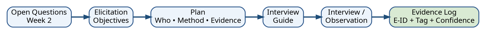

# Week 3 — Elicitation Plan

**Case:** Campus Resource Booking  
**Input:** Week 2 Stakeholder, Context, Scope and Open Questions  
**Status:** Example Completed Work  
**Version:** 1.0

> เอกสารนี้แปลงสิ่งที่ทีมยังไม่รู้ให้เป็น **Elicitation Objectives (EO)** พร้อมกำหนด stakeholder, technique, evidence, owner, risk และ exit criteria

## 1. Elicitation strategy

ใช้หลายเทคนิคเพื่อลดความเสี่ยงจากการพึ่งคำบอกเล่าของ stakeholder เพียงกลุ่มเดียว

- **Semi-structured interview:** เข้าใจเป้าหมาย งานปัจจุบัน ปัญหา กฎ และข้อยกเว้น
- **Observation / walkthrough:** เปรียบเทียบสิ่งที่ทำจริงกับสิ่งที่เล่า
- **Document review:** ตรวจ policy, form, timetable และหลักฐานเดิม
- **Mini workshop:** เปิดเผยความขัดแย้งและสร้างทางเลือก
- **AI rehearsal:** ใช้ซ้อมคำถามเท่านั้น ไม่ใช้สร้างข้อเท็จจริงหรือ requirement จริง

## 2. Open Question → Elicitation Objective

| EO-ID | Source OQ | What we need to learn | From whom / source | Decision supported | Expected evidence |
|---|---|---|---|---|---|
| EO-01 | OQ-01 | authority และ approval path ของทรัพยากรแต่ละประเภท | Lab staff, approver, policy | ออกแบบ workflow/role | rule, exception, authority source |
| EO-02 | OQ-02 | booking window, lead time, duration และ exception | Student, lecturer, staff, document | validation rule | examples + policy reference |
| EO-03 | OQ-03 | ข้อมูลใดมองเห็นได้ในแต่ละ role และเพราะเหตุใด | User, admin, privacy rep | access/privacy model | data visibility matrix |
| EO-04 | OQ-04 | หลักเกณฑ์เมื่อคำขอชนกันและใครตัดสิน | Staff, approver, workshop | prioritization/negotiation | conflict cases + criteria |
| EO-05 | OQ-05 | notification ใดจำเป็น เมื่อใด และผ่านช่องทางใด | Student, lecturer, staff | notification requirements | event-channel preference/need |
| EO-06 | Week 2 C-02 | ข้อมูล availability มาจากระบบใดและเชื่อถือได้เพียงใด | IT, calendar admin, observation | integration boundary | source, latency, fallback |

## 3. Master elicitation plan

| Activity | EO | Stakeholder/source | Technique | Date/time | Owner | Evidence/output | Risk | Mitigation | Exit criteria |
|---|---|---|---|---|---|---|---|---|---|
| A-01 | EO-02, EO-05 | Student requester | Interview 30 min | W3 Tue 10:00 | Narin | notes + examples | ตอบตามความคาดหวังมากกว่างานจริง | ขอ recent concrete example | ได้ current flow + 2 exception + notification need |
| A-02 | EO-01, EO-02, EO-04 | Lab staff | Interview 45 min | W3 Tue 13:30 | Mali | notes + artefact references | workload สูง เวลาจำกัด | ส่งหัวข้อล่วงหน้า | ได้ rule/authority/conflict cases |
| A-03 | EO-02, EO-06 | Lab staff | Observation/walkthrough 30 min | W3 Tue 14:30 | Beam | step log + screenshots without PII | เหตุการณ์จริงไม่เกิด | ใช้ย้อนหลังจากเคสล่าสุด | ได้ actual steps + tools + handoff |
| A-04 | EO-01, EO-04 | Approver | Interview 30 min | W3 Wed 09:30 | Ploy | decision criteria + authority | authority bias | ใช้ neutral scenario | ได้ criteria + unresolved policy gap |
| A-05 | EO-03 | Admin/privacy rep | Joint review 40 min | W3 Wed 13:00 | Narin | visibility matrix | ตีความนโยบายผิด | ขอ source document | ได้ field-by-role matrix + retention question |
| A-06 | EO-06 | University IT | Technical interview 30 min | W3 Thu 10:00 | Beam | system/interface notes | jargon/missing docs | ขอ diagram + example payload | ได้ source, sync interval, failure handling |
| A-07 | EO-04 | Staff + approver + user rep | Mini workshop 45 min | W4 | Mali facilitator | conflict/options/decision record | power imbalance | round-robin + silent idea generation | ได้ ≥2 options และ status/rationale |

## 4. Interview logistics and roles

| Role | Responsibility |
|---|---|
| Facilitator | เปิด session, consent, timebox, ปิดและยืนยัน next step |
| Lead interviewer | ถามตาม EO และปรับลำดับตามคำตอบ |
| Probe interviewer | ถาม example, exception, reason, evidence |
| Note-taker | บันทึกคำตอบใกล้เคียงถ้อยคำจริงและแยก interpretation |
| Evidence controller | ให้ E-ID, tag, confidence, source และ follow-up |
| Quality reviewer | ตรวจ leading question, solution fixation และ privacy |

## 5. Evidence handling protocol

1. ไม่บันทึกข้อมูลส่วนบุคคลที่ไม่จำเป็น
2. ขออนุญาตก่อนบันทึกเสียงหรือภาพ
3. หากไม่บันทึกเสียง ให้ interviewer สรุปและขอ stakeholder ยืนยันตอนท้าย
4. ทุกหลักฐานต้องมี source, context, date, method และ confidence
5. ข้อความจาก AI ต้องติดป้าย **Simulation** และไม่ใช้แทน policy/fact
6. ความขัดแย้งต้องถูกเก็บไว้ ไม่รวมคำตอบให้กลายเป็น consensus ปลอม

## 6. Risks and fallback plan

| Risk ID | Risk | Probability | Impact | Response |
|---|---|---:|---:|---|
| R-01 | Stakeholder ไม่ว่าง | Medium | High | เตรียม alternate role + asynchronous questions |
| R-02 | Interview ได้แต่ opinion ไม่มี example | High | Medium | ใช้ critical incident probe และ walkthrough |
| R-03 | Stakeholder ให้ solution ทันที | High | Medium | ถาม underlying need, outcome และ constraint |
| R-04 | ข้อมูลขัดกัน | High | High | บันทึกแยก source และส่งเข้า negotiation record |
| R-05 | เผลอเก็บ PII | Low | High | data minimization + redact ก่อน commit |
| R-06 | AI rehearsal ทำให้คำถามเอนเอียง | Medium | Medium | human review + before/after question log |

## 7. Definition of Done

- EO ทุกข้อเชื่อมกับ OQ/constraint จาก Week 2
- แต่ละ EO ระบุ source, technique, evidence และ decision use
- Plan มี owner/time/risk/exit criteria
- Interview Guide มีคำถาม neutral 10–12 ข้อพร้อม EO-ID
- มี consent/privacy protocol
- พร้อมนำ evidence ไปบันทึกใน Week 4 ด้วย E-ID

ไฟล์ถัดไป: [`interview-guide.md`](interview-guide.md)
