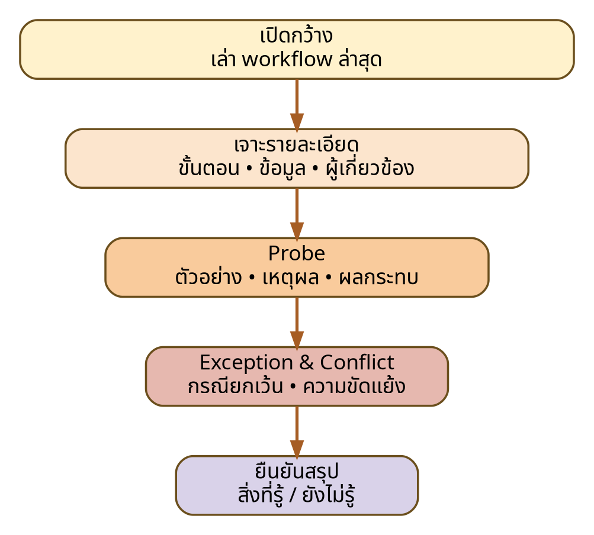

# Week 3 — Semi-structured Interview Guide

**Primary role:** Lab/Room Staff  
**Duration:** 35–45 minutes  
**Linked objectives:** EO-01, EO-02, EO-04, EO-05, EO-06  
**Status:** Example Completed Work



## 1. Opening script (2–3 minutes)

> สวัสดีครับ/ค่ะ ทีมกำลังศึกษา workflow การขอใช้ห้องและอุปกรณ์เพื่อทำความเข้าใจปัญหา กฎ และข้อยกเว้นก่อนออกแบบระบบ การสนทนานี้ใช้เพื่อการเรียนในรายวิชา ENGSE206 เราจะไม่บันทึกข้อมูลส่วนบุคคลที่ไม่จำเป็น และคำตอบจะถูกสรุปเป็นหลักฐานตามบทบาท ไม่ระบุชื่อจริง ท่านสะดวกให้จดบันทึกหรือไม่ และมีประเด็นใดที่ไม่ควรถามหรือบันทึกหรือไม่

### Consent checklist

- [ ] อธิบายวัตถุประสงค์แล้ว
- [ ] ผู้ให้ข้อมูลยินยอมให้จดบันทึก
- [ ] ไม่บันทึกชื่อจริง/รหัสบุคคล
- [ ] หากใช้ AI ให้ระบุว่าเป็นการซ้อม ไม่ใช่ข้อมูลจริง

## 2. Core questions and probes

| Q-ID | EO | Main question | Suggested probes | Evidence expected |
|---|---|---|---|---|
| Q-01 | EO-01 | ช่วยเล่าตั้งแต่มีคำขอเข้ามาจนจบกระบวนการล่าสุดให้ฟังได้ไหม? | ใครรับช่วงต่อ? จุดใดต้องรอ? ใช้เครื่องมืออะไร? | actual workflow + handoff |
| Q-02 | EO-01 | ในแต่ละขั้น ใครมีสิทธิ์ตัดสินใจเรื่องใด และอ้างอิงกฎหรือเอกสารใด? | มีกรณีที่ต้อง escalate หรือไม่? | authority + source |
| Q-03 | EO-02 | ปกติผู้ใช้ต้องยื่นล่วงหน้าเท่าใด และระยะเวลาใช้งานจำกัดอย่างไร? | มีข้อยกเว้นล่าสุดหรือไม่? ใครอนุมัติ? | rule + exception |
| Q-04 | EO-02 | ข้อมูลอะไรที่มักขาดหรือผิดจนทำให้ต้องติดต่อกลับ? | ตัวอย่างล่าสุด? ผลกระทบ? | required data + validation |
| Q-05 | EO-04 | เมื่อมีคำขอชนกัน ท่านพิจารณาอะไรบ้างก่อนตัดสิน? | priority, fairness, urgency, class use? | conflict criteria |
| Q-06 | EO-04 | ช่วยเล่ากรณีที่ผู้เกี่ยวข้องไม่เห็นตรงกันและวิธีที่ใช้คลี่คลาย | ใครมี final authority? สิ่งใดยังไม่ชัด? | conflict + negotiation |
| Q-07 | EO-06 | ท่านตรวจสอบว่าห้องหรืออุปกรณ์ว่างจากแหล่งใด และเชื่อถือข้อมูลได้แค่ไหน? | อัปเดตช้าแค่ไหน? เมื่อระบบล่มทำอย่างไร? | source + latency + fallback |
| Q-08 | EO-05 | เหตุการณ์ใดที่ผู้ใช้หรือเจ้าหน้าที่จำเป็นต้องได้รับแจ้ง? | ใครต้องรู้ เมื่อใด ช่องทางใด? | event-recipient-timing |
| Q-09 | EO-03 | ข้อมูลส่วนใดควรเห็นได้เฉพาะเจ้าหน้าที่หรือผู้อนุมัติ? | เพราะเหตุใด? เก็บนานเท่าใด? | privacy/access need |
| Q-10 | EO-01 | ขั้นตอนใดใช้เวลาหรือแรงงานมากที่สุด และอะไรเป็นสาเหตุ? | frequency, impact, workaround | pain + root cause |
| Q-11 | ALL | หากปรับปรุงได้เพียงหนึ่งเรื่องใน Release แรก ท่านจะเลือกอะไร เพราะเหตุใด? | outcome ที่คาดหวังวัดอย่างไร? | priority rationale |
| Q-12 | ALL | มีข้อยกเว้น กลุ่มผู้ใช้ หรือความเสี่ยงใดที่เรายังไม่ได้ถามหรือไม่? | ใครควรคุยต่อ? เอกสารใดควรดู? | missing stakeholder/source |

## 3. Neutral probes library

ใช้ probe ต่อไปนี้แทนการชี้นำคำตอบ

- “ช่วยยกตัวอย่างครั้งล่าสุดได้ไหม?”
- “เกิดอะไรขึ้นก่อนและหลังจากนั้น?”
- “อะไรทำให้ขั้นตอนนั้นจำเป็น?”
- “กรณีปกติกับกรณียกเว้นต่างกันอย่างไร?”
- “ใครเป็นผู้ยืนยันเรื่องนี้ได้อีก?”
- “มีเอกสารหรือหน้าจอใดที่สะท้อนขั้นตอนนี้หรือไม่?”
- “ผลกระทบต่อผู้ใช้หรือเจ้าหน้าที่คืออะไร?”
- “เราสรุปถูกไหมว่า…?”

## 4. Bias check — before and after

| Problematic question | Problem | Revised question |
|---|---|---|
| ระบบควรส่งแจ้งเตือนผ่าน LINE ใช่ไหม? | leading + solution fixation | ในเหตุการณ์ใดผู้ใช้จำเป็นต้องได้รับแจ้ง และช่องทางที่ใช้อยู่มีข้อดีข้อจำกัดอย่างไร? |
| การอนุมัติช้าเพราะเจ้าหน้าที่มีน้อยหรือเปล่า? | assumes root cause | ช่วยเล่าจุดที่ใช้เวลานานที่สุดและปัจจัยที่ทำให้เกิดความล่าช้า |
| ผู้สอนควรได้ priority สูงกว่านักศึกษาใช่ไหม? | authority/fairness bias | เมื่อคำขอชนกัน ปัจจุบันใช้เกณฑ์ใด และ stakeholder แต่ละฝ่ายได้รับผลกระทบอย่างไร? |
| ถ้ามี dashboard จะช่วยมากไหม? | proposes design | ข้อมูลใดที่ท่านต้องเห็นเพื่อทำงานหรือตัดสินใจได้ครบถ้วน? |

## 5. Observation prompts after interview

หาก stakeholder อนุญาตให้ walkthrough:

1. ขอให้แสดงขั้นตอนโดยใช้ข้อมูลจำลองหรือข้อมูลที่ปกปิดแล้ว
2. บันทึก trigger, action, tool, information, decision, handoff, delay และ workaround
3. อย่าถ่ายภาพที่มีชื่อ เลขประจำตัว เบอร์โทร หรือข้อมูลคำขอจริง
4. เปรียบเทียบสิ่งที่สังเกตกับคำตอบสัมภาษณ์ และติดป้าย contradiction หากไม่ตรงกัน

## 6. Closing script (3–5 minutes)

> ขออนุญาตสรุปสิ่งที่เราเข้าใจ: … ประเด็นที่ยังไม่แน่ใจคือ … และเราจะตรวจต่อจาก … ท่านเห็นว่าสรุปนี้คลาดเคลื่อนตรงไหนหรือไม่? มีบุคคลหรือเอกสารใดที่ควรปรึกษาเพิ่มหรือไม่?

### Confirmation questions

- ข้อสรุปใดเป็นกฎที่ยืนยันได้?
- ข้อใดเป็นเพียงแนวปฏิบัติหรือความเห็น?
- ข้อใดมีข้อยกเว้น?
- ใครมีอำนาจยืนยันขั้นสุดท้าย?
- เราสามารถติดต่อกลับเพื่อยืนยันสรุปได้หรือไม่?

## 7. Interview note structure

```text
Session ID:
Date/time:
Role (not real name):
Interviewer / note-taker:
Consent status:
EO covered:

Evidence items:
- E-ID:
- Near-verbatim statement / observed action:
- Tag: CF/SN/CT/OP/AS/PS/OQ
- Context:
- Confidence:
- Follow-up:

Contradictions:
Open questions:
Potential requirement candidates (do not approve yet):
```

## 8. AI rehearsal limitation statement

AI อาจใช้เป็น stakeholder จำลองเพื่อทดสอบลำดับคำถามและค้นคำถามที่ชี้นำ แต่คำตอบ AI:

- ไม่ใช่ fact หรือ policy ของมหาวิทยาลัย
- ต้องติดป้าย `SN`, `AS`, `OP` หรือ `PS` ตามลักษณะ
- ต้องไม่ถูกคัดลอกเป็น approved requirement
- ต้องมี human review และแผน verification

Transition: evidence จาก Guide นี้จะเข้าสู่ [`../week-04/evidence-log.md`](../week-04/evidence-log.md)
