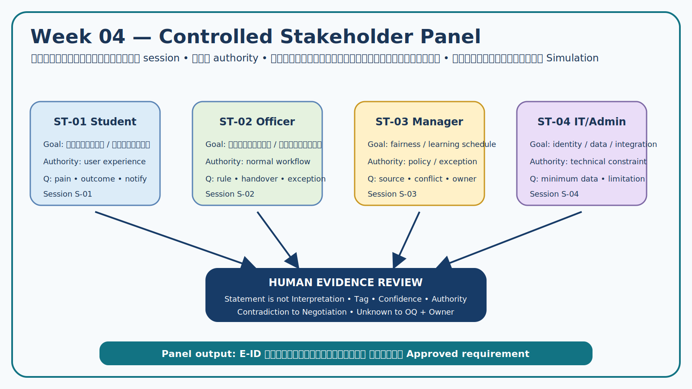
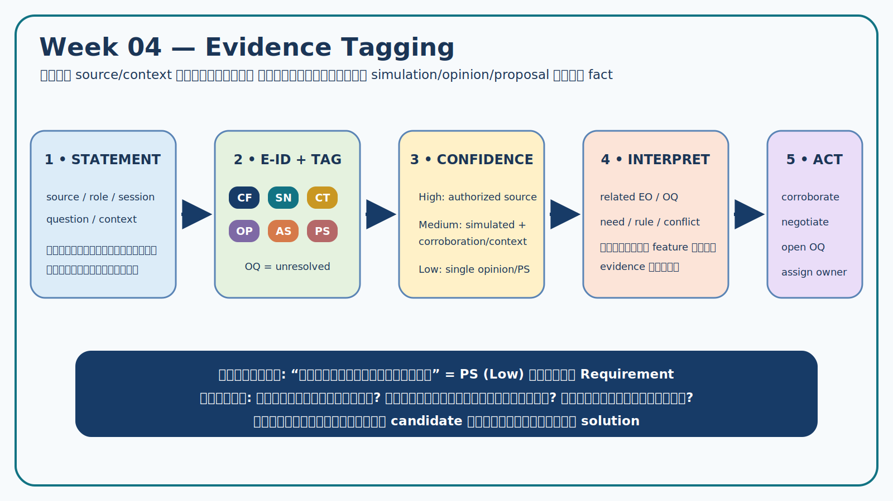

# Week 04 — Evidence Log

> **Team:** Team Example — Campus Resource Booking  
> **Assignment:** `W04-v2.0`  
> **Version:** v1.0 — Completed Teaching Example  
> **Inputs:** Week 03 Elicitation Plan and revised Interview Guide

## 1. Evidence policy

บันทึกนี้แยก **สิ่งที่แหล่งข้อมูลกล่าว/ระบุ** ออกจาก **การตีความของทีม** คำตอบจาก AI stakeholder panel เป็นข้อมูลจำลอง (`SN`) ไม่ใช่นโยบายจริง และทุกข้อที่ไม่มี source/authority ชัดเจนต้องคงสถานะ provisional หรือ unresolved

## 2. Source and session register

| Session | Source/role | Objectives | Control used | Limitation |
|---|---|---|---|---|
| S-00 | Authorized Case Card | baseline CF/CT | อ้าง section ของ Case Card | ให้เพียงบริบทตั้งต้น |
| S-01 | ST-01 Student Requester (Simulation) | EO-03, EO-05 | role isolation, Q-05a/b, Q-07–Q-08 | ไม่มี authority ด้าน policy |
| S-02 | ST-02 Resource Officer (Simulation) | EO-01, EO-04 | workflow walkthrough, Q-01–Q-06 | อนุมัติได้เฉพาะกรณีปกติ |
| S-03 | ST-03 Area Manager/Instructor (Simulation) | EO-01–EO-03 | authority/exception probes | ไม่ invent ตัวเลข/นโยบาย |
| S-04 | ST-04 IT/System Admin (Simulation) | EO-02, EO-06 | constraint/context check | ไม่กำหนด business policy |

## 3. Tagging and confidence rules

| Tag | Use | Confidence rule |
|---|---|---|
| `CF` | ข้อเท็จจริงจาก authorized Case Card/document | High เมื่ออ้าง source ได้ |
| `CT` | constraint/rule ที่มี authority | High/Medium ตาม source; ถ้าไม่มี authority ใช้ `SN`/`OQ` |
| `SN` | simulated need/statement | ไม่เกิน Medium จนกว่าจะ verify กับคน/เอกสารจริง |
| `OP` | preference/opinion | ไม่ใช้เป็น requirement โดยตรง |
| `AS` | assumption | ต้องมี follow-up/owner |
| `PS` | proposed solution | ค้น underlying need ก่อนสร้าง candidate |
| `OQ` | unresolved information | ห้ามเติมคำตอบเอง |

## 4. Evidence table

| E-ID | Source/context | Statement or observation | Tag | Related EO/OQ | Confidence | Team interpretation | Follow-up / owner |
|---|---|---|---|---|---|---|---|
| E-01 | S-00 Case Card §4 | มีพื้นที่หลายขนาดและอุปกรณ์จำนวนจำกัด | CF | EO-02 | High | availability และ conflict เป็นปัญหาหลัก | ใช้เป็น baseline |
| E-02 | S-00 Case Card §2/§4 | การจองกระจายหลายช่องทาง ทำให้ตรวจสถานะยากและเสี่ยงจองซ้ำ | CF | EO-01, EO-05 | High | ต้องมี shared booking record; ยังไม่กำหนด UI | ใช้เป็น baseline |
| E-03 | S-01, Q-07 | ผู้ขอใช้ต้องรู้สถานะ ช่วงเวลาว่าง ความจุ/คุณสมบัติ และกฎสำคัญก่อนยื่นคำขอ | SN | EO-05/OQ-05 | Medium | เป็น information need ไม่ใช่การสั่งทำหน้าจอเฉพาะ | Verify กับผู้ใช้จริง |
| E-04 | S-02, Q-01/Q-02 | คำขอที่ข้อมูลไม่ครบทำให้เจ้าหน้าที่ต้องถามกลับและตัดสินใจล่าช้า | SN | EO-01 | Medium | ต้องรู้ minimum required data | ขอแบบฟอร์มหรือ workflow จริงจาก ST-02 |
| E-05 | S-02, Q-03 | เจ้าหน้าที่จำลองแยกกรณีปกติกับกรณีที่ต้องส่งต่อ แต่ยังไม่มีเกณฑ์รายการทรัพยากรที่ยืนยันแล้ว | SN + OQ | EO-01/OQ-01 | Low–Medium | approval routing มี need; matrix ยัง unresolved | ST-03/policy owner |
| E-06 | S-01, Q-08 | ผู้ขอใช้ต้องทราบเมื่อคำขอถูกตัดสิน เปลี่ยนแปลง หรือใกล้เวลาใช้; channel เป็นเพียง preference | SN + OP | EO-05/OQ-05 | Medium | candidate ควรระบุ event/recipient ก่อนช่องทาง | สำรวจ channel/timing จริง |
| E-07 | S-03, Q-04 | กิจกรรมการเรียนที่มี authority อาจสร้างข้อยกเว้นเมื่อชนกับคำขอทั่วไป และต้องมีผู้ตัดสินใจชัดเจน | SN | EO-01, EO-02 | Medium | ต้องมี exception route/audit; ไม่ใช่สิทธิ override อัตโนมัติ | ตรวจ policy และ authority จริง |
| E-08 | S-03, Q-09 | ไม่พบตัวเลขยืนยันเรื่องจองล่วงหน้า ระยะเวลาใช้ และ no-show ใน simulation | OQ | EO-02, EO-03 | High ว่า “ยังไม่รู้” | ห้ามสร้างค่าตัวเลขเอง | Policy owner / Week 05 issue |
| E-09 | S-00 F-04 + S-02 Q-06 | Case ระบุผู้รับผิดชอบ/วันคืน; เจ้าหน้าที่จำลองเพิ่มความต้องการบันทึกเวลาและสภาพโดยสรุป | CF + SN | EO-04/OQ-04 | Medium | minimum handover record เป็น candidate; รูปถ่ายยังไม่ยืนยัน | ตรวจแบบฟอร์มรับ–คืนและ privacy |
| E-10 | S-04, Q-10 | ระบบควรใช้ identifier/role เท่าที่จำเป็นและไม่เก็บข้อมูล identity ซ้ำโดยไม่มีเหตุผล | SN + CT-candidate | EO-06/AS-01 | Medium | สนับสนุน data minimization; integration ยัง assumption | IT/security owner |
| E-11 | S-04, Q-11 | ยังไม่ยืนยันว่า CRBS อ่านตารางเรียนแบบ real-time ได้ | AS + OQ | EO-02/AS-02 | High ว่า “ยังไม่ยืนยัน” | ต้องมี fallback ที่ไม่พึ่ง integration | เจ้าของข้อมูลตารางเรียน |
| E-12 | S-01 + S-02 + conflict seed | ผู้ใช้ต้องการยื่นคำขอได้เร็ว ขณะที่เจ้าหน้าที่ต้องการข้อมูลครบและควบคุม no-show | SN | EO-01, EO-03 | Medium | เปิด conflict N-01/N-03 | เจรจาด้วย common criteria |
| E-13 | S-01, Q-05b | ผู้ขอใช้กังวลว่าการลงโทษ no-show แบบเดียวทุกกรณีไม่สะท้อนเหตุจำเป็น | OP + SN | EO-03 | Low–Medium | เป็น fairness concern ไม่ใช่ policy | หาข้อมูลเหตุ/appeal/authority |
| E-14 | S-02, Q-06 | การถ่ายภาพทุกครั้งถูกเสนอเป็นวิธีหนึ่ง แต่ยังไม่มีหลักฐานว่าจำเป็นสำหรับทุกทรัพยากร | PS | EO-04 | Low | อย่าแปลงเป็น requirement; หา evidence minimum | ST-02 + privacy review |

## 5. Triangulation and conflicts

| Topic | Supporting/contradicting E-IDs | Finding | Action |
|---|---|---|---|
| Shared status | E-01, E-02, E-03 | Case fact และ user need สอดคล้อง | สร้าง RC-01/RC-03 |
| Complete request vs quick submission | E-04, E-12 | conflict ที่ต้องออกแบบสถานะ/เกณฑ์ | เปิด N-01 |
| Schedule override | E-07, E-11 | need มี แต่ integration/authority ยังไม่ยืนยัน | เปิด N-02 และ RC-04 แบบ provisional |
| No-show control vs fairness | E-08, E-12, E-13 | ไม่มี policy source และมีผลกระทบหลายฝ่าย | เปิด N-03; คง unresolved |
| Return evidence | E-09, E-14 | ต้องบันทึกขั้นต่ำ แต่ photo เป็น proposed solution | RC-06 ไม่บังคับ photo |

## 6. Evidence quality check

- [x] ทุกแถวมี E-ID/source/context/tag/EO/confidence/follow-up
- [x] CF/CT อ้าง authorized source; simulation ไม่ถูกเลื่อนเป็น policy
- [x] statement แยกจาก interpretation
- [x] contradiction ถูกเก็บและส่งเข้า negotiation
- [x] proposed solution ถูกติด `PS` และค้น underlying need
- [x] unresolved มี owner/verification plan

## 7. Handoff

- ใช้ `E-04`, `E-12` เปิด [N-01](04-negotiation-record.md)
- ใช้ `E-07`, `E-11` เปิด `N-02`
- ใช้ `E-08`, `E-12`, `E-13` เปิด `N-03`
- Candidate ทั้งหมดต้องอ้าง E-ID ตาม [Requirement Candidates](04-requirement-candidates.md)
