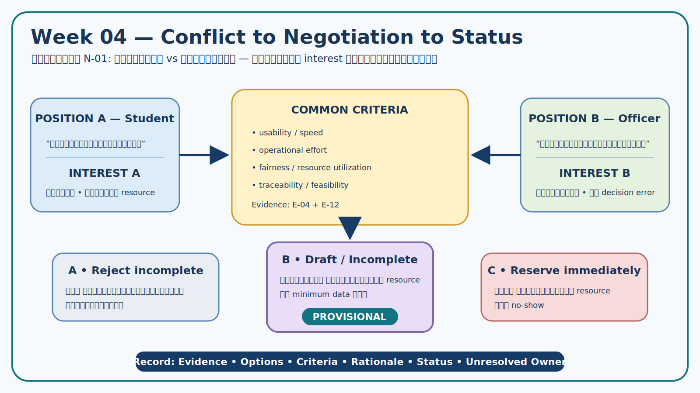

# Week 04 — Conflict and Negotiation Record

> **Status rule:** ผลการเจรจาใน controlled simulation เป็น Candidate/Provisional/Unresolved เท่านั้น ไม่ใช่นโยบายจริงหรือ Approved requirement

## 1. Negotiation method

แต่ละประเด็นแยก **Position** (สิ่งที่แต่ละฝ่ายเรียกร้อง) ออกจาก **Interest** (เหตุผล/ผลลัพธ์ที่ต้องการ) ตรวจ authority/constraint แล้วเปรียบเทียบ options ด้วยเกณฑ์ร่วม ได้แก่ usability, operational effort, fairness, traceability, privacy และ feasibility

## 2. Negotiation register

### N-01 — Quick submission vs complete information

| Field | Record |
|---|---|
| Evidence | E-04, E-12 |
| Position A — Student | ต้องการยื่นคำขอได้รวดเร็ว แม้ยังไม่ทราบรายละเอียดทุกข้อ |
| Interest A | ลดเวลาและไม่พลาดทรัพยากร |
| Position B — Officer | ไม่ต้องการรับคำขอที่ข้อมูลไม่ครบ |
| Interest B | ลดงานถามกลับและตัดสินใจผิด |
| Authority/constraint | เกณฑ์ข้อมูลขั้นต่ำต้องยืนยันกับ ST-02/ST-03; ห้ามถือว่าการสร้าง draft คือการกันทรัพยากร |

| Option | Description | Usability | Operational effort | Traceability/Risk |
|---|---|---:|---:|---|
| A | ปฏิเสธคำขอทันทีเมื่อข้อมูลไม่ครบ | Low | Medium | ชัดแต่ผู้ใช้อาจเริ่มใหม่หลายครั้ง |
| B | รับเป็น Draft/Incomplete; ยังไม่กันทรัพยากรจนข้อมูลขั้นต่ำครบ | High | Medium | ต้องแสดงสถานะ/รายการที่ขาดชัดเจน |
| C | กันทรัพยากรทันทีแม้ข้อมูลไม่ครบ | High | High | เสี่ยงกักทรัพยากรและ no-show |

**Decision/status:** เลือก Option B เป็น **Provisional** เพราะตอบ interest ทั้งสองฝ่ายและตรวจย้อนหลังได้  
**Rationale:** E-04 ชี้ต้นทุนคำขอไม่ครบ ขณะที่ E-12 ชี้ need เรื่องความรวดเร็ว; Draft แยกการเริ่มคำขอออกจากการ confirm reservation  
**Unresolved:** required fields, ระยะเวลาคง Draft และผู้มีสิทธิ์แก้  
**Derived candidates:** RC-02, RC-03

### N-02 — Learning schedule/urgent activity vs existing request

| Field | Record |
|---|---|
| Evidence | E-07, E-11 |
| Position A — Student | คำขอที่ยืนยันแล้วไม่ควรถูกยกเลิกโดยไม่แจ้งและไม่มีเหตุผล |
| Interest A | ความคาดการณ์ได้และความเป็นธรรม |
| Position B — Manager/Instructor | กิจกรรมการเรียนหรือเหตุจำเป็นอาจต้องใช้ทรัพยากร |
| Interest B | รักษาภารกิจการเรียนและจัดการ exception |
| Authority/constraint | authority/policy และ schedule integration ยังต้องยืนยัน; ST-04 ไม่กำหนด policy |

| Option | Description | Fairness | Feasibility | Auditability |
|---|---|---:|---:|---:|
| A | First-come-first-served ไม่มี exception | Medium | High | High |
| B | ผู้มีอำนาจส่ง exception request พร้อมเหตุผล ผลกระทบ และการแจ้งผู้ได้รับผล | High | Medium | High |
| C | override อัตโนมัติจากตารางเรียน | Low–Medium | Unknown | Medium; เสี่ยงข้อมูลผิด |

**Decision/status:** เลือก Option B เป็น **Provisional**; ไม่เลือก automatic override เพราะ E-11 ยังไม่ยืนยัน integration  
**Rationale:** รักษา decision right และ audit trail โดยไม่อ้างว่า exception ทุกกรณีได้รับอนุมัติ  
**Unresolved:** authority matrix, notice period, alternative resource/appeal  
**Derived candidate:** RC-04

### N-03 — No-show control vs fair treatment

| Field | Record |
|---|---|
| Evidence | E-08, E-12, E-13 |
| Position A — Officer/Manager | ต้องลด no-show เพื่อไม่ให้ทรัพยากรถูกกันโดยไม่ใช้ |
| Interest A | utilization และภาระงาน |
| Position B — Student | ไม่ควรลงโทษเหมือนกันทุกกรณี โดยเฉพาะเหตุจำเป็น |
| Interest B | fairness และโอกาสชี้แจง |
| Authority/constraint | ยังไม่มี policy source หรือตัวเลขที่ยืนยัน (E-08) |

| Option | Description | Fairness | Operational effort | Evidence status |
|---|---|---:|---:|---|
| A | ลงโทษอัตโนมัติทุก no-show | Low | Low | Unsupported |
| B | บันทึกเหตุการณ์และแจ้งเตือน; policy consequence ตัดสินภายหลัง | High | Medium | Supported at candidate level |
| C | ไม่บันทึก/ไม่ดำเนินการ | Medium | Low | ไม่ตอบ operational need |

**Decision/status:** **Unresolved** ในส่วน penalty/suspension; รับได้เพียงแนวทาง Option B เรื่อง event record/status notice เป็น candidate  
**Rationale:** E-08 ยืนยันเพียงว่ายังไม่มีนโยบายที่อนุญาตให้ทีมกำหนดบทลงโทษ  
**Unresolved owner:** Area Manager/authorized policy owner; ต้องทบทวนใน Week 05 ก่อน prioritization  
**Derived candidate:** RC-05 เฉพาะ cancellation/status; penalty ไม่สร้างเป็น RC

## 3. Decision summary

| N-ID | Status | Accepted direction | Explicitly not decided | Next owner |
|---|---|---|---|---|
| N-01 | Provisional | Draft/Incomplete ไม่กันทรัพยากรจนข้อมูลขั้นต่ำครบ | required fields และ draft lifetime | ST-02/ST-03 |
| N-02 | Provisional | exception request + authority + rationale + affected-user notice | automatic override และ notice period | ST-03 + schedule owner |
| N-03 | Unresolved | บันทึก event/status ได้ | penalty/suspension/appeal rule | Authorized policy owner |

## 4. Quality check

- [x] ทุก conflict มี E-ID และอย่างน้อย 2 options
- [x] แยก position/interest/authority/constraint
- [x] ใช้เกณฑ์ร่วมและบันทึก rationale
- [x] status ไม่ overclaim ว่า Approved
- [x] สิ่งที่ยังไม่รู้มี owner และไม่ถูกเติมด้วยสมมติฐาน
