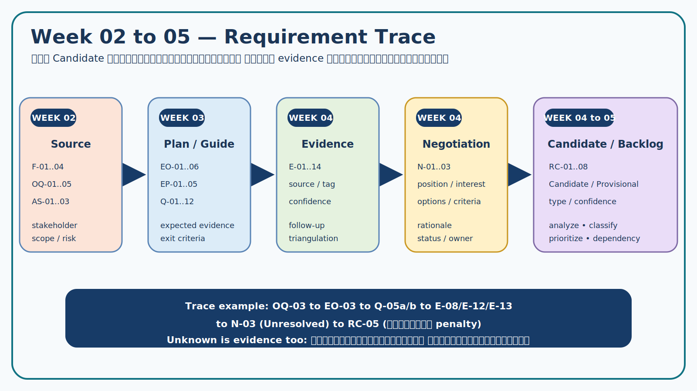

# Week 04 — Evidence-linked Requirement Candidates

> **Important:** รายการนี้เป็น Candidate/Provisional สำหรับนำไปวิเคราะห์ จัดหมวด และจัดลำดับใน Week 05 ยังไม่ใช่ baseline หรือ Approved requirement

## 1. Candidate writing rule

Candidate ที่ดีใน Week 04 ต้องมี actor/system behavior หรือ quality concern ที่ชัดพอให้วิเคราะห์ต่อ อ้าง E-ID ระบุสถานะ/confidence และบอกช่องว่างที่ต้อง verify โดยยังไม่รีบสร้างรายละเอียด UI/technology/penalty ที่ไม่มี evidence

## 2. Requirement candidates

| RC ID | Candidate statement | Type | Evidence / Decision | Status | Confidence | Follow-up / acceptance hint |
|---|---|---|---|---|---|---|
| RC-01 | ระบบต้องให้ผู้ขอใช้ค้นหาและดูสถานะของห้อง/อุปกรณ์ตามช่วงเวลา พร้อมข้อมูลที่จำเป็นต่อการตัดสินใจก่อนยื่นคำขอ | Functional | E-01, E-02, E-03 | Candidate | High | ระบุ minimum information กับ ST-01/ST-02; ทดสอบว่าผู้ใช้แยก available/unavailable ได้ |
| RC-02 | ระบบต้องให้ผู้ขอใช้บันทึกคำขอเป็น `Draft/Incomplete` และแสดงข้อมูลที่ยังขาด โดยสถานะดังกล่าวยังไม่ถือว่าเป็นการยืนยันหรือกันทรัพยากร | Functional/Business rule | E-04, E-12, N-01 | Provisional | Medium | ยืนยัน required fields/draft lifetime; ตรวจว่า Draft ไม่ทำให้ availability เปลี่ยน |
| RC-03 | ก่อนเปลี่ยนคำขอเป็น `Confirmed` ระบบต้องตรวจว่าไม่มีการจองที่ยืนยันแล้วของทรัพยากรเดียวกันในช่วงเวลาทับซ้อน | Functional/Integrity | E-01, E-02, N-01 | Candidate | High | นิยาม overlap และ status set ใน Week 05/06 |
| RC-04 | ระบบต้องส่งกรณี exception ไปยังบทบาทที่มีอำนาจ พร้อมบันทึกเหตุผล แหล่ง authority ผลการตัดสินใจ และผู้ใช้ที่ได้รับผลกระทบ | Functional/Audit | E-05, E-07, E-11, N-02 | Provisional | Medium | ยืนยัน authority matrix, notice และ fallback เมื่อ schedule source ไม่พร้อม |
| RC-05 | ระบบต้องให้ผู้ขอใช้ยกเลิกคำขอและบันทึกเหตุผล/เวลา พร้อมปรับสถานะและแจ้งผู้เกี่ยวข้องตามเหตุการณ์ที่กำหนด โดยผลจาก late cancellation/no-show ยังขึ้นกับ policy ที่ได้รับอนุมัติ | Functional/Policy dependency | E-06, E-08, E-12, E-13, N-03 | Candidate + unresolved policy | Medium | ห้ามกำหนด penalty; เก็บ policy issue แยก |
| RC-06 | เจ้าหน้าที่ต้องบันทึกการส่งมอบ/รับคืนอุปกรณ์ด้วยผู้รับผิดชอบ เวลา และสภาพโดยสรุปตามข้อมูลขั้นต่ำที่ได้รับอนุมัติ | Functional/Accountability | E-01, E-09, E-14 | Candidate | Medium | ตรวจ minimum evidence/privacy; ไม่บังคับ photo โดยไม่มีหลักฐาน |
| RC-07 | ระบบต้องแจ้งผู้เกี่ยวข้องเมื่อคำขอถูกตัดสิน เปลี่ยนแปลง หรือใกล้เหตุการณ์สำคัญ โดยกำหนด recipient/timing ตาม policy และ preference ที่ยืนยันแล้ว | Functional/Usability | E-06 | Candidate | Medium | ยืนยัน channel/timing และ opt-out; วัดการได้รับสถานะโดยไม่รบกวนเกินไป |
| RC-08 | ระบบต้องใช้ข้อมูล identity/role เท่าที่จำเป็นต่อการยืนยันตัวตนและสิทธิ์ และไม่เก็บข้อมูลจากระบบสถาบันซ้ำโดยไม่มีวัตถุประสงค์ที่ยืนยันได้ | NFR—Privacy/Security | E-10, AS-01 | Provisional | Medium | Security/IT review; ระบุ data owner/retention/access |

## 3. Coverage and traceability matrix

| Week 02 source | Week 03 objective/questions | Week 04 evidence/negotiation | Candidate |
|---|---|---|---|
| F-01, F-02, OQ-05 | EO-05; Q-07/Q-08 | E-01–E-03, E-06 | RC-01, RC-07 |
| OQ-01, AS-03 | EO-01; Q-01–Q-03 | E-04, E-05, E-12; N-01 | RC-02, RC-03, RC-04 |
| OQ-02, AS-02 | EO-02; Q-04/Q-09/Q-11 | E-07, E-08, E-11; N-02 | RC-04 |
| OQ-03 | EO-03; Q-05a/Q-05b | E-08, E-12, E-13; N-03 | RC-05 |
| F-04, OQ-04 | EO-04; Q-06 | E-09, E-14 | RC-06 |
| AS-01 | EO-06; Q-10 | E-10 | RC-08 |

## 4. Quality review

| Check | Result | Note |
|---|---|---|
| Traceable | Pass | RC ทุกข้ออ้าง E-ID และเมื่อมี conflict อ้าง N-ID |
| No unsupported approval | Pass | ใช้ Candidate/Provisional/Unresolved |
| Solution-neutral | Pass with note | RC-02 ใช้ status model จาก N-01 แต่ไม่กำหนด UI/technology |
| Atomic enough for Week 05 | Pass | RC-04/RC-05 อาจแยกย่อยหลัง authority/policy clarification |
| Privacy/fairness | Pass | RC-05 ไม่กำหนด penalty; RC-08 data minimization |
| Testability direction | Pass | มี acceptance hint แต่ formal acceptance criteria ทำ Week 06 |

## 5. Week 05 handoff backlog

### Analysis tasks

1. จัดประเภท Functional / Business Rule / NFR / Data / Interface
2. แยก RC ที่มีหลาย concern หากจำเป็น
3. ทำ dependency: RC-02 → RC-03; RC-04 ขึ้นกับ authority; RC-07 ขึ้นกับ event/policy
4. จัด priority ด้วย value/risk/dependency ไม่ใช้ความชอบส่วนบุคคล
5. คง issues ของ E-08/E-11 เป็น unresolved และกำหนด owner/due point

### Do not do yet

- อย่ากำหนด penalty/no-show duration จาก simulation
- อย่าฟันธงว่าใช้ LINE, QR, photo, framework หรือ database
- อย่าเลื่อน Provisional เป็น Approved โดยไม่มี authorized validation
