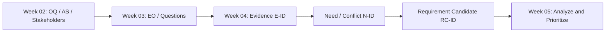
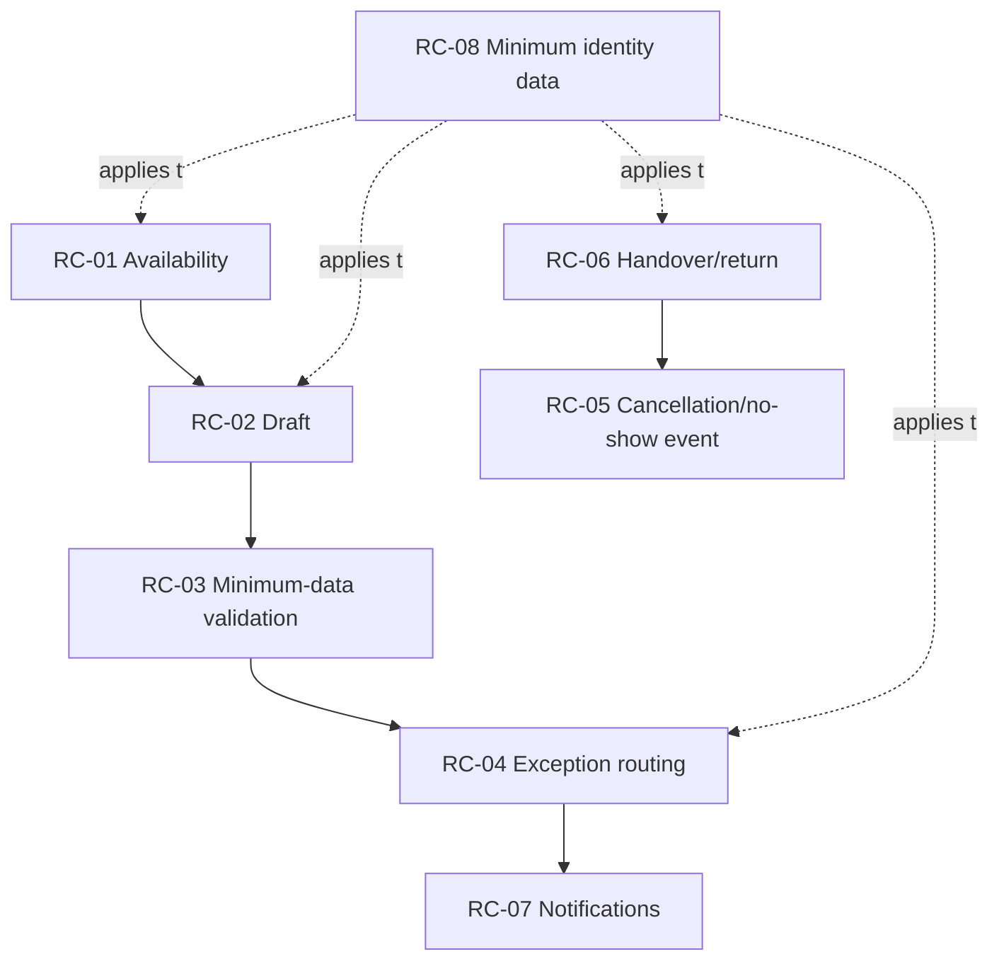

# ENGSE206 Week 04 — Campus Resource Booking: Completed Example and Week 05 Handoff

> **Case:** ระบบจองพื้นที่ทำงานกลุ่มและอุปกรณ์การเรียนรู้ (Campus Resource Booking System: CRBS)  
> **Status:** Completed teaching example — Week 04 evidence checkpoint complete  
> **Purpose:** แสดงผลลัพธ์ปลายทางของ Week 04 และระบุ input ที่ Week 05 ต้องนำไปวิเคราะห์ จัดหมวด และจัดลำดับ  
> **Scope note:** หลักฐานจาก AI stakeholder simulation เป็น `SN` (simulated need/statement) เพื่อการเรียนรู้ ไม่ใช่นโยบายจริงของมหาวิทยาลัย

## 1. สรุปผลลัพธ์ Week 04

Week 04 ไม่ได้มีเป้าหมายเพื่อประกาศ requirement ที่อนุมัติแล้ว แต่สอนให้ทีมเปลี่ยนข้อมูลที่เก็บได้เป็น **Requirement Candidate (RC)** ที่ตามรอยกลับไปยังหลักฐานได้ พร้อมเก็บข้อขัดแย้งและสิ่งที่ยังไม่รู้ไว้ก่อนเข้าสู่ Week 05

### ผลลัพธ์ที่ได้

| Artefact | ผลลัพธ์ที่ได้ | เหตุผลที่สำคัญต่อ Week 05 |
|---|---|---|
| Evidence Log | `E-01..E-14` พร้อม source, tag, confidence และ follow-up | ป้องกันการจัดลำดับจากความรู้สึกหรือความชอบส่วนตัว |
| Negotiation Record | `N-01..N-03` พร้อม options, rationale และ status | ชี้ว่า candidate ใดมี dependency หรือ policy uncertainty |
| Requirement Candidates | `RC-01..RC-08` | เป็นรายการตั้งต้นสำหรับ classify, split และ prioritize |
| Issue / validation list | policy, authority, integration และ privacy ที่ยังไม่ยืนยัน | ป้องกันการใส่ตัวเลขหรือกฎที่ไม่มีหลักฐาน |

## 2. ขอบเขตและกติกาหลักฐาน

### 2.1 ข้อเท็จจริงตั้งต้นที่ยืนยันได้

| Fact | สาระสำคัญ | ผลต่อ candidate |
|---|---|---|
| `F-01` | มีห้องหลายขนาดและอุปกรณ์จำนวนจำกัด | ต้องพิจารณาสถานะว่างและ conflict |
| `F-02` | การจองกระจายหลายช่องทาง | ต้องมีรายการกลางที่ตรวจย้อนหลังได้ |
| `F-04` | การยืมบางรายการต้องมีผู้รับผิดชอบและวันคืน | ต้องพิจารณา handover/return record |
| `CT-02` | ใช้ข้อมูลผู้ใช้จำลอง; ไม่เก็บเลขบัตรประชาชน | candidate ต้องคำนึงถึง data minimization |

### 2.2 กติกาการตีความ

1. `CF` คือข้อเท็จจริงจาก Case Card หรือเอกสารที่อ้างได้
2. `SN` คือคำตอบจาก AI simulation: ใช้ค้นหา need ได้ แต่ไม่ใช้เป็น policy จริงโดยลำพัง
3. `OQ` คือเรื่องที่ยังไม่รู้: ห้ามเติมตัวเลขหรือ rule เอง
4. `PS` คือ proposed solution: ต้องย้อนถามก่อนว่า stakeholder ต้องการผลลัพธ์ใด
5. ทุก `RC-*` ต้องอ้าง `E-*` อย่างน้อยหนึ่งรายการ และบอกสถานะ/สิ่งที่ต้องตรวจต่อ

## 3. หลักฐานที่คัดเลือกและเหตุผล

ตารางนี้เป็น “หลักฐานที่นำไปสร้าง candidate” ไม่ใช่ transcript ทั้งหมด รายละเอียดเต็มดูได้ที่ [04-evidence-log.md](04-evidence-log.md)

| E-ID | สิ่งที่พบ | Tag / confidence | ทีมเลือกใช้หรือไม่ | เหตุผลในการเลือก/ไม่เลือก |
|---|---|---|---|---|
| E-01 | ทรัพยากรมีจำนวนจำกัด | `CF` / High | ใช้ | เป็น fact ที่รองรับปัญหา availability และ conflict |
| E-02 | การจองหลายช่องทางทำให้ตรวจสถานะยากและเสี่ยงจองซ้ำ | `CF` / High | ใช้ | เชื่อมโดยตรงกับ problem statement และ shared record |
| E-03 | ผู้ขอใช้ต้องรู้ช่วงว่าง คุณสมบัติ และกฎก่อนยื่นคำขอ | `SN` / Medium | ใช้แบบ candidate | สะท้อน information need; ยังไม่บังคับรูปแบบหน้าจอ |
| E-04 | คำขอข้อมูลไม่ครบทำให้เจ้าหน้าที่ถามกลับและล่าช้า | `SN` / Medium | ใช้แบบ provisional | มีผลต่อ workflow แต่ required fields ยังต้องยืนยัน |
| E-05 | มีกรณีปกติและกรณีที่ต้องส่งต่อ | `SN + OQ` / Low–Medium | ใช้แบบ provisional | มี need เรื่อง routing แต่ authority matrix ยังไม่ชัด |
| E-06 | ต้องรู้เมื่อคำขอถูกตัดสิน/เปลี่ยนแปลง/ใกล้เวลาใช้ | `SN + OP` / Medium | ใช้แบบ candidate | ยืนยัน event/recipient ได้ แต่ยังไม่กำหนด LINE, email หรือเวลาแจ้ง |
| E-07 | กิจกรรมเรียนอาจเป็น exception และต้องมีผู้ตัดสินใจชัดเจน | `SN` / Medium | ใช้แบบ provisional | สร้าง requirement เรื่อง exception request/audit ได้ ไม่ใช่ auto override |
| E-08 | ไม่มีตัวเลขยืนยันการจองล่วงหน้า ระยะเวลาใช้ หรือ no-show | `OQ` / High | ไม่สร้าง rule | หลักฐานที่สำคัญคือ “ยังไม่รู้”; ต้องเก็บ issue ไว้ Week 05 |
| E-09 | รับ–คืนต้องเห็นผู้รับผิดชอบและวันคืน; มีข้อเสนอเรื่องเวลา/สภาพ | `CF + SN` / Medium | ใช้แบบ candidate | มี fact รองรับ record ขั้นต่ำ แต่ไม่บังคับรูปถ่าย |
| E-10 | ใช้ identifier/role เท่าที่จำเป็น | `SN + CT-candidate` / Medium | ใช้แบบ provisional | ช่วยกำหนด privacy direction แต่ integration/retention ต้อง IT review |
| E-11 | ยังไม่ยืนยันการอ่านตารางเรียนแบบ real-time | `AS + OQ` / High | ไม่สร้าง integration requirement | ต้องออกแบบ backlog โดยมี fallback ไม่พึ่ง real-time integration |
| E-12 | ผู้ใช้ต้องการเร็ว แต่เจ้าหน้าที่ต้องการข้อมูลครบ | `SN` / Medium | ใช้ | เป็น conflict ที่ต้องพิจารณา option ก่อนเขียน RC |
| E-13 | การลงโทษ no-show แบบเดียวทุกกรณีอาจไม่เป็นธรรม | `OP + SN` / Low–Medium | ไม่สร้าง penalty | ใช้เป็น fairness concern เท่านั้น เพราะไม่มี policy source |
| E-14 | การถ่ายภาพทุกครั้งเป็นเพียงข้อเสนอ | `PS` / Low | ไม่ใช้เป็น RC | ไม่ใช่ need ที่ยืนยันแล้วและอาจกระทบ privacy |

## 4. จากหลักฐานสู่ Need และข้อขัดแย้ง

### 4.1 Need ที่ตีความได้

| N-ID | Need ที่ตีความ | Evidence | ทำไมจึงเป็น Need ไม่ใช่ solution |
|---|---|---|---|
| N-AVAIL | ผู้ขอใช้ต้องตัดสินใจได้ว่าทรัพยากรเหมาะสมและว่างก่อนส่งคำขอ | E-01, E-02, E-03 | ไม่ระบุว่าต้องใช้ปฏิทิน, สี, หรือหน้าจอแบบใด |
| N-COMPLETE | เจ้าหน้าที่ต้องได้รับข้อมูลที่จำเป็นเพื่อพิจารณาคำขอโดยไม่ถามกลับซ้ำ | E-04, E-12 | มุ่งที่ผลลัพธ์ “ข้อมูลครบ” ไม่ล็อกแบบฟอร์ม |
| N-EXCEPTION | คำขอที่มีผลกระทบหรือชนข้อจำกัดต้องไปยังผู้มีอำนาจพร้อมเหตุผล | E-05, E-07, E-11 | ไม่สมมติว่า schedule integration หรือ override อัตโนมัติทำได้ |
| N-FAIR | การยกเลิก/no-show ต้องมี record และการสื่อสารก่อนกำหนดผลตาม policy | E-08, E-12, E-13 | แยก operational need ออกจากการตั้งโทษ |
| N-ACCOUNT | ผู้เกี่ยวข้องต้องติดตามการส่งมอบ/รับคืนและวันคืนได้ | E-09, E-14 | ไม่สรุปว่าต้องถ่ายรูปทุกครั้ง |
| N-MIN-DATA | ระบบต้องใช้ข้อมูล identity/role เท่าที่จำเป็น | E-10 | ไม่ตัดสิน interface หรือ retention period ก่อน IT review |

### 4.2 ข้อขัดแย้งที่ทีมบันทึกไว้

| N-ID | ความขัดแย้ง | Direction ที่เลือก | Status | ผลต่อ Week 05 |
|---|---|---|---|---|
| `N-01` | ยื่นคำขอเร็ว vs ข้อมูลครบ | ให้เริ่มเป็น Draft/Incomplete ได้ แต่ยังไม่กันทรัพยากร | Provisional | วิเคราะห์เป็น Functional + Business Rule และระบุ dependency ของ field/rule |
| `N-02` | กิจกรรมเรียนเร่งด่วน vs คำขอเดิม | exception request ต้องมี authority, rationale และแจ้งผู้ได้รับผล | Provisional | แยก capability ออกจาก approval policy และไม่สร้าง auto override |
| `N-03` | ลด no-show vs fair treatment | บันทึก event/สถานะและแจ้งได้; ยังไม่กำหนด penalty | Unresolved | คง policy issue ไว้ใน backlog/risk log ไม่ให้ priority เป็น policy ที่แต่งขึ้น |

## 5. Requirement Candidate ที่ส่งต่อ Week 05

### 5.1 รายการ Candidate และ rationale

| RC-ID | Requirement Candidate | ประเภทเริ่มต้น | หลักฐาน/เหตุผลที่เลือก | Status | สิ่งที่ต้องทำใน Week 05 |
|---|---|---|---|---|---|
| RC-01 | ระบบต้องให้ผู้ขอใช้ค้นหาและดูสถานะห้อง/อุปกรณ์ตามช่วงเวลา พร้อมข้อมูลที่จำเป็นต่อการตัดสินใจก่อนยื่นคำขอ | Functional | E-01/E-02 เป็น case fact และ E-03 ยืนยัน information need | Candidate / High | แยก data attributes, acceptance direction และ value |
| RC-02 | ระบบต้องให้ผู้ขอใช้บันทึกคำขอเป็น Draft/Incomplete และแสดงข้อมูลที่ยังขาด โดย Draft ยังไม่ถือว่าเป็นการจองหรือกันทรัพยากร | Functional + Business Rule | เป็นทางออก provisional ของ N-01 ที่ลดทั้งภาระถามกลับและการเริ่มใหม่ | Provisional / Medium | ยืนยัน required fields, draft lifetime และสถานะ transition |
| RC-03 | ระบบต้องตรวจข้อมูลขั้นต่ำก่อนส่งคำขอเข้าสู่การพิจารณาหรือยืนยันการจอง | Business Rule | E-04 ชี้ปัญหาคำขอไม่ครบ; ต้องทำงานคู่กับ RC-02 | Candidate / Medium | ระบุ validation rules โดยไม่เดา fields |
| RC-04 | ระบบต้องรองรับการส่งคำขอ exception พร้อมเหตุผล ผู้มีอำนาจ และผู้ได้รับผล เพื่อให้ตรวจสอบการตัดสินใจได้ | Functional + Accountability | N-02 เลือก exception request แทน auto override; E-11 ยังไม่ยืนยัน integration | Provisional / Medium | แยก authority rule, audit data และ notification dependency |
| RC-05 | ระบบต้องบันทึกเหตุการณ์ยกเลิก/no-show และแจ้งผู้เกี่ยวข้องตาม policy ที่ได้รับอนุมัติ | Functional + Policy Dependency | มี operational/fairness concern แต่ E-08 ห้ามกำหนด penalty | Candidate / Medium | แยก event record/notification ออกจาก penalty policy |
| RC-06 | เจ้าหน้าที่ต้องบันทึกการส่งมอบ/รับคืนด้วยผู้รับผิดชอบ เวลา และสภาพโดยสรุปตามข้อมูลขั้นต่ำที่อนุมัติ | Functional + Accountability | F-04/E-09 รองรับการรับผิดชอบ; E-14 ตัด photo ออกจาก requirement | Candidate / Medium | กำหนด data minimum และ privacy check |
| RC-07 | ระบบต้องแจ้งผู้เกี่ยวข้องเมื่อคำขอถูกตัดสิน เปลี่ยนแปลง หรือใกล้เหตุการณ์สำคัญ โดยใช้ recipient/timing ที่ยืนยันแล้ว | Functional + Usability | E-06 รองรับเหตุการณ์ที่ต้องรู้ แต่ channel เป็น preference | Candidate / Medium | ทำ event map, priority และ policy/opt-out issue |
| RC-08 | ระบบต้องใช้ข้อมูล identity/role เท่าที่จำเป็นต่อการยืนยันตัวตนและสิทธิ์ และไม่เก็บข้อมูลสถาบันซ้ำโดยไม่มีวัตถุประสงค์ที่ยืนยันได้ | NFR - Privacy/Security | CT-02 และ E-10 สนับสนุน data minimization | Provisional / Medium | ระบุ data owner, retention, access และ integration assumption |

### 5.2 ความสัมพันธ์และ dependency ที่ต้องเห็นก่อนจัด priority

> แผนภาพแสดงความสัมพันธ์เชิงวิเคราะห์เบื้องต้น ไม่ใช่ลำดับการพัฒนาและไม่ใช่ architecture

## 6. Input package สำหรับ Week 05

นักศึกษาต้องนำ “candidate + trace + uncertainty” ไปทำงาน ไม่ใช่คัดลอกเฉพาะประโยค requirement

| Week 05 activity | Input จาก Week 04 | ผลลัพธ์ที่ต้องสร้างใน Week 05 |
|---|---|---|
| Card sorting / classification | RC-01..RC-08 พร้อม type เริ่มต้น | แยก Functional, Business Rule, NFR, Data, Interface/Policy dependency |
| Atomicity review | RC-02, RC-04, RC-05, RC-07, RC-08 | split candidate ที่มีหลาย concern และเชื่อม parent/child trace |
| Priority analysis | value, risk, urgency, dependency, confidence | backlog ที่มี priority และ rationale ไม่ใช่คะแนนลอย ๆ |
| Issue management | E-08, E-11 และ follow-up ทุก RC | issue/assumption list ที่มี owner และ next validation action |
| Quality review | evidence E-ID, N-ID และ status | ตรวจว่าไม่เลื่อน Provisional/Unresolved เป็น Approved เอง |

### 6.1 Ready / revise / hold

| Group | RC-ID | เหตุผล |
|---|---|---|
| Ready for analysis and prioritization | RC-01, RC-03, RC-06, RC-07 | มี problem/need ชัดและมี follow-up ที่จำกัดขอบเขตได้ |
| Analyze but retain validation marker | RC-02, RC-04, RC-05, RC-08 | มีคุณค่าต่อระบบ แต่ยังพึ่ง rule/authority/policy/IT validation |
| Hold as issue; do not convert to final rule | E-08, E-11, penalty/no-show duration, automatic schedule override, mandatory photo | ไม่มี policy/technical evidence เพียงพอ |

### 6.2 Week 05 readiness gate

- [x] ทุก candidate มี `RC-ID` และ trace กลับไปยัง `E-ID`/`N-ID`
- [x] Candidate ที่เป็น provisional ระบุ validation gap อย่างชัดเจน
- [x] No-show penalty, booking quota และ duration ยังอยู่ใน issue list ไม่ใช่ requirement ที่แต่งขึ้น
- [x] Schedule integration ยังเป็น assumption; มีทางวิเคราะห์ที่ไม่พึ่ง real-time integration
- [x] Proposed solution เช่น photo/LINE/QR/database ไม่ถูกยกระดับเป็น requirement โดยไม่มี evidence
- [x] RC-01..RC-08 พร้อมนำเข้าสู่ `docs/05-requirement-backlog.md`

## 7. สิ่งที่นักศึกษาควรทำต่อ

1. เปิด [04-evidence-log.md](04-evidence-log.md) และ [04-negotiation-record.md](04-negotiation-record.md) เพื่อตรวจที่มาของ RC ก่อนเริ่ม card sorting
2. คัดลอก **โครงสร้างการตามรอย** ไปยัง case ของกลุ่ม ไม่คัดลอกเนื้อหา Campus Resource Booking
3. ใน Week 05 ให้จำแนก candidate, ตรวจความเป็น atomic, ทำ dependency และกำหนด priority/rationale
4. รักษา `Candidate`, `Provisional` และ `Unresolved` จนกว่าจะได้หลักฐาน/ผู้มีอำนาจที่เหมาะสม

## 8. Source map

| ลำดับ | ไฟล์ | บทบาท |
|---|---|---|
| Week 02 | [02-stakeholder-context-scope.md](../week-02/02-stakeholder-context-scope.md) | Stakeholders, scope, `OQ-*`, `AS-*` |
| Week 03 | [03-elicitation-plan.md](../week-03/03-elicitation-plan.md) | `EO-*`, source, method, expected evidence |
| Week 04 detail | [04-evidence-log.md](04-evidence-log.md) | หลักฐานฉบับเต็ม |
| Week 04 detail | [04-negotiation-record.md](04-negotiation-record.md) | conflict/options/status |
| Week 04 detail | [04-requirement-candidates.md](04-requirement-candidates.md) | candidate ฉบับเต็มและ coverage matrix |
| Week 05 target | [Week 05 Assignment Contract](../../../weeks/week-05-requirement-analysis-prioritization/assignment-contract.md) | output path: `docs/05-requirement-backlog.md` |

> **Definition of done ของเอกสารนี้:** นักศึกษาสามารถตอบได้ว่า RC แต่ละข้อเกิดจาก evidence ใด, เหตุใดจึงเป็น candidate, สิ่งใดยังไม่รู้, และ Week 05 ต้องทำอะไรกับรายการนั้นต่อ
