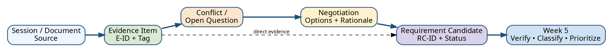

# Week 4 — Evidence Log

**Case:** Campus Resource Booking  
**Sources:** 4 stakeholder simulation/interview sessions + document/walkthrough evidence  
**Status:** Example Completed Work — Simulation-labelled  
**Version:** 1.0

> หลักฐานจาก AI role-play ในตัวอย่างนี้เป็น **Simulation** และยังต้องยืนยันกับ stakeholder/เอกสารจริง

## 1. Evidence tag legend

| Tag | Meaning |
|---|---|
| CF | Case fact / authorized document fact |
| SN | Simulated need stated by role; verify |
| CT | Constraint or rule; record authority/source |
| OP | Opinion or preference |
| AS | Assumption |
| PS | Proposed solution; find underlying need |
| OQ | Open question / unresolved |

## 2. Session summary

| Session | Role | Method | EO covered | Label |
|---|---|---|---|---|
| S-01 | Student requester | Semi-structured interview simulation | EO-02, EO-05 | Simulation |
| S-02 | Lab staff | Interview + workflow walkthrough simulation | EO-01, EO-02, EO-04, EO-06 | Simulation |
| S-03 | Approver/manager | Policy scenario interview simulation | EO-01, EO-04 | Simulation |
| S-04 | IT/privacy representative | Technical/privacy review simulation | EO-03, EO-06 | Simulation |
| D-01 | Case card and Week 2 scope | Document review | All | Authorized course source |

## 3. Evidence table

| E-ID | Session/source | Tag | Near-verbatim evidence / observation | Context | Confidence | Related EO | Follow-up / verification |
|---|---|---|---|---|---|---|---|
| E-001 | D-01 Case card | CF | มีหลายช่องทางและสถานะไม่สอดคล้องกัน | Current problem | High | EO-06 | ใช้เป็น baseline problem fact |
| E-002 | S-01 Student | SN | “ก่อนส่งคำขออยากเห็นว่าห้องว่างจริงและรู้ว่าจะรอผลประมาณกี่วัน” | Search and tracking | Medium | EO-02, EO-05 | Interview นักศึกษาจริง ≥3 คน |
| E-003 | S-01 Student | OP | ต้องการแจ้งเตือนผ่าน LINE เพราะเปิดบ่อยกว่าอีเมล | Notification preference | Low | EO-05 | แยก need จาก channel preference |
| E-004 | S-01 Student | SN | หากคำขอถูกส่งกลับ ต้องเห็นว่าข้อมูลใดต้องแก้ ไม่ใช่เพียงสถานะ “ไม่อนุมัติ” | Correction loop | Medium | EO-05 | ตรวจ UI/notification expectation |
| E-005 | S-02 Lab staff | SN | เจ้าหน้าที่ตรวจตารางเรียน สเปรดชีตจอง และข้อความล่าสุดก่อนยืนยัน | Actual workflow simulation | Medium | EO-06 | Observation จริง + artefact review |
| E-006 | S-02 Lab staff | CT | คำขอทั่วไปควรส่งล่วงหน้าอย่างน้อย 2 วันทำการ | Operational rule simulation | Low | EO-02 | ขอ policy/authority; อาจเป็น practice |
| E-007 | S-02 Lab staff | SN | ข้อมูลที่มักขาดคือวัตถุประสงค์ จำนวนผู้ใช้ และผู้รับผิดชอบ | Input completeness | Medium | EO-02 | ตรวจแบบฟอร์มเดิม |
| E-008 | S-02 Lab staff | OQ | กรณีใช้เพื่อการเรียนกับกิจกรรมนักศึกษาชนกัน ยังไม่มีเกณฑ์ที่เขียนชัด | Conflict | Medium | EO-04 | นำเข้า negotiation session |
| E-009 | S-02 Walkthrough | SN | มีการคัดลอกข้อมูลจากข้อความเข้าสเปรดชีตด้วยมือและตรวจซ้ำอีกครั้ง | Handoff/workaround | Medium | EO-06 | Observation จริง; วัด frequency/time |
| E-010 | S-03 Approver | SN | ผู้อนุมัติต้องเห็นเหตุผลการใช้ จำนวนคน เวลา และผลกระทบต่อการเรียน | Decision information | Medium | EO-01 | Verify with actual approver/form |
| E-011 | S-03 Approver | OP | กิจกรรมการเรียนการสอน “น่าจะ” มาก่อนกิจกรรมทั่วไป | Priority opinion | Low | EO-04 | ต้องตรวจ policy/fairness criteria |
| E-012 | S-03 Approver | CT | การอนุมัติกรณีพิเศษต้องมีเหตุผลและผู้มีอำนาจรับผิดชอบ | Governance constraint simulation | Low | EO-01, EO-04 | ขอ authority document |
| E-013 | S-04 Privacy role | SN | ผู้ใช้ทั่วไปไม่จำเป็นต้องเห็นชื่อเต็มหรือเหตุผลละเอียดของผู้จองรายอื่น | Data minimization | Medium | EO-03 | Privacy review จริง |
| E-014 | S-04 IT role | AS | ระบบตารางเรียนมี API สำหรับอ่าน availability | Integration assumption | Low | EO-06 | Technical verification mandatory |
| E-015 | S-04 IT role | CT | CRBS ไม่ควรเก็บรหัสผ่านและต้องใช้ SSO token | Security constraint simulation | Medium | EO-03, EO-06 | Verify architecture/security standard |
| E-016 | Cross-session | CF | Student และ staff ต่างต้องการสถานะที่ชัดและลดการติดต่อซ้ำ | Synthesis from E-002/E-004/E-005 | Medium | EO-05 | Validate with real stakeholders |
| E-017 | Cross-session | OQ | ยังไม่ชัดว่า booking window แตกต่างตาม resource type หรือไม่ | Rule gap | High | EO-02 | Document review + owner confirmation |
| E-018 | Cross-session | OQ | ใครมี final authority เมื่อ policy ไม่ครอบคลุมกรณีชนกัน | Authority gap | High | EO-01, EO-04 | Governance interview |

## 4. Contradictions and relationships

| ID | Evidence involved | Issue | Action |
|---|---|---|---|
| X-01 | E-003 vs privacy/channel constraints | ผู้ใช้ชอบ LINE แต่ยังไม่ทราบว่าองค์กรอนุญาตหรือไม่ | เขียน requirement ระดับ event/notification ก่อนเลือก channel |
| X-02 | E-011 vs fairness concern | “การเรียนมาก่อน” เป็น opinion ไม่ใช่ policy ที่ยืนยันแล้ว | เปิด negotiation และขอ authority source |
| X-03 | E-006 vs E-017 | มีคำบอกว่า 2 วัน แต่ยังไม่รู้ว่าใช้ทุก resource หรือไม่ | เก็บเป็น provisional rule เท่านั้น |
| X-04 | E-014 vs current boundary | สมมติว่ามี API แต่ยังไม่มีหลักฐาน | ออกแบบ fallback และไม่ commit interface |

## 5. Confidence scale

- **High:** authorized case/document หรือ corroborated evidence ที่ตรวจสอบย้อนกลับได้
- **Medium:** สอดคล้องหลาย source แต่ยังเป็น simulation/ต้องยืนยัน
- **Low:** opinion, assumption, single simulation source หรือไม่มี authority

## 6. Evidence quality check

- [x] มี E-ID, source, tag, context, confidence และ follow-up
- [x] แยกคำพูด/สิ่งสังเกตออกจาก interpretation
- [x] ไม่ใช้ simulation เป็น approved requirement
- [x] เก็บ contradiction และ uncertainty
- [x] ไม่บันทึก PII
- [x] เชื่อม EO และเตรียมสร้าง RC

ถัดไป: [`negotiation-record.md`](negotiation-record.md)
