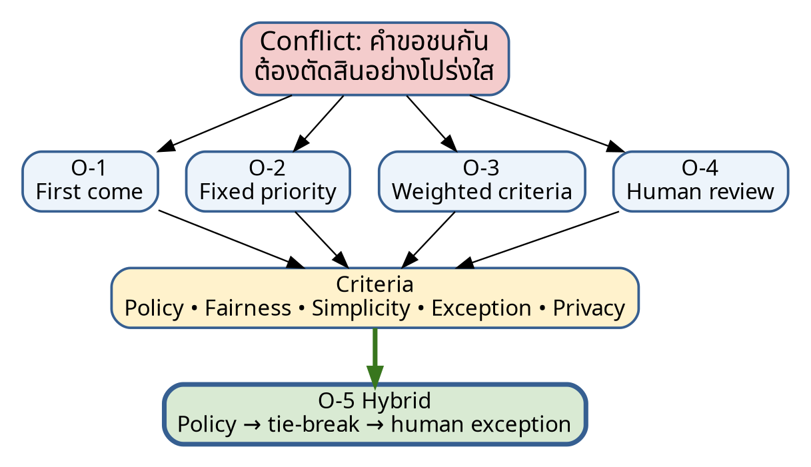

# Week 4 — Negotiation Record

**Conflict ID:** N-01  
**Topic:** การจัดลำดับเมื่อคำขอใช้ห้องชนกัน  
**Status:** Provisional decision — requires policy validation  
**Related evidence:** E-008, E-011, E-012, E-018



## 1. Conflict statement

เมื่อมีคำขอใช้ห้องเดียวกันในช่วงเวลาชนกัน ผู้สอนต้องการให้กิจกรรมการเรียนได้รับสิทธิ์ก่อน นักศึกษาต้องการหลักเกณฑ์ที่โปร่งใส เจ้าหน้าที่ต้องการกฎที่ใช้ได้รวดเร็ว และผู้อนุมัติต้องการช่องทางรองรับกรณีพิเศษโดยมีผู้รับผิดชอบชัดเจน

## 2. Parties, positions, interests and authority

| Party | Position stated | Underlying interests | Authority / limitation |
|---|---|---|---|
| Student requester | ใช้ลำดับเวลายื่นก่อนเพื่อความยุติธรรม | predictability, equal treatment, transparency | ไม่มี final authority |
| Lecturer requester | การเรียนการสอนควรได้ priority | continuity of teaching, avoid class disruption | อาจมี authority เฉพาะบางกรณี; ต้องยืนยัน |
| Lab staff | ต้องมีกฎที่ตัดสินเร็วและลดการโต้แย้ง | operational efficiency, auditability | ใช้ policy แต่ไม่ควรสร้าง policy เอง |
| Approver/manager | ต้อง override ได้ในกรณีพิเศษ | risk management, institutional priority | final authority บาง resource; source ยังไม่ยืนยัน |
| Privacy/fairness concern | เหตุผลและข้อมูลต้องเปิดเผยเท่าที่จำเป็น | fairness, data minimization | review role ไม่ใช่ business approver |

## 3. Constraints

- ต้องไม่ใช้ข้อมูลส่วนบุคคลที่ไม่เกี่ยวข้องเป็นเกณฑ์
- ต้องบันทึกเหตุผลของ priority/override
- ต้องรองรับ resource type ที่มีกฎต่างกัน
- หากไม่มี policy ชัดเจน ระบบต้องไม่ตัดสินอัตโนมัติแบบซ่อนเหตุผล
- ต้องมีช่องทาง appeal/escalation ที่ไม่ทำให้ workflow ซับซ้อนเกิน Release 1

## 4. Options considered

| Option | Description | Benefits | Risks / drawbacks |
|---|---|---|---|
| O-1 First-come-first-served | คำขอที่สมบูรณ์และส่งก่อนมีลำดับก่อน | ง่าย โปร่งใส ตรวจสอบได้ | ไม่รองรับความสำคัญของการเรียน/ฉุกเฉิน |
| O-2 Fixed category priority | กำหนดลำดับ category เช่น scheduled teaching > academic event > general activity | ตัดสินเร็วและสอดคล้องภารกิจ | ต้องมี policy authority; อาจแข็งเกินไป |
| O-3 Weighted criteria | ให้คะแนนตาม category, urgency, impact, alternative availability | ยืดหยุ่นและอธิบายได้ | ซับซ้อน เสี่ยงโต้แย้งเรื่องน้ำหนัก |
| O-4 Human review with recorded rationale | ระบบตรวจชนแล้วส่งให้ผู้มีอำนาจตัดสินพร้อมข้อมูลและบันทึกเหตุผล | รองรับ exception และไม่แสร้งว่ากฎชัด | ใช้เวลาและ workload ผู้อนุมัติ |
| O-5 Hybrid | ใช้ O-2 เมื่อ policy ชัด; ถ้าเท่ากันใช้เวลายื่น; exception เข้า O-4 | สมดุลความเร็ว ความโปร่งใส และ exception | ต้องกำหนด category/policy และ audit ให้ดี |

## 5. Evaluation criteria

| Criterion | Weight | Explanation |
|---|---:|---|
| Policy compliance | 5 | ต้องไม่ขัด authority/policy |
| Fairness and explainability | 5 | ผู้ใช้เข้าใจเหตุผลและตรวจสอบได้ |
| Operational simplicity | 4 | เจ้าหน้าที่ใช้ได้จริง |
| Exception handling | 4 | รองรับกรณีพิเศษโดยมี accountability |
| Implementation feasibility | 3 | เหมาะกับ Release 1 |
| Privacy | 3 | ใช้ข้อมูลเท่าที่จำเป็น |

## 6. Provisional decision

**เลือก Option O-5: Hybrid** โดยมีเงื่อนไข:

1. ใช้ category priority เฉพาะรายการที่มี policy/authority ยืนยันแล้ว
2. หาก category เท่ากัน ใช้เวลาที่คำขอ “สมบูรณ์พร้อมพิจารณา” เป็น tie-breaker
3. หากเป็น exception หรือ policy ไม่ครอบคลุม ส่ง human review
4. ทุก override ต้องระบุ reason code, free-text rationale และ approver role
5. ผู้ขอใช้เห็นเหตุผลในระดับที่เหมาะสม แต่ไม่เห็นข้อมูลส่วนบุคคลของคำขออื่น
6. สถานะยังเป็น **Provisional** จนกว่าจะยืนยัน E-011/E-012/E-018 กับ policy owner

## 7. Rationale

O-5 ลด workload เมื่อกฎชัด แต่ไม่บังคับระบบให้ตัดสินอัตโนมัติในกรณีที่ policy ยังคลุมเครือ อีกทั้งรักษา traceability และความโปร่งใสผ่านเหตุผลและ audit record

## 8. Unresolved issues

| U-ID | Issue | Owner | Verification action | Due |
|---|---|---|---|---|
| U-01 | category priority ที่ได้รับอนุมัติจริงคืออะไร | Policy owner | review policy + sign-off | Week 5 |
| U-02 | ใครเป็น approver ของแต่ละ resource | Program admin | authority matrix | Week 5 |
| U-03 | ผู้ใช้ควรเห็น reason detail ระดับใด | Privacy rep | visibility review | Week 5 |
| U-04 | ใช้ submission time หรือ complete-ready time | Lab staff | process validation | Week 5 |

## 9. Decision log entry

```text
Decision: D-W04-01
Status: Provisional
Decision: Adopt hybrid conflict handling for requirement candidates.
Evidence: E-008, E-011, E-012, E-018
Rationale: Balances policy, fairness, simplicity and exception handling.
Conditions: Policy authority and visibility rules must be verified.
Next review: Week 5 prioritization workshop.
```

ถัดไป: [`requirement-candidates.md`](requirement-candidates.md)
