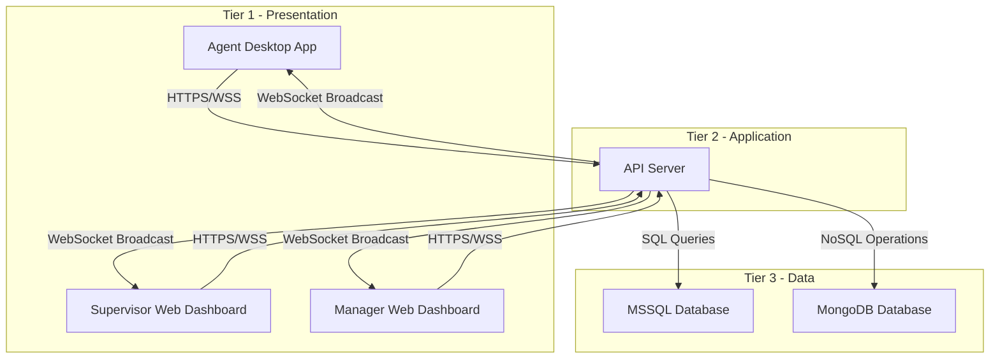

# 🚀 Agent Wallboard System

## Design for <br> ENGSE203: Computer Programming for Software Engineer - Term Project

[](https://github.com) [](https://developer.mozilla.org/en-US/docs/Web/JavaScript) [](https://reactjs.org/) [](https://nodejs.org/) [](https://www.microsoft.com/en-us/sql-server) [](https://en.wikipedia.org/wiki/Multitier_architecture)

> **Real-time Call Center Agent Monitoring และ Communication System**  
> ระบบติดตามสถานะ agents และการสื่อสารแบบ real-time สำหรับ call center operations

---

## 📋 สารบัญ

- [ภาพรวมโครงการ](#-ภาพรวมโครงการ)
- [วัตถุประสงค์การเรียนรู้](#-วัตถุประสงค์การเรียนรู้)
- [เทคโนโลยีที่ใช้](#-เทคโนโลยีที่ใช้)
- [System Architecture](#-system-architecture)
- [คุณสมบัติหลัก](#-คุณสมบัติหลัก)
- [การเตรียมความพร้อม](#-การเตรียมความพร้อม)
- [แผนการพัฒนา](#-แผนการพัฒนา)
- [ทีมงานและบทบาท](#-ทีมงานและบทบาท)
- [การประเมินผล](#-การประเมินผล)
- [Resources และเอกสาร](#-resources-และเอกสาร)

---

## 🎯 ภาพรวมโครงการ

### Problem Statement
Call centers ในปัจจุบันยังประสบปัญหา:
- 📊 **ขาดการติดตามสถานะ real-time** ของ agents
- 💬 **การสื่อสารไม่มีประสิทธิภาพ** ระหว่าง supervisors และ agents
- 📈 **ไม่มี dashboard** สำหรับการจัดการทีม
- 🔄 **การติดตามแบบ manual** ที่เสียเวลาและผิดพลาดได้

### Solution Overview
พัฒนา **Agent Wallboard System** ที่ให้ความสามารถ:
- ✅ **Real-time Status Monitoring**: ติดตามสถานะ agents แบบ real-time
- ✅ **Bidirectional Communication**: การสื่อสารสองทิศทางผ่าน WebSocket
- ✅ **Interactive Dashboard**: หน้าจอแสดงสถิติและการจัดการ
- ✅ **Multi-platform Support**: Desktop app สำหรับ agents, Web dashboard สำหรับ supervisors

### Business Impact
- 🚀 **เพิ่มประสิทธิภาพ** การดำเนินงาน 25%
- ⚡ **ลดเวลาการตอบสนอง** 40%
- 📉 **ลดงาน manual monitoring** 60%
- 📊 **ให้ข้อมูลสำหรับตัดสินใจ** แบบ real-time

---

## 🎓 วัตถุประสงค์การเรียนรู้

โครงการนี้ออกแบบมาเพื่อให้นักศึกษา **ประยุกต์ใช้ความรู้ทาง Software Engineering** ในการแก้ปัญหาจริง:

### 1. Software Design Principles
- 🏗️ **3-Tier Architecture**: Separation of concerns
- 📐 **Design Patterns**: MVC, Repository, Factory patterns
- 🔧 **SOLID Principles**: Object-oriented design
- 📋 **Requirements Engineering**: From user stories to implementation

### 2. Full-Stack Development Skills
- 🖥️ **Frontend**: React.js, Electron.js, responsive design
- ⚙️ **Backend**: Node.js, Express.js, RESTful APIs
- 💾 **Database**: MSSQL, MongoDB, data modeling
- 🌐 **Real-time**: WebSocket communication

### 3. Software Engineering Practices
- 📝 **Documentation**: Requirements, Design, Testing
- 🧪 **Testing**: Unit, Integration, System, UAT
- 🔄 **Version Control**: Git workflows, collaboration
- 🚀 **Deployment**: Build processes, environment management

### 4. Project Management
- 📈 **Agile Methodology**: Sprints, user stories, retrospectives
- 👥 **Team Collaboration**: Roles, responsibilities, communication
- ⏰ **Timeline Management**: Milestones, dependencies, risk management
- 📊 **Quality Assurance**: Code reviews, testing strategies

---

## 💻 เทคโนโลยีที่ใช้

### Frontend Technologies
| Technology | Purpose | Version | Learning Focus |
|------------|---------|---------|----------------|
| **React.js** | Web Dashboard UI | 18+ | Component-based development, State management |
| **Electron.js** | Desktop Application | 22+ | Cross-platform desktop apps, IPC communication |
| **HTML5/CSS3** | UI Structure & Styling | Latest | Responsive design, Modern CSS |
| **JavaScript ES6+** | Frontend Logic | ES2022 | Async programming, Modules, Arrow functions |

### Backend Technologies
| Technology | Purpose | Version | Learning Focus |
|------------|---------|---------|----------------|
| **Node.js** | Runtime Environment | 18+ | Server-side JavaScript, Event-driven programming |
| **Express.js** | Web Framework | 4+ | RESTful APIs, Middleware, Routing |
| **WebSocket** | Real-time Communication | Latest | Bidirectional communication, Event handling |
| **JWT** | Authentication | Latest | Token-based authentication, Security |

### Database Technologies
| Technology | Purpose | Use Case | Learning Focus |
|------------|---------|----------|----------------|
| **MSSQL Server** | Relational Database | Agent data, Transactions | SQL, Normalization, ACID properties |
| **MongoDB** | Document Database | Real-time data, Sessions | NoSQL, Document modeling, Aggregation |

### Development Tools
| Tool | Purpose | Learning Benefit |
|------|---------|------------------|
| **VS Code** | IDE | Code editing, Extensions, Debugging |
| **Git/GitHub** | Version Control | Collaboration, Branching, Pull requests |
| **Postman** | API Testing | API development, Testing, Documentation |
| **Draw.io** | Diagrams | System modeling, Documentation |

---

## 🏗️ System Architecture

### 3-Tier Architecture Overview

```
┌─────────────────────────────────────────────────────────────────────┐
│                        3-TIER ARCHITECTURE                          │
├─────────────────┬─────────────────────┬─────────────────────────────┤
│  TIER 1         │      TIER 2         │         TIER 3              │
│ PRESENTATION    │   APPLICATION       │         DATA                │
├─────────────────┼─────────────────────┼─────────────────────────────┤
│                 │                     │                             │
│ 🖥️ Desktop App  │ 🔧 Node.js Server   │ 🗄️ MSSQL Database          │
│   (Electron)    │   - Express.js      │   - Agent Data              │
│   - Agent UI    │   - REST APIs       │   - Transaction Logs        │
│   - Real-time   │   - Authentication  │   - User Management         │
│                 │                     │                             │
│ 🌐 Web Dashboard│ 🔗 WebSocket Server │ 🍃 MongoDB Database         │
│   (React)       │   - Real-time Comm  │   - Session Data            │
│   - Supervisor  │   - Message Routing │   - Real-time Metrics       │
│   - Manager     │   - Connection Mgmt │   - Activity Logs           │
│                 │                     │                             │
└─────────────────┴─────────────────────┴─────────────────────────────┘
```

### Communication Flow



### Component Responsibilities

#### 🖥️ **Tier 1: Presentation Layer**
- **Agent Desktop App**: Status management, Notification receiving, Local user interface
- **Web Dashboard**: Team monitoring, Message sending, Report viewing, System administration

#### ⚙️ **Tier 2: Application Layer**  
- **REST API Server**: Business logic, Data validation, Authentication/Authorization
- **WebSocket Server**: Real-time communication, Message broadcasting, Connection management

#### 💾 **Tier 3: Data Layer**
- **MSSQL**: Persistent data storage, Transaction integrity, Relational data modeling
- **MongoDB**: Session management, Real-time data caching, Flexible document storage

---

## ⭐ คุณสมบัติหลัก

### 🎯 Epic 1: Real-time Agent Status Monitoring
**เป้าหมาย**: ติดตามและแสดงสถานะของ agents แบบ real-time

#### Features:
- ✅ **Agent Status Display**: แสดงสถานะปัจจุบัน (Available, Active, Wrap, Not Ready, Offline)
- ✅ **Real-time Updates**: อัปเดตสถานะทันทีผ่าน WebSocket
- ✅ **Status History**: บันทึกประวัติการเปลี่ยนสถานะ
- ✅ **Color Coding**: ใช้สีแสดงสถานะเพื่อง่ายต่อการมองเห็น

#### ใช้เทคโนโลยี:
- **Frontend**: React hooks (useState, useEffect), WebSocket client
- **Backend**: WebSocket server, Express.js endpoints
- **Database**: MSSQL สำหรับ agent data, MongoDB สำหรับ real-time status

---

### 💬 Epic 2: Supervisor Communication System
**เป้าหมาย**: ให้ supervisors สื่อสารกับ agents ได้แบบ real-time

#### Features:
- ✅ **Message Sending**: Supervisor ส่งข้อความถึง agent เฉพาะคน
- ✅ **Desktop Notifications**: Agent รับ notification แบบ popup
- ✅ **Message History**: บันทึกประวัติการสื่อสาร
- ✅ **Delivery Status**: ยืนยันการส่งและรับข้อความ

#### ใช้เทคโนโลยี:
- **Frontend**: Notification API, React state management
- **Backend**: WebSocket message routing, Express.js message APIs
- **Database**: MongoDB สำหรับ message storage และ history

---

### 👤 Epic 3: Agent Self-Service Portal  
**เป้าหมาย**: ให้ agents จัดการงานของตัวเองได้

#### Features:
- ✅ **Agent Authentication**: Login ด้วย Agent Code
- ✅ **Profile Management**: แสดงข้อมูลส่วนตัวและสถานะปัจจุบัน
- ✅ **Status Control**: เปลี่ยนสถานะการทำงานตามความต้องการ
- ✅ **Activity Dashboard**: ดูสถิติการทำงานส่วนตัว

#### ใช้เทคโนโลยี:
- **Frontend**: Electron.js desktop app, Form handling
- **Backend**: JWT authentication, Express.js user management
- **Database**: MSSQL สำหรับ user credentials และ profile data

---

### 📊 Epic 4: Management Dashboard & Reporting
**เป้าหมาย**: ให้ supervisors และ managers ดูภาพรวมและสถิติ

#### Features:
- ✅ **Team Dashboard**: แสดงสถิติทีมแบบ real-time
- ✅ **Visual Charts**: Graphs และ charts สำหรับ data visualization  
- ✅ **Performance Metrics**: KPIs และ performance indicators
- ✅ **Export Reports**: ส่งออกรายงานในรูปแบบต่างๆ

#### ใช้เทคโนโลยี:
- **Frontend**: React Chart libraries (Chart.js, D3.js), CSS Grid/Flexbox
- **Backend**: Data aggregation APIs, Report generation services
- **Database**: MongoDB aggregation pipeline, MSSQL reporting queries

---

### ⚙️ Epic 5: System Administration & Configuration
**เป้าหมาย**: จัดการระบบและ configuration สำหรับ IT administrators

#### Features:
- ✅ **Database Management**: จัดการการเชื่อมต่อและ configuration
- ✅ **API Management**: จัดการ endpoints และ security settings
- ✅ **User Management**: จัดการ user accounts และ permissions
- ✅ **System Monitoring**: ติดตาม system health และ performance

#### ใช้เทคโนโลยี:
- **Frontend**: Admin panels, Configuration forms
- **Backend**: Admin APIs, System monitoring endpoints
- **Database**: Connection pooling, Database optimization

---

## 🚀 การเตรียมความพร้อม

### 📚 ความรู้พื้นฐานที่ต้องมี

#### Programming Fundamentals
- [ ] **JavaScript ES6+**: Arrow functions, Promises, async/await, Modules
- [ ] **HTML/CSS**: Semantic HTML, CSS Grid/Flexbox, Responsive design
- [ ] **Basic SQL**: SELECT, INSERT, UPDATE, DELETE, JOINs
- [ ] **JSON**: Data format understanding และการใช้งาน

#### Web Development Concepts  
- [ ] **Client-Server Architecture**: การสื่อสารระหว่าง frontend และ backend
- [ ] **REST APIs**: HTTP methods, Status codes, Request/Response
- [ ] **Database Concepts**: Relational vs NoSQL, CRUD operations
- [ ] **Version Control**: Git basics (clone, commit, push, pull, branch)

### 🛠️ Development Environment Setup

#### Required Software Installation

##### 1. **Node.js และ npm**
```bash
# Download and install from https://nodejs.org/
# Verify installation
node --version  # Should be v18+
npm --version   # Should be v8+
```

##### 2. **Database Systems**
```bash
# MSSQL Server (Windows/Linux)
# Download from: https://www.microsoft.com/en-us/sql-server/sql-server-downloads

# MongoDB Community Edition
# Download from: https://www.mongodb.com/try/download/community
```

##### 3. **Development Tools**
```bash
# Visual Studio Code
# Download from: https://code.visualstudio.com/

# Git for version control  
# Download from: https://git-scm.com/downloads

# Postman for API testing
# Download from: https://www.postman.com/downloads/
```

#### Recommended VS Code Extensions
```json
{
  "recommendations": [
    "ms-vscode.vscode-json",
    "ms-vscode.vscode-typescript-next", 
    "bradlc.vscode-tailwindcss",
    "esbenp.prettier-vscode",
    "ms-mssql.mssql",
    "ms-vscode.vscode-node-debug2"
  ]
}
```

### 📖 เอกสารและ Resources ที่ต้องอ่าน

#### Core Documentation
- [ ] **React.js Official Docs**: https://reactjs.org/docs/
- [ ] **Node.js Documentation**: https://nodejs.org/en/docs/
- [ ] **Express.js Guide**: https://expressjs.com/en/guide/
- [ ] **Electron.js Tutorial**: https://www.electronjs.org/docs/latest/

#### Specific Technologies
- [ ] **WebSocket API**: https://developer.mozilla.org/en-US/docs/Web/API/WebSocket
- [ ] **JWT Introduction**: https://jwt.io/introduction/
- [ ] **MSSQL Node.js**: https://docs.microsoft.com/en-us/sql/connect/node-js/
- [ ] **MongoDB Node.js Driver**: https://docs.mongodb.com/drivers/node/

### 🧪 Prerequisites Checklist

#### Technical Skills Verification
- [ ] สามารถสร้าง basic HTML page พร้อม CSS styling
- [ ] เข้าใจการใช้ JavaScript functions และ objects
- [ ] รู้วิธีการ query ข้อมูลจาก database ด้วย SQL
- [ ] ใช้ Git สำหรับ version control ได้พื้นฐาน

#### Environment Verification
- [ ] สามารถรัน `npm install` และ `npm start` ได้สำเร็จ
- [ ] เชื่อมต่อ database (MSSQL/MongoDB) ได้จาก local environment
- [ ] สร้าง simple Express.js server ได้
- [ ] Clone repository จาก GitHub และ make changes ได้

---

## 📅 แผนการพัฒนา

### 🗓️ Timeline Overview (8 สัปดาห์)

```
Week 1-2: Foundation & Setup
Week 3-4: Core Development  
Week 5-6: Integration & Testing
Week 7-8: Finalization & Presentation
```

### Sprint Breakdown

#### **📚 Sprint 0: Project Setup (Week 1)**
**Theme**: "เตรียมความพร้อมและวางรากฐาน"

##### Learning Objectives:
- ทำความเข้าใจ project requirements และ architecture
- ตั้งค่า development environment
- เรียนรู้ tools และ technologies ที่จะใช้

##### Deliverables:
- [ ] **Environment Setup**: Development environment พร้อมใช้งาน
- [ ] **Project Structure**: Repository structure และ initial codebase
- [ ] **Documentation Review**: อ่านและทำความเข้าใจ requirements
- [ ] **Team Formation**: กำหนดบทบาทและความรับผิดชอบ

##### Technical Tasks:
```bash
# 1. Clone starter repository
git clone [repository-url]
cd agent-wallboard-system

# 2. Install dependencies
npm install

# 3. Setup databases
# - Create MSSQL database instance
# - Create MongoDB database instance
# - Verify connections

# 4. Run initial application
npm run dev
```

---

#### **🏗️ Sprint 1: Foundation (Week 2)**
**Theme**: "Database และ API Foundation"

##### Focus Areas:
- **Epic 5**: System Administration & Configuration
- **Epic 3**: Agent Authentication

##### Learning Objectives:
- Database design และ implementation
- RESTful API development
- Authentication mechanisms

##### Deliverables:
- [ ] **Database Schema**: MSSQL tables และ MongoDB collections
- [ ] **API Endpoints**: Authentication และ basic CRUD APIs
- [ ] **Connection Management**: Database connection pooling
- [ ] **Basic Testing**: Unit tests สำหรับ core functions

##### User Stories:
- US-010: Database Management
- US-011: API Management  
- US-006: Agent Authentication

---

#### **⚡ Sprint 2: Core Features (Week 3-4)**
**Theme**: "Real-time Features และ Communication"

##### Focus Areas:
- **Epic 1**: Real-time Agent Status Monitoring
- **Epic 2**: Supervisor Communication System

##### Learning Objectives:
- WebSocket implementation
- Real-time data synchronization
- Event-driven programming

##### Deliverables:
- [ ] **WebSocket Server**: Real-time communication infrastructure
- [ ] **Agent Status Management**: Status tracking และ updates
- [ ] **Message System**: Supervisor-to-agent messaging
- [ ] **Desktop Notifications**: Agent notification system

##### User Stories:
- US-001: Agent Status Display
- US-002: Agent Status Updates
- US-004: Send Message to Agent
- US-005: Receive Notifications
- US-012: WebSocket Management

---

#### **🎨 Sprint 3: User Interface (Week 5)**
**Theme**: "Frontend Development และ User Experience"

##### Focus Areas:
- **Epic 3**: Agent Self-Service Portal
- **Epic 4**: Management Dashboard

##### Learning Objectives:
- React.js component development
- Electron.js desktop application
- Responsive web design

##### Deliverables:
- [ ] **Desktop Application**: Electron.js app สำหรับ agents
- [ ] **Web Dashboard**: React.js dashboard สำหรับ supervisors
- [ ] **User Interface**: Responsive และ user-friendly design
- [ ] **State Management**: Frontend state management

##### User Stories:
- US-007: Agent Profile Information
- US-008: Team Dashboard
- US-009: Statistical Reports

---

#### **🔧 Sprint 4: Integration & Testing (Week 6)**
**Theme**: "Integration และ Quality Assurance"

##### Focus Areas:
- System integration
- Testing และ debugging
- Performance optimization

##### Learning Objectives:
- Integration testing
- Performance tuning
- Debugging techniques

##### Deliverables:
- [ ] **Full Integration**: ทุก components ทำงานร่วมกันได้
- [ ] **Testing Suite**: Unit และ integration tests
- [ ] **Performance Optimization**: Response time improvements
- [ ] **Bug Fixes**: Critical issues resolution

##### User Stories:
- US-003: Login/Logout Tracking
- US-013: Application Distribution
- US-014: System Configuration

---

#### **🚀 Sprint 5: Finalization (Week 7-8)**
**Theme**: "Production Readiness และ Documentation"

##### Focus Areas:
- Production deployment
- Documentation
- User training
- Project presentation

##### Learning Objectives:
- Deployment processes
- Documentation writing
- Presentation skills

##### Deliverables:
- [ ] **Production Deployment**: Working system ใน production environment
- [ ] **User Documentation**: User manuals และ training materials
- [ ] **Technical Documentation**: API documentation และ system architecture
- [ ] **Project Presentation**: Final presentation พร้อม demo

---

## 👥 ทีมงานและบทบาท

### 🎯 ขนาดทีมแนะนำ: 3-4 คน

### บทบาทหลัก

#### **🏗️ Full-Stack Developer (1-2 คน)**
**Primary Responsibilities**:
- Database design และ implementation  
- RESTful API development
- Frontend-backend integration
- WebSocket implementation

**Skills Required**:
- JavaScript, Node.js, Express.js
- React.js, HTML/CSS
- Database (MSSQL, MongoDB)
- Git version control

**Learning Focus**:
- API design patterns
- Database optimization
- Real-time programming
- Security best practices

#### **🎨 Frontend Specialist (1 คน)**  
**Primary Responsibilities**:
- User interface design และ development
- Electron.js desktop application
- React.js web dashboard
- User experience optimization

**Skills Required**:
- React.js, HTML5, CSS3
- JavaScript ES6+
- Electron.js
- UI/UX design principles

**Learning Focus**:
- Component-based architecture
- State management
- Responsive design
- Desktop application development

#### **📊 QA & Documentation Lead (1 คน)**
**Primary Responsibilities**:
- Testing strategy และ implementation
- Documentation creation และ maintenance
- User acceptance testing coordination
- Project management support

**Skills Required**:
- Testing methodologies
- Technical writing
- Project coordination
- Basic programming knowledge

**Learning Focus**:
- Software testing practices
- Documentation standards
- Quality assurance processes
- Project management tools

### 🤝 Collaboration Guidelines

#### Daily Practices:
- [ ] **Daily Standup** (15 นาที): Update progress, identify blockers
- [ ] **Code Review**: ทุก pull request ต้องผ่าน review
- [ ] **Documentation**: Update documentation เมื่อมี changes
- [ ] **Testing**: Write tests สำหรับ new features

#### Weekly Practices:
- [ ] **Sprint Planning**: วางแผนงานสำหรับสัปดาห์ถัดไป
- [ ] **Demo Session**: แสดงผลงานที่เสร็จสมบูรณ์
- [ ] **Retrospective**: Review สิ่งที่ดีและที่ต้องปรับปรุง
- [ ] **Knowledge Sharing**: แบ่งปันความรู้และเทคนิคใหม่ๆ

#### Communication Channels:
- **GitHub Issues**: Task tracking และ bug reports
- **Discord/Slack**: Daily communication
- **Google Drive**: Document sharing
- **Zoom/Teams**: Weekly meetings

---

## 📊 การประเมินผล

### 🎯 เกณฑ์การประเมิน (100 คะแนน)

#### **📋 Project Implementation (40 คะแนน)**
- **Functionality**: ระบบทำงานได้ตาม requirements (15 คะแนน)
- **Code Quality**: Code structure, comments, best practices (10 คะแนน)
- **User Experience**: UI/UX design และ usability (10 คะแนน)
- **Innovation**: Creative solutions และ additional features (5 คะแนน)

#### **📚 Documentation (25 คะแนน)**
- **Technical Documentation**: API docs, system architecture (10 คะแนน)
- **User Documentation**: User manuals, installation guides (8 คะแนน)
- **Project Documentation**: README, changelog, lessons learned (7 คะแนน)

#### **🎤 Presentation (20 คะแนน)**
- **Technical Presentation**: System demo และ technical explanation (12 คะแนน)
- **Business Value**: Problem solving และ impact explanation (8 คะแนน)

#### **👥 Teamwork (15 คะแนน)**
- **Collaboration**: Git usage, code reviews, communication (8 คะแนน)
- **Individual Contribution**: Personal contribution และ learning growth (7 คะแนน)

### 🏆 Success Criteria

#### **Minimum Requirements (ผ่าน 60%)**:
- ✅ ระบบทำงานได้พื้นฐานตาม core features
- ✅ Database connection และ basic CRUD operations
- ✅ Simple user interface สำหรับ agents และ supervisors
- ✅ Basic documentation และ setup instructions

#### **Good Performance (70-80%)**:
- ✅ Real-time features ทำงานได้เสถียร
- ✅ User-friendly interface พร้อม responsive design  
- ✅ Comprehensive testing และ error handling
- ✅ Complete documentation และ user guides

#### **Excellent Performance (80-90%)**:
- ✅ Advanced features และ performance optimization
- ✅ Professional-grade UI/UX design
- ✅ Comprehensive testing coverage
- ✅ Production-ready deployment

#### **Outstanding Performance (90%+)**:
- ✅ Innovation และ creative problem solving
- ✅ Exceptional user experience และ design
- ✅ Advanced technical implementation
- ✅ Professional presentation และ business impact demonstration

---

## 📖 Resources และเอกสาร

### 📚 Learning Materials

#### **Official Documentation**
- [React.js Documentation](https://reactjs.org/docs/) - Complete React guide
- [Node.js Documentation](https://nodejs.org/en/docs/) - Server-side JavaScript
- [Express.js Guide](https://expressjs.com/) - Web framework for Node.js
- [Electron Documentation](https://www.electronjs.org/docs/) - Desktop app framework
- [WebSocket API](https://developer.mozilla.org/en-US/docs/Web/API/WebSocket) - Real-time communication

#### **Database Resources**
- [MSSQL Node.js Driver](https://docs.microsoft.com/en-us/sql/connect/node-js/) - Database connectivity
- [MongoDB Node.js Driver](https://docs.mongodb.com/drivers/node/) - NoSQL database
- [Mongoose Documentation](https://mongoosejs.com/docs/) - MongoDB object modeling

#### **Additional Learning**
- [JavaScript ES6+ Features](https://es6.io/) - Modern JavaScript
- [Git Tutorial](https://learngitbranching.js.org/) - Version control
- [JWT Introduction](https://jwt.io/introduction/) - Authentication
- [RESTful API Design](https://restfulapi.net/) - API best practices

### 🛠️ Development Tools

#### **Essential Tools**
- **IDE**: [Visual Studio Code](https://code.visualstudio.com/) พร้อม recommended extensions
- **API Testing**: [Postman](https://www.postman.com/) สำหรับ API development และ testing
- **Database Management**: [SQL Server Management Studio](https://docs.microsoft.com/en-us/sql/ssms/), [MongoDB Compass](https://www.mongodb.com/products/compass)
- **Version Control**: [Git](https://git-scm.com/) + [GitHub](https://github.com/)

#### **Optional Tools**
- **Design**: [Draw.io](https://draw.io/) สำหรับ system diagrams
- **Monitoring**: [Postman Monitor](https://monitor.getpostman.com/) สำหรับ API monitoring
- **Deployment**: [Heroku](https://heroku.com/), [Netlify](https://netlify.com/) สำหรับติดตั้งเพื่อใช้งาน

---
