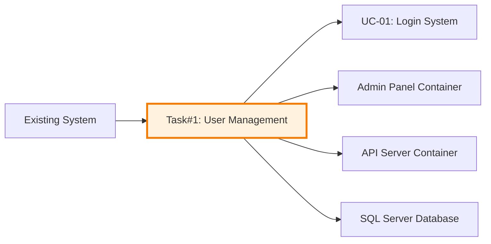
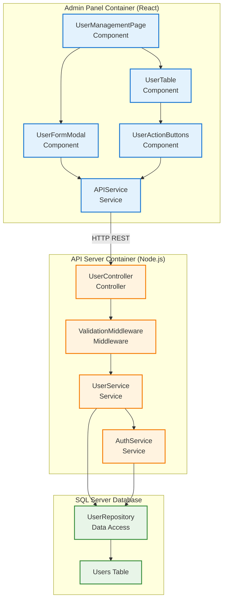
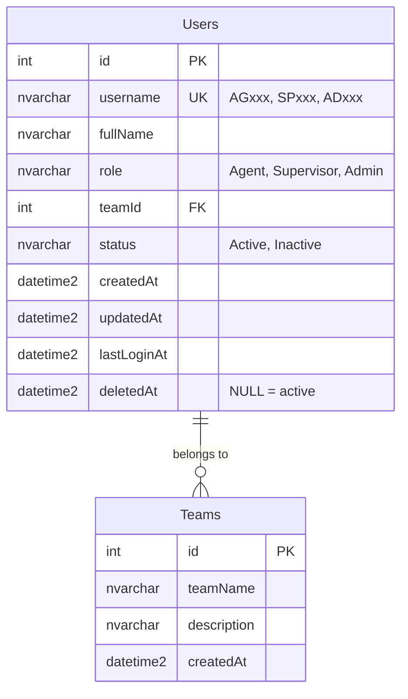
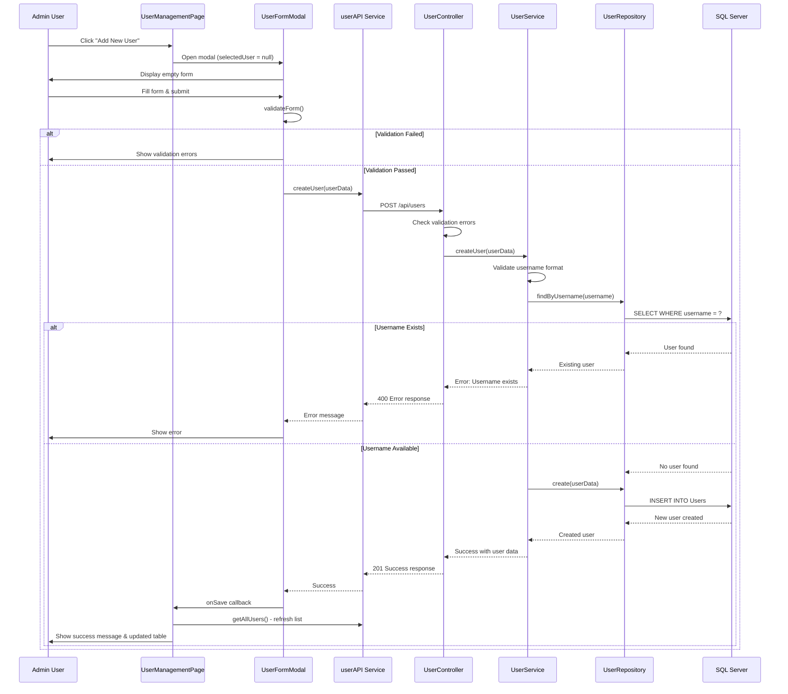
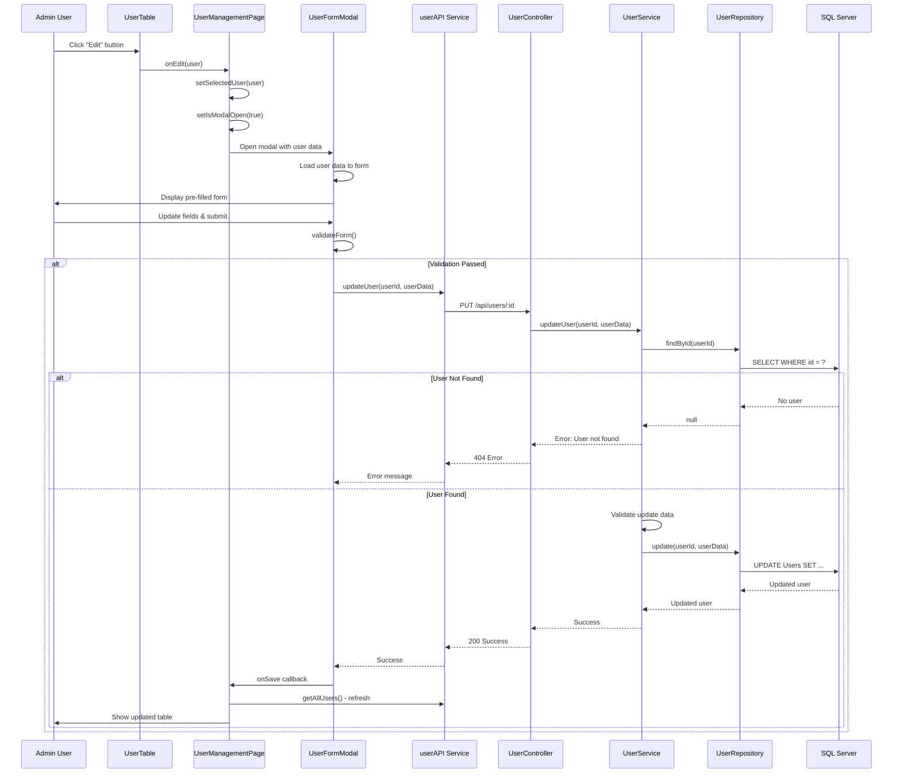
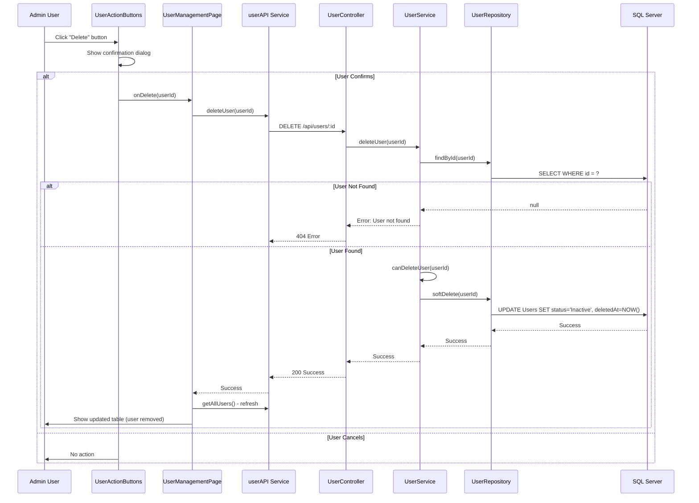
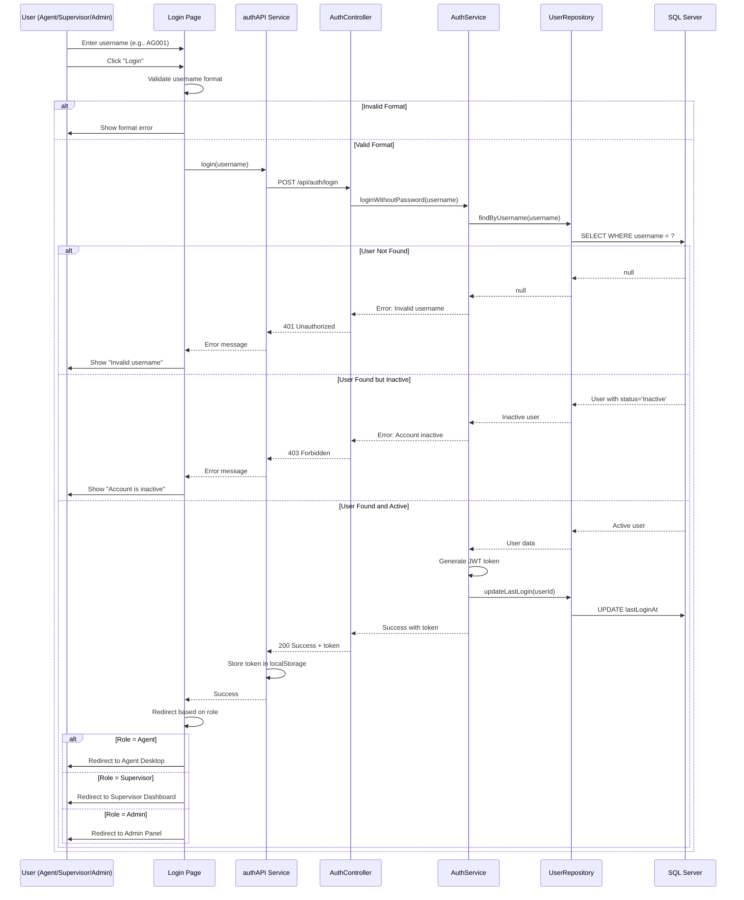

# 📄 Task#1: User Management System - C3 Component Design

**Document ID:** TASK1-C3-USER-MGMT-001  
**Version:** 1.0  
**Created:** October 2025  
**Course:** ENGSE206 - Software Requirements Specification and Design  
**สำหรับ:** กลุ่มเลขคี่ (Odd Groups)  
**ระยะเวลา:** 3 วัน  

---

## 📋 สารบัญ

1. [ภาพรวมและ Requirements](#1-ภาพรวมและ-requirements)
2. [C3 Component Architecture](#2-c3-component-architecture)
3. [Frontend Components Design](#3-frontend-components-design)
4. [Backend Components Design](#4-backend-components-design)
5. [Database Components Design](#5-database-components-design)
6. [Component Interaction Flows](#6-component-interaction-flows)
7. [งานที่นักศึกษาต้องทำเพิ่มเติม](#7-งานที่นักศึกษาต้องทำเพิ่มเติม)

---

## 1. ภาพรวมและ Requirements

### 1.1 วัตถุประสงค์ของ Task

Task นี้มีวัตถุประสงค์เพื่อเพิ่มระบบจัดการผู้ใช้งาน (User Management) ให้กับ Agent Wallboard System โดยรองรับ 3 ประเภทผู้ใช้:

- **👤 Agent** - พนักงาน call center ที่ใช้งาน desktop application
- **👥 Supervisor** - หัวหน้าทีมที่ดูแลและติดตาม agents  
- **⚙️ Admin** - ผู้ดูแลระบบที่จัดการ users ทั้งหมด

### 1.2 User Stories ใหม่

#### **US-NEW-001: Admin จัดการ User Accounts**
```
As an Admin
I want to create, view, edit, and delete user accounts
So that I can manage all system users efficiently

Acceptance Criteria:
✅ Admin สามารถเพิ่ม user ใหม่ได้โดยระบุ: username, full name, role, team
✅ Admin สามารถดูรายการ users ทั้งหมดในรูปแบบ table พร้อม filtering
✅ Admin สามารถแก้ไขข้อมูล user ได้ (ยกเว้น username)
✅ Admin สามารถลบ user ได้ (soft delete - set status = 'inactive')
✅ Admin สามารถ activate/deactivate user account ได้
```

#### **US-NEW-002: Login Without Password**
```
As a User (Agent/Supervisor/Admin)
I want to login using only my unique code (username)
So that I can access the system quickly without remembering passwords

Acceptance Criteria:
✅ ผู้ใช้กรอกเฉพาะ username (เช่น AG001, SP001, AD001)
✅ ระบบตรวจสอบว่า username มีอยู่และ active
✅ ระบบสร้าง JWT token สำหรับ session management
✅ ระบบ redirect ไปหน้าที่เหมาะสมตาม role
```

### 1.3 Functional Requirements

| Requirement ID | Description | Priority |
|----------------|-------------|----------|
| FR-UM-001 | ระบบต้องแสดงรายการ users ทั้งหมดในรูป table | HIGH |
| FR-UM-002 | ระบบต้องรองรับการเพิ่ม user ใหม่ผ่าน form | HIGH |
| FR-UM-003 | ระบบต้องรองรับการแก้ไขข้อมูล user | HIGH |
| FR-UM-004 | ระบบต้องรองรับการลบ user (soft delete) | HIGH |
| FR-UM-005 | ระบบต้องมี validation ข้อมูล user | HIGH |
| FR-UM-006 | ระบบต้อง login ได้โดยไม่ใช้ password | HIGH |
| FR-UM-007 | ระบบต้องสร้าง JWT token หลัง login สำเร็จ | HIGH |
| FR-UM-008 | ระบบต้องมี role-based access control | MEDIUM |

### 1.4 การเชื่อมต่อกับระบบเดิม

Task นี้จะเชื่อมต่อกับระบบเดิมดังนี้:



**จุดเชื่อมต่อหลัก:**
- ใช้ **SQL Server Database** เดิม (เพิ่มตารางใหม่)
- ใช้ **API Server** เดิม (เพิ่ม endpoints ใหม่)
- ใช้ **Admin Panel** เดิม (เพิ่มหน้าจัดการ users)
- ปรับปรุง **Authentication Service** (login without password)

---

## 2. C3 Component Architecture

### 2.1 Component Overview Diagram



### 2.2 Component Summary

| Layer | Component | Responsibility | Technology |
|-------|-----------|---------------|------------|
| **Frontend** | UserManagementPage | Main container component | React (no JSX) |
| | UserTable | Display users in table format | React + HTML |
| | UserFormModal | Add/Edit user form | React + HTML |
| | UserActionButtons | Action buttons (Edit/Delete) | React + HTML |
| | APIService | HTTP client for API calls | Fetch API |
| **Backend** | UserController | Handle HTTP requests | Express.js |
| | UserService | Business logic | Node.js |
| | AuthService | Authentication logic | Node.js + JWT |
| | ValidationMiddleware | Validate request data | Express middleware |
| **Database** | Users Table | Store user data | MSSQL |
| | UserRepository | Data access layer | Node.js + mssql |

---

## 3. Frontend Components Design

### 3.1 Component Structure

```
src/pages/admin/
├── UserManagementPage.js      (Main container - ให้โครงสร้างครบ 100%)
├── components/
│   ├── UserTable.js            (Table display - ให้ HTML/CSS ครบ 100%)
│   ├── UserFormModal.js        (Form modal - ให้ HTML/CSS ครบ 100%)
│   └── UserActionButtons.js    (Action buttons - ให้ HTML/CSS ครบ 100%)
└── services/
    └── userAPI.js              (API calls - ให้ 80%, TODO: error handling)
```

### 3.2 UserManagementPage Component

**หน้าที่:** Main container component ที่รวบรวม components ย่อยทั้งหมด

**Component Interface:**
```javascript
// UserManagementPage.js
import React, { useState, useEffect } from 'react';
import UserTable from './components/UserTable';
import UserFormModal from './components/UserFormModal';
import { userAPI } from './services/userAPI';

// Props: None (top-level page component)
// State: users, loading, error, selectedUser, isModalOpen

const UserManagementPage = () => {
  // State management
  const [users, setUsers] = useState([]);
  const [loading, setLoading] = useState(false);
  const [error, setError] = useState(null);
  const [selectedUser, setSelectedUser] = useState(null);
  const [isModalOpen, setIsModalOpen] = useState(false);

  // TODO: นักศึกษาเพิ่ม useEffect สำหรับ load users เมื่อ component mount
  // TODO: นักศึกษาเขียน handleCreateUser function
  // TODO: นักศึกษาเขียน handleEditUser function  
  // TODO: นักศึกษาเขียน handleDeleteUser function
  // TODO: นักศึกษาเขียน handleSaveUser function (create or update)

  return React.createElement('div', { className: 'user-management-page' },
    // Header section
    React.createElement('div', { className: 'page-header' },
      React.createElement('h1', null, 'User Management'),
      React.createElement('button', {
        className: 'btn btn-primary',
        onClick: () => {
          setSelectedUser(null);
          setIsModalOpen(true);
        }
      }, '+ Add New User')
    ),

    // Error display (if any)
    error && React.createElement('div', { className: 'alert alert-error' }, error),

    // Loading state
    loading ? 
      React.createElement('div', { className: 'loading' }, 'Loading users...') :
      // User table
      React.createElement(UserTable, {
        users: users,
        onEdit: (user) => {
          // TODO: นักศึกษาเขียน logic เปิด modal สำหรับแก้ไข
        },
        onDelete: (userId) => {
          // TODO: นักศึกษาเขียน logic ลบ user
        }
      }),

    // User form modal
    isModalOpen && React.createElement(UserFormModal, {
      user: selectedUser,
      onClose: () => setIsModalOpen(false),
      onSave: (userData) => {
        // TODO: นักศึกษาเขียน logic save user
      }
    })
  );
};

export default UserManagementPage;
```

**CSS (ให้ครบ 100%):**
```css
/* styles/UserManagementPage.css */

.user-management-page {
  padding: 24px;
  max-width: 1400px;
  margin: 0 auto;
}

.page-header {
  display: flex;
  justify-content: space-between;
  align-items: center;
  margin-bottom: 24px;
  padding-bottom: 16px;
  border-bottom: 2px solid #e0e0e0;
}

.page-header h1 {
  font-size: 28px;
  font-weight: 600;
  color: #1a1a1a;
  margin: 0;
}

.btn {
  padding: 10px 20px;
  border: none;
  border-radius: 6px;
  font-size: 14px;
  font-weight: 500;
  cursor: pointer;
  transition: all 0.3s ease;
}

.btn-primary {
  background: linear-gradient(135deg, #667eea 0%, #764ba2 100%);
  color: white;
}

.btn-primary:hover {
  transform: translateY(-2px);
  box-shadow: 0 4px 12px rgba(102, 126, 234, 0.4);
}

.alert {
  padding: 12px 16px;
  border-radius: 6px;
  margin-bottom: 20px;
  font-size: 14px;
}

.alert-error {
  background-color: #fee;
  border-left: 4px solid #f44336;
  color: #c62828;
}

.loading {
  text-align: center;
  padding: 40px;
  font-size: 16px;
  color: #666;
}
```

### 3.3 UserTable Component

**หน้าที่:** แสดงรายการ users ในรูปแบบ table พร้อม action buttons

**Component Code (ให้ครบ 100%):**
```javascript
// components/UserTable.js
import React from 'react';
import UserActionButtons from './UserActionButtons';

const UserTable = ({ users, onEdit, onDelete }) => {
  return React.createElement('div', { className: 'user-table-container' },
    React.createElement('table', { className: 'user-table' },
      // Table Header
      React.createElement('thead', null,
        React.createElement('tr', null,
          React.createElement('th', null, 'Username'),
          React.createElement('th', null, 'Full Name'),
          React.createElement('th', null, 'Role'),
          React.createElement('th', null, 'Team'),
          React.createElement('th', null, 'Status'),
          React.createElement('th', null, 'Created Date'),
          React.createElement('th', null, 'Actions')
        )
      ),
      // Table Body
      React.createElement('tbody', null,
        users.length === 0 ?
          React.createElement('tr', null,
            React.createElement('td', { colSpan: 7, className: 'no-data' },
              'No users found. Click "Add New User" to create one.'
            )
          ) :
          users.map(user =>
            React.createElement('tr', { key: user.id },
              React.createElement('td', null,
                React.createElement('span', { className: 'username' }, user.username)
              ),
              React.createElement('td', null, user.fullName),
              React.createElement('td', null,
                React.createElement('span', { 
                  className: `role-badge role-${user.role.toLowerCase()}` 
                }, user.role)
              ),
              React.createElement('td', null, user.teamName || '-'),
              React.createElement('td', null,
                React.createElement('span', {
                  className: `status-badge status-${user.status.toLowerCase()}`
                }, user.status)
              ),
              React.createElement('td', null,
                new Date(user.createdAt).toLocaleDateString('th-TH')
              ),
              React.createElement('td', null,
                React.createElement(UserActionButtons, {
                  user: user,
                  onEdit: () => onEdit(user),
                  onDelete: () => onDelete(user.id)
                })
              )
            )
          )
      )
    )
  );
};

export default UserTable;
```

**CSS (ให้ครบ 100%):**
```css
/* styles/UserTable.css */

.user-table-container {
  background: white;
  border-radius: 8px;
  box-shadow: 0 2px 8px rgba(0, 0, 0, 0.1);
  overflow: hidden;
}

.user-table {
  width: 100%;
  border-collapse: collapse;
}

.user-table thead {
  background: linear-gradient(135deg, #667eea 0%, #764ba2 100%);
  color: white;
}

.user-table th {
  padding: 14px 16px;
  text-align: left;
  font-weight: 600;
  font-size: 13px;
  text-transform: uppercase;
  letter-spacing: 0.5px;
}

.user-table tbody tr {
  border-bottom: 1px solid #f0f0f0;
  transition: background-color 0.2s ease;
}

.user-table tbody tr:hover {
  background-color: #f8f9ff;
}

.user-table td {
  padding: 14px 16px;
  font-size: 14px;
  color: #333;
}

.username {
  font-family: 'Courier New', monospace;
  font-weight: 600;
  color: #667eea;
}

.role-badge {
  display: inline-block;
  padding: 4px 12px;
  border-radius: 12px;
  font-size: 12px;
  font-weight: 600;
  text-transform: uppercase;
}

.role-agent {
  background-color: #e3f2fd;
  color: #1976d2;
}

.role-supervisor {
  background-color: #fff3e0;
  color: #f57c00;
}

.role-admin {
  background-color: #fce4ec;
  color: #c2185b;
}

.status-badge {
  display: inline-block;
  padding: 4px 12px;
  border-radius: 12px;
  font-size: 12px;
  font-weight: 600;
}

.status-active {
  background-color: #e8f5e8;
  color: #2e7d32;
}

.status-inactive {
  background-color: #ffebee;
  color: #c62828;
}

.no-data {
  text-align: center;
  padding: 40px;
  color: #999;
  font-style: italic;
}
```

### 3.4 UserFormModal Component

**หน้าที่:** Form modal สำหรับเพิ่ม/แก้ไข user

**Component Code (ให้ HTML/CSS ครบ 100%):**
```javascript
// components/UserFormModal.js
import React, { useState, useEffect } from 'react';

const UserFormModal = ({ user, onClose, onSave }) => {
  // Initialize form data
  const [formData, setFormData] = useState({
    username: '',
    fullName: '',
    role: 'Agent',
    teamId: '',
    status: 'Active'
  });

  // TODO: นักศึกษาเพิ่ม form validation state
  const [errors, setErrors] = useState({});

  // Load user data if editing
  useEffect(() => {
    if (user) {
      setFormData({
        username: user.username,
        fullName: user.fullName,
        role: user.role,
        teamId: user.teamId || '',
        status: user.status
      });
    }
  }, [user]);

  // TODO: นักศึกษาเขียน handleChange function
  const handleChange = (e) => {
    // TODO: อัพเดท formData state
    // TODO: เคลียร์ error ของ field ที่แก้ไข
  };

  // TODO: นักศึกษาเขียน validateForm function
  const validateForm = () => {
    // TODO: ตรวจสอบ required fields
    // TODO: ตรวจสอบรูปแบบ username (AGxxx, SPxxx, ADxxx)
    // TODO: ตรวจสอบความยาว fullName
    // TODO: return true/false
  };

  // TODO: นักศึกษาเขียน handleSubmit function
  const handleSubmit = (e) => {
    e.preventDefault();
    // TODO: validate form
    // TODO: ถ้าผ่าน validation เรียก onSave(formData)
    // TODO: ถ้าไม่ผ่าน แสดง error messages
  };

  return React.createElement('div', { className: 'modal-overlay', onClick: onClose },
    React.createElement('div', {
      className: 'modal-content',
      onClick: (e) => e.stopPropagation()
    },
      // Modal Header
      React.createElement('div', { className: 'modal-header' },
        React.createElement('h2', null, user ? 'Edit User' : 'Add New User'),
        React.createElement('button', {
          className: 'btn-close',
          onClick: onClose
        }, '×')
      ),

      // Modal Body (Form)
      React.createElement('form', { onSubmit: handleSubmit, className: 'user-form' },
        // Username field
        React.createElement('div', { className: 'form-group' },
          React.createElement('label', { htmlFor: 'username' },
            'Username ',
            React.createElement('span', { className: 'required' }, '*')
          ),
          React.createElement('input', {
            type: 'text',
            id: 'username',
            name: 'username',
            value: formData.username,
            onChange: handleChange,
            placeholder: 'e.g., AG001, SP001, AD001',
            disabled: !!user, // disabled เมื่อแก้ไข
            className: errors.username ? 'error' : ''
          }),
          React.createElement('small', { className: 'hint' },
            'Format: AG001-AG999 (Agent), SP001-SP999 (Supervisor), AD001-AD999 (Admin)'
          ),
          errors.username && React.createElement('span', { className: 'error-message' },
            errors.username
          )
        ),

        // Full Name field
        React.createElement('div', { className: 'form-group' },
          React.createElement('label', { htmlFor: 'fullName' },
            'Full Name ',
            React.createElement('span', { className: 'required' }, '*')
          ),
          React.createElement('input', {
            type: 'text',
            id: 'fullName',
            name: 'fullName',
            value: formData.fullName,
            onChange: handleChange,
            placeholder: 'Enter full name',
            className: errors.fullName ? 'error' : ''
          }),
          errors.fullName && React.createElement('span', { className: 'error-message' },
            errors.fullName
          )
        ),

        // Role field
        React.createElement('div', { className: 'form-group' },
          React.createElement('label', { htmlFor: 'role' },
            'Role ',
            React.createElement('span', { className: 'required' }, '*')
          ),
          React.createElement('select', {
            id: 'role',
            name: 'role',
            value: formData.role,
            onChange: handleChange,
            className: errors.role ? 'error' : ''
          },
            React.createElement('option', { value: 'Agent' }, 'Agent'),
            React.createElement('option', { value: 'Supervisor' }, 'Supervisor'),
            React.createElement('option', { value: 'Admin' }, 'Admin')
          )
        ),

        // Team field (optional for Agent/Supervisor)
        React.createElement('div', { className: 'form-group' },
          React.createElement('label', { htmlFor: 'teamId' }, 'Team'),
          React.createElement('select', {
            id: 'teamId',
            name: 'teamId',
            value: formData.teamId,
            onChange: handleChange
          },
            React.createElement('option', { value: '' }, '-- Select Team --'),
            React.createElement('option', { value: '1' }, 'Team Alpha'),
            React.createElement('option', { value: '2' }, 'Team Beta'),
            React.createElement('option', { value: '3' }, 'Team Gamma')
          ),
          React.createElement('small', { className: 'hint' },
            'Optional: Assign user to a team'
          )
        ),

        // Status field
        React.createElement('div', { className: 'form-group' },
          React.createElement('label', { htmlFor: 'status' },
            'Status ',
            React.createElement('span', { className: 'required' }, '*')
          ),
          React.createElement('select', {
            id: 'status',
            name: 'status',
            value: formData.status,
            onChange: handleChange
          },
            React.createElement('option', { value: 'Active' }, 'Active'),
            React.createElement('option', { value: 'Inactive' }, 'Inactive')
          )
        ),

        // Form Actions
        React.createElement('div', { className: 'form-actions' },
          React.createElement('button', {
            type: 'button',
            className: 'btn btn-secondary',
            onClick: onClose
          }, 'Cancel'),
          React.createElement('button', {
            type: 'submit',
            className: 'btn btn-primary'
          }, user ? 'Update User' : 'Create User')
        )
      )
    )
  );
};

export default UserFormModal;
```

**CSS (ให้ครบ 100%):**
```css
/* styles/UserFormModal.css */

.modal-overlay {
  position: fixed;
  top: 0;
  left: 0;
  right: 0;
  bottom: 0;
  background-color: rgba(0, 0, 0, 0.5);
  display: flex;
  align-items: center;
  justify-content: center;
  z-index: 1000;
  animation: fadeIn 0.2s ease;
}

@keyframes fadeIn {
  from { opacity: 0; }
  to { opacity: 1; }
}

.modal-content {
  background: white;
  border-radius: 12px;
  width: 90%;
  max-width: 600px;
  max-height: 90vh;
  overflow-y: auto;
  box-shadow: 0 8px 32px rgba(0, 0, 0, 0.2);
  animation: slideUp 0.3s ease;
}

@keyframes slideUp {
  from {
    transform: translateY(20px);
    opacity: 0;
  }
  to {
    transform: translateY(0);
    opacity: 1;
  }
}

.modal-header {
  display: flex;
  justify-content: space-between;
  align-items: center;
  padding: 20px 24px;
  border-bottom: 1px solid #e0e0e0;
}

.modal-header h2 {
  margin: 0;
  font-size: 22px;
  font-weight: 600;
  color: #1a1a1a;
}

.btn-close {
  background: none;
  border: none;
  font-size: 32px;
  color: #999;
  cursor: pointer;
  padding: 0;
  width: 32px;
  height: 32px;
  display: flex;
  align-items: center;
  justify-content: center;
  transition: color 0.2s ease;
}

.btn-close:hover {
  color: #333;
}

.user-form {
  padding: 24px;
}

.form-group {
  margin-bottom: 20px;
}

.form-group label {
  display: block;
  margin-bottom: 6px;
  font-weight: 500;
  font-size: 14px;
  color: #333;
}

.required {
  color: #f44336;
}

.form-group input,
.form-group select {
  width: 100%;
  padding: 10px 12px;
  border: 1px solid #ddd;
  border-radius: 6px;
  font-size: 14px;
  transition: border-color 0.2s ease;
  box-sizing: border-box;
}

.form-group input:focus,
.form-group select:focus {
  outline: none;
  border-color: #667eea;
  box-shadow: 0 0 0 3px rgba(102, 126, 234, 0.1);
}

.form-group input.error,
.form-group select.error {
  border-color: #f44336;
}

.form-group input:disabled {
  background-color: #f5f5f5;
  cursor: not-allowed;
}

.hint {
  display: block;
  margin-top: 4px;
  font-size: 12px;
  color: #666;
  font-style: italic;
}

.error-message {
  display: block;
  margin-top: 4px;
  font-size: 12px;
  color: #f44336;
}

.form-actions {
  display: flex;
  justify-content: flex-end;
  gap: 12px;
  margin-top: 24px;
  padding-top: 20px;
  border-top: 1px solid #e0e0e0;
}

.btn-secondary {
  background-color: #f5f5f5;
  color: #333;
}

.btn-secondary:hover {
  background-color: #e0e0e0;
}
```

### 3.5 UserActionButtons Component

**Component Code (ให้ครบ 100%):**
```javascript
// components/UserActionButtons.js
import React from 'react';

const UserActionButtons = ({ user, onEdit, onDelete }) => {
  const handleDelete = () => {
    // TODO: นักศึกษาเพิ่ม confirmation dialog
    if (window.confirm(`Are you sure you want to delete user "${user.username}"?`)) {
      onDelete();
    }
  };

  return React.createElement('div', { className: 'action-buttons' },
    React.createElement('button', {
      className: 'btn-action btn-edit',
      onClick: onEdit,
      title: 'Edit user'
    }, '✏️ Edit'),
    React.createElement('button', {
      className: 'btn-action btn-delete',
      onClick: handleDelete,
      title: 'Delete user'
    }, '🗑️ Delete')
  );
};

export default UserActionButtons;
```

**CSS (ให้ครบ 100%):**
```css
/* styles/UserActionButtons.css */

.action-buttons {
  display: flex;
  gap: 8px;
}

.btn-action {
  padding: 6px 12px;
  border: none;
  border-radius: 4px;
  font-size: 12px;
  font-weight: 500;
  cursor: pointer;
  transition: all 0.2s ease;
}

.btn-edit {
  background-color: #e3f2fd;
  color: #1976d2;
}

.btn-edit:hover {
  background-color: #1976d2;
  color: white;
  transform: translateY(-1px);
}

.btn-delete {
  background-color: #ffebee;
  color: #c62828;
}

.btn-delete:hover {
  background-color: #c62828;
  color: white;
  transform: translateY(-1px);
}
```

### 3.6 APIService (User API Client)

**หน้าที่:** จัดการการเรียก API endpoints สำหรับ user management

**Code (ให้ 80%):**
```javascript
// services/userAPI.js

const API_BASE_URL = process.env.REACT_APP_API_URL || 'http://localhost:3000/api';

/**
 * User API Service
 * ให้โครงสร้างหลัก 80%, นักศึกษาเพิ่ม error handling และ loading states
 */
export const userAPI = {
  /**
   * Get all users
   * @returns {Promise<Array>} List of users
   */
  getAllUsers: async () => {
    try {
      const response = await fetch(`${API_BASE_URL}/users`, {
        method: 'GET',
        headers: {
          'Content-Type': 'application/json',
          'Authorization': `Bearer ${localStorage.getItem('token')}`
        }
      });

      if (!response.ok) {
        throw new Error(`HTTP error! status: ${response.status}`);
      }

      const data = await response.json();
      return data;
    } catch (error) {
      // TODO: นักศึกษาเพิ่ม error handling ที่ดีกว่า
      console.error('Error fetching users:', error);
      throw error;
    }
  },

  /**
   * Get user by ID
   * @param {string} userId - User ID
   * @returns {Promise<Object>} User object
   */
  getUserById: async (userId) => {
    try {
      const response = await fetch(`${API_BASE_URL}/users/${userId}`, {
        method: 'GET',
        headers: {
          'Content-Type': 'application/json',
          'Authorization': `Bearer ${localStorage.getItem('token')}`
        }
      });

      // TODO: นักศึกษาเพิ่ม response validation
      const data = await response.json();
      return data;
    } catch (error) {
      console.error('Error fetching user:', error);
      throw error;
    }
  },

  /**
   * Create new user
   * @param {Object} userData - User data object
   * @returns {Promise<Object>} Created user
   */
  createUser: async (userData) => {
    try {
      // TODO: นักศึกษาเพิ่ม input validation ก่อนส่ง API
      
      const response = await fetch(`${API_BASE_URL}/users`, {
        method: 'POST',
        headers: {
          'Content-Type': 'application/json',
          'Authorization': `Bearer ${localStorage.getItem('token')}`
        },
        body: JSON.stringify(userData)
      });

      if (!response.ok) {
        const errorData = await response.json();
        throw new Error(errorData.message || 'Failed to create user');
      }

      const data = await response.json();
      return data;
    } catch (error) {
      // TODO: นักศึกษาปรับปรุง error handling
      console.error('Error creating user:', error);
      throw error;
    }
  },

  /**
   * Update existing user
   * @param {string} userId - User ID
   * @param {Object} userData - Updated user data
   * @returns {Promise<Object>} Updated user
   */
  updateUser: async (userId, userData) => {
    // TODO: นักศึกษาเขียน implementation
    // Hint: ใช้ PUT method
    // Hint: ส่ง userId ใน URL และ userData ใน body
    // Hint: ต้องมี Authorization header
    throw new Error('Not implemented - TODO by student');
  },

  /**
   * Delete user (soft delete)
   * @param {string} userId - User ID
   * @returns {Promise<void>}
   */
  deleteUser: async (userId) => {
    // TODO: นักศึกษาเขียน implementation
    // Hint: ใช้ DELETE method
    // Hint: ส่ง userId ใน URL
    // Hint: Backend จะทำ soft delete (set status = 'inactive')
    throw new Error('Not implemented - TODO by student');
  },

  /**
   * Toggle user status (active/inactive)
   * @param {string} userId - User ID
   * @returns {Promise<Object>} Updated user
   */
  toggleUserStatus: async (userId) => {
    // TODO: นักศึกษาเขียน implementation (optional feature)
    // Hint: ใช้ PATCH method
    // Endpoint: /users/:id/toggle-status
    throw new Error('Not implemented - TODO by student');
  }
};

// Helper function for error handling
// TODO: นักศึกษาเขียน helper function สำหรับจัดการ error messages
export const handleAPIError = (error) => {
  // TODO: แปลง error object เป็น user-friendly message
  // TODO: จัดการ different error types (network, validation, auth, etc.)
  return error.message || 'An unexpected error occurred';
};
```

---

## 4. Backend Components Design

### 4.1 Component Structure

```
src/api/
├── controllers/
│   └── userController.js       (HTTP handlers - ให้ 80%)
├── services/
│   ├── userService.js          (Business logic - ให้ 70%)
│   └── authService.js          (Auth logic - ให้ 80%)
├── middleware/
│   └── validation.js           (Validation - ให้ 100%)
├── models/
│   └── userModel.js            (Data model - ให้ 100%)
└── repositories/
    └── userRepository.js       (Data access - ให้ 90%)
```

### 4.2 UserController

**หน้าที่:** จัดการ HTTP requests และ responses สำหรับ user operations

**Component Interface:**
```javascript
// controllers/userController.js
const userService = require('../services/userService');
const { validationResult } = require('express-validator');

/**
 * User Controller
 * จัดการ HTTP requests สำหรับ user management
 * ให้ 80% - นักศึกษาเพิ่ม error handling และ response formatting
 */
const userController = {
  /**
   * GET /api/users
   * Get all users
   */
  getAllUsers: async (req, res) => {
    try {
      // Get query parameters for filtering
      const { role, status, teamId } = req.query;
      
      const users = await userService.getAllUsers({
        role,
        status,
        teamId
      });

      res.status(200).json({
        success: true,
        data: users,
        count: users.length
      });
    } catch (error) {
      console.error('Error in getAllUsers:', error);
      res.status(500).json({
        success: false,
        message: 'Failed to fetch users',
        error: error.message
      });
    }
  },

  /**
   * GET /api/users/:id
   * Get user by ID
   */
  getUserById: async (req, res) => {
    try {
      const { id } = req.params;
      
      const user = await userService.getUserById(id);
      
      if (!user) {
        return res.status(404).json({
          success: false,
          message: 'User not found'
        });
      }

      res.status(200).json({
        success: true,
        data: user
      });
    } catch (error) {
      console.error('Error in getUserById:', error);
      res.status(500).json({
        success: false,
        message: 'Failed to fetch user',
        error: error.message
      });
    }
  },

  /**
   * POST /api/users
   * Create new user
   */
  createUser: async (req, res) => {
    try {
      // Check validation errors
      const errors = validationResult(req);
      if (!errors.isEmpty()) {
        return res.status(400).json({
          success: false,
          message: 'Validation failed',
          errors: errors.array()
        });
      }

      const userData = req.body;
      
      // TODO: นักศึกษาเพิ่ม validation เพิ่มเติม
      // - Check username format (AGxxx, SPxxx, ADxxx)
      // - Check if username already exists
      // - Validate role-specific rules

      const newUser = await userService.createUser(userData);

      res.status(201).json({
        success: true,
        message: 'User created successfully',
        data: newUser
      });
    } catch (error) {
      console.error('Error in createUser:', error);
      
      // TODO: นักศึกษาปรับปรุง error handling
      // - Handle duplicate username error
      // - Handle validation errors
      // - Return appropriate status codes
      
      res.status(500).json({
        success: false,
        message: 'Failed to create user',
        error: error.message
      });
    }
  },

  /**
   * PUT /api/users/:id
   * Update existing user
   */
  updateUser: async (req, res) => {
    // TODO: นักศึกษาเขียน implementation
    // Hint: ดึง id จาก req.params
    // Hint: ดึง updated data จาก req.body
    // Hint: ตรวจสอบว่า user มีอยู่จริง
    // Hint: เรียก userService.updateUser()
    // Hint: return updated user
    try {
      res.status(501).json({
        success: false,
        message: 'Not implemented - TODO by student'
      });
    } catch (error) {
      res.status(500).json({
        success: false,
        message: 'Failed to update user',
        error: error.message
      });
    }
  },

  /**
   * DELETE /api/users/:id
   * Delete user (soft delete)
   */
  deleteUser: async (req, res) => {
    // TODO: นักศึกษาเขียน implementation
    // Hint: ดึง id จาก req.params
    // Hint: ตรวจสอบว่า user มีอยู่จริง
    // Hint: เรียก userService.deleteUser() (จะทำ soft delete)
    // Hint: return success message
    try {
      res.status(501).json({
        success: false,
        message: 'Not implemented - TODO by student'
      });
    } catch (error) {
      res.status(500).json({
        success: false,
        message: 'Failed to delete user',
        error: error.message
      });
    }
  },

  /**
   * PATCH /api/users/:id/toggle-status
   * Toggle user status (active/inactive)
   */
  toggleUserStatus: async (req, res) => {
    // TODO: นักศึกษาเขียน implementation (optional feature)
    try {
      res.status(501).json({
        success: false,
        message: 'Not implemented - TODO by student'
      });
    } catch (error) {
      res.status(500).json({
        success: false,
        message: 'Failed to toggle user status',
        error: error.message
      });
    }
  }
};

module.exports = userController;
```

### 4.3 UserService

**หน้าที่:** Business logic สำหรับ user management

**Component Code (ให้ 70%):**
```javascript
// services/userService.js
const userRepository = require('../repositories/userRepository');

/**
 * User Service
 * Business logic layer สำหรับ user operations
 * ให้ 70% - นักศึกษาเพิ่ม business rules และ validations
 */
const userService = {
  /**
   * Get all users with optional filtering
   * @param {Object} filters - Filter criteria
   * @returns {Promise<Array>} List of users
   */
  getAllUsers: async (filters = {}) => {
    try {
      const users = await userRepository.findAll(filters);
      
      // TODO: นักศึกษาเพิ่ม business logic
      // - Filter sensitive data (e.g., password hashes)
      // - Add computed fields (e.g., fullName from firstName + lastName)
      // - Sort by specific criteria
      
      return users;
    } catch (error) {
      console.error('Error in getAllUsers service:', error);
      throw error;
    }
  },

  /**
   * Get user by ID
   * @param {string} userId - User ID
   * @returns {Promise<Object>} User object
   */
  getUserById: async (userId) => {
    try {
      const user = await userRepository.findById(userId);
      
      if (!user) {
        throw new Error('User not found');
      }

      // Remove sensitive data
      delete user.passwordHash;
      
      return user;
    } catch (error) {
      console.error('Error in getUserById service:', error);
      throw error;
    }
  },

  /**
   * Create new user
   * @param {Object} userData - User data
   * @returns {Promise<Object>} Created user
   */
  createUser: async (userData) => {
    try {
      // TODO: นักศึกษาเพิ่ม validations
      // 1. Validate username format
      const usernameRegex = /^(AG|SP|AD)\d{3}$/;
      if (!usernameRegex.test(userData.username)) {
        throw new Error('Invalid username format. Use AGxxx, SPxxx, or ADxxx');
      }

      // 2. Check if username already exists
      // TODO: เรียก userRepository.findByUsername()
      // TODO: ถ้าเจอ throw error 'Username already exists'

      // 3. Validate role-specific rules
      // TODO: ถ้า role = 'Agent' หรือ 'Supervisor' ต้องมี teamId
      // TODO: ถ้า role = 'Admin' ไม่ต้องมี teamId

      // 4. Set default values
      const userToCreate = {
        ...userData,
        status: userData.status || 'Active',
        createdAt: new Date(),
        updatedAt: new Date()
      };

      // Create user
      const newUser = await userRepository.create(userToCreate);
      
      // Remove sensitive data
      delete newUser.passwordHash;
      
      return newUser;
    } catch (error) {
      console.error('Error in createUser service:', error);
      throw error;
    }
  },

  /**
   * Update existing user
   * @param {string} userId - User ID
   * @param {Object} userData - Updated data
   * @returns {Promise<Object>} Updated user
   */
  updateUser: async (userId, userData) => {
    // TODO: นักศึกษาเขียน implementation
    // 1. ตรวจสอบว่า user มีอยู่จริง (เรียก getUserById)
    // 2. ตรวจสอบว่าไม่มีการเปลี่ยน username
    // 3. Validate updated data (role, teamId, status, etc.)
    // 4. เรียก userRepository.update()
    // 5. return updated user
    throw new Error('Not implemented - TODO by student');
  },

  /**
   * Delete user (soft delete)
   * @param {string} userId - User ID
   * @returns {Promise<void>}
   */
  deleteUser: async (userId) => {
    // TODO: นักศึกษาเขียน implementation
    // 1. ตรวจสอบว่า user มีอยู่จริง
    // 2. ตรวจสอบว่าไม่ใช่ current user (ไม่สามารถลบตัวเองได้)
    // 3. Soft delete: set status = 'Inactive', deletedAt = current timestamp
    // 4. เรียก userRepository.softDelete()
    throw new Error('Not implemented - TODO by student');
  },

  /**
   * Validate username format
   * @param {string} username - Username to validate
   * @returns {boolean} Is valid
   */
  validateUsername: (username) => {
    // TODO: นักศึกษาเขียน validation logic
    // Format: AGxxx (Agent), SPxxx (Supervisor), ADxxx (Admin)
    // xxx = 001-999
    const regex = /^(AG|SP|AD)(00[1-9]|0[1-9]\d|[1-9]\d{2})$/;
    return regex.test(username);
  },

  /**
   * Check if user can be deleted
   * @param {string} userId - User ID
   * @returns {Promise<boolean>} Can delete
   */
  canDeleteUser: async (userId) => {
    // TODO: นักศึกษาเขียน business rules
    // - ตรวจสอบว่า user มี active sessions หรือไม่
    // - ตรวจสอบว่า user เป็น owner ของ data อื่นหรือไม่
    // - Return true/false
    return true;
  }
};

module.exports = userService;
```

### 4.4 AuthService (Login Without Password)

**หน้าที่:** Authentication logic โดยไม่ใช้ password

**Component Code (ให้ 80%):**
```javascript
// services/authService.js
const jwt = require('jsonwebtoken');
const userRepository = require('../repositories/userRepository');

const JWT_SECRET = process.env.JWT_SECRET || 'your-secret-key';
const JWT_EXPIRES_IN = '24h';

/**
 * Authentication Service
 * Handle login without password
 * ให้ 80% - นักศึกษาเพิ่ม JWT token generation
 */
const authService = {
  /**
   * Login without password (using username only)
   * @param {string} username - User username/code
   * @returns {Promise<Object>} Auth result with token
   */
  loginWithoutPassword: async (username) => {
    try {
      // 1. Find user by username
      const user = await userRepository.findByUsername(username);
      
      if (!user) {
        throw new Error('Invalid username');
      }

      // 2. Check if user is active
      if (user.status !== 'Active') {
        throw new Error('User account is inactive');
      }

      // 3. Generate JWT token
      // TODO: นักศึกษาเพิ่ม JWT token generation
      // Payload should include: userId, username, role
      const token = jwt.sign(
        {
          userId: user.id,
          username: user.username,
          role: user.role
        },
        JWT_SECRET,
        { expiresIn: JWT_EXPIRES_IN }
      );

      // 4. Update last login timestamp
      await userRepository.updateLastLogin(user.id);

      // 5. Return user data และ token
      return {
        success: true,
        user: {
          id: user.id,
          username: user.username,
          fullName: user.fullName,
          role: user.role,
          teamId: user.teamId
        },
        token: token,
        expiresIn: JWT_EXPIRES_IN
      };
    } catch (error) {
      console.error('Error in loginWithoutPassword:', error);
      throw error;
    }
  },

  /**
   * Verify JWT token
   * @param {string} token - JWT token
   * @returns {Object} Decoded token payload
   */
  verifyToken: (token) => {
    try {
      const decoded = jwt.verify(token, JWT_SECRET);
      return decoded;
    } catch (error) {
      throw new Error('Invalid or expired token');
    }
  },

  /**
   * Validate user code format
   * @param {string} username - Username/code
   * @returns {boolean} Is valid format
   */
  validateUserCode: (username) => {
    // TODO: นักศึกษาเขียน validation
    // Format: AGxxx, SPxxx, ADxxx (xxx = 001-999)
    const regex = /^(AG|SP|AD)(00[1-9]|0[1-9]\d|[1-9]\d{2})$/;
    return regex.test(username);
  },

  /**
   * Get user role from username prefix
   * @param {string} username - Username/code
   * @returns {string} Role name
   */
  getRoleFromUsername: (username) => {
    if (username.startsWith('AG')) return 'Agent';
    if (username.startsWith('SP')) return 'Supervisor';
    if (username.startsWith('AD')) return 'Admin';
    return null;
  }
};

module.exports = authService;
```

### 4.5 Validation Middleware

**Component Code (ให้ 100%):**
```javascript
// middleware/validation.js
const { body, param, query, validationResult } = require('express-validator');

/**
 * Validation middleware using express-validator
 * ให้ครบ 100%
 */

// User creation validation
exports.validateCreateUser = [
  body('username')
    .notEmpty().withMessage('Username is required')
    .matches(/^(AG|SP|AD)(00[1-9]|0[1-9]\d|[1-9]\d{2})$/)
    .withMessage('Username must be in format: AGxxx, SPxxx, or ADxxx (001-999)'),
  
  body('fullName')
    .notEmpty().withMessage('Full name is required')
    .isLength({ min: 2, max: 100 }).withMessage('Full name must be 2-100 characters'),
  
  body('role')
    .notEmpty().withMessage('Role is required')
    .isIn(['Agent', 'Supervisor', 'Admin']).withMessage('Invalid role'),
  
  body('teamId')
    .optional()
    .isInt({ min: 1 }).withMessage('Team ID must be a positive integer'),
  
  body('status')
    .optional()
    .isIn(['Active', 'Inactive']).withMessage('Status must be Active or Inactive'),
  
  // Custom validation: Agent/Supervisor must have teamId
  body('teamId').custom((value, { req }) => {
    if ((req.body.role === 'Agent' || req.body.role === 'Supervisor') && !value) {
      throw new Error('Team ID is required for Agent and Supervisor roles');
    }
    return true;
  })
];

// User update validation
exports.validateUpdateUser = [
  param('id')
    .notEmpty().withMessage('User ID is required')
    .isInt({ min: 1 }).withMessage('Invalid user ID'),
  
  body('username')
    .optional()
    .custom(() => {
      throw new Error('Username cannot be changed');
    }),
  
  body('fullName')
    .optional()
    .isLength({ min: 2, max: 100 }).withMessage('Full name must be 2-100 characters'),
  
  body('role')
    .optional()
    .isIn(['Agent', 'Supervisor', 'Admin']).withMessage('Invalid role'),
  
  body('teamId')
    .optional()
    .isInt({ min: 1 }).withMessage('Team ID must be a positive integer'),
  
  body('status')
    .optional()
    .isIn(['Active', 'Inactive']).withMessage('Status must be Active or Inactive')
];

// User ID validation
exports.validateUserId = [
  param('id')
    .notEmpty().withMessage('User ID is required')
    .isInt({ min: 1 }).withMessage('Invalid user ID')
];

// Login validation
exports.validateLogin = [
  body('username')
    .notEmpty().withMessage('Username is required')
    .matches(/^(AG|SP|AD)(00[1-9]|0[1-9]\d|[1-9]\d{2})$/)
    .withMessage('Invalid username format')
];

// Query filters validation
exports.validateUserFilters = [
  query('role')
    .optional()
    .isIn(['Agent', 'Supervisor', 'Admin']).withMessage('Invalid role filter'),
  
  query('status')
    .optional()
    .isIn(['Active', 'Inactive']).withMessage('Invalid status filter'),
  
  query('teamId')
    .optional()
    .isInt({ min: 1 }).withMessage('Invalid team ID filter')
];

// Validation error handler
exports.handleValidationErrors = (req, res, next) => {
  const errors = validationResult(req);
  if (!errors.isEmpty()) {
    return res.status(400).json({
      success: false,
      message: 'Validation failed',
      errors: errors.array().map(err => ({
        field: err.param,
        message: err.msg
      }))
    });
  }
  next();
};
```

---

## 5. Database Components Design

### 5.1 Database Schema

**Users Table Structure (ให้ครบ 100%):**

```sql
-- Table: Users
-- Purpose: เก็บข้อมูลผู้ใช้งานทั้งหมด (Agent, Supervisor, Admin)

CREATE TABLE Users (
    id INT IDENTITY(1,1) PRIMARY KEY,
    username NVARCHAR(50) NOT NULL UNIQUE,
    fullName NVARCHAR(100) NOT NULL,
    role NVARCHAR(20) NOT NULL CHECK (role IN ('Agent', 'Supervisor', 'Admin')),
    teamId INT NULL,
    status NVARCHAR(20) NOT NULL DEFAULT 'Active' CHECK (status IN ('Active', 'Inactive')),
    createdAt DATETIME2 NOT NULL DEFAULT GETDATE(),
    updatedAt DATETIME2 NOT NULL DEFAULT GETDATE(),
    lastLoginAt DATETIME2 NULL,
    deletedAt DATETIME2 NULL,
    CONSTRAINT FK_Users_Teams FOREIGN KEY (teamId) REFERENCES Teams(id)
);

-- Indexes for performance
CREATE INDEX IX_Users_Username ON Users(username);
CREATE INDEX IX_Users_Role ON Users(role);
CREATE INDEX IX_Users_Status ON Users(status);
CREATE INDEX IX_Users_TeamId ON Users(teamId);

-- Constraint: Username format validation
ALTER TABLE Users ADD CONSTRAINT CK_Users_Username_Format 
CHECK (username LIKE 'AG[0-9][0-9][0-9]' 
    OR username LIKE 'SP[0-9][0-9][0-9]' 
    OR username LIKE 'AD[0-9][0-9][0-9]');
```

### 5.2 UserRepository (Data Access Layer)

**Component Code (ให้ 90%):**
```javascript
// repositories/userRepository.js
const sql = require('mssql');
const dbConfig = require('../config/database');

/**
 * User Repository
 * Data access layer สำหรับ Users table
 * ให้ 90% - นักศึกษาเพิ่ม error handling
 */
const userRepository = {
  /**
   * Find all users with optional filters
   * @param {Object} filters - Filter criteria
   * @returns {Promise<Array>} List of users
   */
  findAll: async (filters = {}) => {
    try {
      const pool = await sql.connect(dbConfig);
      
      let query = `
        SELECT 
          u.id,
          u.username,
          u.fullName,
          u.role,
          u.teamId,
          t.teamName,
          u.status,
          u.createdAt,
          u.updatedAt,
          u.lastLoginAt
        FROM Users u
        LEFT JOIN Teams t ON u.teamId = t.id
        WHERE u.deletedAt IS NULL
      `;
      
      const params = [];
      
      // Add filters
      if (filters.role) {
        query += ' AND u.role = @role';
        params.push({ name: 'role', type: sql.NVarChar, value: filters.role });
      }
      
      if (filters.status) {
        query += ' AND u.status = @status';
        params.push({ name: 'status', type: sql.NVarChar, value: filters.status });
      }
      
      if (filters.teamId) {
        query += ' AND u.teamId = @teamId';
        params.push({ name: 'teamId', type: sql.Int, value: parseInt(filters.teamId) });
      }
      
      query += ' ORDER BY u.createdAt DESC';
      
      const request = pool.request();
      params.forEach(param => {
        request.input(param.name, param.type, param.value);
      });
      
      const result = await request.query(query);
      return result.recordset;
    } catch (error) {
      console.error('Error in findAll:', error);
      throw error;
    }
  },

  /**
   * Find user by ID
   * @param {number} userId - User ID
   * @returns {Promise<Object>} User object
   */
  findById: async (userId) => {
    try {
      const pool = await sql.connect(dbConfig);
      
      const result = await pool.request()
        .input('userId', sql.Int, userId)
        .query(`
          SELECT 
            u.id,
            u.username,
            u.fullName,
            u.role,
            u.teamId,
            t.teamName,
            u.status,
            u.createdAt,
            u.updatedAt,
            u.lastLoginAt
          FROM Users u
          LEFT JOIN Teams t ON u.teamId = t.id
          WHERE u.id = @userId AND u.deletedAt IS NULL
        `);
      
      return result.recordset[0];
    } catch (error) {
      console.error('Error in findById:', error);
      throw error;
    }
  },

  /**
   * Find user by username
   * @param {string} username - Username
   * @returns {Promise<Object>} User object
   */
  findByUsername: async (username) => {
    try {
      const pool = await sql.connect(dbConfig);
      
      const result = await pool.request()
        .input('username', sql.NVarChar, username)
        .query(`
          SELECT 
            u.id,
            u.username,
            u.fullName,
            u.role,
            u.teamId,
            t.teamName,
            u.status,
            u.createdAt,
            u.updatedAt,
            u.lastLoginAt
          FROM Users u
          LEFT JOIN Teams t ON u.teamId = t.id
          WHERE u.username = @username AND u.deletedAt IS NULL
        `);
      
      return result.recordset[0];
    } catch (error) {
      console.error('Error in findByUsername:', error);
      throw error;
    }
  },

  /**
   * Create new user
   * @param {Object} userData - User data
   * @returns {Promise<Object>} Created user
   */
  create: async (userData) => {
    try {
      const pool = await sql.connect(dbConfig);
      
      const result = await pool.request()
        .input('username', sql.NVarChar, userData.username)
        .input('fullName', sql.NVarChar, userData.fullName)
        .input('role', sql.NVarChar, userData.role)
        .input('teamId', sql.Int, userData.teamId || null)
        .input('status', sql.NVarChar, userData.status || 'Active')
        .query(`
          INSERT INTO Users (username, fullName, role, teamId, status, createdAt, updatedAt)
          VALUES (@username, @fullName, @role, @teamId, @status, GETDATE(), GETDATE());
          
          SELECT 
            u.id,
            u.username,
            u.fullName,
            u.role,
            u.teamId,
            t.teamName,
            u.status,
            u.createdAt,
            u.updatedAt
          FROM Users u
          LEFT JOIN Teams t ON u.teamId = t.id
          WHERE u.id = SCOPE_IDENTITY();
        `);
      
      return result.recordset[0];
    } catch (error) {
      console.error('Error in create:', error);
      throw error;
    }
  },

  /**
   * Update user
   * @param {number} userId - User ID
   * @param {Object} userData - Updated data
   * @returns {Promise<Object>} Updated user
   */
  update: async (userId, userData) => {
    // TODO: นักศึกษาเขียน implementation
    // Hint: สร้าง dynamic UPDATE query
    // Hint: อัพเดตเฉพาะ fields ที่ส่งมา
    // Hint: ต้องอัพเดต updatedAt ด้วย
    // Hint: return updated user object
    try {
      const pool = await sql.connect(dbConfig);
      
      // TODO: Build dynamic SET clause based on userData
      let setClause = 'updatedAt = GETDATE()';
      const request = pool.request().input('userId', sql.Int, userId);
      
      if (userData.fullName !== undefined) {
        setClause += ', fullName = @fullName';
        request.input('fullName', sql.NVarChar, userData.fullName);
      }
      
      // TODO: Add other fields (role, teamId, status)
      
      const query = `
        UPDATE Users 
        SET ${setClause}
        WHERE id = @userId AND deletedAt IS NULL;
        
        SELECT 
          u.id,
          u.username,
          u.fullName,
          u.role,
          u.teamId,
          t.teamName,
          u.status,
          u.createdAt,
          u.updatedAt
        FROM Users u
        LEFT JOIN Teams t ON u.teamId = t.id
        WHERE u.id = @userId;
      `;
      
      const result = await request.query(query);
      return result.recordset[0];
    } catch (error) {
      console.error('Error in update:', error);
      throw error;
    }
  },

  /**
   * Soft delete user
   * @param {number} userId - User ID
   * @returns {Promise<void>}
   */
  softDelete: async (userId) => {
    // TODO: นักศึกษาเขียน implementation
    // Hint: UPDATE Users SET status = 'Inactive', deletedAt = GETDATE()
    // Hint: WHERE id = @userId
    try {
      const pool = await sql.connect(dbConfig);
      
      await pool.request()
        .input('userId', sql.Int, userId)
        .query(`
          UPDATE Users 
          SET status = 'Inactive', 
              deletedAt = GETDATE(),
              updatedAt = GETDATE()
          WHERE id = @userId
        `);
      
      return true;
    } catch (error) {
      console.error('Error in softDelete:', error);
      throw error;
    }
  },

  /**
   * Update last login timestamp
   * @param {number} userId - User ID
   * @returns {Promise<void>}
   */
  updateLastLogin: async (userId) => {
    try {
      const pool = await sql.connect(dbConfig);
      
      await pool.request()
        .input('userId', sql.Int, userId)
        .query(`
          UPDATE Users 
          SET lastLoginAt = GETDATE()
          WHERE id = @userId
        `);
      
      return true;
    } catch (error) {
      console.error('Error in updateLastLogin:', error);
      throw error;
    }
  },

  /**
   * Check if username exists
   * @param {string} username - Username to check
   * @returns {Promise<boolean>} Exists or not
   */
  usernameExists: async (username) => {
    try {
      const pool = await sql.connect(dbConfig);
      
      const result = await pool.request()
        .input('username', sql.NVarChar, username)
        .query(`
          SELECT COUNT(*) as count 
          FROM Users 
          WHERE username = @username AND deletedAt IS NULL
        `);
      
      return result.recordset[0].count > 0;
    } catch (error) {
      console.error('Error in usernameExists:', error);
      throw error;
    }
  }
};

module.exports = userRepository;
```

### 5.3 Database ER Diagram



---

## 6. Component Interaction Flows

### 6.1 Create User Flow



### 6.2 Edit User Flow



### 6.3 Delete User Flow



### 6.4 Login Without Password Flow



---

## 7. งานที่นักศึกษาต้องทำเพิ่มเติม

### 7.1 Frontend Tasks (20-30% ของ Frontend Code)

#### **Task 7.1.1: Complete UserManagementPage Logic**
```javascript
// ใน UserManagementPage.js

// TODO #1: เพิ่ม useEffect สำหรับ load users เมื่อ component mount
useEffect(() => {
  const loadUsers = async () => {
    // TODO: set loading = true
    // TODO: เรียก userAPI.getAllUsers()
    // TODO: set users state
    // TODO: handle errors
    // TODO: set loading = false
  };
  
  loadUsers();
}, []);

// TODO #2: เขียน handleCreateUser function
const handleCreateUser = () => {
  // TODO: set selectedUser = null
  // TODO: open modal (setIsModalOpen(true))
};

// TODO #3: เขียน handleEditUser function
const handleEditUser = (user) => {
  // TODO: set selectedUser = user
  // TODO: open modal
};

// TODO #4: เขียน handleDeleteUser function
const handleDeleteUser = async (userId) => {
  // TODO: show confirmation dialog
  // TODO: เรียก userAPI.deleteUser(userId)
  // TODO: refresh user list
  // TODO: show success message
};

// TODO #5: เขียน handleSaveUser function
const handleSaveUser = async (userData) => {
  // TODO: check ถ้า selectedUser มีค่า = edit mode, ไม่มี = create mode
  // TODO: เรียก API ที่เหมาะสม (create or update)
  // TODO: close modal
  // TODO: refresh user list
  // TODO: show success message
};
```

**คำแนะนำ:**
- ใช้ `try-catch` สำหรับ error handling
- แสดง loading state ขณะรอ API response
- แสดง success/error messages หลังจาก operations สำเร็จ/ล้มเหลว
- Refresh user list หลังจาก create/update/delete

---

#### **Task 7.1.2: Complete UserFormModal Validation**
```javascript
// ใน UserFormModal.js

// TODO #1: เขียน handleChange function
const handleChange = (e) => {
  const { name, value } = e.target;
  
  // TODO: อัพเดท formData state
  setFormData(prev => ({
    ...prev,
    [name]: value
  }));
  
  // TODO: เคลียร์ error ของ field นี้
  if (errors[name]) {
    setErrors(prev => ({
      ...prev,
      [name]: null
    }));
  }
};

// TODO #2: เขียน validateForm function
const validateForm = () => {
  const newErrors = {};
  
  // TODO: Validate username
  if (!formData.username) {
    newErrors.username = 'Username is required';
  } else if (!/^(AG|SP|AD)\d{3}$/.test(formData.username)) {
    newErrors.username = 'Username must be AGxxx, SPxxx, or ADxxx (001-999)';
  }
  
  // TODO: Validate fullName
  if (!formData.fullName || formData.fullName.trim().length < 2) {
    newErrors.fullName = 'Full name must be at least 2 characters';
  }
  
  // TODO: Validate role-specific rules
  if ((formData.role === 'Agent' || formData.role === 'Supervisor') && !formData.teamId) {
    newErrors.teamId = 'Team is required for Agent and Supervisor';
  }
  
  setErrors(newErrors);
  return Object.keys(newErrors).length === 0;
};

// TODO #3: เขียน handleSubmit function
const handleSubmit = (e) => {
  e.preventDefault();
  
  // TODO: validate form
  if (validateForm()) {
    // TODO: เรียก onSave(formData)
    onSave(formData);
  }
};
```

**คำแนะนำ:**
- ใช้ regex pattern `/^(AG|SP|AD)(00[1-9]|0[1-9]\d|[1-9]\d{2})$/` สำหรับ validate username
- แสดง error messages ใต้แต่ละ input field
- เคลียร์ errors เมื่อผู้ใช้เริ่มแก้ไข field
- Prevent form submission หาก validation ล้มเหลว

---

#### **Task 7.1.3: Enhance APIService Error Handling**
```javascript
// ใน services/userAPI.js

// TODO #1: Improve error handling in getAllUsers
getAllUsers: async () => {
  try {
    const response = await fetch(`${API_BASE_URL}/users`, {
      method: 'GET',
      headers: {
        'Content-Type': 'application/json',
        'Authorization': `Bearer ${localStorage.getItem('token')}`
      }
    });

    // TODO: Check if token is invalid (401)
    if (response.status === 401) {
      // TODO: Clear token and redirect to login
      localStorage.removeItem('token');
      window.location.href = '/login';
      throw new Error('Session expired. Please login again.');
    }

    if (!response.ok) {
      const errorData = await response.json();
      throw new Error(errorData.message || 'Failed to fetch users');
    }

    const data = await response.json();
    return data.data; // Return the data array
  } catch (error) {
    console.error('Error fetching users:', error);
    throw error;
  }
},

// TODO #2: Implement updateUser
updateUser: async (userId, userData) => {
  try {
    // TODO: ส่ง PUT request ไปที่ /api/users/:userId
    // TODO: ส่ง userData ใน body
    // TODO: ใส่ Authorization header
    // TODO: Handle response และ errors
    // TODO: Return updated user data
    
    const response = await fetch(`${API_BASE_URL}/users/${userId}`, {
      method: 'PUT',
      headers: {
        'Content-Type': 'application/json',
        'Authorization': `Bearer ${localStorage.getItem('token')}`
      },
      body: JSON.stringify(userData)
    });

    // TODO: Add error handling
    
    const data = await response.json();
    return data.data;
  } catch (error) {
    throw error;
  }
},

// TODO #3: Implement deleteUser
deleteUser: async (userId) => {
  // TODO: Similar to updateUser but use DELETE method
  // TODO: No body needed for DELETE
  // TODO: Return success status
}
```

**คำแนะนำ:**
- ตรวจสอบ HTTP status codes (200, 201, 400, 401, 404, 500)
- Handle network errors (เช่น ไม่มี internet connection)
- แสดง user-friendly error messages
- Implement token expiration handling

---

### 7.2 Backend Tasks (20-30% ของ Backend Code)

#### **Task 7.2.1: Complete UserController Methods**
```javascript
// ใน controllers/userController.js

// TODO #1: Implement updateUser
updateUser: async (req, res) => {
  try {
    const { id } = req.params;
    const userData = req.body;
    
    // TODO: Validate request
    const errors = validationResult(req);
    if (!errors.isEmpty()) {
      return res.status(400).json({
        success: false,
        message: 'Validation failed',
        errors: errors.array()
      });
    }
    
    // TODO: เรียก userService.updateUser(id, userData)
    // TODO: Return updated user
    // TODO: Handle errors (user not found, etc.)
  } catch (error) {
    res.status(500).json({
      success: false,
      message: 'Failed to update user',
      error: error.message
    });
  }
},

// TODO #2: Implement deleteUser
deleteUser: async (req, res) => {
  try {
    const { id } = req.params;
    
    // TODO: เรียก userService.deleteUser(id)
    // TODO: Return success message
    // TODO: Handle errors
  } catch (error) {
    res.status(500).json({
      success: false,
      message: 'Failed to delete user',
      error: error.message
    });
  }
}
```

---

#### **Task 7.2.2: Complete UserService Business Logic**
```javascript
// ใน services/userService.js

// TODO #1: Implement createUser validation
createUser: async (userData) => {
  try {
    // TODO: Validate username format
    // TODO: Check if username already exists
    const existingUser = await userRepository.findByUsername(userData.username);
    if (existingUser) {
      throw new Error('Username already exists');
    }
    
    // TODO: Validate role-specific rules
    if ((userData.role === 'Agent' || userData.role === 'Supervisor') && !userData.teamId) {
      throw new Error('Team ID is required for Agent and Supervisor roles');
    }
    
    // TODO: Create user
    const newUser = await userRepository.create(userData);
    return newUser;
  } catch (error) {
    throw error;
  }
},

// TODO #2: Implement updateUser
updateUser: async (userId, userData) => {
  // TODO: Check if user exists
  // TODO: Validate that username is not being changed
  // TODO: Validate updated data
  // TODO: Call userRepository.update()
  // TODO: Return updated user
},

// TODO #3: Implement deleteUser
deleteUser: async (userId) => {
  // TODO: Check if user exists
  // TODO: Check if user can be deleted (business rules)
  // TODO: Call userRepository.softDelete()
  // TODO: Return success
}
```

---

#### **Task 7.2.3: Complete UserRepository Update Method**
```javascript
// ใน repositories/userRepository.js

// TODO: Complete update method
update: async (userId, userData) => {
  try {
    const pool = await sql.connect(dbConfig);
    
    // TODO: Build dynamic SET clause
    let setClause = 'updatedAt = GETDATE()';
    const request = pool.request().input('userId', sql.Int, userId);
    
    // TODO: Add fullName if provided
    if (userData.fullName !== undefined) {
      setClause += ', fullName = @fullName';
      request.input('fullName', sql.NVarChar, userData.fullName);
    }
    
    // TODO: Add role if provided
    if (userData.role !== undefined) {
      // TODO: Add to setClause and request.input
    }
    
    // TODO: Add teamId if provided
    // TODO: Add status if provided
    
    // TODO: Execute UPDATE query
    // TODO: Return updated user
  } catch (error) {
    throw error;
  }
}
```

**คำแนะนำ:**
- ใช้ parameterized queries เพื่อป้องกัน SQL injection
- ตรวจสอบว่า operation สำเร็จ (affected rows > 0)
- Return updated/deleted data เพื่อ confirm กับ client
- Log errors อย่างละเอียดเพื่อ debug

---

### 7.3 Integration Tasks

#### **Task 7.3.1: Connect Login Form to AuthService**
```javascript
// TODO: ใน Login component

const handleLogin = async (e) => {
  e.preventDefault();
  
  // TODO: Validate username format
  if (!authService.validateUserCode(username)) {
    setError('Invalid username format');
    return;
  }
  
  // TODO: Call login API
  try {
    const result = await authAPI.login(username);
    
    // TODO: Store token
    localStorage.setItem('token', result.token);
    localStorage.setItem('user', JSON.stringify(result.user));
    
    // TODO: Redirect based on role
    switch (result.user.role) {
      case 'Agent':
        window.location.href = '/agent/dashboard';
        break;
      case 'Supervisor':
        window.location.href = '/supervisor/dashboard';
        break;
      case 'Admin':
        window.location.href = '/admin/users';
        break;
    }
  } catch (error) {
    setError(error.message);
  }
};
```

---

#### **Task 7.3.2: Add API Routes**
```javascript
// TODO: ใน routes/userRoutes.js

const express = require('express');
const router = express.Router();
const userController = require('../controllers/userController');
const validation = require('../middleware/validation');
const auth = require('../middleware/auth');

// TODO: Add routes with validation and auth middleware

// GET /api/users - Get all users
router.get('/',
  auth.verifyToken,
  auth.requireAdmin,
  validation.validateUserFilters,
  validation.handleValidationErrors,
  userController.getAllUsers
);

// TODO: Add POST /api/users - Create user
// TODO: Add PUT /api/users/:id - Update user
// TODO: Add DELETE /api/users/:id - Delete user

module.exports = router;
```

---

### 7.4 Testing Tasks

#### **Task 7.4.1: Test API Endpoints**
```javascript
// TODO: สร้าง test file หรือใช้ Postman collection

// Test 1: Create User
POST http://localhost:3000/api/users
Headers:
  Content-Type: application/json
  Authorization: Bearer <admin-token>
Body:
{
  "username": "AG001",
  "fullName": "John Doe",
  "role": "Agent",
  "teamId": 1,
  "status": "Active"
}

// TODO: Test all endpoints
// - GET /api/users
// - GET /api/users/:id
// - PUT /api/users/:id
// - DELETE /api/users/:id
// - POST /api/auth/login
```

**คำแนะนำ:**
- ทดสอบทั้ง success และ error cases
- ทดสอบ validation (ส่งข้อมูลไม่ครบ, format ผิด)
- ทดสอบ authorization (ลองเรียก API โดยไม่มี token)
- ทดสอบ edge cases (username ซ้ำ, user ไม่มีอยู่)

---

### 7.5 Submission Checklist

#### **Git Repository Requirements:**
- [ ] Create feature branch: `feature/task1-user-management`
- [ ] Commit regularly with meaningful messages
- [ ] Push to remote repository
- [ ] Create Pull Request with description

**Example commit messages:**
```bash
git commit -m "feat: add user table component with styling"
git commit -m "feat: implement user form validation"
git commit -m "feat: add user API service methods"
git commit -m "fix: handle duplicate username error"
git commit -m "test: add unit tests for user service"
```

---

#### **Trello Board Requirements:**
- [ ] Create cards for each TODO task
- [ ] Move cards through columns: To Do → In Progress → Testing → Done
- [ ] Add checklist items for sub-tasks
- [ ] Add comments for progress updates
- [ ] Attach screenshots of completed features

**Trello Board Structure:**
```
📋 To Do
├── Frontend: Complete UserManagementPage logic
├── Frontend: Implement form validation
├── Backend: Complete UserController methods
├── Backend: Implement UserService business logic
└── Testing: API endpoint testing

🔄 In Progress
├── (Current tasks being worked on)

✅ Testing
├── (Tasks in testing phase)

🎉 Done
├── (Completed tasks)
```

---

#### **Documentation Requirements:**
- [ ] Update README.md with setup instructions
- [ ] Document API endpoints (add to existing API docs)
- [ ] Add comments to complex code sections
- [ ] Create user manual for Admin panel

---

#### **Code Quality Requirements:**
- [ ] Follow existing code style and conventions
- [ ] No console.log statements in production code
- [ ] Proper error handling in all functions
- [ ] Input validation on both frontend and backend
- [ ] SQL queries use parameterized statements

---

### 7.6 Grading Rubric

| Criteria | Weight | Description |
|----------|--------|-------------|
| **Functionality** | 40% | ทุก features ทำงานได้ถูกต้อง |
| - Create User | 10% | สร้าง user ใหม่ได้สำเร็จ พร้อม validation |
| - Edit User | 10% | แก้ไขข้อมูล user ได้ถูกต้อง |
| - Delete User | 10% | ลบ user ได้ (soft delete) |
| - List Users | 10% | แสดงรายการ users พร้อม filtering |
| **Code Quality** | 30% | คุณภาพของโค้ดและการปฏิบัติตาม best practices |
| - Error Handling | 10% | จัดการ errors อย่างเหมาะสม |
| - Validation | 10% | Validation ครบถ้วนทั้ง frontend และ backend |
| - Code Organization | 10% | โค้ดเป็นระเบียบและ maintainable |
| **Git & Trello** | 20% | การใช้ Git และ Trello อย่างถูกต้อง |
| - Commit History | 10% | Commits สม่ำเสมอและมี meaningful messages |
| - Trello Management | 10% | Task tracking และ progress updates |
| **Testing** | 10% | การทดสอบและ bug fixes |
| - API Testing | 5% | ทดสอบ API endpoints ด้วย Postman |
| - UI Testing | 5% | ทดสอบ UI และ user flows |

---

## 8. เอกสารอ้างอิงและแหล่งข้อมูลเพิ่มเติม

### 8.1 เอกสารที่เกี่ยวข้อง (จาก Project Knowledge)

**เอกสารออกแบบ:**
- `1-srs.md` - Software Requirements Specification
- `3-c2-design.md` - Container Architecture Design
- `4-c3-frontend-components(Section1).md` - Frontend Components Design

**เอกสาร Implementation:**
- `6.6.2-Backend-Server-Code-Guide.md` - Backend implementation guide
- `6.6.3.2-Frontend-Applications-React-Dashboard.md` - React frontend guide
- `6.6.4-Database-Sample-Data.md` - Database setup guide

### 8.2 API Endpoints Summary

**User Management APIs:**
```
GET    /api/users              - Get all users (with filters)
GET    /api/users/:id          - Get user by ID
POST   /api/users              - Create new user
PUT    /api/users/:id          - Update user
DELETE /api/users/:id          - Delete user (soft delete)
PATCH  /api/users/:id/status   - Toggle user status
```

**Authentication APIs:**
```
POST   /api/auth/login         - Login without password
POST   /api/auth/logout        - Logout
GET    /api/auth/verify        - Verify token
```

### 8.3 Database Tables Reference

**Users Table:**
```sql
Users (
  id INT PRIMARY KEY,
  username NVARCHAR(50) UNIQUE,
  fullName NVARCHAR(100),
  role NVARCHAR(20),
  teamId INT,
  status NVARCHAR(20),
  createdAt DATETIME2,
  updatedAt DATETIME2,
  lastLoginAt DATETIME2,
  deletedAt DATETIME2
)
```

**Teams Table (Existing):**
```sql
Teams (
  id INT PRIMARY KEY,
  teamName NVARCHAR(100),
  description NVARCHAR(500),
  createdAt DATETIME2
)
```

### 8.4 Sample Data Scripts

**ตัวอย่าง Users:**
```sql
-- Insert sample users
INSERT INTO Users (username, fullName, role, teamId, status, createdAt, updatedAt)
VALUES 
  ('AG001', 'สมชาย ใจดี', 'Agent', 1, 'Active', GETDATE(), GETDATE()),
  ('AG002', 'สมหญิง รักงาน', 'Agent', 1, 'Active', GETDATE(), GETDATE()),
  ('SP001', 'วิชัย หัวหน้า', 'Supervisor', 1, 'Active', GETDATE(), GETDATE()),
  ('AD001', 'ผู้ดูแล ระบบ', 'Admin', NULL, 'Active', GETDATE(), GETDATE());
```

### 8.5 Username Patterns

**Format Rules:**
```
Agent:      AG001 - AG999
Supervisor: SP001 - SP999
Admin:      AD001 - AD999

Regex: ^(AG|SP|AD)(00[1-9]|0[1-9]\d|[1-9]\d{2})$
```

**Examples:**
- ✅ Valid: AG001, AG099, AG100, AG999
- ✅ Valid: SP001, SP050, SP999
- ✅ Valid: AD001, AD010, AD100
- ❌ Invalid: AG000 (ต้อง 001-999)
- ❌ Invalid: AG1000 (เกิน 3 หลัก)
- ❌ Invalid: AG01 (ขาด leading zero)

### 8.6 React createElement Patterns (ไม่ใช้ JSX)

**Basic Element:**
```javascript
// JSX: <div className="container">Hello</div>
React.createElement('div', { className: 'container' }, 'Hello')
```

**Nested Elements:**
```javascript
// JSX:
// <div className="card">
//   <h2>Title</h2>
//   <p>Content</p>
// </div>

React.createElement('div', { className: 'card' },
  React.createElement('h2', null, 'Title'),
  React.createElement('p', null, 'Content')
)
```

**With Event Handlers:**
```javascript
// JSX: <button onClick={handleClick}>Click</button>
React.createElement('button', { onClick: handleClick }, 'Click')
```

**Array of Elements:**
```javascript
// JSX: items.map(item => <li key={item.id}>{item.name}</li>)
items.map(item => 
  React.createElement('li', { key: item.id }, item.name)
)
```

### 8.7 Common Error Messages

**Frontend Validation Errors:**
```javascript
const ERROR_MESSAGES = {
  USERNAME_REQUIRED: 'Username is required',
  USERNAME_FORMAT: 'Username must be AGxxx, SPxxx, or ADxxx',
  FULLNAME_REQUIRED: 'Full name is required',
  FULLNAME_LENGTH: 'Full name must be 2-100 characters',
  ROLE_REQUIRED: 'Role is required',
  TEAM_REQUIRED: 'Team is required for Agent and Supervisor',
  STATUS_REQUIRED: 'Status is required'
};
```

**Backend API Errors:**
```javascript
const API_ERRORS = {
  USER_NOT_FOUND: 'User not found',
  USERNAME_EXISTS: 'Username already exists',
  INVALID_USERNAME: 'Invalid username format',
  VALIDATION_FAILED: 'Validation failed',
  UNAUTHORIZED: 'Unauthorized access',
  FORBIDDEN: 'Insufficient permissions',
  INTERNAL_ERROR: 'Internal server error'
};
```

---

## 9. คำถามที่พบบ่อย (FAQ)

### Q1: ทำไมไม่ใช้ JSX?
**A:** เพื่อให้นักศึกษาเข้าใจ React ในระดับพื้นฐาน และเห็นว่า JSX เป็นเพียง syntactic sugar ของ `React.createElement()` นักศึกษาจะเข้าใจ React reconciliation และ virtual DOM ได้ดีขึ้น

### Q2: Login ไม่มี password ปลอดภัยหรือไม่?
**A:** ในโปรเจกต์นี้เป็นการจำลอง internal system ที่ใช้ username เป็น unique identifier ในระบบจริงควรมี additional security layers เช่น:
- IP whitelisting
- VPN access
- Two-factor authentication
- Session timeout

### Q3: Soft delete คืออะไร? ทำไมไม่ลบจริง?
**A:** Soft delete คือการทำเครื่องหมายว่า record ถูกลบแล้ว (set `deletedAt`) แต่ไม่ลบออกจาก database จริง
- **ข้อดี:** สามารถ restore data ได้, เก็บ audit trail
- **ข้อเสีย:** Database size ใหญ่ขึ้น, queries ต้อง filter `deletedAt IS NULL`

### Q4: ทำไม Admin ไม่ต้องมี teamId?
**A:** เพราะ Admin มีสิทธิ์เข้าถึงทุก team ไม่จำเป็นต้องผูกกับ team ใดโดยเฉพาะ

### Q5: ถ้า username ซ้ำจะเกิดอะไรขึ้น?
**A:** Database มี UNIQUE constraint บน username column ดังนั้น:
1. SQL Server จะ throw error
2. Backend จะ catch error และ return 400 Bad Request
3. Frontend จะแสดง error message "Username already exists"

### Q6: ต้องทำ unit tests หรือไม่?
**A:** ไม่จำเป็น แต่ถ้าทำจะได้คะแนนพิเศษ สามารถใช้:
- Frontend: Jest + React Testing Library
- Backend: Jest + Supertest

### Q7: ต้อง handle token expiration อย่างไร?
**A:** เมื่อ API ตอบกลับ 401 Unauthorized:
```javascript
if (response.status === 401) {
  localStorage.removeItem('token');
  window.location.href = '/login';
}
```

### Q8: ต้องทำ pagination หรือไม่?
**A:** ไม่จำเป็นสำหรับ Task นี้ เพราะจำนวน users น้อย แต่ถ้าทำเพิ่มจะได้คะแนนพิเศษ

---

## 10. Tips & Best Practices

### 10.1 Frontend Best Practices

**1. State Management:**
```javascript
// ✅ Good: แยก state ตามหน้าที่
const [users, setUsers] = useState([]);
const [loading, setLoading] = useState(false);
const [error, setError] = useState(null);

// ❌ Bad: รวม state ทุกอย่างเป็น object เดียว
const [state, setState] = useState({ users: [], loading: false, error: null });
```

**2. Error Handling:**
```javascript
// ✅ Good: แสดง user-friendly error
catch (error) {
  setError(error.message || 'Something went wrong');
}

// ❌ Bad: แสดง technical error
catch (error) {
  setError(error.stack);
}
```

**3. Loading States:**
```javascript
// ✅ Good: แสดง loading indicator
{loading ? (
  React.createElement('div', { className: 'loading' }, 'Loading...')
) : (
  React.createElement(UserTable, { users })
)}

// ❌ Bad: ไม่มี loading state
React.createElement(UserTable, { users })
```

### 10.2 Backend Best Practices

**1. Input Validation:**
```javascript
// ✅ Good: Validate both format and business rules
if (!usernameRegex.test(username)) {
  throw new Error('Invalid format');
}
const existing = await userRepository.findByUsername(username);
if (existing) {
  throw new Error('Already exists');
}

// ❌ Bad: Validate เฉพาะ format
if (!usernameRegex.test(username)) {
  throw new Error('Invalid');
}
```

**2. Error Responses:**
```javascript
// ✅ Good: Consistent error structure
res.status(400).json({
  success: false,
  message: 'Validation failed',
  errors: validationErrors
});

// ❌ Bad: Inconsistent error format
res.status(400).send('Error: validation failed');
```

**3. SQL Queries:**
```javascript
// ✅ Good: Parameterized query
const result = await pool.request()
  .input('username', sql.NVarChar, username)
  .query('SELECT * FROM Users WHERE username = @username');

// ❌ Bad: String concatenation (SQL Injection risk!)
const result = await pool.query(
  `SELECT * FROM Users WHERE username = '${username}'`
);
```

### 10.3 Git Best Practices

**Commit Message Format:**
```bash
# ✅ Good commits
git commit -m "feat: add user creation form with validation"
git commit -m "fix: handle duplicate username error"
git commit -m "refactor: extract validation logic to separate function"
git commit -m "docs: update API documentation"

# ❌ Bad commits
git commit -m "update"
git commit -m "fix bug"
git commit -m "changes"
```

**Branch Naming:**
```bash
# ✅ Good branch names
feature/task1-user-management
feature/user-form-validation
bugfix/duplicate-username-handling

# ❌ Bad branch names
fix
updates
task1
```

### 10.4 Testing Best Practices

**API Testing Checklist:**
```
✅ Test happy path (success case)
✅ Test validation errors (missing fields, invalid format)
✅ Test business logic errors (duplicate username, inactive user)
✅ Test authorization (missing token, invalid token, wrong role)
✅ Test edge cases (empty string, very long string, special characters)
```

**UI Testing Checklist:**
```
✅ Test form submission with valid data
✅ Test form validation (empty fields, invalid format)
✅ Test error messages display correctly
✅ Test loading states
✅ Test success messages
✅ Test modal open/close
✅ Test table refresh after operations
```

---

## 11. Timeline Suggestions

### Day 1 (8 hours) - Setup & Core Features
```
Morning (4 hours):
├── 1h: อ่านเอกสาร + setup environment
├── 1h: สร้าง database tables + sample data
├── 1h: Implement backend UserController (GET methods)
└── 1h: Test APIs with Postman

Afternoon (4 hours):
├── 2h: Implement UserManagementPage + UserTable
├── 1h: Connect frontend to backend (GET users)
└── 1h: Test และ debug
```

### Day 2 (8 hours) - Create & Update Features
```
Morning (4 hours):
├── 1h: Implement UserFormModal (HTML/CSS given)
├── 1h: Add form validation logic
├── 1h: Implement backend createUser
└── 1h: Test create user flow

Afternoon (4 hours):
├── 1h: Implement backend updateUser
├── 1h: Connect edit functionality
├── 1h: Implement delete functionality
└── 1h: Test all CRUD operations
```

### Day 3 (8 hours) - Integration & Testing
```
Morning (4 hours):
├── 1h: Integrate login without password
├── 1h: Add error handling และ loading states
├── 1h: Improve UI/UX (error messages, confirmations)
└── 1h: Code cleanup และ refactoring

Afternoon (4 hours):
├── 1h: Complete testing (all features)
├── 1h: Fix bugs
├── 1h: Update documentation
└── 1h: Prepare for submission (Git, Trello)
```

---

## 12. Evaluation Criteria Details

### 12.1 Functionality (40%)

**Create User (10%):**
- [ ] Form opens correctly
- [ ] All fields render properly
- [ ] Validation works (client-side)
- [ ] API call succeeds
- [ ] New user appears in table
- [ ] Success message displays

**Edit User (10%):**
- [ ] Edit button opens form with data
- [ ] Form pre-filled correctly
- [ ] Validation works
- [ ] Username cannot be changed
- [ ] Update API call succeeds
- [ ] Table updates with new data

**Delete User (10%):**
- [ ] Delete button shows confirmation
- [ ] Soft delete works (set inactive + deletedAt)
- [ ] User removed from table
- [ ] Cannot delete self (if implemented)
- [ ] Success message displays

**List Users (10%):**
- [ ] Table displays all users
- [ ] Columns show correct data
- [ ] Status badges styled correctly
- [ ] Role badges styled correctly
- [ ] No data message when empty
- [ ] Loading state works

### 12.2 Code Quality (30%)

**Error Handling (10%):**
- [ ] Try-catch in all async functions
- [ ] User-friendly error messages
- [ ] Network errors handled
- [ ] Validation errors displayed
- [ ] API errors propagated correctly

**Validation (10%):**
- [ ] Client-side validation complete
- [ ] Server-side validation complete
- [ ] Validation messages clear
- [ ] Business rules enforced
- [ ] Edge cases covered

**Code Organization (10%):**
- [ ] Components in separate files
- [ ] Services/APIs separated
- [ ] Consistent naming conventions
- [ ] Proper indentation
- [ ] Comments for complex logic
- [ ] No duplicate code

### 12.3 Git & Trello (20%)

**Commit History (10%):**
- [ ] At least 15 meaningful commits
- [ ] Commits throughout 3 days
- [ ] Clear commit messages
- [ ] Logical commit grouping
- [ ] No huge commits with many changes

**Trello Management (10%):**
- [ ] All tasks created as cards
- [ ] Cards moved through workflow
- [ ] Progress comments added
- [ ] Screenshots attached
- [ ] Completion dates tracked

### 12.4 Testing (10%)

**API Testing (5%):**
- [ ] All endpoints tested
- [ ] Postman collection created
- [ ] Success cases tested
- [ ] Error cases tested
- [ ] Test results documented

**UI Testing (5%):**
- [ ] All user flows tested
- [ ] Forms tested with various inputs
- [ ] Error scenarios tested
- [ ] Loading states verified
- [ ] Cross-browser tested (if possible)

---

## 13. Submission Instructions

### 13.1 Git Submission

**1. Push ทุก commits:**
```bash
git add .
git commit -m "chore: final cleanup and documentation"
git push origin feature/task1-user-management
```

**2. สร้าง Pull Request:**
- Title: `[Task#1] User Management System Implementation`
- Description: รายละเอียดงานที่ทำ + screenshots
- Assign to: อาจารย์ผู้สอน
- Labels: `task1`, `user-management`, `ready-for-review`

**3. Tag final version:**
```bash
git tag -a task1-submission -m "Task#1 User Management - Final Submission"
git push origin task1-submission
```

### 13.2 Trello Submission

**1. Export Trello Board:**
- Menu → More → Print and Export → Export as JSON
- บันทึกไฟล์ `task1-trello-export.json`

**2. Take Screenshots:**
- Full board view
- Each card with checklists
- Activity timeline

**3. Create Summary Card:**
- Card title: "Task#1 - Final Summary"
- Description: สรุปงานที่ทำทั้งหมด
- Attachments: Screenshots + export JSON

### 13.3 Documentation Submission

**สร้างไฟล์ README สำหรับ Task#1:**
```markdown
# Task#1: User Management System

## Features Implemented
- ✅ Create new users
- ✅ Edit existing users
- ✅ Delete users (soft delete)
- ✅ List users with filtering
- ✅ Login without password

## Setup Instructions
1. Database setup: Run `task1-database-setup.sql`
2. Backend: `npm install && npm start`
3. Frontend: `npm install && npm run dev`

## API Endpoints
- GET /api/users
- POST /api/users
- PUT /api/users/:id
- DELETE /api/users/:id

## Testing
- Postman collection: `task1-api-tests.json`
- Test results: `task1-test-results.md`

## Screenshots
[Include screenshots of main features]

## Known Issues
[List any known bugs or limitations]

## Future Improvements
[Suggestions for enhancements]
```

### 13.4 Final Checklist Before Submission

```
Code:
├── [ ] ทุก TODO ใน code ทำเสร็จแล้ว
├── [ ] ไม่มี console.log ใน production code
├── [ ] ไม่มี commented code ที่ไม่ใช้
├── [ ] Variable names เป็นภาษาอังกฤษและสื่อความหมาย
└── [ ] Indentation ถูกต้องสม่ำเสมอ

Functionality:
├── [ ] สามารถ create user ได้
├── [ ] สามารถ edit user ได้
├── [ ] สามารถ delete user ได้
├── [ ] สามารถ list users ได้
└── [ ] Login without password ทำงานได้

Testing:
├── [ ] ทดสอบ happy path ทุก feature
├── [ ] ทดสอบ validation errors
├── [ ] ทดสอบ API errors
└── [ ] ทดสอบ edge cases

Documentation:
├── [ ] README.md อัพเดตแล้ว
├── [ ] API documentation complete
├── [ ] Comments ใน code ที่ซับซ้อน
└── [ ] Commit messages ชัดเจน

Git:
├── [ ] ทุก changes committed
├── [ ] Push ไป remote repository แล้ว
├── [ ] Pull Request สร้างแล้ว
└── [ ] Tag final version

Trello:
├── [ ] ทุก tasks moved to Done
├── [ ] Progress comments เพิ่มแล้ว
├── [ ] Screenshots attached
└── [ ] Board exported

Submission:
├── [ ] ส่ง Git repository URL
├── [ ] ส่ง Trello board link
├── [ ] ส่ง Postman collection
└── [ ] ส่ง README documentation
```

---

## 14. ภาคผนวก

### ภาคผนวก A: Quick Reference - React createElement

```javascript
// Element
React.createElement('div', props, ...children)

// Component
React.createElement(ComponentName, props, ...children)

// Multiple children
React.createElement('div', null, child1, child2, child3)

// Children array
React.createElement('div', null, items.map(item => ...))

// Conditional rendering
condition ? React.createElement(...) : null
```

### ภาคผนวก B: Quick Reference - SQL Server Queries

```sql
-- Find all active users
SELECT * FROM Users WHERE deletedAt IS NULL;

-- Find by username
SELECT * FROM Users WHERE username = 'AG001' AND deletedAt IS NULL;

-- Create user
INSERT INTO Users (username, fullName, role, teamId, status, createdAt, updatedAt)
VALUES ('AG001', 'John Doe', 'Agent', 1, 'Active', GETDATE(), GETDATE());

-- Update user
UPDATE Users 
SET fullName = 'Jane Doe', updatedAt = GETDATE()
WHERE id = 1;

-- Soft delete
UPDATE Users 
SET status = 'Inactive', deletedAt = GETDATE(), updatedAt = GETDATE()
WHERE id = 1;
```

### ภาคผนวก C: Quick Reference - Express Validation

```javascript
const { body, validationResult } = require('express-validator');

// Validation rules
[
  body('field').notEmpty().withMessage('Required'),
  body('field').isLength({ min: 2, max: 100 }),
  body('field').matches(/regex/),
  body('field').isIn(['value1', 'value2']),
  body('field').custom((value, { req }) => { /* logic */ })
]

// Check validation
const errors = validationResult(req);
if (!errors.isEmpty()) {
  return res.status(400).json({ errors: errors.array() });
}
```

---

## 📞 ติดต่อและขอความช่วยเหลือ

**หากนักศึกษามีคำถามหรือปัญหา:**

1. **ใช้ Discussion forum ใน GitHub** - แนะนำให้ถามแล้วช่วยกันตอบ
2. **Office Hours** - วันพุธ 13:00-15:00 น.
3. **Email อาจารย์** - engse206@rmutl.ac.th
4. **LINE Group** - กลุ่ม ENGSE206-2025

**ขอให้อ่านเอกสารอย่างละเอียดก่อนถามครับ มักจะมีคำตอบอยู่ในเอกสารแล้ว! 📚**

---

**Good luck with your implementation! 🚀**

*Document End*