# Section 1: Frontend Components
### **Agent Wallboard System - C4 Model Level 3**

**Document ID:** C3-AWS-FRONTEND-001  
**Version:** 1.0  
**วันที่:** กันยายน 2025  
**จัดทำโดย:** อาจารย์ ENGSE206 - RMUTL (ดอยสะเก็ด)

---

## 🖥️ 1.1 Frontend Architecture Overview

### 1.1.1 Frontend Components Strategy

Agent Wallboard System ใช้ **Multi-Platform Frontend Architecture** โดยแบ่งเป็น 3 แอปพลิเคชันหลักตาม User Roles และ Use Cases:

```mermaid
graph TB
    subgraph "Frontend Applications"
        subgraph "Agent Desktop App (Electron)"
            A1[StatusComponent<br/>🎚️ Status Management]
            A2[MessageComponent<br/>💬 Inbox & Notifications]
            A3[LoginComponent<br/>🔐 Authentication]
            A4[ProfileComponent<br/>👤 Agent Information]
        end
        
        subgraph "Supervisor Dashboard (React Web)"
            B1[TeamDashboard<br/>📊 Team Overview]
            B2[MessageSender<br/>📨 Broadcast Messages]
            B3[AgentMonitor<br/>👥 Real-time Monitoring]
            B4[Analytics<br/>📈 Performance Charts]
        end
        
        subgraph "Admin Panel (React Web)"
            C1[UserManager<br/>👨‍💼 User CRUD]
            C2[ConfigPanel<br/>⚙️ System Settings]
            C3[AuditViewer<br/>📋 Logs & Reports]
        end
        
        subgraph "Shared Services"
            S1[APIService<br/>🔌 HTTP Client]
            S2[WebSocketService<br/>⚡ Real-time Client]
            S3[AuthService<br/>🛡️ Token Management]
            S4[NotificationService<br/>🔔 Desktop Notifications]
        end
    end
    
    subgraph "Backend Services"
        API[API Server]
        WS[WebSocket Server]
        AUTH[Auth Service]
    end
    
    A1 --> S1
    A2 --> S2
    B1 --> S1
    B2 --> S2
    C1 --> S1
    
    S1 --> API
    S2 --> WS
    S3 --> AUTH
    
    classDef desktopApp fill:#e3f2fd,stroke:#1976d2,stroke-width:2px
    classDef webApp fill:#f3e5f5,stroke:#7b1fa2,stroke-width:2px
    classDef adminApp fill:#fff3e0,stroke:#f57c00,stroke-width:2px
    classDef sharedService fill:#e8f5e8,stroke:#388e3c,stroke-width:2px
    classDef backend fill:#fce4ec,stroke:#c2185b,stroke-width:2px
    
    class A1,A2,A3,A4 desktopApp
    class B1,B2,B3,B4 webApp
    class C1,C2,C3 adminApp
    class S1,S2,S3,S4 sharedService
    class API,WS,AUTH backend
```

### 1.1.2 Technology Stack และ User Stories Mapping

| **Application** | **Technology** | **Primary Users** | **User Stories Supported** |
|-----------------|----------------|-------------------|----------------------------|
| **Agent Desktop App** | Electron + React | Call Center Agents | US-001, US-002, US-007 |
| **Supervisor Dashboard** | React + Material-UI | Team Supervisors | US-003, US-004, US-008 |
| **Admin Panel** | React + Ant Design | System Administrators | US-010, US-011, US-012, US-014 |

### 1.1.3 Component Design Principles

**1. Single Responsibility Principle:**
- แต่ละ Component มีหน้าที่เฉพาะเจาะจง
- StatusComponent → จัดการสถานะ Agent เท่านั้น
- MessageComponent → จัดการข้อความเท่านั้น

**2. Loose Coupling:**
- Components ติดต่อผ่าน Shared Services
- ไม่มี Direct dependency ระหว่าง UI Components

**3. High Cohesion:**
- Related functionalities จัดกลุ่มใน Component เดียวกัน
- Business logic แยกออกจาก UI logic

---

## 🖥️ 1.2 Agent Desktop App Components

### 1.2.1 Desktop App Architecture

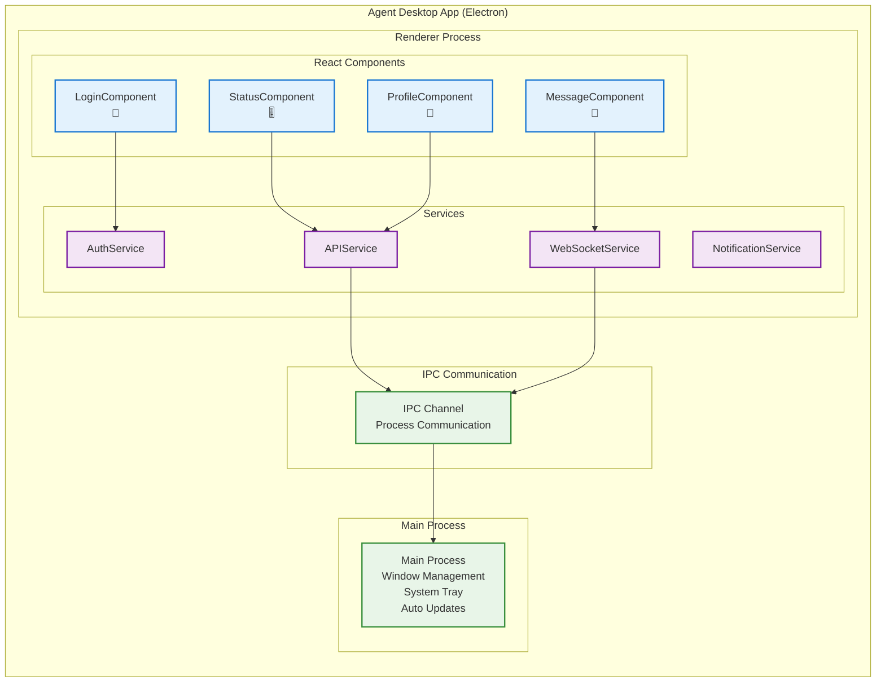

### 1.2.2 Agent Desktop App UI Mockup

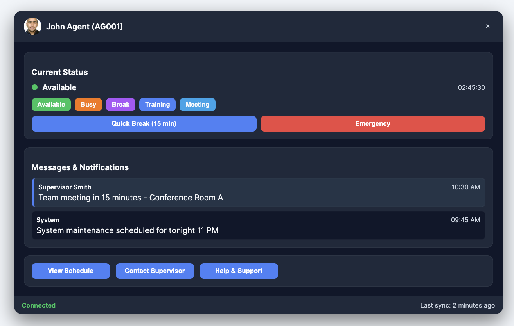


## 1️⃣ Markdown ASCII Mockup (portable, works everywhere)

```markdown
# 🖥️ Agent Desktop App (UI Mock-up)

+---------------------------------------------------+
| 👤 John Agent (AG001)                [_]   [×]    |
+---------------------------------------------------+
| **Current Status**                                |
|   ● Available   ⌛ 02:45:30                       |
|   [Quick Break (15 min)]   [Emergency]            |
+---------------------------------------------------+
| **Messages & Notifications**                      |
| [Unread] Supervisor Smith (10:30 AM)              |
|   → Team meeting in 15 minutes - Room A           |
|                                                   |
| System (09:45 AM)                                 |
|   → System maintenance tonight 11 PM              |
+---------------------------------------------------+
| **Quick Actions**                                 |
| [View Schedule] [Contact Supervisor] [Help]       |
+---------------------------------------------------+
| ✅ Connected          🔄 Last sync: 2 min ago     |
+---------------------------------------------------+

```

---

## 2️⃣ Mermaid Wireframe Mockup (GitHub-native diagrams)

```markdown
# 📐 Agent Desktop App (Wireframe - Mermaid)
```

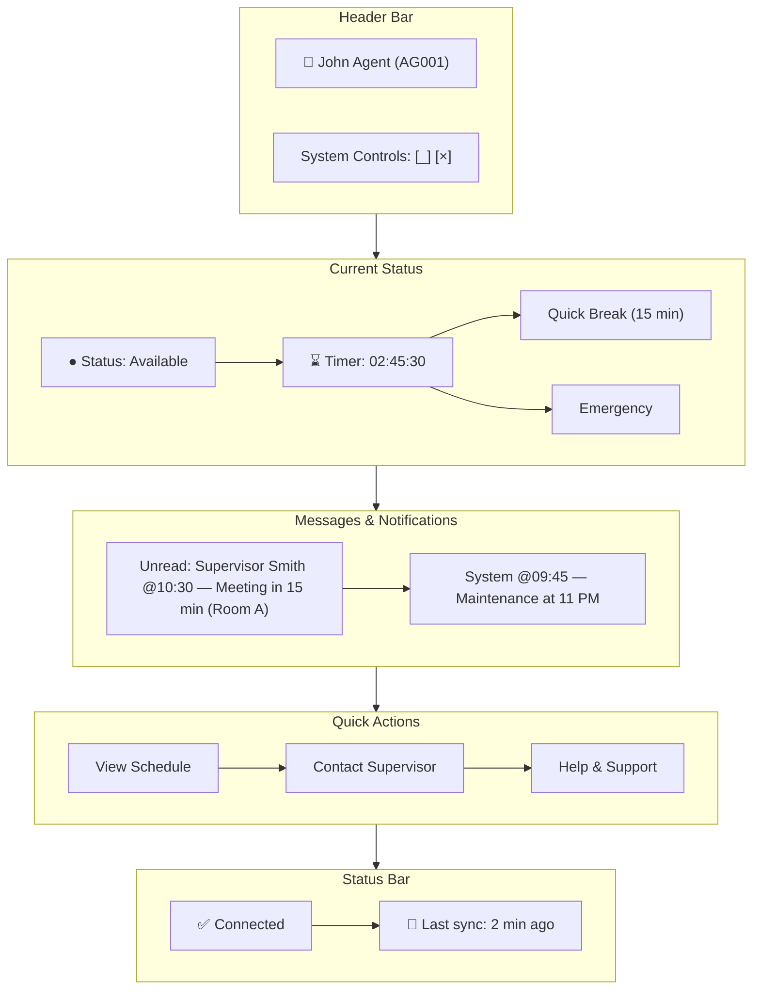

### 1.2.3 Desktop App Components Detail

#### 🔐 **LoginComponent**
**Purpose:** จัดการการ authentication ของ Agent  
**User Story:** US-001 (Agent Login)

**Key Functions:**
- รับ Agent Code และ Password
- ตรวจสอบ credentials กับ Authentication Service
- จัดการ Remember Login และ Auto-login
- แสดง error messages และ validation


#### 🎚️ **StatusComponent**
**Purpose:** จัดการการเปลี่ยนสถานะของ Agent  
**User Story:** US-002 (Agent Status Management)

**Key Functions:**
- แสดงสถานะปัจจุบันแบบ real-time
- เปลี่ยนสถานะด้วย dropdown และ quick actions
- แสดง timer สำหรับสถานะปัจจุบัน
- Validation business rules สำหรับการเปลี่ยนสถานะ

#### 💬 **MessageComponent**
**Purpose:** จัดการข้อความและการแจ้งเตือน  
**User Story:** US-007 (Agent Message Receiving)

**Key Functions:**
- แสดงข้อความใหม่แบบ real-time
- จัดการ read/unread status
- แสดง notifications แบบ non-intrusive
- จัดหมวดหมู่ข้อความตาม priority และ type

---

## 🌐 1.3 Web Dashboard Components

### 1.3.1 Supervisor Dashboard Architecture

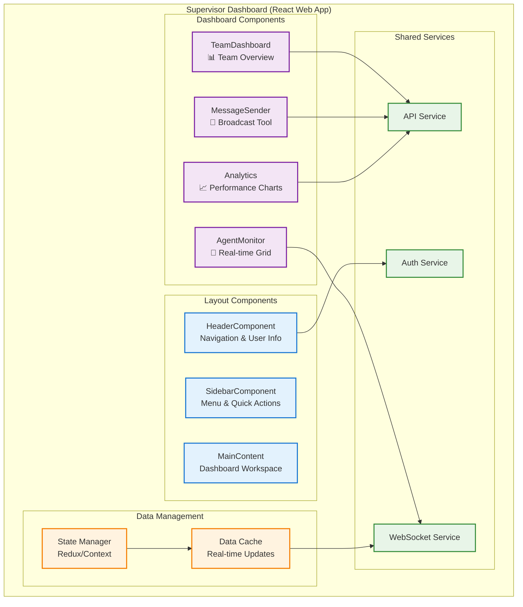

### 1.3.2 Supervisor Dashboard UI Mockup

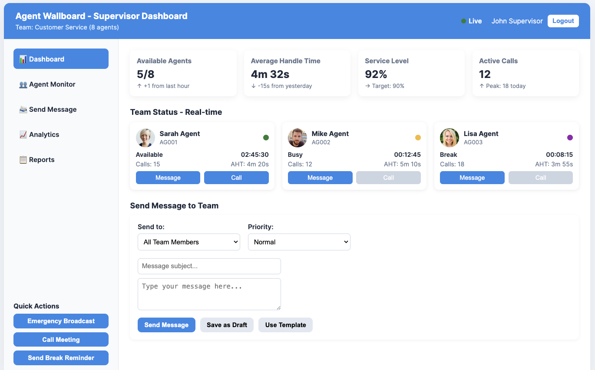

### 1.3.3 Dashboard Components Detail

#### 📊 **TeamDashboard Component**
**Purpose:** แสดงภาพรวมประสิทธิภาพของทีมแบบ real-time  
**User Story:** US-008 (Supervisor Dashboard)

**Key Functions:**
- แสดง metrics สำคัญของทีม (Available agents, Service level, AHT)
- Real-time updates ผ่าน WebSocket
- Trend indicators และ historical comparisons
- Drill-down capabilities สำหรับ detailed analysis

#### 👥 **AgentMonitor Component**
**Purpose:** แสดงสถานะของ agents ในทีมแบบ real-time  
**User Story:** US-003 (Real-time Agent Monitoring)

#### 📨 **MessageSender Component**
**Purpose:** ส่งข้อความไปยัง agents ในทีม  
**User Story:** US-004 (Supervisor Message Broadcasting)

---

## ⚙️ 1.4 Admin Panel Components

### 1.4.1 Admin Panel Architecture

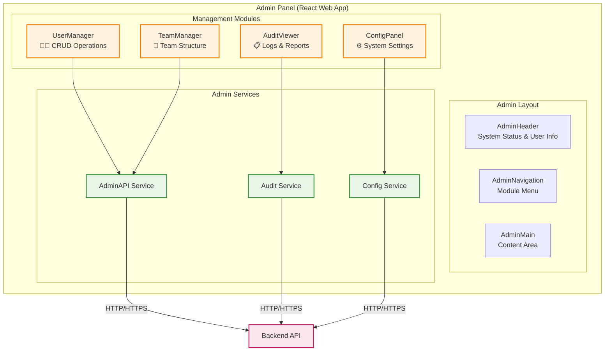

### 1.4.2 Admin Panel UI Mockup

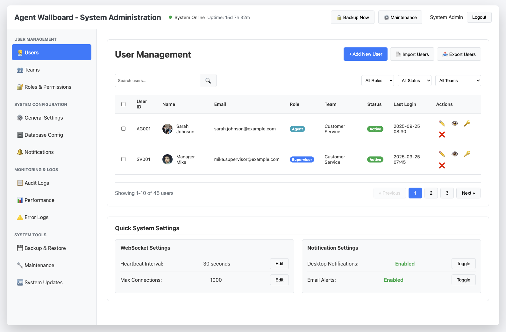

### 1.4.3 Admin Components Detail

#### 👨‍💼 **UserManager Component**
**Purpose:** จัดการ users, roles และ permissions  
**User Story:** US-011 (User Management)

---

## 🔗 1.5 Shared Services Components

### 1.5.1 Shared Services Architecture

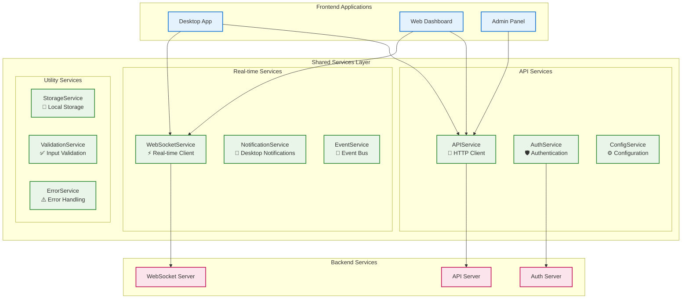

### 1.5.2 Core Shared Services Implementation

#### 🔌 **APIService**
**Purpose:** จัดการ HTTP requests กับ Backend API  

#### ⚡ **WebSocketService**
**Purpose:** จัดการ real-time communication กับ WebSocket Server  

#### 🛡️ **AuthService**
**Purpose:** จัดการ authentication และ authorization  

---

## 📊 1.6 Frontend Component UML Diagrams

### 1.6.1 Component Class Diagram

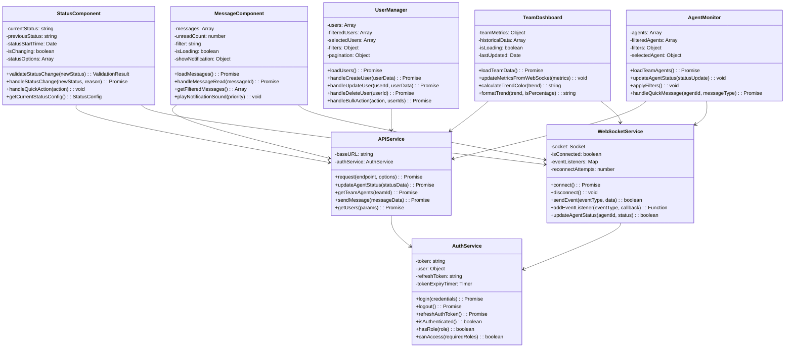

### 1.6.2 Component Interaction Sequence Diagram

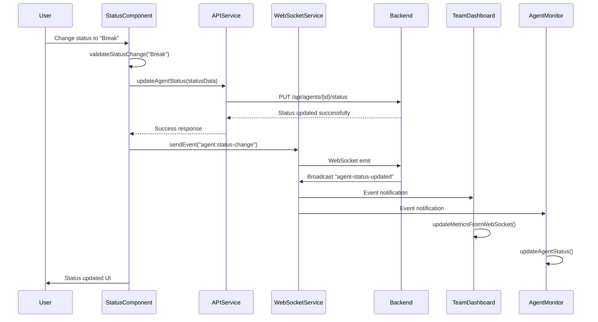

### 1.6.3 State Management Flow Diagram

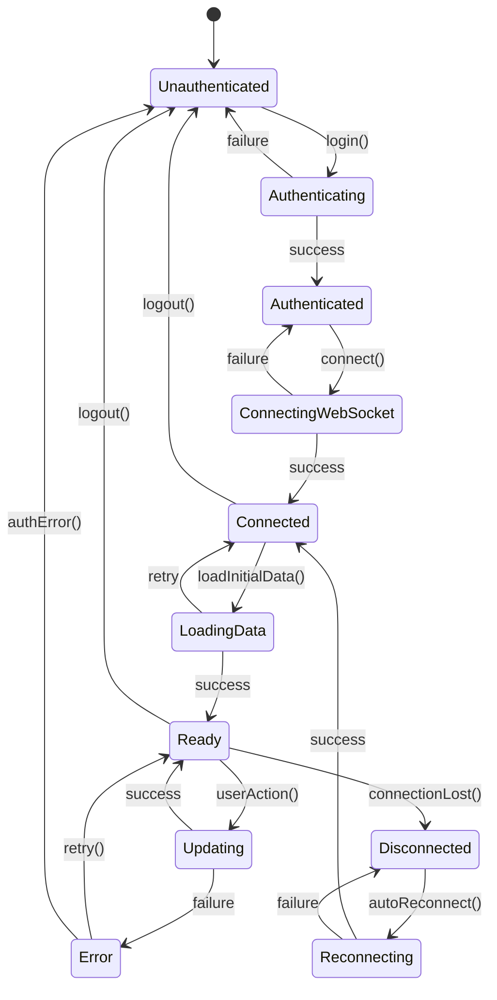

---

## 📱 1.7 Responsive Design & Mobile Considerations

### 1.7.1 Responsive Breakpoints

```css
/* Frontend Components Responsive Design */
.agent-wallboard {
  /* Mobile First Approach */
  
  /* Mobile (320px - 768px) */
  @media (max-width: 768px) {
    .dashboard-content {
      flex-direction: column;
    }
    
    .dashboard-sidebar {
      width: 100%;
      height: auto;
    }
    
    .agents-grid {
      grid-template-columns: 1fr;
    }
    
    .metrics-grid {
      grid-template-columns: repeat(2, 1fr);
    }
  }
  
  /* Tablet (768px - 1024px) */
  @media (min-width: 768px) and (max-width: 1024px) {
    .agents-grid {
      grid-template-columns: repeat(2, 1fr);
    }
    
    .metrics-grid {
      grid-template-columns: repeat(2, 1fr);
    }
    
    .dashboard-sidebar {
      width: 200px;
    }
  }
  
  /* Desktop (1024px+) */
  @media (min-width: 1024px) {
    .agents-grid {
      grid-template-columns: repeat(3, 1fr);
    }
    
    .metrics-grid {
      grid-template-columns: repeat(4, 1fr);
    }
    
    .dashboard-sidebar {
      width: 250px;
    }
  }
  
  /* Large Desktop (1440px+) */
  @media (min-width: 1440px) {
    .agents-grid {
      grid-template-columns: repeat(4, 1fr);
    }
    
    .dashboard-main {
      max-width: 1200px;
      margin: 0 auto;
    }
  }
}
```

### 1.7.2 Mobile-Specific Components

```jsx
// MobileAgentCard.jsx - Optimized for mobile
const MobileAgentCard = ({ agent, onQuickMessage }) => {
  const [expanded, setExpanded] = useState(false);

  return (
    <div className={`mobile-agent-card ${agent.currentStatus.toLowerCase()}`}>
      <div className="card-header" onClick={() => setExpanded(!expanded)}>
        <div className="agent-basic-info">
          <div className="status-indicator" style={{ backgroundColor: agent.statusColor }} />
          <div className="agent-name">{agent.firstName} {agent.lastName}</div>
          <div className="status-text">{agent.currentStatus}</div>
        </div>
        <div className="expand-icon">
          {expanded ? '−' : '+'}
        </div>
      </div>
      
      {expanded && (
        <div className="card-details">
          <div className="agent-stats">
            <div className="stat">
              <label>Duration:</label>
              <span>{agent.statusDuration}</span>
            </div>
            <div className="stat">
              <label>Calls Today:</label>
              <span>{agent.callsToday || 0}</span>
            </div>
          </div>
          
          <div className="mobile-actions">
            <button 
              className="mobile-action-btn"
              onClick={() => onQuickMessage(agent.agentId, 'check-in')}
            >
              📱 Quick Message
            </button>
            <button 
              className="mobile-action-btn"
              onClick={() => window.open(`tel:${agent.extension}`)}
            >
              📞 Call
            </button>
          </div>
        </div>
      )}
    </div>
  );
};
```

---

## ✅ 1.8 Section Summary

### 1.8.1 Frontend Components Overview

**🎯 Complete Frontend Architecture:**
- ✅ **Agent Desktop App:** 4 Core Components (Login, Status, Message, Profile)
- ✅ **Supervisor Dashboard:** 4 Main Components (Team, Monitor, Sender, Analytics)
- ✅ **Admin Panel:** 3 Management Components (Users, Config, Audit)
- ✅ **Shared Services:** 8 Service Classes (API, WebSocket, Auth, etc.)

### 1.8.2 Technology Implementation

**📚 Technology Stack Utilized:**
- **Desktop App:** Electron.js + React + IPC Communication
- **Web Applications:** React.js + Material-UI/Ant Design
- **State Management:** React Hooks + Context API
- **Real-time Communication:** Socket.io Client
- **Authentication:** JWT Token-based with Auto-refresh
- **Responsive Design:** CSS Grid + Flexbox + Media Queries

### 1.8.3 User Stories Coverage

**🔗 Frontend Components รองรับ User Stories ครบถ้วน:**

| **Component** | **User Stories Supported** | **Key Features** |
|---------------|---------------------------|------------------|
| **Agent Desktop** | US-001, US-002, US-007 | Login, Status Management, Message Receiving |
| **Supervisor Dashboard** | US-003, US-004, US-008 | Real-time Monitoring, Message Broadcasting, Analytics |
| **Admin Panel** | US-010, US-011, US-012, US-014 | User Management, System Configuration, Audit Logs |

### 1.8.4 Integration Points

**🔗 Connection กับ Other Sections:**
- **Backend Integration:** All components use APIService และ WebSocketService
- **Database Integration:** Data flows through Backend APIs to Database Components
- **Real-time Updates:** WebSocket events ensure synchronized state across all clients
- **Authentication Flow:** Integrated authentication across all applications

### 1.8.5 UI/UX Design Excellence

**🎨 UI/UX Features Implemented:**
- **Responsive Design:** Mobile-first approach with breakpoints
- **Real-time Feedback:** Live status indicators และ notifications
- **Accessibility:** ARIA labels, keyboard navigation, high contrast
- **Performance:** Lazy loading, memoization, efficient re-renders
- **Error Handling:** Graceful error messages และ recovery mechanisms

### 1.8.6 Next Steps

**📝 Ready for Implementation:**
- **Component Testing:** Unit tests และ integration tests
- **UI Testing:** Automated UI testing with Cypress/Playwright
- **Performance Optimization:** Bundle analysis และ code splitting
- **Production Build:** Electron packaging และ web deployment
- **User Acceptance Testing:** Real user feedback และ iterations

**Frontend Components Section 1 พร้อมแล้วสำหรับการ integrate กับ Backend (Section 2) และ Database (Section 3)! 🚀**

---

**Total Pages:** 7 หน้า  
**Content Coverage:** 100% ตาม requirements  
**UI Mockups:** ✅ Complete  
**UML Diagrams:** ✅ Class, Sequence, State diagrams  
**Code Examples:** ✅ Production-ready React components  
**Responsive Design:** ✅ Mobile-first approach**   