# การออกแบบ C3: Component Architecture สำหรับ Agent Wallboard System
## คู่มือสำหรับนักศึกษาวิศวกรรมซอฟต์แวร์ ปี 2

---

## บทนำ

การออกแบบ C3 (Component Diagram) คือการ "ซูมเข้าไป" จาก C2 Container เพื่อแสดงว่าภายใน Container แต่ละตัว ประกอบด้วย Component อะไรบ้าง และมีการทำงานร่วมกันอย่างไร

**เป้าหมาย:** แสดงโครงสร้างภายในของ Container และกำหนด Interface ที่ชัดเจน

---

## Step 1: ทบทวน C2 Container Architecture 

### C2 Container Overview ที่เราจะทำ C3

จากการตรวจสอบเอกสาร C2 พบว่ามี **7 Containers** หลัก:

```mermaid
graph TD
    subgraph "Agent Wallboard System"
        subgraph "Frontend Tier (3 Containers)"
            DesktopApp["🖥 Agent Desktop App<br/>Electron + React"]
            WebDash["🌐 Supervisor Dashboard<br/>React + Material-UI"]
            AdminPanel["⚙️ Admin Panel<br/>React + Admin Framework"]
        end
        
        subgraph "Backend Tier (2 Containers)"
            APIServer["⚙️ API Server<br/>Node.js + Express"]
            WSServer["⚡ WebSocket Server<br/>Socket.io"]
        end
        
        subgraph "Data Tier (2 Containers)"
            SQLServer["🗃 SQL Server<br/>User Data & Config"]
            MongoDB["🍃 MongoDB<br/>Real-time Data"]
        end
    end
    
    DesktopApp & WebDash & AdminPanel --> APIServer
    DesktopApp & WebDash --> WSServer
    APIServer & WSServer --> SQLServer & MongoDB
```



**หมายเหตุ:** จากเอกสาร C2 บางฉบับมีการกล่าวถึง Redis แต่เพื่อความเรียบง่ายสำหรับนักศึกษา จะใช้ 7 Containers หลักนี้

---

## Step 2: หลักการออกแบบ Component

### 2.1 Component คืออะไร?

**Component** = ชิ้นส่วนย่อยที่มีหน้าที่เฉพาะ ซึ่ง:
- มี **Interface** ชัดเจน
- มี **Responsibility** เฉพาะ 
- **Test** และ **พัฒนา** แยกได้

### 2.2 หลักการสำคัญ

1. **Single Responsibility** - ทำหน้าที่เดียว
2. **High Cohesion** - ส่วนย่อยทำงานเข้ากันได้ดี
3. **Loose Coupling** - พึ่งพากันน้อย
4. **Clear Interface** - ติดต่อกันผ่าน Interface ที่กำหนดไว้

### 2.3 เหตุผลที่ต้องทำ C3

**เพื่อการพัฒนา:**
- แบ่งงานให้ทีมได้ชัดเจน
- วางแผน Implementation
- กำหนด Test Strategy

**เพื่อการบำรุงรักษา:**  
- เข้าใจโครงสร้าง
- แก้ไขปัญหาได้เร็ว
- เพิ่มฟีเจอร์ได้ง่าย

---

## Step 3: C3 Component Breakdown (ครบทุก Container)

### 3.1 API Server Components (5 Components)

**API Server** แบ่งเป็น 5 Components หลัก:

```mermaid
graph TB
    subgraph "API Server Container"
        subgraph "Controllers Layer"
            AuthController["AuthController<br/>🔐 จัดการ Login/Logout"]
            AgentController["AgentController<br/>👤 จัดการ Agent Status"]
            MessageController["MessageController<br/>💬 จัดการข้อความ"]
        end
        
        subgraph "Services Layer"
            AgentService["AgentService<br/>📊 Business Logic สำหรับ Agent"]
            MessageService["MessageService<br/>📨 Message Processing"]
        end
        
        subgraph "Infrastructure"
            AuthMiddleware["AuthMiddleware<br/>🛡️ JWT Validation"]
            DatabaseService["DatabaseService<br/>🔗 Data Access Layer"]
        end
    end
    
    AuthController --> AuthMiddleware
    AgentController --> AuthMiddleware
    MessageController --> AuthMiddleware
    
    AgentController --> AgentService
    MessageController --> MessageService
    
    AgentService --> DatabaseService
    MessageService --> DatabaseService
```



**คำอธิบาย Component:**

**Controllers (3 Components):**
- **AuthController:** รับ HTTP Request สำหรับ login, logout, refresh token
- **AgentController:** รับ Request สำหรับเปลี่ยนสถานะ Agent (Available, Busy, Break)  
- **MessageController:** รับ Request สำหรับส่งข้อความระหว่าง Supervisor กับ Agent

**Services (2 Components):**
- **AgentService:** ประมวลผล Business Logic เกี่ยวกับ Agent (validation rules, status transitions)
- **MessageService:** ประมวลผล Business Logic เกี่ยวกับข้อความ (broadcast, direct message)

**Infrastructure (2 Components):**
- **AuthMiddleware:** ตรวจสอบ JWT Token ก่อนเข้าสู่ Controller
- **DatabaseService:** จัดการการเชื่อมต่อและ query ฐานข้อมูล

### 3.2 WebSocket Server Components (4 Components)

```mermaid
graph TB
    subgraph "WebSocket Server Container"
        ConnectionManager["ConnectionManager<br/>🔌 จัดการ Client Connections"]
        EventHandler["EventHandler<br/>⚡ จัดการ Real-time Events"]
        BroadcastService["BroadcastService<br/>📡 ส่งข้อมูลไป Client"]
        RoomManager["RoomManager<br/>🏠 จัดการ Team Rooms"]
    end
    
    ConnectionManager --> RoomManager
    EventHandler --> BroadcastService
    BroadcastService --> RoomManager
    EventHandler --> ConnectionManager
```



**คำอธิบาย:**
- **ConnectionManager:** จัดการ WebSocket connections (connect, disconnect, authentication)
- **EventHandler:** รับและประมวลผล events จาก clients (status change, message sent)
- **BroadcastService:** ส่งข้อมูล real-time ไปยัง clients ที่เกี่ยวข้อง
- **RoomManager:** จัดกลุ่ม clients ตามทีม (เพื่อส่งข้อมูลเฉพาะทีม)

### 3.3 Agent Desktop App Components (6 Components)

```mermaid
graph TB
    subgraph "Agent Desktop App Container"
        subgraph "UI Components"
            LoginComponent["LoginComponent<br/>🔑 หน้า Login"]
            StatusComponent["StatusComponent<br/>📊 เปลี่ยนสถานะ Agent"]
            MessageComponent["MessageComponent<br/>💬 รับและแสดงข้อความ"]
            NotificationComponent["NotificationComponent<br/>🔔 แจ้งเตือน Desktop"]
        end
        
        subgraph "Services"
            APIService["APIService<br/>🔗 เรียก REST API"]
            WebSocketService["WebSocketService<br/>⚡ Real-time Communication"]
        end
    end
    
    LoginComponent --> APIService
    StatusComponent --> APIService & WebSocketService
    MessageComponent --> WebSocketService
    NotificationComponent --> WebSocketService
    
    APIService --> WebSocketService
```



**คำอธิบาย:**

**UI Components (4 Components):**
- **LoginComponent:** หน้าจอ login สำหรับ Agent ใส่ Agent Code และ Password
- **StatusComponent:** ส่วน UI สำหรับเปลี่ยนสถานะ Agent พร้อม dropdown และ timer
- **MessageComponent:** แสดงข้อความที่ได้รับจาก Supervisor และประวัติข้อความ
- **NotificationComponent:** แสดง popup notification เมื่อมีข้อความใหม่

**Services (2 Components):**
- **APIService:** จัดการการเรียก REST API ไปยัง Backend (login, update status)
- **WebSocketService:** จัดการ real-time communication (รับ status updates, messages)

### 3.4 Supervisor Dashboard Components (5 Components)

```mermaid
graph TB
    subgraph "Supervisor Dashboard Container"
        subgraph "Dashboard Components"
            TeamOverview["TeamOverview<br/>📈 ภาพรวมทีม (KPI)"]
            AgentGrid["AgentGrid<br/>👥 แสดง Agent Cards"]
            MessageSender["MessageSender<br/>📨 ส่งข้อความ"]
            Analytics["Analytics<br/>📊 สถิติและรายงาน"]
        end
        
        subgraph "Shared Services"
            DashboardAPI["DashboardAPI<br/>🔗 เรียก API"]
            RealtimeService["RealtimeService<br/>⚡ WebSocket Client"]
        end
    end
    
    TeamOverview --> DashboardAPI & RealtimeService
    AgentGrid --> RealtimeService
    MessageSender --> DashboardAPI
    Analytics --> DashboardAPI
```



**คำอธิบาย:**

**Dashboard Components (4 Components):**
- **TeamOverview:** แสดงสถิติรวมของทีม (จำนวน Agent online, service level, AHT)
- **AgentGrid:** แสดง Agent แต่ละคนในรูป card พร้อมสถานะ real-time
- **MessageSender:** ส่วน UI สำหรับส่งข้อความถึง Agent (direct หรือ broadcast)
- **Analytics:** แสดงกราฟและสถิติประสิทธิภาพของทีม

**Shared Services (2 Components):**
- **DashboardAPI:** เรียก REST API สำหรับข้อมูลที่ไม่ real-time
- **RealtimeService:** รับข้อมูล real-time ผ่าน WebSocket

### 3.5 Admin Panel Components (4 Components)

```mermaid
graph TB
    subgraph "Admin Panel Container"
        UserManager["UserManager<br/>👨‍💼 จัดการ User (CRUD)"]
        ConfigPanel["ConfigPanel<br/>⚙️ ตั้งค่าระบบ"]
        AuditViewer["AuditViewer<br/>📋 ดู Logs และรายงาน"]
        SystemMonitor["SystemMonitor<br/>📊 ติดตาม System Health"]
        
        AdminAPI["AdminAPI<br/>🔗 API Service สำหรับ Admin"]
    end
    
    UserManager --> AdminAPI
    ConfigPanel --> AdminAPI
    AuditViewer --> AdminAPI
    SystemMonitor --> AdminAPI
```



**คำอธิบาย:**
- **UserManager:** หน้าจัดการ User (สร้าง, แก้ไข, ลบ Agent/Supervisor)
- **ConfigPanel:** ตั้งค่าระบบ (timeout, message limits, business rules)
- **AuditViewer:** ดู log การใช้งานระบบและการเปลี่ยนแปลงข้อมูล
- **SystemMonitor:** ติดตามสถานะระบบ (CPU, Memory, Database connections)
- **AdminAPI:** Service สำหรับเรียก API ที่ต้องสิทธิ์ Admin

### 3.6 SQL Server Database Components (4 Components)

```mermaid
graph TB
    subgraph "SQL Server Database Container"
        UserRepository["UserRepository<br/>👤 จัดการ User Data"]
        TeamRepository["TeamRepository<br/>👥 จัดการ Team Data"]
        ConfigRepository["ConfigRepository<br/>⚙️ จัดการ System Config"]
        AuditRepository["AuditRepository<br/>📝 จัดการ Audit Logs"]
        
        ConnectionPool["Connection Pool<br/>🔗 Database Connection Management"]
    end
    
    UserRepository --> ConnectionPool
    TeamRepository --> ConnectionPool
    ConfigRepository --> ConnectionPool
    AuditRepository --> ConnectionPool
```



**คำอธิบาย:**
- **UserRepository:** จัดการข้อมูล User (Agent, Supervisor, Admin) และ authentication
- **TeamRepository:** จัดการข้อมูล Team structure และ hierarchy
- **ConfigRepository:** จัดการ system configuration และ business rules
- **AuditRepository:** บันทึกและจัดการ audit logs สำหรับ compliance
- **ConnectionPool:** จัดการ database connections เพื่อ performance

### 3.7 MongoDB Database Components (4 Components)

```mermaid
graph TB
    subgraph "MongoDB Database Container"
        StatusRepository["StatusRepository<br/>📊 Agent Status History"]
        MessageRepository["MessageRepository<br/>💬 Messages & Chat"]
        MetricsRepository["MetricsRepository<br/>📈 Performance Data"]
        EventRepository["EventRepository<br/>⚡ Real-time Events"]
        
        MongoConnection["MongoDB Connection<br/>🔗 Connection Management"]
    end
    
    StatusRepository --> MongoConnection
    MessageRepository --> MongoConnection
    MetricsRepository --> MongoConnection
    EventRepository --> MongoConnection
```



**คำอธิบาย:**
- **StatusRepository:** เก็บประวัติการเปลี่ยนสถานะของ Agent แต่ละครั้ง
- **MessageRepository:** เก็บข้อความทั้งหมดระหว่าง Supervisor และ Agent
- **MetricsRepository:** เก็บข้อมูลสถิติประสิทธิภาพ (hourly, daily aggregation)
- **EventRepository:** เก็บ real-time events สำหรับ debugging และ monitoring
- **MongoConnection:** จัดการ MongoDB connections และ connection pooling

---

## Step 4: Component Interface Design

### 4.1 ตัวอย่าง Interface แต่ละ Component

**AgentService Interface:**
```typescript
interface AgentService {
  // การจัดการสถานะ
  updateStatus(agentId: string, status: AgentStatus, reason?: string): Promise<boolean>
  getCurrentStatus(agentId: string): Promise<AgentStatus>
  getStatusHistory(agentId: string, timeRange: DateRange): Promise<AgentStatusHistory[]>
  
  // การตรวจสอบ Business Rules
  validateStatusChange(currentStatus: AgentStatus, newStatus: AgentStatus): ValidationResult
  calculateWorkTime(agentId: string, date: Date): Promise<WorkTimeStats>
  
  // การจัดการทีม
  getTeamMembers(teamId: string): Promise<Agent[]>
  getTeamStats(teamId: string): Promise<TeamStats>
}
```

**MessageService Interface:**
```typescript
interface MessageService {
  // การส่งข้อความ
  sendDirectMessage(senderId: string, recipientId: string, content: string, priority: Priority): Promise<Message>
  sendBroadcast(senderId: string, teamId: string, content: string, priority: Priority): Promise<Message[]>
  
  // การรับข้อความ
  getInbox(agentId: string, limit: number): Promise<Message[]>
  markAsRead(messageId: string, agentId: string): Promise<boolean>
  
  // การจัดการประวัติ
  getMessageHistory(userId: string, timeRange: DateRange): Promise<Message[]>
  deleteMessage(messageId: string, userId: string): Promise<boolean>
}
```

**WebSocketService Interface:**
```typescript
interface WebSocketService {
  // การจัดการ Connection
  connect(token: string): Promise<void>
  disconnect(): void
  isConnected(): boolean
  
  // การส่ง Events
  emit(eventName: string, data: any): void
  broadcast(roomId: string, eventName: string, data: any): void
  
  // การรับ Events  
  on(eventName: string, callback: (data: any) => void): void
  off(eventName: string, callback?: (data: any) => void): void
  
  // การจัดการ Rooms
  joinRoom(roomId: string): void
  leaveRoom(roomId: string): void
}
```

### 4.2 เหตุผลการออกแบบ Interface

**ทำไมต้องมี Interface:**
1. **ทีมพัฒนา** สามารถทำงานแยกกันได้ (Parallel Development)
2. **Testing** ทำได้ง่าย (Mock Interface สำหรับ Unit Testing)
3. **Maintenance** เปลี่ยน Implementation โดยไม่กระทบส่วนอื่น
4. **Documentation** Interface เป็น Contract ที่ชัดเจน

---

## Step 5: Component Communication Patterns

### 5.1 Synchronous Communication (HTTP REST)

```mermaid
sequenceDiagram
    participant Desktop as Agent Desktop
    participant API as API Server
    participant DB as Database
    
    Desktop->>API: PUT /api/agent/status
    Note right of Desktop: เปลี่ยนสถานะเป็น "Break"
    API->>API: Validate request & business rules
    API->>DB: Update agent status
    DB-->>API: Confirmation
    API-->>Desktop: Success response
    Note right of Desktop: แสดง UI confirmation
```



### 5.2 Asynchronous Communication (WebSocket)


### 5.3 Event-Driven Pattern

**ตัวอย่าง Events ในระบบ:**
- `agent.status.changed` - เมื่อ Agent เปลี่ยนสถานะ
- `message.sent` - เมื่อส่งข้อความ
- `message.received` - เมื่อได้รับข้อความ
- `team.metrics.updated` - เมื่อสถิติทีมอัปเดต
- `user.login` - เมื่อมี User login
- `system.alert` - เมื่อมี System alert

**ประโยชน์ของ Event-Driven:**
- Components ไม่ต้องรู้จักกันโดยตรง (Loose Coupling)
- เพิ่ม Feature ใหม่ได้ง่าย (ฟัง Event เพิ่ม)
- Scale ได้ดี (Multiple listeners)
- Debug ง่าย (Event logging)

---

## Step 6: Implementation Guidelines

### 6.1 Development Sequence (ลำดับการพัฒนาที่แนะนำ)

**Phase 1: Foundation (Weeks 1-3)**
1. **Database Components** - สร้าง Repositories และ Connection pools
2. **API Services** - สร้าง Business Logic (AgentService, MessageService)
3. **API Controllers** - สร้าง HTTP Endpoints

**Phase 2: Real-time Features (Weeks 4-6)**
4. **WebSocket Components** - สร้าง Real-time communication
5. **Desktop App Services** - สร้าง API และ WebSocket clients
6. **Basic Desktop UI** - สร้าง Login และ Status components

**Phase 3: Advanced Features (Weeks 7-9)**
7. **Dashboard Components** - สร้าง Supervisor dashboard
8. **Admin Components** - สร้าง Admin panel
9. **Advanced Features** - Analytics, reporting

**Phase 4: Integration & Testing (Weeks 10-12)**
10. **Integration Testing** - Test component interactions
11. **End-to-end Testing** - Test complete user scenarios
12. **Deployment & Documentation** - Production deployment

### 6.2 Testing Strategy

**Unit Testing (แต่ละ Component):**
- Mock dependencies เพื่อ test แยก
- Test business logic ใน Services
- Test validation ใน Controllers
- Test UI behavior ใน Components

**Integration Testing (Component ร่วมกัน):**
- Test API endpoints จริง
- Test WebSocket communication
- Test database operations
- Test error handling

**End-to-End Testing (User Scenarios):**
- Test complete user workflows
- Test real-time features
- Test multi-user scenarios
- Test system performance

### 6.3 Code Organization Structure

```
project/
├── backend/
│   ├── controllers/           # API Controllers (3 files)
│   │   ├── AuthController.js
│   │   ├── AgentController.js
│   │   └── MessageController.js
│   ├── services/              # Business Logic (2 files)
│   │   ├── AgentService.js
│   │   └── MessageService.js
│   ├── middleware/            # Express Middleware
│   │   └── AuthMiddleware.js
│   ├── database/              # Database Components
│   │   ├── repositories/      # SQL Server Repositories (4 files)
│   │   └── mongodb/           # MongoDB Repositories (4 files)
│   └── websocket/             # WebSocket Components (4 files)
│       ├── ConnectionManager.js
│       ├── EventHandler.js
│       ├── BroadcastService.js
│       └── RoomManager.js
├── desktop-app/
│   ├── components/            # React UI Components (4 files)
│   │   ├── LoginComponent.jsx
│   │   ├── StatusComponent.jsx
│   │   ├── MessageComponent.jsx
│   │   └── NotificationComponent.jsx
│   └── services/              # Frontend Services (2 files)
│       ├── APIService.js
│       └── WebSocketService.js
├── web-dashboard/
│   ├── components/            # Dashboard Components (4 files)
│   └── services/              # Dashboard Services (2 files)
└── admin-panel/
    ├── components/            # Admin Components (4 files)
    └── services/              # Admin Services (1 file)
```

---

## Step 7: Component Dependencies Matrix

### 7.1 Dependency Relationships

| Component | Depends On | Used By | Interface |
|-----------|------------|---------|-----------|
| **AuthController** | AuthMiddleware, DatabaseService | HTTP Routes | REST API |
| **AgentController** | AuthMiddleware, AgentService | HTTP Routes | REST API |
| **MessageController** | AuthMiddleware, MessageService | HTTP Routes | REST API |
| **AgentService** | DatabaseService | AgentController, WebSocket | Service Interface |
| **MessageService** | DatabaseService | MessageController, WebSocket | Service Interface |
| **ConnectionManager** | RoomManager | EventHandler | WebSocket API |
| **EventHandler** | BroadcastService | ConnectionManager | Event API |
| **BroadcastService** | RoomManager | EventHandler | Broadcast API |

### 7.2 Dependency Injection Pattern

```javascript
// ตัวอย่าง Dependency Injection
class AgentController {
  constructor(agentService, authMiddleware) {
    this.agentService = agentService;
    this.authMiddleware = authMiddleware;
  }
  
  async updateStatus(req, res) {
    // ใช้ injected dependencies
    const isValid = await this.authMiddleware.validate(req);
    if (isValid) {
      const result = await this.agentService.updateStatus(req.body);
      res.json(result);
    }
  }
}

// การ setup dependencies
const agentService = new AgentService(databaseService);
const authMiddleware = new AuthMiddleware(tokenService);
const agentController = new AgentController(agentService, authMiddleware);
```

**ประโยชน์ของ Dependency Injection:**
- Testing ง่าย (inject Mock objects)
- Components แยกจากกันชัดเจน (Loose Coupling)
- Configuration ทำได้ยืดหยุ่น
- Maintenance และ debugging ง่าย

---

## Step 8: Quality Assurance & Review

### 8.1 Component Design Review Checklist

**Single Responsibility Principle:**
- [ ] แต่ละ Component มีหน้าที่หลักเพียงอย่างเดียว
- [ ] ไม่มี Component ที่ทำหน้าที่หลายอย่าง
- [ ] Component name สื่อถึงหน้าที่ได้ชัดเจน

**Interface Design:**
- [ ] Interface ครบถ้วนสำหรับ use cases ทั้งหมด
- [ ] Parameter และ return type ชัดเจน
- [ ] Error handling ครอบคลุม
- [ ] Documentation เพียงพอ

**Dependencies:**
- [ ] Dependencies เหมาะสมและจำเป็น
- [ ] ไม่มี circular dependencies
- [ ] Dependency Injection ใช้ได้
- [ ] Mock ได้สำหรับ testing

**Testability:**
- [ ] สามารถ unit test แยกได้
- [ ] Interface ชัดเจนสำหรับ testing
- [ ] Dependencies mock ได้
- [ ] Test scenarios ครอบคลุม

### 8.2 Architecture Validation

**ตรวจสอบตาม Requirements:**
- [ ] รองรับ Real-time Updates (WebSocket components)
- [ ] รองรับ Multi-user Access (Authentication components)
- [ ] รองรับ Team-based Operations (Team management components)
- [ ] รองรับ Performance Monitoring (Analytics components)
- [ ] รองรับ System Administration (Admin components)

**ตรวจสอบ Scalability:**
- [ ] Components สามารถ scale แยกได้
- [ ] Database components รองรับ connection pooling
- [ ] WebSocket components รองรับ multiple connections
- [ ] Caching strategy เหมาะสม

---

## Step 9: สรุปและข้อแนะนำ

### 9.1 สิ่งที่ได้จาก C3 Component Design

**โครงสร้างที่ชัดเจน:**
- **7 Containers** แบ่งเป็น **28 Components** รวม
- แต่ละ Component มีหน้าที่และ Interface ชัดเจน
- Dependencies และ communication patterns กำหนดไว้

**แผนการพัฒนา:**
- ลำดับการพัฒนาที่เหมาสม (Database → Services → Controllers → UI)
- Test strategy สำหรับแต่ละระดับ
- Code organization ที่เป็นระบบ

**ความพร้อมสำหรับทีม:**
- Components แบ่งงานได้ชัดเจน
- Interface สำหรับ parallel development
- Testing แยกได้ตาม Component

### 9.2 Component Count Summary

| Container | Component Count | Key Components |
|-----------|----------------|----------------|
| **API Server** | 7 | Controllers (3), Services (2), Infrastructure (2) |
| **WebSocket Server** | 4 | Connection, Event, Broadcast, Room management |
| **Agent Desktop App** | 6 | UI Components (4), Services (2) |
| **Supervisor Dashboard** | 6 | Dashboard Components (4), Services (2) |
| **Admin Panel** | 5 | Management Components (4), API Service (1) |
| **SQL Server Database** | 5 | Repositories (4), Connection Pool (1) |
| **MongoDB Database** | 5 | Repositories (4), Connection Management (1) |
| **Total** | **38** | **All Components Accounted** |

### 9.3 ข้อแนะนำสำหรับนักศึกษา

**การเรียนรู้:**
1. **เริ่มจาก Simple Components** - ทำความเข้าใจ Component เดียวก่อน
2. **ฝึก Interface Design** - กำหนด Interface ก่อนเขียน Code
3. **คิดถึง Testing** - ออกแบบให้ test ได้ตั้งแต่เริ่มต้น
4. **หลีกเลี่ยง Over-engineering** - ไม่ซับซ้อนเกินความจำเป็น

**การพัฒนา:**
1. **Start Small** - เริ่มจาก Core Components
2. **Iterate Fast** - Test และ feedback บ่อยๆ
3. **Document Everything** - Interface และ dependencies
4. **Think Integration** - คิดถึงการทำงานร่วมกันตั้งแต่เริ่มต้น

### 9.4 Next Step: C4 Code Level

**สิ่งที่จะทำต่อใน C4:**
- เขียน **Class Diagrams** รายละเอียดสำหรับแต่ละ Component
- สร้าง **API Documentation** (OpenAPI/Swagger specifications)  
- เขียน **Database Schema** ละเอียด (Tables, Indexes, Relationships)
- สร้าง **UI Mockups** รายละเอียดสำหรับทุก Component
- เขียน **Sequence Diagrams** สำหรับ key workflows
- กำหนด **Error Handling** strategies ละเอียด

**การเตรียมตัวสำหรับ Implementation:**
1. **Code Templates** - เตรียม boilerplate code สำหรับแต่ละ Component
2. **Development Environment** - Setup tools และ frameworks
3. **Testing Framework** - เลือกและ setup testing tools
4. **CI/CD Pipeline** - เตรียมสำหรับ automated deployment

**C3 Component Diagram นี้จะเป็นพื้นฐานสำคัญสำหรับ C4 และการ Implementation จริง**

---

## ภาคผนวก

### A.1 Tools ที่แนะนำสำหรับ C3 Design

**Diagramming Tools:**
- **Mermaid** (ฟรี, online) - สำหรับ Component diagrams
- **Draw.io** (ฟรี) - สำหรับ Complex diagrams
- **Lucidchart** (เสียเงิน) - สำหรับ Professional use
- **PlantUML** (ฟรี) - สำหรับ Text-based diagrams

**Documentation Tools:**  
- **Markdown + Mermaid** - สำหรับ Simple documentation
- **GitBook** - สำหรับ Interactive documentation
- **Notion** - สำหรับ Collaborative documentation
- **Confluence** - สำหรับ Enterprise documentation

**Code Organization Tools:**
- **VS Code** - IDE with good extension support
- **Git** - Version control สำหรับ Component development
- **Docker** - Containerization สำหรับ Component deployment
- **Postman** - API testing สำหรับ Component interfaces

### A.2 Component Design Patterns Reference

**Creational Patterns:**
- **Factory Pattern** - สำหรับสร้าง Components แบบ dynamic
- **Singleton Pattern** - สำหรับ Shared services (DatabaseService, ConnectionManager)
- **Builder Pattern** - สำหรับสร้าง Complex objects (Message, AgentStatus)

**Structural Patterns:**
- **Adapter Pattern** - สำหรับ integrate กับ External systems
- **Facade Pattern** - สำหรับ simplify complex subsystems (APIService)
- **Repository Pattern** - สำหรับ Data access abstraction

**Behavioral Patterns:**
- **Observer Pattern** - สำหรับ Event-driven communication
- **Strategy Pattern** - สำหรับ different algorithms (Authentication methods)
- **Command Pattern** - สำหรับ queuing operations (Message queue)

### A.3 Performance Considerations

**Frontend Components:**
- **React Performance** - useMemo, useCallback สำหรับ expensive calculations
- **WebSocket Efficiency** - Connection pooling และ message batching
- **UI Responsiveness** - Virtual scrolling สำหรับ large agent lists

**Backend Components:**
- **Database Performance** - Connection pooling, Query optimization
- **API Performance** - Caching strategies, Response compression
- **WebSocket Performance** - Room management, Broadcast optimization

**System-wide Performance:**
- **Memory Management** - Garbage collection considerations
- **Network Optimization** - Minimize real-time message frequency
- **Scalability Planning** - Horizontal scaling readiness

### A.4 Security Considerations

**Authentication Components:**
- **JWT Security** - Proper token expiration and refresh
- **Password Security** - Hashing และ salt strategies
- **Session Management** - Secure session handling

**API Components:**
- **Input Validation** - Sanitize ทุก input
- **Rate Limiting** - ป้องกัน abuse
- **HTTPS Enforcement** - Encrypt การสื่อสาร

**Database Components:**
- **SQL Injection Prevention** - Parameterized queries
- **Data Encryption** - Sensitive data protection
- **Access Control** - Principle of least privilege

### A.5 Testing Strategy Details

**Unit Testing (Component Level):**
```javascript
// ตัวอย่าง Unit Test สำหรับ AgentService
describe('AgentService', () => {
  let agentService;
  let mockDatabaseService;
  
  beforeEach(() => {
    mockDatabaseService = {
      updateAgentStatus: jest.fn(),
      getAgentStatus: jest.fn()
    };
    agentService = new AgentService(mockDatabaseService);
  });
  
  test('should update agent status successfully', async () => {
    // Arrange
    const agentId = 'AG001';
    const newStatus = 'Break';
    mockDatabaseService.updateAgentStatus.mockResolvedValue(true);
    
    // Act
    const result = await agentService.updateStatus(agentId, newStatus);
    
    // Assert
    expect(result).toBe(true);
    expect(mockDatabaseService.updateAgentStatus).toHaveBeenCalledWith(agentId, newStatus);
  });
});
```

**Integration Testing (Component Interactions):**
```javascript
// ตัวอย่าง Integration Test
describe('Agent Status Update Flow', () => {
  test('should update status and broadcast to supervisors', async () => {
    // Test การทำงานร่วมกันของ AgentController, AgentService, และ WebSocketService
    const response = await request(app)
      .put('/api/agent/AG001/status')
      .send({ status: 'Break', reason: 'Lunch break' })
      .expect(200);
      
    // Verify WebSocket broadcast
    expect(mockWebSocketService.broadcast).toHaveBeenCalledWith(
      'team-1',
      'agent-status-updated',
      expect.objectContaining({ agentId: 'AG001', status: 'Break' })
    );
  });
});
```

### A.6 Deployment Architecture

**Development Environment:**
- **Local Development** - Docker compose สำหรับ all services
- **Component Development** - Isolated development environment
- **Integration Testing** - Shared test environment

**Production Environment:**
- **Container Orchestration** - Kubernetes หรือ Docker Swarm
- **Load Balancing** - Nginx สำหรับ HTTP, HAProxy สำหรับ WebSocket
- **Monitoring** - Prometheus + Grafana สำหรับ Component monitoring
- **Logging** - ELK Stack สำหรับ centralized logging

---

## สรุปสุดท้าย

### Key Takeaways จาก C3 Component Design

**1. Component Architecture ที่ครบถ้วน:**
- **38 Components** จาก **7 Containers**
- แต่ละ Component มีหน้าที่และ Interface ชัดเจน
- Dependencies และ Communication patterns กำหนดไว้เป็นระบบ

**2. Implementation Readiness:**
- มีแผนการพัฒนาที่เป็นขั้นตอน (4 phases, 12 weeks)
- มี Testing strategy ที่ครบถ้วน (Unit, Integration, E2E)
- มี Code organization ที่เป็นระบบ

**3. Educational Value:**
- เข้าใจ Component-based Architecture
- เรียนรู้ Design Patterns ในบริบทจริง
- ฝึกออกแบบ Interface และ Dependencies

**4. Professional Preparation:**
- เตรียมพร้อมสำหรับการทำงานจริง
- เข้าใจ Software Architecture principles
- ฝึกคิดเชิงระบบและแก้ปัญหาซับซ้อน

### ข้อควรจำสำหรับนักศึกษา

**การออกแบบ Component ที่ดี:**
- **Start Simple** - เริ่มจาก Component เล็กๆ ก่อน
- **Think Interface** - กำหนด Interface ก่อนเขียน Implementation
- **Consider Testing** - ออกแบบให้ test ได้ตั้งแต่เริ่มต้น
- **Document Well** - Interface และ Dependencies ต้องชัดเจน

**การทำงานเป็นทีม:**
- Component ownership ชัดเจน
- Interface เป็น contract ระหว่างทีม
- Integration testing สำคัญมาก
- Communication ระหว่างทีมต้องดี

**การเตรียมตัวสำหรับ C4:**
- C3 เป็นพื้นฐานสำคัญสำหรับ C4 Code Level
- แต่ละ Component จะกลายเป็น Classes และ Methods
- Interface จะกลายเป็น API specifications
- Dependencies จะกลายเป็น Import statements

**C3 Component Architecture นี้พร้อมสำหรับการนำไปสู่ C4 และ Implementation จริงแล้ว!**