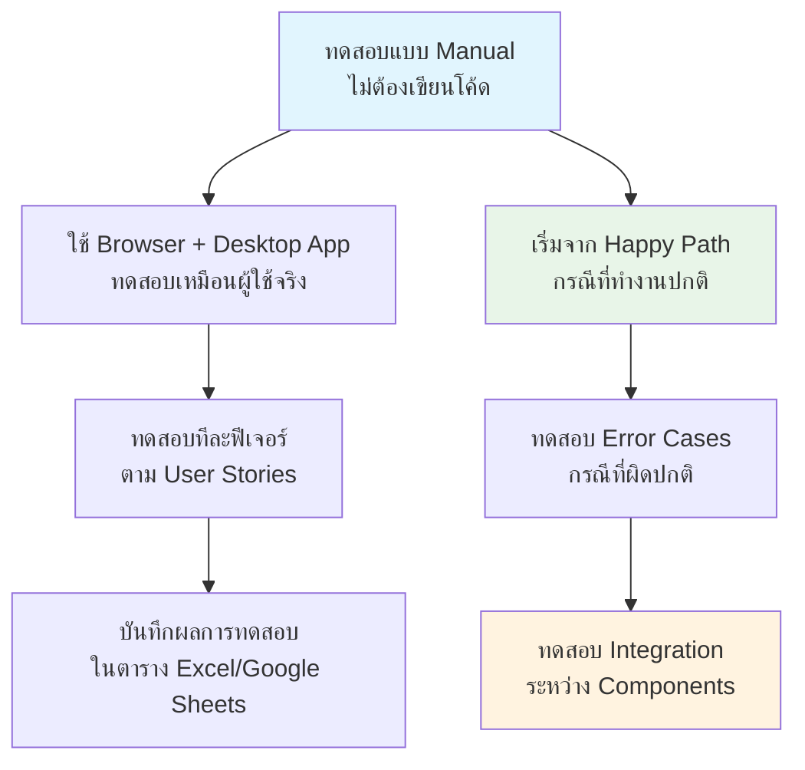

# 6.4 Simple Testing Strategy - Agent Wallboard System

## 🎯 Overview

เอกสารนี้จะแนะนำ**วิธีการทดสอบแบบง่าย ๆ** ที่นักศึกษาสามารถทำได้เองสำหรับระบบ Agent Wallboard System โดยไม่ต้องมีความรู้เชิงลึกเรื่อง Software Testing แต่ยังครอบคลุมการทดสอบที่จำเป็นทั้ง Backend และ Frontend

### 🎓 เป้าหมายการเรียนรู้
เมื่อจบการอ่านเอกสารนี้ นักศึกษาจะสามารถ:
- เข้าใจหลักการทดสอบพื้นฐานที่ไม่ซับซ้อน
- ทำการทดสอบระบบได้ด้วยตนเองอย่างเป็นระบบ
- สร้าง Test Cases เบื้องต้นจาก Use Cases และ User Stories
- ใช้ Traceability Matrix เพื่อเชื่อมโยง Requirements กับการทดสอบ

---

## 🧪 **Testing Strategy Overview**

### **🎯 หลักการทดสอบแบบง่าย**



### **📋 ระดับการทดสอบแบบง่าย**

| ระดับการทดสอบ | คำอธิบาย | เครื่องมือ | เวลาที่ใช้ |
|-------------|---------|----------|----------|
| **Component Testing** | ทดสอบฟีเจอร์ย่อย ๆ ทีละตัว | Manual Testing | 30 นาที/ฟีเจอร์ |
| **Integration Testing** | ทดสอบการทำงานร่วมกัน | Browser + Desktop | 1 ชั่วโมง |
| **System Testing** | ทดสอบระบบทั้งหมด | End-to-End Manual | 2 ชั่วโมง |
| **User Acceptance** | ทดสอบตาม User Stories | Checklist + Demo | 1 ชั่วโมง |

---

## 📊 **Requirements to Testing Traceability Matrix**

### **🗂️ SRS Use Cases Mapping**

จากเอกสาร SRS และ Use Cases ที่เรามี นำมาสร้างเป็น Test Cases แบบง่าย:

| Use Case ID | Use Case Name | User Story | Test Cases ที่ต้องทำ | Priority |
|-------------|---------------|------------|---------------------|----------|
| **UC-001** | Agent Login | "As an Agent, I want to login with my agent code" | TC-001: Valid Login<br/>TC-002: Invalid Login<br/>TC-003: Empty Fields | High |
| **UC-002** | Supervisor Login | "As a Supervisor, I want to login to monitor my team" | TC-004: Valid Supervisor Login<br/>TC-005: Wrong Supervisor Code | High |
| **UC-003** | Change Agent Status | "As an Agent, I want to change my status" | TC-006: Status Available<br/>TC-007: Status Busy<br/>TC-008: Status Break<br/>TC-009: Status Offline | High |
| **UC-004** | View Team Status | "As a Supervisor, I want to see all agents' status" | TC-010: Real-time Status Updates<br/>TC-011: Agent Online/Offline Detection | High |
| **UC-005** | Send Direct Message | "As a Supervisor, I want to send message to specific agent" | TC-012: Send Message<br/>TC-013: Agent Receives Notification | Medium |
| **UC-006** | Send Broadcast Message | "As a Supervisor, I want to broadcast to all team" | TC-014: Broadcast Message<br/>TC-015: All Agents Receive | Medium |
| **UC-007** | View Message History | "As an Agent, I want to see my messages" | TC-016: View Received Messages<br/>TC-017: Message History | Low |
| **UC-008** | Desktop Notifications | "As an Agent, I want desktop notifications for new messages" | TC-018: Notification Popup<br/>TC-019: Notification Sound | Low |

---

## 🧪 **Manual Testing Approach**

### **📋 Simple Test Case Template**

ใช้รูปแบบง่าย ๆ ที่นักศึกษาเข้าใจได้:

```
Test Case ID: TC-001
Title: Agent Login - Valid Credentials
User Story: As an Agent, I want to login with my agent code

Pre-conditions:
- Backend server running (localhost:3001)
- Agent Desktop app opened

Test Steps:
1. เปิด Agent Desktop App
2. ใส่ Agent Code "AG001" 
3. คลิก "Sign In"

Expected Results:
- เข้าสู่ระบบสำเร็จ
- แสดงหน้า Agent Dashboard
- แสดงชื่อ Agent: "John Smith"
- Status เริ่มต้น: "Available"

Actual Results: 
[นักศึกษาเติมขณะทดสอบ]

Status: [Pass/Fail]
Notes: [บันทึกข้อสังเกต]
```

---

## 🎯 **Week 1 Testing Plan**

### **📅 Day 1-2: Component Testing**

**🔐 Authentication Testing**
```bash
Test Group: Login Functionality
┌─────────────────────────────────────────┐
│ TC-001: Agent Valid Login               │
│ TC-002: Agent Invalid Login             │
│ TC-003: Supervisor Valid Login          │
│ TC-004: Supervisor Invalid Login        │
│ TC-005: Empty Field Validation          │
└─────────────────────────────────────────┘
```

**Manual Testing Steps:**
1. **Agent Desktop Testing**
   - ทดสอบ login กับ AG001, AG002, AG003 (ควรสำเร็จ)
   - ทดสอบกับ AG999 (ควรล้มเหลว)
   - ทดสอบใส่ช่องว่าง (ควรแสดง error)

2. **Supervisor Dashboard Testing**
   - ทดสอบ login กับ SP001, SP002, SP003 (ควรสำเร็จ)
   - ทดสอบกับ SP999 (ควรล้มเหลว)
   - ตรวจสอบว่าแสดงข้อมูลทีมถูกต้อง

### **📅 Day 3-4: Status Management Testing**

**📊 Status Change Testing**
```bash
Test Group: Agent Status Management
┌─────────────────────────────────────────┐
│ TC-006: Change to Available             │
│ TC-007: Change to Busy                  │
│ TC-008: Change to Break                 │
│ TC-009: Change to Offline               │
│ TC-010: Status Sync to Dashboard        │
└─────────────────────────────────────────┘
```

**Manual Testing Scenario:**
1. เปิด Agent Desktop (AG001) + Supervisor Dashboard (SP001)
2. เปลี่ยน status ใน Agent Desktop
3. สังเกตการอัพเดทใน Supervisor Dashboard
4. ทดสอบทั้ง 4 status: Available → Busy → Break → Offline
5. บันทึกเวลาที่ใช้ในการอัพเดท (ควรไม่เกิน 5 วินาที)

---

## 🎯 **Week 2 Testing Plan**

### **📅 Day 1-2: Message System Testing**

**💬 Message Communication Testing**
```bash
Test Group: Message System
┌─────────────────────────────────────────┐
│ TC-012: Send Direct Message             │
│ TC-013: Agent Receives Notification     │
│ TC-014: Send Broadcast Message          │
│ TC-015: All Agents Receive Broadcast    │
│ TC-016: Message History Display         │
└─────────────────────────────────────────┘
```

**Multi-User Testing Scenario:**
1. **Setup:** เปิด 1 Supervisor Dashboard + 2 Agent Desktop Apps
2. **Direct Message Test:**
   - Supervisor ส่งข้อความไป AG001
   - ตรวจสอบ AG001 ได้รับข้อความ
   - ตรวจสอบ AG002 ไม่ได้รับข้อความ
3. **Broadcast Test:**
   - Supervisor ส่ง broadcast message
   - ตรวจสอบทั้ง AG001 และ AG002 ได้รับ

### **📅 Day 3-4: Integration Testing**

**🔗 End-to-End Integration Testing**
```bash
Test Scenario: Complete Workflow
┌─────────────────────────────────────────┐
│ 1. Multiple Login (Supervisor + Agents) │
│ 2. Real-time Status Updates             │
│ 3. Message Communication                │
│ 4. Desktop Notifications                │
│ 5. Connection Handling                  │
└─────────────────────────────────────────┘
```

---

## 📊 **Simple Testing Tools & Techniques**

### **🛠️ Testing Tools (ไม่ต้องติดตั้งเพิ่ม)**

**1. Browser Developer Tools**
```bash
การใช้งาน:
1. เปิด Supervisor Dashboard
2. กด F12 → Console tab
3. ดู error messages ที่เกิดขึ้น
4. Network tab → ดูการเรียก API
```

**2. Backend API Testing ด้วย curl**
```bash
# Test login API
curl -X POST http://localhost:3001/api/auth/login \
  -H "Content-Type: application/json" \
  -d '{"agentCode": "AG001"}'

# Test health endpoint
curl http://localhost:3001/health
```

**3. Database Verification**
```bash
# ตรวจสอบ SQLite data
sqlite3 database/sqlite/wallboard.db
> SELECT * FROM agents WHERE agent_code = 'AG001';

# ตรวจสอบ MongoDB data
mongosh wallboard
> db.messages.find().sort({timestamp: -1}).limit(5)
```

### **📋 Testing Checklist Template**

```
=== Agent Wallboard Testing Checklist ===

Environment Setup:
□ Backend server running (port 3001)
□ MongoDB service running
□ SQLite database accessible
□ Agent Desktop apps can launch
□ Supervisor Dashboard loads

Authentication Testing:
□ Valid agent login works
□ Invalid agent login shows error
□ Valid supervisor login works
□ Invalid supervisor login shows error
□ Login validation works properly

Status Management:
□ Agent can change to Available
□ Agent can change to Busy
□ Agent can change to Break
□ Agent can change to Offline
□ Status updates appear in supervisor dashboard
□ Status changes are saved to database

Message System:
□ Supervisor can send direct message
□ Agent receives direct message
□ Agent shows desktop notification
□ Supervisor can send broadcast message
□ All agents receive broadcast message
□ Message history is saved

Real-time Features:
□ Status updates are real-time (< 5 seconds)
□ Agent connect/disconnect detected
□ Multiple agents work simultaneously
□ WebSocket connection stable

Error Handling:
□ Invalid input shows appropriate error
□ Network connection loss handled gracefully
□ Server restart doesn't break application
□ UI remains responsive during operations
```

---

## 🐛 **Common Issues และ Debugging**

### **❌ Typical Problems Students Face**

**1. Connection Issues**
```bash
Problem: "Agent Desktop ไม่เชื่อมต่อ Backend"
Debug Steps:
1. ตรวจสอบ Backend running: curl http://localhost:3001/health
2. ตรวจสอบ .env file ใน Agent Desktop
3. ดู console errors ใน Agent Desktop (Ctrl+Shift+I)
4. ตรวจสอบ CORS settings ใน Backend
```

**2. Real-time Updates ไม่ทำงาน**
```bash
Problem: "Status เปลี่ยนแต่ Dashboard ไม่อัพเดท"
Debug Steps:
1. ตรวจสอบ WebSocket connection ใน browser Console
2. ดู Network tab ใน Developer Tools
3. ตรวจสอบ Socket.io events ใน Backend logs
4. ลองปิด-เปิด applications ใหม่
```

**3. Database Issues**
```bash
Problem: "Login ทำงานแต่ข้อมูลไม่บันทึก"
Debug Steps:
1. ตรวจสอบ SQLite database: sqlite3 database/sqlite/wallboard.db
2. ตรวจสอบ MongoDB: mongosh wallboard
3. ดู Backend logs สำหรับ database errors
4. ตรวจสอบ file permissions ของ database files
```

---

## 📈 **Testing Progress Tracking**

### **📊 Simple Progress Dashboard**

ใช้ Google Sheets หรือ Excel สร้างตารางติดตามผล:

| Test Date | Tester Name | Test Case ID | Status | Issues Found | Notes |
|-----------|-------------|--------------|---------|--------------|-------|
| 2024-03-15 | Student A | TC-001 | Pass | None | Login works perfectly |
| 2024-03-15 | Student A | TC-002 | Fail | Error message unclear | Need better validation message |
| 2024-03-15 | Student B | TC-006 | Pass | None | Status change is fast |
| 2024-03-16 | Student B | TC-012 | Pass | Minor UI issue | Message appears correctly |

### **🎯 Testing Metrics (เรียบง่าย)**

```bash
📊 Basic Testing Metrics:
┌─────────────────────────────────────────┐
│ Total Test Cases: 18                    │
│ Passed: 15                              │
│ Failed: 2                               │
│ Not Tested: 1                           │
│ Pass Rate: 83%                          │
│                                         │
│ Critical Issues: 0                      │
│ Minor Issues: 3                         │
│ Suggestions: 5                          │
└─────────────────────────────────────────┘
```

---

## 🎓 **Testing Best Practices for Students**

### **✅ Do's - สิ่งที่ควรทำ**

1. **ทดสอบเป็นระบบ** - ตาม Test Cases ไม่ทดสอบแบบสุ่ม
2. **บันทึกผลทุกครั้ง** - เก็บ evidence ไว้ใน spreadsheet
3. **ทดสอบ Happy Path ก่อน** - แล้วค่อยทดสอบ error cases
4. **ใช้ข้อมูลจริง** - ทดสอบกับ sample data ที่มีให้
5. **ทดสอบบน browser/OS ต่าง ๆ** - Chrome, Firefox, Windows, Mac

### **❌ Don'ts - สิ่งที่ไม่ควรทำ**

1. **ไม่ทดสอบแบบสุ่ม** - ต้องมี plan และ checklist
2. **ไม่ทดสอบเฉพาะ Happy Path** - ต้องทดสอบ error cases ด้วย
3. **ไม่ ignore Error Messages** - ทุก error ต้องมีความหมาย
4. **ไม่ทดสอบคนเดียว** - ควรให้เพื่อนช่วยทดสอบด้วย
5. **ไม่ลืมทดสอบ Edge Cases** - เช่น ข้อมูลว่าง, ข้อมูลผิดรูปแบบ

---

## 📋 **Test Case Examples (Ready to Use)**

### **🔐 Authentication Test Cases**

**Test Case TC-001: Agent Valid Login**
```
Objective: ทดสอบ Agent login ด้วย credentials ที่ถูกต้อง
Prerequisites: Backend server running, Agent Desktop app available

Steps:
1. เปิด Agent Desktop Application
2. ใส่ Agent Code: "AG001"
3. คลิกปุ่ม "Sign In"

Expected Results:
- แสดงหน้า Agent Dashboard
- แสดงชื่อ "John Smith"
- แสดง Status "Available"
- ไม่มี error messages

Pass Criteria: ทุก Expected Results เกิดขึ้นถูกต้อง
```

**Test Case TC-002: Agent Invalid Login**
```
Objective: ทดสอบ Agent login ด้วย credentials ที่ผิด
Prerequisites: Backend server running, Agent Desktop app available

Steps:
1. เปิด Agent Desktop Application
2. ใส่ Agent Code: "AG999" (ไม่มีในระบบ)
3. คลิกปุ่ม "Sign In"

Expected Results:
- ไม่เข้าสู่ระบบ
- แสดง error message "Invalid agent code"
- ยังคงอยู่ในหน้า login form
- ช่อง input ถูก clear

Pass Criteria: แสดง error message ถูกต้องและไม่เข้าระบบ
```

### **📊 Status Management Test Cases**

**Test Case TC-006: Change Status to Available**
```
Objective: ทดสอบการเปลี่ยน Agent status เป็น Available
Prerequisites: Agent logged in successfully

Steps:
1. ใน Agent Dashboard คลิกปุ่ม "Available"
2. สังเกตการเปลี่ยนแปลงของ UI
3. เปิด Supervisor Dashboard ในอีก browser
4. ตรวจสอบ status ใน supervisor dashboard

Expected Results:
- Agent status button แสดงสี green
- Status text แสดง "Available"
- Supervisor dashboard แสดง agent เป็น "Available"
- การอัพเดทเกิดขึ้นภายใน 5 วินาที

Pass Criteria: Status ถูกอัพเดทใน Agent และ Supervisor ถูกต้อง
```

### **💬 Message System Test Cases**

**Test Case TC-012: Send Direct Message**
```
Objective: ทดสอบการส่งข้อความจาก Supervisor ไป Agent
Prerequisites: Supervisor logged in, Agent online

Steps:
1. ใน Supervisor Dashboard คลิก "Message" บน Agent card
2. ใส่ข้อความ "Please check your queue"
3. คลิก "Send"
4. ตรวจสอบ Agent Desktop Application

Expected Results:
- Supervisor: แสดงข้อความ "Message sent successfully"
- Agent: แสดง desktop notification
- Agent: ข้อความปรากฏใน message panel
- Message มี timestamp ถูกต้อง

Pass Criteria: Agent ได้รับข้อความครบถ้วนและทันเวลา
```

---

## 🎯 **Final Testing Report Template**

### **📋 Simple Testing Summary**

```
=== Agent Wallboard System Testing Report ===

Testing Period: [Start Date] - [End Date]
Tested By: [Student Names]
System Version: [Version Number]

=== SUMMARY ===
Total Test Cases Executed: __/18
Passed: __
Failed: __
Pass Rate: __%

=== CRITICAL FINDINGS ===
1. [List critical issues that must be fixed]
2. 
3. 

=== MINOR ISSUES ===
1. [List minor issues or improvements]
2. 
3. 

=== RECOMMENDATIONS ===
1. [Suggestions for improvement]
2. 
3. 

=== SYSTEM READINESS ===
□ Authentication system works correctly
□ Real-time features function properly  
□ Message system delivers reliably
□ Desktop notifications work
□ System handles errors gracefully
□ Performance is acceptable

Overall Assessment: [Ready for Demo / Needs Minor Fixes / Major Issues Found]

Tested Features Coverage:
□ Agent Login & Authentication
□ Supervisor Login & Dashboard
□ Status Management (4 statuses)
□ Real-time Status Updates
□ Direct Messaging
□ Broadcast Messaging  
□ Desktop Notifications
□ Error Handling

=== EVIDENCE ===
Attached:
- Screenshots of successful tests
- Error message screenshots  
- Performance timing records
- Test execution videos (optional)
```

---

## ✅ **Summary**

**🎉 Simple Testing Strategy ที่ครบถ้วน:**

### **📊 What Students Will Learn:**
- **Manual Testing Fundamentals** - ทดสอบด้วยมือแบบเป็นระบบ
- **Requirements Traceability** - เชื่อมโยง Use Cases กับ Test Cases
- **Test Case Writing** - เขียน test cases ที่เข้าใจง่าย
- **Debugging Basics** - แก้ปัญหาเบื้องต้นที่เจอบ่อย
- **Documentation Skills** - บันทึกผลการทดสอบอย่างมืออาชีพ

### **🛠️ Practical & Doable:**
- ✅ **ไม่ต้องเขียนโค้ดทดสอบ** - ใช้ manual testing
- ✅ **ใช้เครื่องมือที่มีอยู่** - Browser, curl, database clients
- ✅ **ทดสอบแบบเป็นระบบ** - มี checklist และ template
- ✅ **เหมาะกับเวลา 2 สัปดาห์** - แบ่งงานชัดเจนตาม timeline

### **🔗 Connected to Requirements:**
- **SRS Use Cases** → **Test Cases** mapping ชัดเจน
- **User Stories** → **Test Scenarios** ที่ทำได้จริง
- **Functional Requirements** → **Verification Steps** ที่เข้าใจง่าย

**💡 Next Steps:**
1. ใช้ Testing Strategy นี้ในการทดสอบ Agent Wallboard System
2. ปรับแต่ง Test Cases ตามฟีเจอร์ที่พัฒนาเพิ่มเติม
3. สร้าง Testing Culture ในทีมพัฒนา

**Happy Testing! 🧪✨**