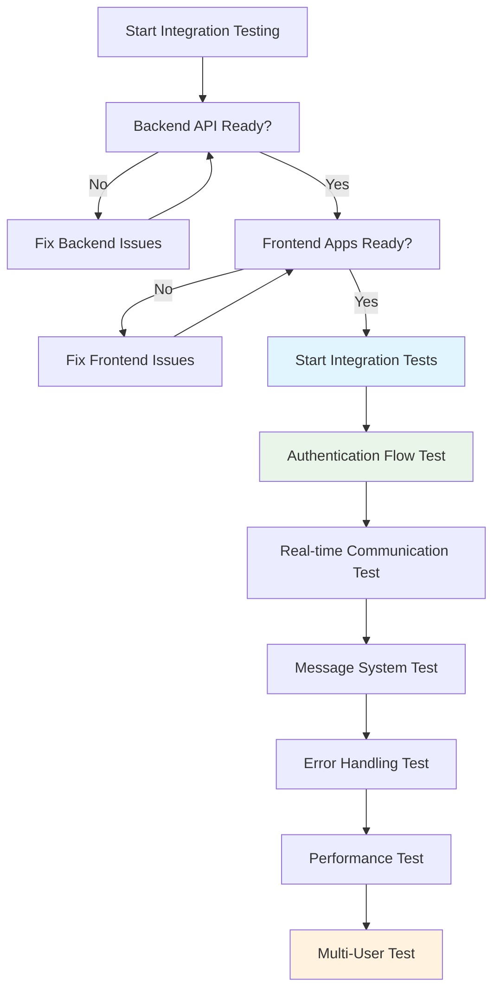

# 6.4.1 Detailed API Testing & Integration Guide

## 🎯 Overview

เอกสารนี้จะให้รายละเอียดเชิงลึกสำหรับการทดสอบ **Backend API** และการทดสอบ **Integration** ระหว่าง Frontend Applications (Supervisor Dashboard + Agent Desktop) กับ Backend Server โดยเน้นการเป็น **Practical Guide** สำหรับนักศึกษาที่จะทำหน้าที่ **Tester**

### 🎓 เป้าหมายการเรียนรู้
เมื่อจบการอ่านเอกสารนี้ นักศึกษาจะสามารถ:
- ทดสอบ Backend API endpoints อย่างเป็นระบบ
- ใช้เครื่องมือทดสอบ API แบบมืออาชีพ  
- สร้าง Integration Test Scenarios ที่ครอบคลุม
- ระบุและแก้ไขปัญหาการเชื่อมต่อระหว่าง Frontend-Backend

---

## 🏗️ **Backend API Testing Foundation**

### **📋 API Endpoints Overview จาก Backend**

จากเอกสาร 6.6.2 Backend Server Code Guide เรามี API endpoints ดังนี้:

| Category | Endpoint | Method | Authentication | Purpose |
|----------|----------|---------|----------------|---------|
| **Health Check** | `/health` | GET | ❌ No | ตรวจสอบสถานะ server |
| **Authentication** | `/api/auth/login` | POST | ❌ No | Login agent/supervisor |
| **Authentication** | `/api/auth/logout` | POST | ✅ Yes | Logout current user |
| **Agent Management** | `/api/agents/:id/status` | PUT | ✅ Yes | Update agent status |
| **Agent Management** | `/api/agents/team/:teamId` | GET | ✅ Yes | Get team members |
| **Agent Management** | `/api/agents/:id/history` | GET | ✅ Yes | Get agent history |
| **Message System** | `/api/messages/send` | POST | ✅ Yes | Send message |
| **Message System** | `/api/messages/inbox/:userId` | GET | ✅ Yes | Get user messages |
| **Message System** | `/api/messages/:id/read` | PUT | ✅ Yes | Mark message as read |

### **🔧 API Testing Tools Setup**

**1. Postman Collection Setup**
```json
{
  "info": {
    "name": "Agent Wallboard API Tests",
    "description": "Complete API testing collection for Agent Wallboard System"
  },
  "variable": [
    {
      "key": "baseUrl",
      "value": "http://localhost:3001"
    },
    {
      "key": "authToken",
      "value": ""
    }
  ],
  "auth": {
    "type": "bearer",
    "bearer": [
      {
        "key": "token",
        "value": "{{authToken}}"
      }
    ]
  }
}
```

**2. Alternative: curl Command Templates**
```bash
# Base URL
BASE_URL="http://localhost:3001"

# Health Check Template
curl -X GET "${BASE_URL}/health"

# Login Template  
curl -X POST "${BASE_URL}/api/auth/login" \
  -H "Content-Type: application/json" \
  -d '{"agentCode": "AG001"}'

# Authenticated Request Template
curl -X GET "${BASE_URL}/api/agents/team/1" \
  -H "Authorization: Bearer YOUR_TOKEN_HERE"
```

---

## 🧪 **API Testing Methodology**

### **📋 Phase 1: Individual API Endpoint Testing**

**🔗 Test Case Template สำหรับ API**
```
API Test Case ID: API-001
Endpoint: POST /api/auth/login
Purpose: Agent authentication with valid credentials

Test Data:
- Agent Code: "AG001" (valid)
- Expected Agent: John Smith, Team 1

Request:
POST http://localhost:3001/api/auth/login
Content-Type: application/json
{
  "agentCode": "AG001"
}

Expected Response:
Status: 200 OK
Body: {
  "success": true,
  "data": {
    "agent": {
      "agentCode": "AG001",
      "agentName": "John Smith",
      "teamId": 1,
      "role": "agent"
    },
    "token": "eyJhbGciOiJIUzI1NiIsInR5cCI6IkpXVCJ9..."
  }
}

Validation Checklist:
□ Status code is 200
□ Response contains "success": true
□ Agent data matches expected values
□ JWT token is present and valid format
□ Response time < 500ms

Negative Test Cases:
- Invalid agent code: "AG999"
- Empty agent code: ""
- Missing agentCode field
- Wrong HTTP method (GET instead of POST)
```

### **🔐 Authentication Flow Testing**

**Authentication Test Sequence:**
```bash
# Step 1: Health Check (No Auth Required)
Test-001: GET /health
Expected: {"status": "OK", "timestamp": "..."}

# Step 2: Valid Agent Login
Test-002: POST /api/auth/login 
Body: {"agentCode": "AG001"}
Expected: Success + JWT token
Save: token to environment variable

# Step 3: Valid Supervisor Login  
Test-003: POST /api/auth/login
Body: {"supervisorCode": "SP001", "type": "supervisor"}
Expected: Success + JWT token + team data

# Step 4: Test Protected Endpoint
Test-004: GET /api/agents/team/1
Header: Authorization: Bearer {token}
Expected: List of team members

# Step 5: Test Invalid Token
Test-005: GET /api/agents/team/1  
Header: Authorization: Bearer invalid_token
Expected: 401 Unauthorized

# Step 6: Test Expired Token (if applicable)
Test-006: Use old/expired token
Expected: 401 Token Expired
```

### **📊 Status Management API Testing**

**Status Update Test Matrix:**
```bash
Test Scenario: Agent Status Updates
Prerequisites: Agent AG001 logged in successfully

# Test All Valid Status Transitions
Status-001: Available → Busy
PUT /api/agents/AG001/status
Body: {"status": "Busy"}
Expected: 200 OK, status updated

Status-002: Busy → Break  
PUT /api/agents/AG001/status
Body: {"status": "Break"}
Expected: 200 OK, status updated

Status-003: Break → Available
PUT /api/agents/AG001/status  
Body: {"status": "Available"}
Expected: 200 OK, status updated

Status-004: Available → Offline
PUT /api/agents/AG001/status
Body: {"status": "Offline"}  
Expected: 200 OK, status updated

# Test Invalid Status Values
Status-005: Invalid Status
PUT /api/agents/AG001/status
Body: {"status": "InvalidStatus"}
Expected: 400 Bad Request, error message

Status-006: Missing Status Field
PUT /api/agents/AG001/status
Body: {}
Expected: 400 Bad Request, validation error

Status-007: Wrong Agent ID
PUT /api/agents/AG999/status  
Body: {"status": "Available"}
Expected: 404 Not Found
```

### **💬 Message System API Testing**

**Message API Test Scenarios:**
```bash
# Direct Message Testing
Message-001: Supervisor sends direct message
POST /api/messages/send
Body: {
  "fromCode": "SP001",
  "toCode": "AG001", 
  "content": "Please check your queue",
  "type": "direct"
}
Expected: 200 OK, message sent confirmation

Message-002: Broadcast message
POST /api/messages/send  
Body: {
  "fromCode": "SP001",
  "toTeamId": 1,
  "content": "Team meeting in 15 minutes", 
  "type": "broadcast"
}
Expected: 200 OK, broadcast confirmation

Message-003: Get agent inbox
GET /api/messages/inbox/AG001
Expected: 200 OK, list of messages for AG001

Message-004: Mark message as read
PUT /api/messages/{messageId}/read
Expected: 200 OK, message marked as read

# Negative Test Cases
Message-005: Send to non-existent agent
POST /api/messages/send
Body: {
  "fromCode": "SP001", 
  "toCode": "AG999",
  "content": "Test message"
}
Expected: 404 Not Found or appropriate error

Message-006: Empty message content
POST /api/messages/send
Body: {
  "fromCode": "SP001",
  "toCode": "AG001",
  "content": ""
}
Expected: 400 Bad Request, validation error
```

---

## 🔗 **Frontend-Backend Integration Testing**

### **🎯 Integration Test Strategy**



### **📋 Phase 2: End-to-End Integration Test Scenarios**

**🔐 Scenario 1: Complete Authentication Flow**
```bash
Integration Test: AUTH-FLOW-001
Title: Complete Authentication and Initial Data Load

Steps:
1. Start Backend Server
   - Verify: http://localhost:3001/health returns OK
   
2. Open Supervisor Dashboard
   - Navigate to: http://localhost:3000
   - Verify: Login form appears
   
3. Supervisor Login Test
   - Enter: SP001 in supervisor code field
   - Click: Sign In button
   - Verify: Dashboard loads with team data
   - Verify: Network tab shows API calls:
     * POST /api/auth/login (success)
     * GET /api/agents/team/1 (success)
     * WebSocket connection established
   
4. Agent Desktop Login Test  
   - Open: Agent Desktop app
   - Enter: AG001 in agent code field
   - Click: Sign In button
   - Verify: Agent dashboard appears
   - Verify: Agent appears in Supervisor Dashboard
   - Verify: Status shows "Available"

Expected Results:
- Both apps successfully authenticated
- Real-time connection established
- Agent visible in supervisor dashboard
- No console errors in either app

Pass Criteria: All verification points successful
```

**📊 Scenario 2: Real-time Status Updates**
```bash
Integration Test: STATUS-SYNC-001  
Title: Real-time Status Synchronization

Prerequisites: 
- Supervisor (SP001) logged in
- Agent (AG001) logged in and visible in dashboard

Steps:
1. Baseline Check
   - Verify: Agent shows "Available" in both apps
   
2. Status Change Test
   - In Agent Desktop: Click "Busy" button
   - Start Timer: Record time of click
   - In Supervisor Dashboard: Watch for status change
   - Stop Timer: When status updates to "Busy"
   
3. Multiple Status Changes
   - Agent: Available → Busy (observe update)
   - Agent: Busy → Break (observe update)  
   - Agent: Break → Offline (observe update)
   - Agent: Offline → Available (observe update)
   
4. Database Verification
   - Check MongoDB: agent_status collection
   - Verify: Latest status entries saved correctly
   - Query: db.agent_status.find({agentCode: "AG001"}).sort({timestamp: -1}).limit(5)

Expected Results:
- All status changes appear in supervisor dashboard
- Update time < 5 seconds per change
- Database entries match UI changes
- WebSocket events logged in browser console

Performance Criteria:
- Status update latency: < 3 seconds
- No WebSocket disconnections
- No duplicate status entries
```

**💬 Scenario 3: Message Communication Flow**
```bash
Integration Test: MESSAGE-FLOW-001
Title: Complete Message Communication

Prerequisites:
- Supervisor (SP001) logged in 
- Agents (AG001, AG002) logged in and online

Test Sequence:

1. Direct Message Test
   - Supervisor: Click message button on AG001 card
   - Enter: "Please check your queue status"
   - Click: Send
   - Verify: AG001 receives desktop notification
   - Verify: Message appears in AG001 message panel
   - Time: Record message delivery time
   
2. Broadcast Message Test  
   - Supervisor: Click broadcast message button
   - Enter: "Team meeting in 15 minutes"
   - Select: All team members
   - Click: Send
   - Verify: Both AG001 and AG002 receive notification
   - Verify: Message appears in both agent message panels
   
3. Message History Test
   - Agent: Check message history panel
   - Verify: Previous messages visible
   - Verify: Timestamps correct
   - Verify: Sender identification correct
   
4. Database Verification
   - MongoDB query: db.messages.find().sort({timestamp: -1}).limit(10)
   - Verify: All sent messages saved
   - Verify: Recipient lists accurate for broadcasts

Expected Results:
- Direct messages delivered to correct recipient only
- Broadcast messages delivered to all team members  
- Desktop notifications triggered
- Message history maintained
- Database consistency verified

Pass Criteria:
- Message delivery: < 5 seconds
- No message loss
- Correct recipient targeting
- Notification sounds work (if implemented)
```

### **🧪 Advanced Integration Test Scenarios**

**🌐 Scenario 4: Multi-User Stress Test**
```bash
Integration Test: MULTI-USER-001
Title: Multiple Users Concurrent Operations

Setup:
- 1 Supervisor Dashboard (SP001)
- 3 Agent Desktop Apps (AG001, AG002, AG003)
- All logged in simultaneously

Test Matrix:
┌─────────────────────────────────────────────┐
│ Time | AG001 Action | AG002 Action | AG003 Action │
├─────────────────────────────────────────────┤
│ 0:00 | → Busy       | → Break      | → Available  │
│ 0:30 | → Available  | → Busy       | → Break      │
│ 1:00 | → Break      | → Available  | → Busy       │
│ 1:30 | → Offline    | → Offline    | → Available  │
│ 2:00 | → Available  | → Available  | → Busy       │
└─────────────────────────────────────────────┘

Supervisor Actions:
- Send direct messages to each agent every 45 seconds
- Send broadcast message at 1:15
- Monitor all status changes in real-time

Monitoring Points:
- WebSocket connection stability
- Message delivery accuracy  
- Status update consistency
- Performance degradation
- Memory usage (browser dev tools)

Pass Criteria:
- All status updates reflected accurately
- No message delivery failures
- WebSocket connections remain stable
- UI remains responsive
- No significant performance degradation
```

**🚨 Scenario 5: Error Handling & Recovery**
```bash
Integration Test: ERROR-RECOVERY-001
Title: System Error Handling and Recovery

Error Simulation Tests:

1. Network Interruption Test
   - Disconnect backend server (Ctrl+C)
   - Observe: Frontend error handling
   - Restart: Backend server
   - Verify: Automatic reconnection
   - Test: All functionality works after reconnection
   
2. Database Connection Error
   - Stop MongoDB service
   - Attempt: Status change operations
   - Observe: Error messages displayed
   - Restart: MongoDB service
   - Verify: System recovery
   
3. Invalid Token Test
   - Manually expire/corrupt JWT token
   - Attempt: Protected API operations  
   - Verify: Proper authentication error handling
   - Test: Re-login process
   
4. WebSocket Disconnection
   - Simulate network instability
   - Monitor: WebSocket reconnection attempts
   - Verify: Real-time features resume after reconnection
   
5. Browser Refresh Test
   - Agent: Refresh browser/restart app during message sending
   - Supervisor: Refresh during status monitoring
   - Verify: Session persistence (if implemented)
   - Verify: Graceful state recovery

Expected Error Behaviors:
- Clear error messages displayed to users
- No application crashes
- Automatic retry mechanisms work
- Graceful degradation of features
- Quick recovery when services restored

Recovery Criteria:
- Reconnection time: < 10 seconds
- No data loss during outages
- User sessions maintained where possible
- All functionality restored post-recovery
```

---

## 📊 **Integration Testing Tools & Techniques**

### **🛠️ Browser Developer Tools for Integration Testing**

**1. Network Tab Monitoring**
```bash
Integration Testing with Browser DevTools:

1. Open Supervisor Dashboard
2. Press F12 → Network tab
3. Filter by XHR/Fetch requests
4. Monitor API calls during testing:

Expected API Call Patterns:
┌─────────────────────────────────────────────┐
│ Login → auth/login (POST)                   │
│ Load Team → agents/team/1 (GET)             │
│ WebSocket → socket.io/ (WebSocket)          │
│ Send Message → messages/send (POST)         │
│ Status Update → agents/AG001/status (PUT)   │
└─────────────────────────────────────────────┘

Red Flags to Watch:
❌ 401/403 errors (authentication issues)
❌ 500 errors (server problems)  
❌ Failed WebSocket connections
❌ Excessive request duplication
❌ Slow response times (>2 seconds)
```

**2. Console Monitoring**
```javascript
// Console monitoring commands for testing
// Paste in browser console during testing

// Monitor WebSocket events
window.socket?.on('connect', () => console.log('✅ WebSocket Connected'));
window.socket?.on('disconnect', () => console.log('❌ WebSocket Disconnected'));
window.socket?.on('agent_status_update', (data) => console.log('📊 Status Update:', data));
window.socket?.on('new_message', (data) => console.log('💬 New Message:', data));

// Monitor API response times
const originalFetch = window.fetch;
window.fetch = function(...args) {
  const start = performance.now();
  return originalFetch(...args).then(response => {
    const end = performance.now();
    console.log(`🌐 API Call: ${args[0]} - ${Math.round(end - start)}ms`);
    return response;
  });
};

// Monitor React state changes (if using React DevTools)
// Check for unnecessary re-renders or state issues
```

### **📋 Integration Test Execution Checklist**

**Pre-Test Setup Checklist:**
```bash
Environment Verification:
□ Backend server running on port 3001
□ MongoDB service running and accessible
□ SQLite database file exists and readable
□ Supervisor Dashboard accessible at localhost:3000
□ Agent Desktop app(s) can launch successfully
□ All sample data loaded correctly

Testing Tools Ready:
□ Browser Developer Tools open
□ Postman collection imported (optional)
□ Test data spreadsheet prepared
□ Screenshots/recording tools ready (optional)
□ Timer for performance measurements

Test Data Prepared:
□ Valid credentials: SP001, SP002, SP003
□ Valid agent codes: AG001-AG010
□ Test message content prepared
□ Expected response data documented
```

**During-Test Monitoring Checklist:**
```bash
Every 5 Minutes Check:
□ All applications still responsive
□ No error messages in console
□ WebSocket connections still active
□ Memory usage not excessive
□ Network requests completing successfully

After Each Test Scenario:
□ Document results in test report
□ Screenshot any errors encountered
□ Note performance timing measurements
□ Verify database state if relevant
□ Clean up test data if necessary
```

---

## 📈 **Integration Test Reporting**

### **📊 Integration Test Report Template**

```bash
=== Integration Test Report ===
Test Session: [Date] [Start Time] - [End Time]
Tester: [Name]
Environment: [Local/Staging/Production]
Backend Version: [Git commit/version]
Frontend Version: [Git commit/version]

=== TEST EXECUTION SUMMARY ===
Total Integration Scenarios: 5
Passed: ___
Failed: ___  
Blocked: ___
Pass Rate: ___%

=== SCENARIO RESULTS ===

Scenario 1: Authentication Flow
Status: [PASS/FAIL/BLOCKED]
Execution Time: ___ minutes
Issues Found: [List any issues]
Performance Notes: [Response times, etc.]

Scenario 2: Real-time Status Updates  
Status: [PASS/FAIL/BLOCKED]
Execution Time: ___ minutes
Average Update Latency: ___ seconds
Issues Found: [List any issues]

Scenario 3: Message Communication
Status: [PASS/FAIL/BLOCKED] 
Execution Time: ___ minutes
Message Delivery Time: ___ seconds
Issues Found: [List any issues]

Scenario 4: Multi-User Stress Test
Status: [PASS/FAIL/BLOCKED]
Concurrent Users Tested: ___
System Performance: [Stable/Degraded/Failed]
Issues Found: [List any issues]

Scenario 5: Error Handling & Recovery
Status: [PASS/FAIL/BLOCKED]
Recovery Time: ___ seconds
Error Handling Quality: [Excellent/Good/Poor]
Issues Found: [List any issues]

=== CRITICAL ISSUES ===
1. [High Priority Issue 1]
2. [High Priority Issue 2]

=== MINOR ISSUES ===  
1. [Low Priority Issue 1]
2. [Low Priority Issue 2]

=== PERFORMANCE METRICS ===
API Response Times:
- Authentication: ___ ms (target: <500ms)
- Status Updates: ___ ms (target: <200ms)  
- Message Sending: ___ ms (target: <300ms)

Real-time Latency:
- Status Updates: ___ seconds (target: <3s)
- Message Delivery: ___ seconds (target: <5s)
- WebSocket Reconnection: ___ seconds (target: <10s)

=== BROWSER COMPATIBILITY ===
□ Chrome [Version] - [PASS/FAIL]
□ Firefox [Version] - [PASS/FAIL]  
□ Safari [Version] - [PASS/FAIL]
□ Edge [Version] - [PASS/FAIL]

=== RECOMMENDATIONS ===
1. [Improvement suggestion 1]
2. [Improvement suggestion 2]
3. [Future test considerations]

=== ATTACHMENTS ===
- Screenshots of errors: [file names]
- Performance monitoring data: [file names]
- Console logs: [file names]
- Database state snapshots: [file names]
```

---

## 🔧 **Common Integration Issues & Solutions**

### **❌ Top 10 Integration Issues & Debugging**

**1. CORS (Cross-Origin Resource Sharing) Errors**
```bash
Problem: "Access to fetch at 'http://localhost:3001/api/auth/login' 
         from origin 'http://localhost:3000' has been blocked by CORS policy"

Debug Steps:
1. Check backend CORS configuration
2. Verify allowed origins include frontend URL
3. Check preflight request handling for PUT/POST

Solution:
// backend-server/server.js
app.use(cors({
  origin: ['http://localhost:3000', 'http://localhost:3001'],
  credentials: true
}));
```

**2. WebSocket Connection Failures**
```bash
Problem: "WebSocket connection failed" or real-time updates not working

Debug Steps:
1. Check browser console for WebSocket errors
2. Verify backend WebSocket server running
3. Test WebSocket endpoint directly
4. Check firewall/proxy settings

Verification:
// Test WebSocket connection manually
const socket = io('http://localhost:3001');
socket.on('connect', () => console.log('Connected'));
socket.on('connect_error', (error) => console.log('Error:', error));
```

**3. Authentication Token Issues**
```bash
Problem: "401 Unauthorized" or "Invalid token" errors

Debug Steps:
1. Check token format in Authorization header
2. Verify token expiration time
3. Check JWT secret consistency
4. Validate token payload structure

Testing:
// Check token in browser localStorage/sessionStorage
console.log('Stored token:', localStorage.getItem('authToken'));

// Decode JWT token (client-side, for debugging only)
const payload = JSON.parse(atob(token.split('.')[1]));
console.log('Token payload:', payload);
```

**4. Database Connection Issues**
```bash
Problem: API calls fail with database connection errors

Debug Steps:
1. Verify MongoDB service running: mongosh --eval "db.stats()"
2. Check SQLite file permissions and path
3. Verify connection strings in .env files
4. Test database connections independently

Backend Verification:
// Add to server.js for debugging
console.log('MongoDB URI:', process.env.MONGODB_URI);
console.log('SQLite Path:', process.env.SQLITE_DB_PATH);
```

**5. Environment Configuration Issues**
```bash
Problem: Different behavior between team members' setups

Debug Steps:
1. Compare .env files between working/non-working setups
2. Verify all required environment variables set
3. Check port conflicts
4. Verify dependencies versions match

Environment Audit:
# Check all environment variables
node -e "console.log(process.env)" | grep -E "(PORT|MONGODB|SQLITE|JWT)"

# Check running processes on ports
lsof -i :3000  # Frontend
lsof -i :3001  # Backend  
lsof -i :27017 # MongoDB
```

---

## 🎓 **Integration Testing Best Practices**

### **✅ Do's for Integration Testing**

1. **Test Happy Path First**
   - Verify basic functionality works end-to-end
   - Establish baseline performance metrics
   - Ensure clean test environment

2. **Use Real Data**
   - Test with actual sample data from database
   - Use realistic message content and user behaviors
   - Validate data consistency across systems

3. **Monitor Performance**
   - Measure API response times
   - Track WebSocket latency
   - Monitor memory usage during extended testing

4. **Document Everything**
   - Record exact steps for reproducible tests
   - Screenshot error states
   - Log timing measurements

5. **Test Edge Cases**
   - Network interruptions
   - Concurrent user scenarios
   - Boundary conditions (max message length, etc.)

### **❌ Don'ts for Integration Testing**

1. **Don't Skip Error Scenarios**
   - Always test negative cases
   - Verify error handling robustness
   - Check graceful degradation

2. **Don't Test in Isolation**
   - Integration tests should involve multiple components
   - Test realistic user workflows
   - Include database state validation

3. **Don't Ignore Performance**
   - Set acceptable performance thresholds
   - Test with realistic data volumes
   - Monitor resource usage

4. **Don't Hardcode Test Data**
   - Use configurable test data
   - Clean up after tests
   - Avoid dependencies between test runs

---

## ✅ **Summary**

**🎉 Comprehensive API & Integration Testing Guide:**

### **📊 What Students Will Master:**
- **API Testing Fundamentals** - Systematic endpoint testing
- **Integration Test Design** - End-to-end scenario creation  
- **Performance Monitoring** - Response time and latency measurement
- **Error Handling Validation** - Robustness and recovery testing
- **Professional Test Reporting** - Documentation and issue tracking

### **🛠️ Practical Tools & Techniques:**
- ✅ **Postman Collections** - Professional API testing setup
- ✅ **Browser DevTools** - Real-time monitoring and debugging
- ✅ **curl Commands** - Command-line testing alternatives
- ✅ **Integration Scenarios** - Multi-component test workflows
- ✅ **Performance Metrics** - Quantitative quality assessment

### **🔗 Complete Testing Coverage:**
- **Backend APIs** - All endpoints tested individually
- **Authentication Flow** - Login/logout/token validation
- **Real-time Features** - WebSocket communication validation
- **Message System** - Direct and broadcast messaging
- **Multi-User Scenarios** - Concurrent usage testing
- **Error Recovery** - Resilience and fault tolerance

**💡 Next Steps:**
1. Execute API testing using provided templates
2. Run integration scenarios with multiple users
3. Document findings using professional report format
4. Collaborate with development team on issue resolution

**Happy Integration Testing! 🧪🔗✨**