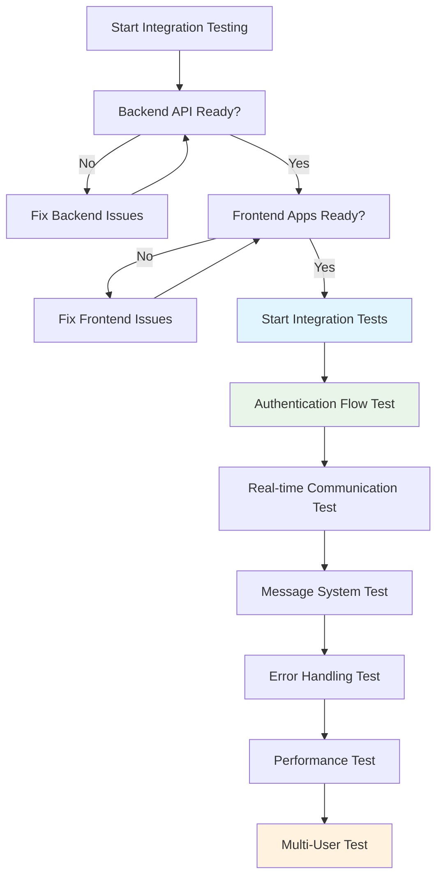

# 6.4.1 คู่มือการทดสอบ API และ Integration แบบละเอียด

## 🎯 ภาพรวม

เอกสารนี้จะให้รายละเอียดเชิงลึกสำหรับการทดสอบ **Backend API** และการทดสอบ **Integration** ระหว่าง Frontend Applications (Supervisor Dashboard + Agent Desktop) กับ Backend Server โดยเน้นการเป็น **คู่มือปฏิบัติ** สำหรับนักศึกษาที่จะทำหน้าที่ **Tester**

### 🎓 เป้าหมายการเรียนรู้
เมื่อจบการอ่านเอกสารนี้ นักศึกษาจะสามารถ:
- ทดสอบ Backend API endpoints อย่างเป็นระบบ
- ใช้เครื่องมือทดสอบ API แบบมืออาชีพ  
- สร้าง Integration Test Scenarios ที่ครอบคลุม
- ระบุและแก้ไขปัญหาการเชื่อมต่อระหว่าง Frontend-Backend
- ทดสอบ Frontend Applications แบบ End-to-End

---

## 🏗️ **Backend API Testing Foundation**

### **📋 API Endpoints สรุปจาก Backend**

จากเอกสาร 6.6.2 Backend Server Code Guide เรามี API endpoints ดังนี้:

| หมวดหมู่ | Endpoint | Method | Authentication | จุดประสงค์ |
|----------|----------|---------|----------------|---------|
| **Health Check** | `/health` | GET | ❌ ไม่ต้อง | ตรวจสอบสถานะ server |
| **Authentication** | `/api/auth/login` | POST | ❌ ไม่ต้อง | Login agent/supervisor |
| **Authentication** | `/api/auth/logout` | POST | ✅ ต้องการ | Logout ผู้ใช้ปัจจุบัน |
| **Agent Management** | `/api/agents/:id/status` | PUT | ✅ ต้องการ | อัปเดตสถานะ agent |
| **Agent Management** | `/api/agents/team/:teamId` | GET | ✅ ต้องการ | ดึงข้อมูลสมาชิกทีม |
| **Agent Management** | `/api/agents/:id/history` | GET | ✅ ต้องการ | ดูประวัติ agent |
| **Message System** | `/api/messages/send` | POST | ✅ ต้องการ | ส่งข้อความ |
| **Message System** | `/api/messages/inbox/:userId` | GET | ✅ ต้องการ | ดูข้อความของผู้ใช้ |
| **Message System** | `/api/messages/:id/read` | PUT | ✅ ต้องการ | ทำเครื่องหมายอ่านแล้ว |

### **🔧 การตั้งค่าเครื่องมือทดสอบ API**

**1. การตั้งค่า Postman Collection**
```json
{
  "info": {
    "name": "Agent Wallboard API Tests",
    "description": "ชุดทดสอบ API แบบสมบูรณ์สำหรับระบบ Agent Wallboard"
  },
  "variable": [
    {
      "key": "baseUrl",
      "value": "http://localhost:3001"
    },
    {
      "key": "authToken",
      "value": ""
    }
  ],
  "auth": {
    "type": "bearer",
    "bearer": [
      {
        "key": "token",
        "value": "{{authToken}}"
      }
    ]
  }
}
```

**2. ทางเลือก: curl Command Templates**
```bash
# Base URL
BASE_URL="http://localhost:3001"

# Health Check Template
curl -X GET "${BASE_URL}/health"

# Login Template  
curl -X POST "${BASE_URL}/api/auth/login" \
  -H "Content-Type: application/json" \
  -d '{"agentCode": "AG001"}'

# Authenticated Request Template
curl -X GET "${BASE_URL}/api/agents/team/1" \
  -H "Authorization: Bearer YOUR_TOKEN_HERE"
```

---

## 🧪 **วิธีการทดสอบ API**

### **📋 Phase 1: การทดสอบ API แต่ละ Endpoint**

**🔗 Template ของ Test Case สำหรับ API**
```
API Test Case ID: API-001
Endpoint: POST /api/auth/login
จุดประสงค์: การยืนยันตัวตน Agent ด้วยข้อมูลที่ถูกต้อง

ข้อมูลทดสอบ:
- Agent Code: "AG001" (ถูกต้อง)
- Agent ที่คาดหวัง: John Smith, Team 1

Request:
POST http://localhost:3001/api/auth/login
Content-Type: application/json
{
  "agentCode": "AG001"
}

ผลลัพธ์ที่คาดหวัง:
Status: 200 OK
Body: {
  "success": true,
  "data": {
    "agent": {
      "agentCode": "AG001",
      "agentName": "John Smith",
      "teamId": 1,
      "role": "agent"
    },
    "token": "eyJhbGciOiJIUzI1NiIsInR5cCI6IkpXVCJ9..."
  }
}

รายการตรวจสอบ:
□ Status code เป็น 200
□ Response มี "success": true
□ ข้อมูล Agent ตรงกับที่คาดหวัง
□ JWT token มีอยู่และรูปแบบถูกต้อง
□ เวลาตอบสนอง < 500ms

Test Cases แบบ Negative:
- Agent code ไม่ถูกต้อง: "AG999"
- Agent code ว่าง: ""
- ไม่มี field agentCode
- ใช้ HTTP method ผิด (GET แทน POST)
```

### **🔐 การทดสอบ Authentication Flow**

**ลำดับการทดสอบ Authentication:**
```bash
# Step 1: Health Check (ไม่ต้องยืนยันตัวตน)
Test-001: GET /health
คาดหวัง: {"status": "OK", "timestamp": "..."}

# Step 2: Agent Login ที่ถูกต้อง
Test-002: POST /api/auth/login 
Body: {"agentCode": "AG001"}
คาดหวัง: สำเร็จ + JWT token
บันทึก: token ใน environment variable

# Step 3: Supervisor Login ที่ถูกต้อง  
Test-003: POST /api/auth/login
Body: {"supervisorCode": "SP001", "type": "supervisor"}
คาดหวัง: สำเร็จ + JWT token + ข้อมูลทีม

# Step 4: ทดสอบ Protected Endpoint
Test-004: GET /api/agents/team/1
Header: Authorization: Bearer {token}
คาดหวัง: รายชื่อสมาชิกทีม

# Step 5: ทดสอบ Invalid Token
Test-005: GET /api/agents/team/1  
Header: Authorization: Bearer invalid_token
คาดหวัง: 401 Unauthorized

# Step 6: ทดสอบ Token หมดอายุ (ถ้ามี)
Test-006: ใช้ token เก่า/หมดอายุ
คาดหวัง: 401 Token Expired
```

### **📊 Status Management API Testing**

**Status Update Test Matrix:**
```bash
Test Scenario: Agent Status Updates
Prerequisites: Agent AG001 logged in successfully

# Test All Valid Status Transitions
Status-001: Available → Busy
PUT /api/agents/AG001/status
Body: {"status": "Busy"}
Expected: 200 OK, status updated

Status-002: Busy → Break  
PUT /api/agents/AG001/status
Body: {"status": "Break"}
Expected: 200 OK, status updated

Status-003: Break → Available
PUT /api/agents/AG001/status  
Body: {"status": "Available"}
Expected: 200 OK, status updated

Status-004: Available → Offline
PUT /api/agents/AG001/status
Body: {"status": "Offline"}  
Expected: 200 OK, status updated

# Test Invalid Status Values
Status-005: Invalid Status
PUT /api/agents/AG001/status
Body: {"status": "InvalidStatus"}
Expected: 400 Bad Request, error message

Status-006: Missing Status Field
PUT /api/agents/AG001/status
Body: {}
Expected: 400 Bad Request, validation error

Status-007: Wrong Agent ID
PUT /api/agents/AG999/status  
Body: {"status": "Available"}
Expected: 404 Not Found
```

### **💬 Message System API Testing**

**Message API Test Scenarios:**
```bash
# Direct Message Testing
Message-001: Supervisor sends direct message
POST /api/messages/send
Body: {
  "fromCode": "SP001",
  "toCode": "AG001", 
  "content": "Please check your queue",
  "type": "direct"
}
Expected: 200 OK, message sent confirmation

Message-002: Broadcast message
POST /api/messages/send  
Body: {
  "fromCode": "SP001",
  "toTeamId": 1,
  "content": "Team meeting in 15 minutes", 
  "type": "broadcast"
}
Expected: 200 OK, broadcast confirmation

Message-003: Get agent inbox
GET /api/messages/inbox/AG001
Expected: 200 OK, list of messages for AG001

Message-004: Mark message as read
PUT /api/messages/{messageId}/read
Expected: 200 OK, message marked as read

# Negative Test Cases
Message-005: Send to non-existent agent
POST /api/messages/send
Body: {
  "fromCode": "SP001", 
  "toCode": "AG999",
  "content": "Test message"
}
Expected: 404 Not Found or appropriate error

Message-006: Empty message content
POST /api/messages/send
Body: {
  "fromCode": "SP001",
  "toCode": "AG001",
  "content": ""
}
Expected: 400 Bad Request, validation error
```

---

## 🔗 **Frontend-Backend Integration Testing**

### **🎯 Integration Test Strategy**



### **📋 Phase 2: End-to-End Integration Test Scenarios**

**🔐 Scenario 1: Complete Authentication Flow**
```bash
Integration Test: AUTH-FLOW-001
Title: Complete Authentication and Initial Data Load

Steps:
1. Start Backend Server
   - Verify: http://localhost:3001/health returns OK
   
2. Open Supervisor Dashboard
   - Navigate to: http://localhost:3000
   - Verify: Login form appears
   
3. Supervisor Login Test
   - Enter: SP001 in supervisor code field
   - Click: Sign In button
   - Verify: Dashboard loads with team data
   - Verify: Network tab shows API calls:
     * POST /api/auth/login (success)
     * GET /api/agents/team/1 (success)
     * WebSocket connection established
   
4. Agent Desktop Login Test  
   - Open: Agent Desktop app
   - Enter: AG001 in agent code field
   - Click: Sign In button
   - Verify: Agent dashboard appears
   - Verify: Agent appears in Supervisor Dashboard
   - Verify: Status shows "Available"

Expected Results:
- Both apps successfully authenticated
- Real-time connection established
- Agent visible in supervisor dashboard
- No console errors in either app

Pass Criteria: All verification points successful
```

**📊 Scenario 2: Real-time Status Updates**
```bash
Integration Test: STATUS-SYNC-001  
Title: Real-time Status Synchronization

Prerequisites: 
- Supervisor (SP001) logged in
- Agent (AG001) logged in and visible in dashboard

Steps:
1. Baseline Check
   - Verify: Agent shows "Available" in both apps
   
2. Status Change Test
   - In Agent Desktop: Click "Busy" button
   - Start Timer: Record time of click
   - In Supervisor Dashboard: Watch for status change
   - Stop Timer: When status updates to "Busy"
   
3. Multiple Status Changes
   - Agent: Available → Busy (observe update)
   - Agent: Busy → Break (observe update)  
   - Agent: Break → Offline (observe update)
   - Agent: Offline → Available (observe update)
   
4. Database Verification
   - Check MongoDB: agent_status collection
   - Verify: Latest status entries saved correctly
   - Query: db.agent_status.find({agentCode: "AG001"}).sort({timestamp: -1}).limit(5)

Expected Results:
- All status changes appear in supervisor dashboard
- Update time < 5 seconds per change
- Database entries match UI changes
- WebSocket events logged in browser console

Performance Criteria:
- Status update latency: < 3 seconds
- No WebSocket disconnections
- No duplicate status entries
```

**💬 Scenario 3: Message Communication Flow**
```bash
Integration Test: MESSAGE-FLOW-001
Title: Complete Message Communication

Prerequisites:
- Supervisor (SP001) logged in 
- Agents (AG001, AG002) logged in and online

Test Sequence:

1. Direct Message Test
   - Supervisor: Click message button on AG001 card
   - Enter: "Please check your queue status"
   - Click: Send
   - Verify: AG001 receives desktop notification
   - Verify: Message appears in AG001 message panel
   - Time: Record message delivery time
   
2. Broadcast Message Test  
   - Supervisor: Click broadcast message button
   - Enter: "Team meeting in 15 minutes"
   - Select: All team members
   - Click: Send
   - Verify: Both AG001 and AG002 receive notification
   - Verify: Message appears in both agent message panels
   
3. Message History Test
   - Agent: Check message history panel
   - Verify: Previous messages visible
   - Verify: Timestamps correct
   - Verify: Sender identification correct
   
4. Database Verification
   - MongoDB query: db.messages.find().sort({timestamp: -1}).limit(10)
   - Verify: All sent messages saved
   - Verify: Recipient lists accurate for broadcasts

Expected Results:
- Direct messages delivered to correct recipient only
- Broadcast messages delivered to all team members  
- Desktop notifications triggered
- Message history maintained
- Database consistency verified

Pass Criteria:
- Message delivery: < 5 seconds
- No message loss
- Correct recipient targeting
- Notification sounds work (if implemented)
```

### **🧪 Advanced Integration Test Scenarios**

**🌐 Scenario 4: Multi-User Stress Test**
```bash
Integration Test: MULTI-USER-001
Title: Multiple Users Concurrent Operations

Setup:
- 1 Supervisor Dashboard (SP001)
- 3 Agent Desktop Apps (AG001, AG002, AG003)
- All logged in simultaneously

Test Matrix:
┌─────────────────────────────────────────────┐
│ Time | AG001 Action | AG002 Action | AG003 Action │
├─────────────────────────────────────────────┤
│ 0:00 | → Busy       | → Break      | → Available  │
│ 0:30 | → Available  | → Busy       | → Break      │
│ 1:00 | → Break      | → Available  | → Busy       │
│ 1:30 | → Offline    | → Offline    | → Available  │
│ 2:00 | → Available  | → Available  | → Busy       │
└─────────────────────────────────────────────┘

Supervisor Actions:
- Send direct messages to each agent every 45 seconds
- Send broadcast message at 1:15
- Monitor all status changes in real-time

Monitoring Points:
- WebSocket connection stability
- Message delivery accuracy  
- Status update consistency
- Performance degradation
- Memory usage (browser dev tools)

Pass Criteria:
- All status updates reflected accurately
- No message delivery failures
- WebSocket connections remain stable
- UI remains responsive
- No significant performance degradation
```

**🚨 Scenario 5: Error Handling & Recovery**
```bash
Integration Test: ERROR-RECOVERY-001
Title: System Error Handling and Recovery

Error Simulation Tests:

1. Network Interruption Test
   - Disconnect backend server (Ctrl+C)
   - Observe: Frontend error handling
   - Restart: Backend server
   - Verify: Automatic reconnection
   - Test: All functionality works after reconnection
   
2. Database Connection Error
   - Stop MongoDB service
   - Attempt: Status change operations
   - Observe: Error messages displayed
   - Restart: MongoDB service
   - Verify: System recovery
   
3. Invalid Token Test
   - Manually expire/corrupt JWT token
   - Attempt: Protected API operations  
   - Verify: Proper authentication error handling
   - Test: Re-login process
   
4. WebSocket Disconnection
   - Simulate network instability
   - Monitor: WebSocket reconnection attempts
   - Verify: Real-time features resume after reconnection
   
5. Browser Refresh Test
   - Agent: Refresh browser/restart app during message sending
   - Supervisor: Refresh during status monitoring
   - Verify: Session persistence (if implemented)
   - Verify: Graceful state recovery

Expected Error Behaviors:
- Clear error messages displayed to users
- No application crashes
- Automatic retry mechanisms work
- Graceful degradation of features
- Quick recovery when services restored

Recovery Criteria:
- Reconnection time: < 10 seconds
- No data loss during outages
- User sessions maintained where possible
- All functionality restored post-recovery
```

---

## 🎯 **การทดสอบ Frontend Applications แบบ End-to-End**

### **📱 Phase 3: การทดสอบ Supervisor Dashboard (React Web)**

**🌐 Test Cases สำหรับ Supervisor Dashboard**

**Test Case FE-DASH-001: การ Login และโหลดข้อมูลเริ่มต้น**
```
จุดประสงค์: ทดสอบการ login และโหลดข้อมูลทีมใน Supervisor Dashboard

เงื่อนไขเบื้องต้น:
- Backend server ทำงานอยู่
- Browser เปิด http://localhost:3000

ขั้นตอนการทดสอบ:
1. เปิด Supervisor Dashboard
   - ตรวจสอบ: หน้า login form แสดงขึ้น
   
2. ใส่ข้อมูล Supervisor Code
   - กรอก: SP001
   - คลิก: Sign In
   
3. ตรวจสอบการโหลดข้อมูล
   - ตรวจสอบ: Dashboard แสดงขึ้น
   - ตรวจสอบ: แสดงชื่อ supervisor "Sarah Wilson"
   - ตรวจสอบ: แสดงทีม "Customer Service"
   - ตรวจสอบ: แสดงรายชื่อ agents ในทีม (AG001-AG004)

4. ตรวจสอบ Network Activity (F12 → Network)
   - ตรวจสอบ: POST /api/auth/login สำเร็จ
   - ตรวจสอบ: GET /api/agents/team/1 สำเร็จ
   - ตรวจสอบ: WebSocket connection established

ผลลัพธ์ที่คาดหวัง:
- Login สำเร็จและ dashboard โหลดครบ
- แสดงข้อมูลทีมถูกต้อง
- ไม่มี error ใน console
- WebSocket เชื่อมต่อสำเร็จ

เกณฑ์ผ่าน: ทุกการตรวจสอบสำเร็จ
```

**Test Case FE-DASH-002: การส่งข้อความ Direct Message**
```
จุดประสงค์: ทดสอบการส่งข้อความจาก Supervisor ไปยัง Agent เฉพาะคน

เงื่อนไขเบื้องต้น:
- Supervisor (SP001) login แล้ว
- Agent (AG001) online และมองเห็นใน dashboard

ขั้นตอนการทดสอบ:
1. เลือก Agent สำหรับส่งข้อความ
   - คลิก: ปุ่ม "Message" บน AG001 card
   - ตรวจสอบ: Message dialog เปิดขึ้น
   
2. เขียนและส่งข้อความ
   - กรอก: "Please check your queue status"
   - คลิก: Send button
   - ตรวจสอบ: ข้อความ "Message sent successfully"
   
3. ตรวจสอบ Network Activity
   - ตรวจสอบ: POST /api/messages/send สำเร็จ
   - ตรวจสอบ: WebSocket event 'message_sent' ถูกส่ง

4. ตรวจสอบใน Agent Desktop (ถ้าเปิดไว้)
   - ตรวจสอบ: Agent ได้รับ desktop notification
   - ตรวจสอบ: ข้อความแสดงใน message panel

ผลลัพธ์ที่คาดหวัง:
- ข้อความส่งสำเร็จ
- Agent ได้รับข้อความ
- Real-time delivery ทำงาน
- UI แสดงสถานะส่งสำเร็จ

เกณฑ์ผ่าน: ข้อความถึง agent ถูกต้องและทันเวลา
```

**Test Case FE-DASH-003: การ Monitor Status แบบ Real-time**
```
จุดประสงค์: ทดสอบการอัปเดต status ของ agents แบบ real-time

เงื่อนไขเบื้องต้น:
- Supervisor dashboard เปิดอยู่
- Agent Desktop (AG001) เปิดอยู่และ login แล้ว

ขั้นตอนการทดสอบ:
1. ตรวจสอบ Initial Status
   - ตรวจสอบ: AG001 แสดงสถานะ "Available" (สีเขียว)
   - บันทึก: เวลาเริ่มต้น
   
2. เปลี่ยน Status ใน Agent Desktop
   - ใน Agent Desktop: คลิก "Busy"
   - เริ่มจับเวลา: จากการคลิก
   
3. สังเกต Update ใน Supervisor Dashboard
   - รอ: สถานะเปลี่ยนเป็น "Busy" (สีส้ม)
   - หยุดจับเวลา: เมื่อเห็นการเปลี่ยนแปลง
   - บันทึก: เวลาที่ใช้ในการอัปเดต
   
4. ทดสอบการเปลี่ยนแปลงหลายครั้ง
   - Busy → Break (สีน้ำเงิน)
   - Break → Available (สีเขียว)
   - Available → Offline (สีเทา)

5. ตรวจสอบ WebSocket Events (Console)
   - ตรวจสอบ: 'agent_status_update' events
   - ตรวจสอบ: ข้อมูล event ถูกต้อง

ผลลัพธ์ที่คาดหวัง:
- ทุกการเปลี่ยน status แสดงใน dashboard
- เวลาอัปเดต < 5 วินาที
- สีและข้อความถูกต้อง
- ไม่มีการหลุดการเชื่อมต่อ

เกณฑ์การผ่าน:
- Status update latency: < 3 วินาที
- ไม่มี WebSocket disconnections
- UI แสดงผลถูกต้องทุกครั้ง
```

### **🖥️ Phase 4: การทดสอบ Agent Desktop App (Electron)**

**Test Case FE-AGENT-001: การเปิดแอปและ Login**
```
จุดประสงค์: ทดสอบการเปิด Electron app และการ login

เงื่อนไขเบื้องต้น:
- Backend server ทำงานอยู่
- Agent Desktop app สามารถเปิดได้

ขั้นตอนการทดสอบ:
1. เปิด Agent Desktop Application
   - รัน: npm run electron-dev
   - ตรวจสอบ: Electron window เปิดขึ้น
   - ตรวจสอบ: หน้า login form แสดง
   
2. ทดสอบ Agent Login
   - กรอก: AG001
   - คลิก: Sign In
   - ตรวจสอบ: เข้าสู่ระบบสำเร็จ
   
3. ตรวจสอบ Agent Dashboard
   - ตรวจสอบ: แสดงชื่อ "John Smith"
   - ตรวจสอบ: แสดง Agent Code "AG001"
   - ตรวจสอบ: แสดงทีม "Customer Service"
   - ตรวจสอบ: Status เริ่มต้น "Available"
   
4. ตรวจสอบ UI Elements
   - ตรวจสอบ: Status buttons ทั้ง 4 ตัว
   - ตรวจสอบ: Message panel แสดง
   - ตรวจสอบ: Agent info แสดงถูกต้อง

ผลลัพธ์ที่คาดหวัง:
- Electron app เปิดสำเร็จ
- Login ทำงานถูกต้อง
- Dashboard แสดงข้อมูล agent
- UI elements ครบถ้วน

เกณฑ์ผ่าน: ทุกการตรวจสอบสำเร็จ
```

**Test Case FE-AGENT-002: การเปลี่ยน Status และ Notifications**
```
จุดประสงค์: ทดสอบการเปลี่ยนสถานะและการรับ notifications

เงื่อนไขเบื้องต้น:
- Agent (AG001) login ใน desktop app แล้ว
- Supervisor (SP001) login ใน dashboard แล้ว

ขั้นตอนการทดสอบ:
1. ทดสอบการเปลี่ยน Status
   - คลิก: "Busy" button
   - ตรวจสอบ: UI แสดงสถานะ "Busy"
   - ตรวจสอบ: ปุ่มเปลี่ยนสี (highlight)
   
2. ทดสอบ Status แต่ละแบบ
   - Available → Busy → Break → Offline → Available
   - ตรวจสอบ: UI อัปเดตทุกครั้ง
   - ตรวจสอบ: Supervisor dashboard เห็นการเปลี่ยนแปลง
   
3. ทดสอบการรับ Message
   - ใน Supervisor: ส่งข้อความ "Test message"
   - ตรวจสอบ: Desktop notification ปรากฏ
   - ตรวจสอบ: ข้อความแสดงใน message panel
   - ตรวจสอบ: เสียง notification (ถ้ามี)
   
4. ทดสอบ Message History
   - ตรวจสอบ: ข้อความเก่าแสดงใน history
   - ตรวจสอบ: Timestamp ถูกต้อง
   - ตรวจสอบ: ชื่อผู้ส่งแสดงถูกต้อง

ผลลัพธ์ที่คาดหวัง:
- การเปลี่ยน status ทำงานถูกต้อง
- Desktop notifications แสดง
- ข้อความส่งถึงและแสดงถูกต้อง
- Message history ทำงาน

เกณฑ์ผ่าน:
- Status changes < 2 วินาทีเพื่อ sync
- Notifications แสดงทุกครั้ง
- Message delivery < 3 วินาที
```

**Test Case FE-AGENT-003: System Tray และ Window Management**
```
จุดประสงค์: ทดสอบ system tray integration และ window management

เงื่อนไขเบื้องต้น:
- Agent Desktop app เปิดและ login แล้ว

ขั้นตอนการทดสอบ:
1. ทดสอบ System Tray
   - ตรวจสอบ: System tray icon แสดง
   - คลิกขวา: System tray icon
   - ตรวจสอบ: Context menu แสดง
   
2. ทดสอบ Minimize/Restore
   - คลิก: Minimize button
   - ตรวจสอบ: App ซ่อนไป system tray
   - คลิก: System tray icon
   - ตรวจสอบ: App กลับมาแสดง
   
3. ทดสอบ Background Operation
   - Minimize app ไป system tray
   - ใน Supervisor: ส่งข้อความ
   - ตรวจสอบ: Notification แสดงแม้ app ซ่อนอยู่
   - ตรวจสอบ: Tray icon เปลี่ยนสี/กระพริบ (ถ้ามี)
   
4. ทดสอบ Quit Application
   - คลิกขวา: System tray
   - เลือก: Quit/Exit
   - ตรวจสอบ: App ปิดสมบูรณ์
   - ตรวจสอบ: Supervisor แสดง agent offline

ผลลัพธ์ที่คาดหวัง:
- System tray ทำงานถูกต้อง
- Minimize/restore สำเร็จ
- Background notifications ทำงาน
- Quit application สะอาด

เกณฑ์ผ่าน: ทุกฟีเจอร์ทำงานตามที่ออกแบบ
```

### **🔗 Phase 5: End-to-End Integration Scenarios**

**Integration Test E2E-001: Complete User Workflow**
```
จุดประสงค์: ทดสอบ workflow ที่สมบูรณ์ของการใช้งานระบบจริง

เงื่อนไขเบื้องต้น:
- Backend server ทำงานอยู่
- Database (SQLite + MongoDB) พร้อมใช้งาน
- Sample data โหลดครบถ้วน

ขั้นตอนการทดสอบ (ลำดับตามการใช้งานจริง):

1. เริ่มงานของ Supervisor
   - เปิด Supervisor Dashboard
   - Login ด้วย SP001 (Sarah Wilson)
   - ตรวจสอบ: ทีม Customer Service แสดง
   - ตรวจสอบ: Agents ทั้งหมด offline
   
2. Agents เริ่มเข้างาน
   - เปิด Agent Desktop (AG001 - John Smith)
   - เปิด Agent Desktop (AG002 - Emma Davis)
   - Login ทั้งสองคน
   - ตรวจสอบ: Supervisor เห็น agents online
   
3. เริ่มการทำงาน
   - AG001: เปลี่ยนเป็น "Available"
   - AG002: เปลี่ยนเป็น "Available"
   - ตรวจสอบ: Supervisor dashboard อัปเดต real-time
   
4. การส่งข้อความแบบต่าง ๆ
   - Supervisor → AG001: "Good morning, ready for the day?"
   - Supervisor → ทั้งทีม: "Team meeting in 15 minutes"
   - ตรวจสอบ: ทั้งสอง agents รับข้อความครบ
   
5. การเปลี่ยนสถานะระหว่างงาน
   - AG001: Available → Busy → Break → Available
   - AG002: Available → Busy (พร้อมกัน)
   - ตรวจสอบ: Supervisor เห็นสถานะเปลี่ยนแปลง
   
6. เลิกงาน
   - AG001: เปลี่ยนเป็น "Offline"
   - AG002: ปิด app
   - ตรวจสอบ: Supervisor เห็น offline status
   
7. สิ้นสุดการทำงาน
   - Supervisor: ตรวจสอบ team summary
   - Logout จาก dashboard

ผลลัพธ์ที่คาดหวัง:
- ทุกขั้นตอนทำงานราบรื่น
- Real-time updates ไม่ขาดตอน
- ข้อความส่งถึงครบถ้วน
- Status tracking ถูกต้อง
- ไม่มี system errors

เกณฑ์ผ่าน:
- End-to-end workflow สมบูรณ์
- Performance acceptable (< 5s per action)
- Data consistency ระหว่าง components
- User experience smooth
```

**Integration Test E2E-002: Multi-User Stress Test**
```
จุดประสงค์: ทดสอบระบบกับผู้ใช้หลายคนพร้อมกัน

Setup สำหรับการทดสอบ:
- 1 Supervisor Dashboard (SP001)
- 4 Agent Desktop Apps (AG001, AG002, AG003, AG004)
- ทุกคน login พร้อมกัน

Test Matrix - การดำเนินการพร้อมกัน:
┌─────────────────────────────────────────────┐
│ เวลา | AG001 | AG002 | AG003 | AG004 | SP001 │
├─────────────────────────────────────────────┤
│ 0:00 | Available | Available | Available | Available | Monitor │
│ 0:30 | → Busy | → Break | Available | → Busy | Send msg to AG001 │
│ 1:00 | Busy | → Available | → Break | Available | Broadcast msg │
│ 1:30 | → Break | Busy | Break | → Offline | Send msg to AG002 │
│ 2:00 | → Available | → Available | → Available | Login back | Monitor all │
│ 2:30 | → Offline | → Offline | → Offline | → Offline | Summary │
└─────────────────────────────────────────────┘

จุดตรวจสอบ:
- WebSocket connections คงเสถียรภาพ
- Message delivery ความแม่นยำ 100%
- Status updates แบบ real-time
- Performance ไม่ลดลง
- Memory usage ไม่เพิ่มมากเกินไป

ผลลัพธ์ที่คาดหวัง:
- ทุก actions แสดงใน supervisor dashboard
- ไม่มี message delivery failures
- WebSocket connections ไม่หลุด
- UI ยังคง responsive
- ไม่มี performance degradation

เกณฑ์ผ่าน:
- Success rate: 100%
- Average response time: < 3 วินาที
- Zero connection drops
- Smooth user experience for all users
```

---

## 🛠️ **เครื่องมือและเทคนิคการทดสอบ Integration**

### **🔍 การใช้ Browser Developer Tools สำหรับ Integration Testing**

**1. การ Monitor Network Tab**
```bash
การทดสอบ Integration ด้วย Browser DevTools:

1. เปิด Supervisor Dashboard
2. กด F12 → Network tab
3. Filter โดย XHR/Fetch requests
4. ติดตาม API calls ระหว่างการทดสอบ:

รูปแบบ API Call ที่คาดหวัง:
┌─────────────────────────────────────────────┐
│ Login → auth/login (POST)                   │
│ Load Team → agents/team/1 (GET)             │
│ WebSocket → socket.io/ (WebSocket)          │
│ Send Message → messages/send (POST)         │
│ Status Update → agents/AG001/status (PUT)   │
└─────────────────────────────────────────────┘

สัญญาณเตือนที่ต้องระวัง:
❌ 401/403 errors (ปัญหา authentication)
❌ 500 errors (ปัญหา server)  
❌ Failed WebSocket connections
❌ การ request ซ้ำ ๆ มากเกินไป
❌ เวลาตอบสนองช้า (>2 วินาที)
```

**2. การ Monitor Console**
```javascript
// คำสั่ง Console monitoring สำหรับการทดสอบ
// วางใน browser console ระหว่างทดสอบ

// ติดตาม WebSocket events
window.socket?.on('connect', () => console.log('✅ WebSocket เชื่อมต่อ'));
window.socket?.on('disconnect', () => console.log('❌ WebSocket หลุดการเชื่อมต่อ'));
window.socket?.on('agent_status_update', (data) => console.log('📊 Status Update:', data));
window.socket?.on('new_message', (data) => console.log('💬 New Message:', data));

// ติดตาม API response times
const originalFetch = window.fetch;
window.fetch = function(...args) {
  const start = performance.now();
  return originalFetch(...args).then(response => {
    const end = performance.now();
    console.log(`🌐 API Call: ${args[0]} - ${Math.round(end - start)}ms`);
    return response;
  });
};

// ติดตาม React state changes (ถ้าใช้ React DevTools)
// ตรวจสอบ unnecessary re-renders หรือ state issues
```

### **📋 Integration Test Execution Checklist**

**Checklist การเตรียมพร้อมก่อนทดสอบ:**
```bash
การตรวจสอบสภาพแวดล้อม:
□ Backend server ทำงานที่ port 3001
□ MongoDB service ทำงานและเข้าถึงได้
□ SQLite database file มีอยู่และอ่านได้
□ Supervisor Dashboard เข้าถึงได้ที่ localhost:3000
□ Agent Desktop app(s) เปิดได้สำเร็จ
□ Sample data ทั้งหมดโหลดครบถ้วน

เครื่องมือทดสอบพร้อมใช้:
□ Browser Developer Tools เปิดแล้ว
□ Postman collection import แล้ว (ถ้าใช้)
□ Test data spreadsheet เตรียมแล้ว
□ Screenshot/recording tools พร้อม (ถ้าต้องการ)
□ Timer สำหรับวัด performance

ข้อมูลทดสอบเตรียมแล้ว:
□ Credentials ที่ถูกต้อง: SP001, SP002, SP003
□ Agent codes ที่ถูกต้อง: AG001-AG010
□ เนื้อหาข้อความทดสอบเตรียมแล้ว
□ ข้อมูล response ที่คาดหวังจดไว้แล้ว
```

**Checklist การติดตาม During-Test:**
```bash
ทุก ๆ 5 นาทีตรวจสอบ:
□ Applications ทั้งหมดยังตอบสนอง
□ ไม่มี error messages ใน console
□ WebSocket connections ยังทำงาน
□ การใช้ memory ไม่มากเกินไป
□ Network requests เสร็จสมบูรณ์

หลังแต่ละ Test Scenario:
□ บันทึกผลลัพธ์ใน test report
□ Screenshot errors ที่เจอ (ถ้ามี)
□ บันทึกเวลา performance measurements
□ ตรวจสอบ database state ถ้าเกี่ยวข้อง
□ ทำความสะอาดข้อมูลทดสอบถ้าจำเป็น
```

---

## 📈 **Integration Test Reporting**

### **📊 Template รายงานการทดสอบ Integration**

```bash
=== รายงานการทดสอบ Integration ===
Session การทดสอบ: [วันที่] [เวลาเริ่ม] - [เวลาจบ]
ผู้ทดสอบ: [ชื่อ]
สภาพแวดล้อม: [Local/Staging/Production]
Backend Version: [Git commit/version]
Frontend Version: [Git commit/version]

=== สรุปการดำเนินการทดสอบ ===
Integration Scenarios ทั้งหมด: 5
ผ่าน: ___
ไม่ผ่าน: ___  
Blocked: ___
อัตราการผ่าน: ___%

=== ผลลัพธ์แต่ละ Scenario ===

Scenario 1: Authentication Flow
สถานะ: [ผ่าน/ไม่ผ่าน/BLOCKED]
เวลาการทำงาน: ___ นาที
ปัญหาที่พบ: [รายการปัญหา]
บันทึก Performance: [เวลาตอบสนอง, etc.]

Scenario 2: Real-time Status Updates  
สถานะ: [ผ่าน/ไม่ผ่าน/BLOCKED]
เวลาการทำงาน: ___ นาที
เวลา Update Latency เฉลี่ย: ___ วินาที
ปัญหาที่พบ: [รายการปัญหา]

Scenario 3: Message Communication
สถานะ: [ผ่าน/ไม่ผ่าน/BLOCKED] 
เวลาการทำงาน: ___ นาที
เวลา Message Delivery: ___ วินาที
ปัญหาที่พบ: [รายการปัญหา]

Scenario 4: Multi-User Stress Test
สถานะ: [ผ่าน/ไม่ผ่าน/BLOCKED]
จำนวนผู้ใช้พร้อมกัน: ___
System Performance: [เสถียร/ลดลง/ล้มเหลว]
ปัญหาที่พบ: [รายการปัญหา]

Scenario 5: Error Handling & Recovery
สถานะ: [ผ่าน/ไม่ผ่าน/BLOCKED]
เวลา Recovery: ___ วินาที
คุณภาพ Error Handling: [ดีเยี่ยม/ดี/แย่]
ปัญหาที่พบ: [รายการปัญหา]

=== ปัญหาวิกฤต ===
1. [ปัญหาสำคัญลำดับที่ 1]
2. [ปัญหาสำคัญลำดับที่ 2]

=== ปัญหาเล็กน้อย ===  
1. [ปัญหาเล็กน้อยลำดับที่ 1]
2. [ปัญหาเล็กน้อยลำดับที่ 2]

=== เมตริก Performance ===
เวลาตอบสนอง API:
- Authentication: ___ ms (เป้าหมาย: <500ms)
- Status Updates: ___ ms (เป้าหมาย: <200ms)  
- Message Sending: ___ ms (เป้าหมาย: <300ms)

Real-time Latency:
- Status Updates: ___ วินาที (เป้าหมาย: <3s)
- Message Delivery: ___ วินาที (เป้าหมาย: <5s)
- WebSocket Reconnection: ___ วินาที (เป้าหมาย: <10s)

=== ความเข้ากันได้ของ Browser ===
□ Chrome [Version] - [ผ่าน/ไม่ผ่าน]
□ Firefox [Version] - [ผ่าน/ไม่ผ่าน]  
□ Safari [Version] - [ผ่าน/ไม่ผ่าน]
□ Edge [Version] - [ผ่าน/ไม่ผ่าน]

=== ข้อเสนอแนะ ===
1. [ข้อเสนอแนะการปรับปรุงลำดับที่ 1]
2. [ข้อเสนอแนะการปรับปรุงลำดับที่ 2]
3. [การพิจารณาทดสอบในอนาคต]

=== เอกสารแนบ ===
- Screenshots ของ errors: [ชื่อไฟล์]
- ข้อมูล Performance monitoring: [ชื่อไฟล์]
- Console logs: [ชื่อไฟล์]
- Database state snapshots: [ชื่อไฟล์]
```

---

## 🔧 **ปัญหา Integration ที่พบบ่อยและการแก้ไข**

### **❌ 10 ปัญหา Integration อันดับต้น ๆ และการ Debug**

**1. CORS (Cross-Origin Resource Sharing) Errors**
```bash
ปัญหา: "Access to fetch at 'http://localhost:3001/api/auth/login' 
         from origin 'http://localhost:3000' has been blocked by CORS policy"

ขั้นตอนการ Debug:
1. ตรวจสอบการตั้งค่า CORS ใน backend
2. ตรวจสอบ allowed origins รวม frontend URL
3. ตรวจสอบการจัดการ preflight request สำหรับ PUT/POST

วิธีแก้:
// backend-server/server.js
app.use(cors({
  origin: ['http://localhost:3000', 'http://localhost:3001'],
  credentials: true
}));
```

**2. WebSocket Connection Failures**
```bash
ปัญหา: "WebSocket connection failed" หรือ real-time updates ไม่ทำงาน

ขั้นตอนการ Debug:
1. ตรวจสอบ browser console หา WebSocket errors
2. ตรวจสอบ backend WebSocket server ทำงาน
3. ทดสอบ WebSocket endpoint โดยตรง
4. ตรวจสอบ firewall/proxy settings

การ Verification:
// ทดสอบ WebSocket connection แบบ manual
const socket = io('http://localhost:3001');
socket.on('connect', () => console.log('เชื่อมต่อแล้ว'));
socket.on('connect_error', (error) => console.log('Error:', error));
```

**3. Authentication Token Issues**
```bash
ปัญหา: "401 Unauthorized" หรือ "Invalid token" errors

ขั้นตอนการ Debug:
1. ตรวจสอบ token format ใน Authorization header
2. ตรวจสอบเวลาหมดอายุของ token
3. ตรวจสอบ JWT secret ความสอดคล้อง
4. ตรวจสอบ token payload structure

การทดสอบ:
// ตรวจสอบ token ใน browser localStorage/sessionStorage
console.log('Stored token:', localStorage.getItem('authToken'));

// Decode JWT token (client-side, สำหรับ debugging เท่านั้น)
const payload = JSON.parse(atob(token.split('.')[1]));
console.log('Token payload:', payload);
```

**4. Database Connection Issues**
```bash
ปัญหา: API calls ล้มเหลวด้วย database connection errors

ขั้นตอนการ Debug:
1. ตรวจสอบ MongoDB service ทำงาน: mongosh --eval "db.stats()"
2. ตรวจสอบ SQLite file permissions และ path
3. ตรวจสอบ connection strings ใน .env files
4. ทดสอบ database connections แยกต่างหาก

Backend Verification:
// เพิ่มใน server.js สำหรับ debugging
console.log('MongoDB URI:', process.env.MONGODB_URI);
console.log('SQLite Path:', process.env.SQLITE_DB_PATH);
```

**5. Environment Configuration Issues**
```bash
ปัญหา: พฤติกรรมแตกต่างระหว่าง setup ของสมาชิกทีม

ขั้นตอนการ Debug:
1. เปรียบเทียบ .env files ระหว่าง working/non-working setups
2. ตรวจสอบ environment variables ที่จำเป็นทั้งหมด
3. ตรวจสอบ port conflicts
4. ตรวจสอบ dependencies versions ตรงกัน

Environment Audit:
# ตรวจสอบ environment variables ทั้งหมด
node -e "console.log(process.env)" | grep -E "(PORT|MONGODB|SQLITE|JWT)"

# ตรวจสอบ running processes บน ports
lsof -i :3000  # Frontend
lsof -i :3001  # Backend  
lsof -i :27017 # MongoDB
```

---

## 🎓 **Best Practices การทดสอบ Integration**

### **✅ สิ่งที่ควรทำในการทดสอบ Integration**

1. **ทดสอบ Happy Path ก่อน**
   - ตรวจสอบ functionality พื้นฐานทำงาน end-to-end
   - สร้าง baseline performance metrics
   - ให้แน่ใจว่า test environment สะอาด

2. **ใช้ข้อมูลจริง**
   - ทดสอบด้วย sample data จริงจาก database
   - ใช้เนื้อหาข้อความและพฤติกรรมผู้ใช้ที่สมจริง
   - ตรวจสอบ data consistency ข้ามระบบ

3. **ติดตาม Performance**
   - วัดเวลาตอบสนอง API
   - ติดตาม WebSocket latency
   - ติดตาม memory usage ระหว่างการทดสอบยาว ๆ

4. **บันทึกทุกอย่าง**
   - บันทึกขั้นตอนที่แน่นอนสำหรับ reproducible tests
   - Screenshot error states
   - บันทึกการวัดเวลา

5. **ทดสอบ Edge Cases**
   - การขัดข้องของ network
   - Concurrent user scenarios
   - Boundary conditions (ความยาวข้อความสูงสุด, etc.)

### **❌ สิ่งที่ไม่ควรทำในการทดสอบ Integration**

1. **อย่าข้าม Error Scenarios**
   - ต้องทดสอบ negative cases เสมอ
   - ตรวจสอบความแข็งแกร่งของ error handling
   - ตรวจสอบ graceful degradation

2. **อย่าทดสอบแยกส่วน**
   - Integration tests ควรเกี่ยวข้องกับหลาย components
   - ทดสอบ realistic user workflows
   - รวม database state validation

3. **อย่าเพิกเฉย Performance**
   - ตั้ง performance thresholds ที่ยอมรับได้
   - ทดสอบด้วยปริมาณข้อมูลที่สมจริง
   - ติดตาม resource usage

4. **อย่า Hardcode Test Data**
   - ใช้ configurable test data
   - ทำความสะอาดหลังทดสอบ
   - หลีกเลี่ยง dependencies ระหว่าง test runs

---

## ✅ **สรุป**

**🎉 คู่มือการทดสอบ API และ Integration แบบครอบคลุม:**

### **📊 สิ่งที่นักศึกษาจะเชี่ยวชาญ:**
- **พื้นฐานการทดสอบ API** - การทดสอบ endpoint อย่างเป็นระบบ
- **การออกแบบ Integration Test** - การสร้าง end-to-end scenario  
- **การติดตาม Performance** - การวัดเวลาตอบสนองและ latency
- **การ Validation การจัดการ Error** - การทดสอบความแข็งแกร่งและการฟื้นตัว
- **การทำรายงานการทดสอบมืออาชีพ** - การจัดทำเอกสารและติดตามปัญหา

### **🛠️ เครื่องมือและเทคนิคที่ใช้งานได้จริง:**
- ✅ **Postman Collections** - การตั้งค่าการทดสอบ API แบบมืออาชีพ
- ✅ **Browser DevTools** - การติดตามและ debug แบบ real-time
- ✅ **curl Commands** - ทางเลือกการทดสอบผ่าน command-line
- ✅ **Integration Scenarios** - test workflows หลาย-component
- ✅ **Performance Metrics** - การประเมินคุณภาพแบบปริมาณ

### **🔗 ความครอบคลุมการทดสอบที่สมบูรณ์:**
- **Backend APIs** - ทุก endpoints ทดสอบแยก
- **Frontend Applications** - ทั้ง Supervisor Dashboard และ Agent Desktop  
- **Authentication Flow** - การ login/logout/token validation
- **Real-time Features** - การ validation การสื่อสาร WebSocket
- **Message System** - การส่งข้อความแบบ direct และ broadcast
- **Multi-User Scenarios** - การทดสอบการใช้งานพร้อมกัน
- **Error Recovery** - ความยืดหยุ่นและการทนต่อข้อผิดพลาด

**💡 ขั้นตอนต่อไป:**
1. ดำเนินการทดสอบ API โดยใช้ templates ที่ให้ไว้
2. รัน integration scenarios กับผู้ใช้หลายคน
3. จัดทำรายงานผลการค้นพบโดยใช้รูปแบบรายงานมืออาชีพ
4. ร่วมมือกับทีมพัฒนาในการแก้ไขปัญหา

**สุขสันต์กับการทดสอบ Integration! 🧪🔗✨**

