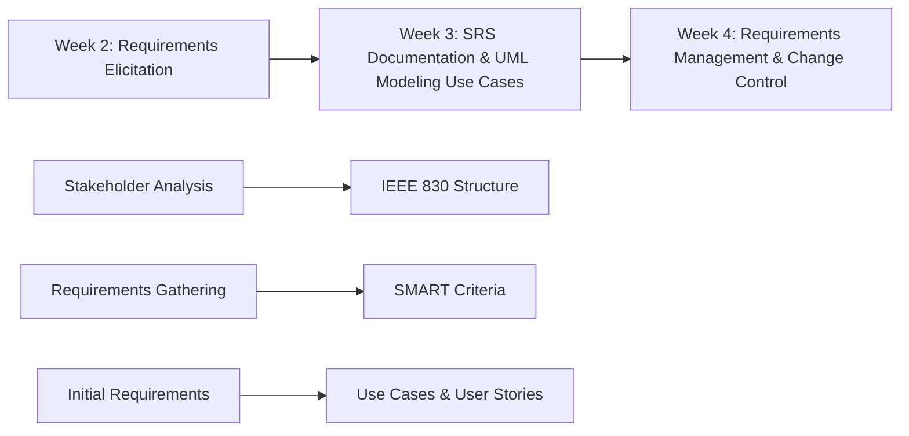
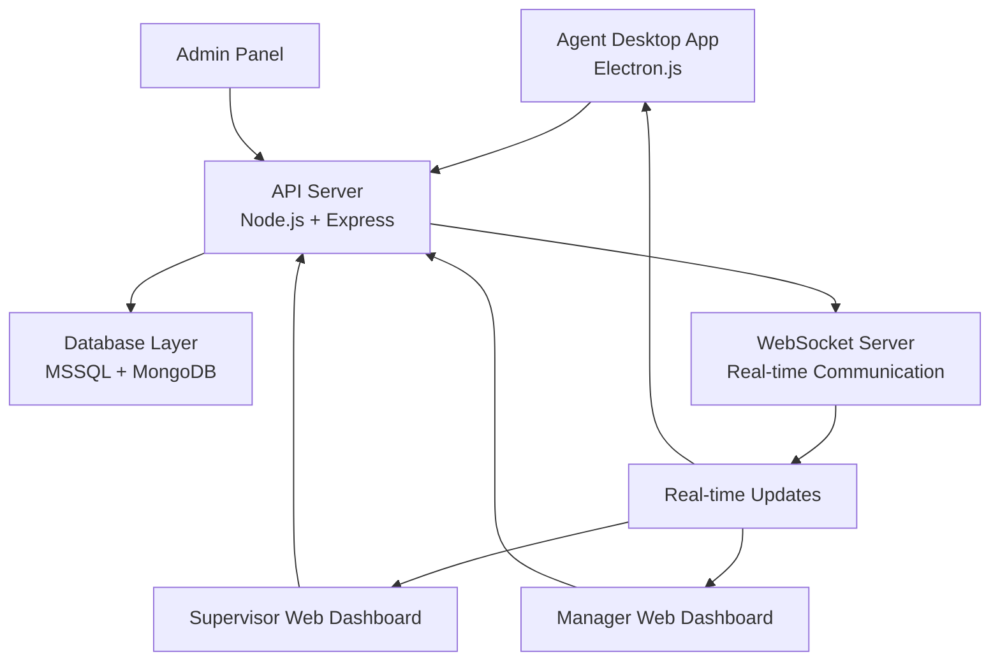
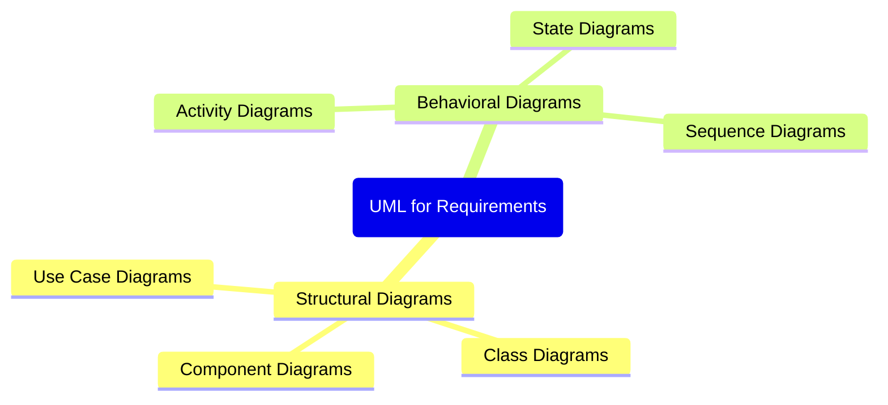
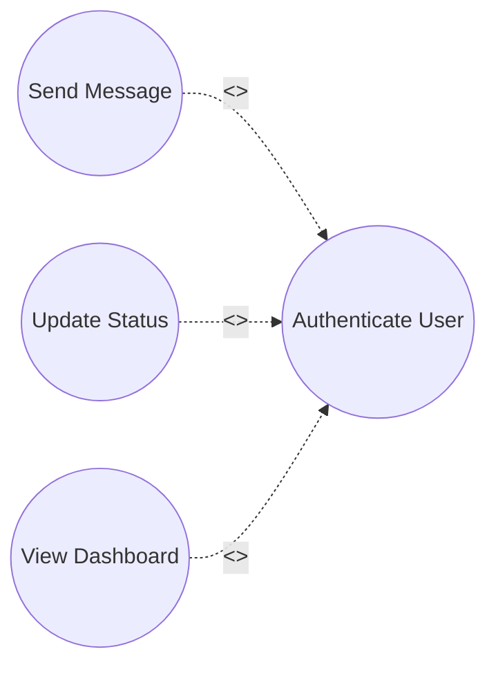
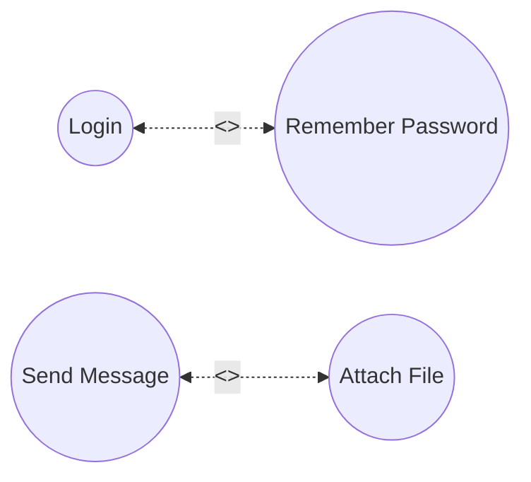
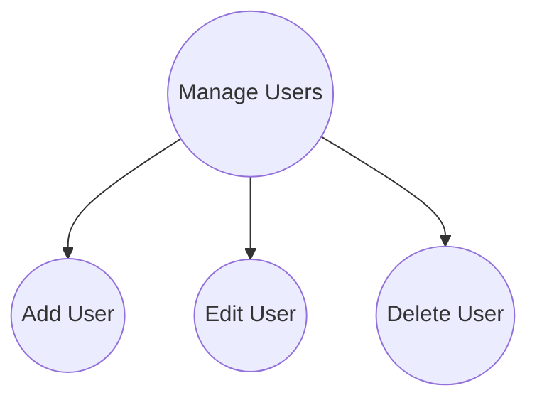
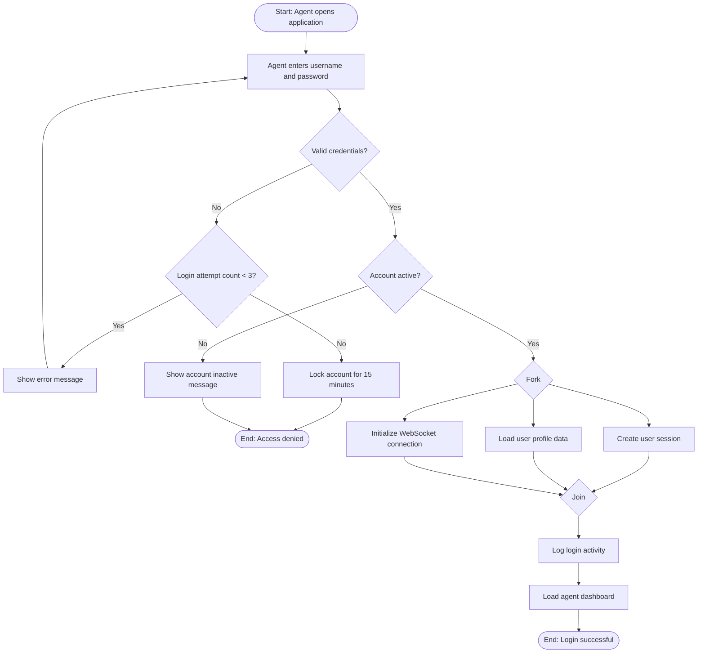

# ENGSE206: Software Requirements Specification and Design
## สัปดาห์ที่ 3: การเขียนเอกสารความต้องการ (SRS) และ UML Modeling
### มหาวิทยาลัยเทคโนโลยีราชมงคลล้านนา (ดอยสะเก็ด)
#### อาจารย์ประจำหลักสูตรวิศวกรรมซอฟต์แวร์ - ระดับปริญาตรี

---

## Slide 1: Course Information & Introduction
### รายละเอียดรายวิชา

**รหัสวิชา:** ENGSE206  
**ชื่อวิชา:** Software Requirements Specification and Design  
**หน่วยกิต:** 3(2-3-6)  
**ภาคการศึกษา:** 1/2568 

**อาจารย์ผู้สอน:** [ธนิต เกตุแก้ว]  
**ตำแหน่ง:** อาจารย์ประจำภาควิชาวิศวกรรมซอฟต์แวร์

**วันเวลาเรียน:** [วันศุกร์เวลา 8:00-18:00]  
**ห้องเรียน:** [C-405]  

**📋 สัปดาห์ที่ 3 Overview:**
- เขียนเอกสาร SRS ตามมาตรฐาน IEEE 830
- สร้าง UML Models สำหรับ Requirements
- กรณีศึกษา: Agent Wallboard System
- Hands-on Workshops และ Practical Exercises

---

## Slide 2: Week 3 Learning Objectives & Outcomes
### 🎯 วัตถุประสงค์และผลลัพธ์การเรียนรู้

**เมื่อจบสัปดาห์ที่ 3 นักศึกษาจะสามารถ:**

**1. ความรู้ (Knowledge - K)**
- K1: อธิบายโครงสร้างและองค์ประกอบของ SRS ตาม IEEE 830
- K2: แยกแยะความแตกต่างระหว่าง Functional และ Non-functional Requirements
- K3: เข้าใจหลักการและประเภทของ UML diagrams สำหรับ requirements

**2. ทักษะ (Skills - S)**
- S1: เขียนเอกสาร SRS ที่มีคุณภาพตาม SMART criteria
- S2: สร้าง Use Case Diagrams และ Activity Diagrams
- S3: เขียน User Stories พร้อม Acceptance Criteria แบบ Given-When-Then

**3. คุณลักษณะ (Attributes - A)**
- A1: คิดวิเคราะห์และแก้ไขปัญหาเชิงระบบ
- A2: สื่อสารและทำงานร่วมกับทีมได้อย่างมีประสิทธิภาพ
- A3: มีจิตสำนึกในการสร้างเอกสารที่มีคุณภาพ

**🎯 กรณีศึกษาหลัก:** Agent Wallboard System for Call Center Operations

---

## Slide 3: Review from Week 2 & Connection
### ทบทวนสัปดาห์ที่ 2 และการเชื่อมต่อ

**📚 สิ่งที่เราได้เรียนรู้ในสัปดาห์ที่ 2:**
- Requirements Engineering Process และ Lifecycle
- Stakeholder Analysis และ Elicitation Techniques
- Requirements Classification: Functional vs Non-functional
- Initial Requirements Gathering สำหรับ Agent Wallboard System

**🔗 การเชื่อมต่อสู่สัปดาห์ที่ 3:**


**📋 Agent Wallboard System Context (ต่อจากสัปดาห์ที่ 2):**
- ✅ Stakeholders: Agents, Supervisors, Managers, Admins
- ✅ High-level Requirements: Real-time monitoring, Communication
- ✅ System Boundaries และ Constraints

**📌 วันนี้:** จัดระเบียบเป็นเอกสาร SRS และสร้าง UML models

---

## Slide 4: What is Software Requirements Specification (SRS)?
### เอกสารความต้องการซอฟต์แวร์คืออะไร?

**🔍 คำจำกัดความ:**
> เอกสารที่อธิบายอย่างละเอียดและครบถ้วนเกี่ยวกับพฤติกรรม ฟังก์ชันการทำงาน ข้อจำกัด และคุณลักษณะที่ต้องการของระบบซอฟต์แวร์ที่จะพัฒนา

**🎯 วัตถุประสงค์หลัก:**
1. **สื่อสาร (Communication):** ถ่ายทอดความต้องการระหว่าง stakeholders
2. **เป็นพื้นฐาน (Foundation):** สำหรับการออกแบบ พัฒนา และทดสอบ
3. **เป็นเกณฑ์ (Criteria):** สำหรับการ validation และ acceptance
4. **ควบคุมขอบเขต (Scope Control):** จำกัดและกำหนดขอบเขตโปรเจกต์
5. **สัญญา (Contract):** ข้อตกลงทางกฎหมายระหว่างผู้พัฒนาและลูกค้า

**👥 ผู้ใช้เอกสาร SRS:**
- **นักพัฒนา (Developers):** พัฒนาระบบตาม specifications
- **นักทดสอบ (Testers):** สร้าง test plans และ test cases
- **ลูกค้า (Clients):** ตรวจสอบความถูกต้องและครบถ้วน
- **Project Managers:** ประเมินเวลา ต้นทุน และความซับซ้อน
- **System Architects:** ออกแบบ architecture และ components
- **Maintenance Teams:** ดูแลและปรับปรุงระบบ

---

## Slide 5: IEEE 830 Standard - Overview & Importance
### มาตรฐาน IEEE 830 - ภาพรวมและความสำคัญ

**📜 IEEE Standard 830-1998:**
> "IEEE Recommended Practice for Software Requirements Specifications"

**⭐ ทำไมต้องใช้ IEEE 830:**
1. **มาตรฐานสากล:** ยอมรับทั่วโลกในอุตสาหกรรมซอฟต์แวร์
2. **โครงสร้างชัดเจน:** Template ที่ได้รับการพิสูจน์แล้ว
3. **คุณภาพสม่ำเสมอ:** หลักเกณฑ์คุณภาพที่กำหนดไว้
4. **ลดความเสี่ยง:** ป้องกันปัญหาจากความไม่เข้าใจ
5. **มาตรฐานการสื่อสาร:** ภาษากลางสำหรับทีมพัฒนา

**📊 IEEE 830 Structure (3 Sections หลัก):**
```
📋 Software Requirements Specification (IEEE 830)
├── 1. Introduction (บทนำ)
│   ├── 1.1 Purpose (วัตถุประสงค์)
│   ├── 1.2 Scope (ขอบเขต)
│   ├── 1.3 Definitions, Acronyms, Abbreviations
│   ├── 1.4 References (เอกสารอ้างอิง)
│   └── 1.5 Overview (ภาพรวม)
├── 2. Overall Description (คำอธิบายโดยรวม)
│   ├── 2.1 Product Perspective (มุมมองผลิตภัณฑ์)
│   ├── 2.2 Product Functions (ฟังก์ชันของผลิตภัณฑ์)
│   ├── 2.3 User Characteristics (ลักษณะผู้ใช้)
│   ├── 2.4 Constraints (ข้อจำกัด)
│   └── 2.5 Assumptions and Dependencies
└── 3. Specific Requirements (ความต้องการเฉพาะ)
    ├── 3.1 Functional Requirements
    ├── 3.2 Non-functional Requirements
    └── 3.3 External Interface Requirements
```

---

## Slide 6: IEEE 830 Quality Characteristics - The 8 Criteria
### คุณลักษณะคุณภาพตาม IEEE 830 - 8 เกณฑ์

**📏 8 คุณลักษณะสำคัญของ SRS ที่มีคุณภาพ:**

| #️⃣ | คุณลักษณะ | คำอธิบาย | ตัวอย่าง Agent Wallboard |
|-----|-----------|----------|---------------------------|
| 1️⃣ | **Correct** | สอดคล้องกับความต้องการจริงของ stakeholders | Requirements ผ่านการยืนยันจาก supervisors |
| 2️⃣ | **Unambiguous** | มีความหมายเดียว ไม่คลุมเครือ | "Login ภายใน 2 วินาที" แทน "Login เร็ว" |
| 3️⃣ | **Complete** | ครบถ้วนทุก requirements ที่จำเป็น | ครอบคลุมทั้ง functional และ non-functional |
| 4️⃣ | **Consistent** | ไม่ขัดแย้งกันภายในเอกสาร | UI mockups สอดคล้องกับ requirements |
| 5️⃣ | **Ranked** | จัดลำดับความสำคัญได้ | HIGH, MEDIUM, LOW priorities |
| 6️⃣ | **Verifiable** | สามารถทดสอบและวัดผลได้ | มี testable acceptance criteria |
| 7️⃣ | **Modifiable** | แก้ไขและปรับปรุงได้ง่าย | โครงสร้างชัดเจน มี traceability |
| 8️⃣ | **Traceable** | ตามรอยถึงที่มาและไปได้ | Requirements ↔ Design ↔ Code ↔ Tests |

**❌ ตัวอย่างไม่ดี (Poor Quality):**
- "ระบบต้องเร็ว" (ไม่ชัดเจน)
- "ผู้ใช้จะพอใจ" (ทดสอบไม่ได้)

**✅ ตัวอย่างดี (Good Quality):**
- "API response time ไม่เกิน 500ms สำหรับ 95% ของ requests"
- "User satisfaction score ≥ 4.0/5.0 จาก usability survey"

---

## Slide 7: SMART Criteria for Requirements Writing
### เกณฑ์ SMART สำหรับการเขียน Requirements

**🎯 S.M.A.R.T Framework สำหรับ High-Quality Requirements:**

| ตัวอักษร | คำเต็ม | คำอธิบาย | Agent Wallboard Example |
|----------|--------|----------|-------------------------|
| **S** | **Specific** | ชัดเจน เจาะจง ไม่คลุมเครือ | "Agent สามารถเปลี่ยนสถานะเป็น Available, Busy, Break, Lunch" |
| **M** | **Measurable** | วัดผลได้ มีเกณฑ์ชัดเจน | "Status update ต้องแสดงใน supervisor dashboard ภายใน 1 วินาที" |
| **A** | **Achievable** | ทำได้จริง ไม่เหลือเชื่อ | "รองรับ agents สูงสุด 100 คนพร้อมกันในระบบ" |
| **R** | **Relevant** | เกี่ยวข้องกับเป้าหมายธุรกิจ | "Real-time monitoring เพื่อเพิ่มประสิทธิภาพการทำงานของทีม" |
| **T** | **Time-bound** | มีกรอบเวลาที่กำหนด | "Login process ต้องเสร็จสมบูรณ์ภายใน 3 วินาที" |

**🔄 การประยุกต์ใช้ SMART ในการเขียน Requirements:**

**❌ ไม่เป็น SMART:**
```
"ระบบต้องใช้งานง่ายและรวดเร็ว"
```

**✅ เป็น SMART:**
```
"Supervisor สามารถส่งข้อความถึง Agent ได้ภายใน 3 คลิก
และ Agent ต้องได้รับข้อความภายใน 2 วินาที
โดยมี delivery success rate อย่างน้อย 98%"
```

**📝 แบบฝึกหัด:** แปลง requirement ต่อไปนี้ให้เป็น SMART
- "ระบบต้องปลอดภัย" → "ระบบต้องเข้ารหัสข้อมูลด้วย AES-256 และผ่าน security audit ภายใน 6 เดือน"

---

## Slide 8: Writing Best Practices for SRS
### แนวทางปฏิบัติที่ดีในการเขียน SRS

**✍️ หลักการเขียนที่มีประสิทธิภาพ:**

**1. ใช้ภาษาที่ชัดเจนและเฉพาะเจาะจง:**
```
❌ หลีกเลี่ยง: "ระบบอาจจะ", "น่าจะ", "บางครั้ง", "โดยประมาณ"
✅ ใช้: "ระบบต้อง", "ระบบจะ", "เมื่อ...ระบบแสดง", "ภายใน"
```

**2. หลีกเลี่ยงคำที่คลุมเครือ (Vague Terms):**

| ❌ คำคลุมเครือ | ✅ คำที่ชัดเจน | ตัวอย่าง |
|----------------|----------------|----------|
| "เร็ว" | "ภายใน X วินาที" | "Response time < 2 seconds" |
| "ใช้งานง่าย" | "X คลิก หรือ X ขั้นตอน" | "Login ใน 2 คลิก" |
| "ปลอดภัย" | "เข้ารหัสด้วย X" | "AES-256 encryption" |
| "เสถียร" | "Uptime X%" | "99.5% availability" |
| "หลายคน" | "จำนวนชัดเจน" | "รองรับ 100 concurrent users" |

**3. โครงสร้างที่สม่ำเสมอ (Consistent Structure):**
```markdown
FR-XXX: [ชื่อ Requirement]
Description: [คำอธิบายละเอียด]
Priority: [HIGH/MEDIUM/LOW]
Rationale: [เหตุผล/จุดประสงค์]
Source: [แหล่งที่มา - stakeholder, document]

Acceptance Criteria:
  - Given: [สถานการณ์เริ่มต้น]
  - When: [เงื่อนไข/การกระทำ]  
  - Then: [ผลลัพธ์ที่คาดหวัง]

Dependencies: [Requirements อื่นที่เกี่ยวข้อง]
Assumptions: [สมมติฐาน]
Constraints: [ข้อจำกัด]
```

**4. ใช้ Active Voice แทน Passive Voice:**
- ❌ "Messages will be sent by the system" 
- ✅ "System sends messages to agents"

---

## Slide 9: Agent Wallboard SRS - Section 1: Introduction
### ตัวอย่าง SRS - ส่วนที่ 1: บทนำ

**📋 Section 1: Introduction สำหรับ Agent Wallboard System**

**1.1 Purpose (วัตถุประสงค์)**
```markdown
เอกสาร Software Requirements Specification (SRS) ฉบับนี้มีวัตถุประสงค์เพื่อ:

1. อธิบายความต้องการเชิงหน้าที่ (Functional Requirements) และ
   ความต้องการเชิงคุณภาพ (Non-functional Requirements) ของระบบ 
   Agent Wallboard System

2. กำหนดขอบเขตการทำงานและข้อจำกัดของระบบ

3. เป็นเอกสารอ้างอิงสำหรับการออกแบบ พัฒนา และทดสอบระบบ

Target Audiences:
- ทีมพัฒนา (Development Team)
- ทีมทดสอบ (Quality Assurance Team)  
- Stakeholders (Supervisors, Operations Managers)
- System Administrators
- Project Managers และ Business Analysts
```

**1.2 Scope (ขอบเขต)**
```markdown
ระบบ Agent Wallboard System เป็นโซลูชันสำหรับการติดตาม
และจัดการการทำงานของ call center agents แบบ real-time

✅ ภายในขอบเขต (In Scope):
- Agent status monitoring และ tracking แบบ real-time
- Bidirectional communication ระหว่าง supervisors และ agents  
- Management dashboard สำหรับ operations oversight
- User authentication, authorization และ session management
- Desktop application สำหรับ agents
- Web-based dashboard สำหรับ supervisors และ managers
- Real-time notifications และ alert system
- Basic reporting และ analytics

❌ นอกขอบเขต (Out of Scope):
- Call routing หรือ PBX system integration
- Customer relationship management (CRM) features
- Payroll, HR management หรือ employee records
- Mobile applications สำหรับ smartphones/tablets
- Advanced analytics หรือ machine learning features
- Integration กับ external third-party systems
```

---

## Slide 10: Agent Wallboard SRS - Section 1 Continued
### ตัวอย่าง SRS - ส่วนที่ 1: บทนำ (ต่อ)

**1.3 Definitions, Acronyms, and Abbreviations**

**🔤 คำจำกัดความ (Definitions):**

| คำศัพท์ | คำจำกัดความ |
|--------|-------------|
| **Agent** | พนักงาน call center ที่ใช้งาน desktop application เพื่อรับสายและปฏิบัติงาน |
| **Supervisor** | หัวหน้าทีมที่ดูแลและติดตาม agents รวมถึงสื่อสารกับ agents |
| **Operations Manager** | ผู้จัดการระดับสูงที่ดูภาพรวมการดำเนินงานของ call center |
| **System Administrator** | ผู้ดูแลระบบ IT และการ configuration ต่างๆ |
| **Wallboard** | หน้าจอแสดงสถานะของ agents แบบ real-time |
| **Real-time** | การอัปเดตข้อมูลที่มีความหน่วงเวลาไม่เกิน 5 วินาที |
| **Status** | สถานะปัจจุบันของ agent เช่น Available, Busy, Break, Lunch |
| **Session** | ช่วงเวลาที่ผู้ใช้ login และใช้งานระบบ |

**🔤 คำย่อ (Acronyms):**

| คำย่อ | ความหมายเต็ม |
|-------|---------------|
| **SRS** | Software Requirements Specification |
| **API** | Application Programming Interface |
| **UI/UX** | User Interface/User Experience |
| **MSSQL** | Microsoft SQL Server |
| **HTTP/HTTPS** | HyperText Transfer Protocol (Secure) |
| **WebSocket** | Protocol สำหรับการสื่อสาร real-time bidirectional |
| **JSON** | JavaScript Object Notation |
| **SSL/TLS** | Secure Sockets Layer/Transport Layer Security |
| **JWT** | JSON Web Token |
| **REST** | REpresentational State Transfer |

**1.4 References (เอกสารอ้างอิง)**
```markdown
• IEEE Std 830-1998 - IEEE Recommended Practice for Software Requirements Specifications
• RFC 6455 - The WebSocket Protocol  
• RFC 7519 - JSON Web Token (JWT)
• ENGSE206 Course Materials - Software Requirements and Design
• Agent Wallboard System - Project Charter and Initial Requirements
• Call Center Operations Manual - Business Process Documentation
```

---

## Slide 11: Agent Wallboard SRS - Section 2: Overall Description
### ตัวอย่าง SRS - ส่วนที่ 2: คำอธิบายโดยรวม

**📊 Section 2: Overall Description**

**2.1 Product Perspective (มุมมองผลิตภัณฑ์)**


**2.2 Product Functions (ฟังก์ชันของผลิตภัณฑ์)**
```markdown
หน้าที่หลักของระบบ:

🔐 Authentication & Authorization:
- User login/logout พร้อม role-based access control
- Session management และ security

📊 Real-time Monitoring:
- Agent status tracking (Available, Busy, Break, etc.)
- Live dashboard updates สำหรับ supervisors
- Real-time notifications และ alerts

💬 Communication:
- Instant messaging ระหว่าง supervisors และ agents
- Broadcast messages ถึงทีมหรือกลุ่ม agents
- Emergency notifications

📈 Management & Reporting:
- Performance dashboards สำหรับ managers
- Basic analytics และ trend reporting
- Agent productivity metrics

⚙️ System Administration:
- User management (add, edit, delete users)
- System configuration และ settings
- Database backup และ maintenance
```

**2.3 User Characteristics (ลักษณะผู้ใช้)**

| User Type | จำนวน | Technical Skill Level | Frequency of Use | Primary Tasks |
|-----------|--------|----------------------|------------------|---------------|
| **Agent** | 50-80 คน | Basic computer skills | ทุกวัน 8+ ชั่วโมง | Status updates, receive messages |
| **Supervisor** | 8-12 คน | Intermediate | ทุกวัน 6-8 ชั่วโมง | Monitor agents, send messages |
| **Operations Manager** | 2-4 คน | Basic-Intermediate | สัปดาห์ละ 3-4 วัน | View reports, analyze performance |
| **System Administrator** | 1-2 คน | Advanced technical | ตามความจำเป็น | System config, user management |

---

## Slide 12: Agent Wallboard SRS - Section 2 Continued
### ตัวอย่าง SRS - ส่วนที่ 2: คำอธิบายโดยรวม (ต่อ)

**2.4 Constraints (ข้อจำกัด)**

**🔧 Technical Constraints:**
```markdown
Platform Constraints:
• Operating System: Windows 10/11 (64-bit) เท่านั้น
• Database: Microsoft SQL Server 2019 หรือใหม่กว่า
• Web Browsers: Chrome 90+, Firefox 88+, Edge 90+ (สำหรับ web dashboard)
• Network: Corporate LAN เท่านั้น (ไม่มี internet access requirement)
• Hardware: Minimum 8GB RAM, dual-core processor per workstation

Performance Constraints:
• Maximum Concurrent Users: 100 users พร้อมกัน
• Response Time: API calls ต้อง < 500ms
• Real-time Latency: Status updates ต้อง < 1 second
• Database Size: Support up to 10GB operational data
• Network Bandwidth: Optimized for corporate LAN speeds

Data Retention Constraints:
• Operational Data: เก็บ 2 ปี
• Log Data: เก็บ 1 ปี
• Message History: เก็บ 6 เดือน
• Performance Metrics: เก็บ 3 ปี
```

**💰 Business & Organizational Constraints:**
```markdown
Budget Constraints:
• Development Budget: จำกัดสำหรับ custom development
• Infrastructure: ใช้ existing hardware และ network
• Licensing: ต้องพิจารณา cost ของ third-party licenses
• Training: Budget จำกัดสำหรับ user training

Timeline Constraints:
• Go-Live Date: ต้อง deploy ภายใน 6 เดือน
• Pilot Testing: 2 สัปดาห์ก่อน full deployment
• User Training: 1 สัปดาห์ก่อน go-live
• Parallel Running: ไม่สามารถทำได้ (no existing system)

Resource Constraints:
• Development Team: 4-5 developers maximum
• Testing Team: 2-3 testers  
• IT Support: 1-2 คน สำหรับ deployment และ maintenance
• User Availability: จำกัดเวลาสำหรับ testing และ feedback
```

**🔒 Security & Compliance Constraints:**
```markdown
Security Requirements:
• Data Encryption: ข้อมูลใน database ต้องเข้ารหัส
• Network Security: ใช้งานใน secured corporate network เท่านั้น
• Access Control: Role-based permissions strictly enforced
• Audit Trail: บันทึก user activities ทั้งหมด
• Password Policy: ตาม corporate security standards

Compliance Requirements:
• Data Protection: ตาม corporate data protection policy
• IT Security Standards: ผ่าน corporate security review
• Change Management: ตาม IT change management process
• Business Continuity: มี backup และ recovery procedures
```

**2.5 Assumptions and Dependencies (สมมติฐานและการพึ่งพา)**

**📋 Assumptions (สมมติฐาน):**
```markdown
Technical Assumptions:
• Corporate network infrastructure มีเสถียรภาพดี (99%+ uptime)
• Database server มี capacity เพียงพอสำหรับ concurrent access
• Workstations มี hardware specifications ที่เพียงพอ
• Internet connectivity ไม่จำเป็นสำหรับ daily operations
• Windows domain authentication service ทำงานปกติ

User Assumptions:
• Users มี basic computer literacy และ Windows experience
• Agents คุ้นเคยกับ desktop applications
• Supervisors มี experience กับ web-based dashboards
• IT support team มี skills สำหรับ system maintenance
• Users จะได้รับ training ก่อน system rollout

Business Assumptions:
• Call center operations จะคงรูปแบบการทำงานปัจจุบัน
• ไม่มีการเปลี่ยนแปลง major business processes ระหว่าง development
• Organization structure (Agent→Supervisor→Manager) จะไม่เปลี่ยน
• Budget approval จะได้รับตามแผนที่วางไว้
• Project stakeholders จะให้ cooperation throughout project
```

**🔗 Dependencies (การพึ่งพา):**
```markdown
External Dependencies:
• Microsoft SQL Server license และ installation
• Corporate Windows Domain infrastructure
• Network infrastructure และ security policies  
• Hardware procurement และ setup (if needed)
• Corporate IT policies และ approval processes

Internal Dependencies:
• User requirements finalization และ sign-off
• UI/UX design approval จาก stakeholders
• Database design และ schema approval
• Security review และ approval จาก IT security team
• User acceptance testing และ feedback incorporation

Operational Dependencies:
• IT department สำหรับ system deployment และ ongoing support
• User training programs สำหรับ successful adoption
• Change management process สำหรับ smooth transition
• Backup and recovery procedures implementation
• System monitoring และ maintenance procedures setup
```

**📊 Risk Mitigation for Dependencies:**
```markdown
High-Risk Dependencies:
• Database Infrastructure → Backup plan: Cloud database option
• Network Stability → Mitigation: Offline mode capabilities
• User Adoption → Strategy: Comprehensive training program

Medium-Risk Dependencies:
• Hardware Capacity → Monitoring: Performance testing throughout development
• Security Approval → Early Engagement: Security review in design phase
```

---

## Slide 13: Functional Requirements - Structure & Template
### โครงสร้างและแม่แบบ Functional Requirements

**📝 มาตรฐานการเขียน Functional Requirements:**

**Template ที่ใช้:**
```markdown
FR-XXX: [Requirement Name - ใช้ verb phrase ที่ชัดเจน]
Description: [รายละเอียดความต้องการที่ชัดเจนและครบถ้วน]
Priority: [HIGH/MEDIUM/LOW] 
Rationale: [เหตุผล/จุดประสงค์ทางธุรกิจที่ชัดเจน]
Source: [ที่มาของ requirement - stakeholder, document, regulation]

Acceptance Criteria:
- Given [initial context/state - สถานการณ์เริ่มต้น]
  When [event/action occurs - การกระทำหรือเหตุการณ์]
  Then [expected outcome/result - ผลลัพธ์ที่คาดหวัง]
  
- Given [alternative context - สถานการณ์ทางเลือก]
  When [different action - การกระทำที่แตกต่าง]
  Then [different outcome - ผลลัพธ์ที่แตกต่าง]

Dependencies: [Requirements อื่นที่ต้องมีก่อนหรือเกี่ยวข้อง]
Assumptions: [สมมติฐานที่สำคัญต่อ requirement นี้]
Constraints: [ข้อจำกัดเฉพาะสำหรับ requirement นี้]
Related Use Cases: [UC-XXX ที่เกี่ยวข้อง]
Verification Method: [วิธีการทดสอบและตรวจสอบ]
```

**🗂️ การจัดกลุ่ม Functional Requirements:**

| กลุ่ม | Range | จำนวน | คำอธิบาย | ตัวอย่าง |
|-------|--------|--------|----------|----------|
| **Authentication & Security** | FR-001 to FR-003 | 3 | User login, authorization, session | User Login, Role Authorization |
| **Real-time Monitoring** | FR-004 to FR-007 | 4 | Status tracking, dashboard updates | Agent Status Update, Live Dashboard |
| **Communication** | FR-008 to FR-010 | 3 | Messaging, notifications | Instant Messaging, Notifications |
| **Management & Reporting** | FR-011 to FR-013 | 3 | Dashboards, reports, analytics | Performance Dashboard, Reports |
| **System Administration** | FR-014 to FR-016 | 3 | User management, configuration | User Management, System Config |

**🔗 Traceability Framework:**
```
Business Need → Functional Requirement → Use Case → User Story → Test Case → Code
```

**✅ Quality Checklist สำหรับแต่ละ FR:**
```markdown
Content Quality:
□ เป็นไปตาม SMART criteria (Specific, Measurable, Achievable, Relevant, Time-bound)
□ มี clear และ testable acceptance criteria
□ ระบุ priority level พร้อมเหตุผล
□ มี rationale ที่เชื่อมโยงกับ business goal
□ ไม่ขัดแย้งกับ requirements อื่น (consistency check)

Structure Quality:
□ ใช้ template ที่กำหนดอย่างสม่ำเสมอ
□ มี unique identifier (FR-XXX)
□ Dependencies และ assumptions ระบุครบถ้วน
□ Verification method ชัดเจน
□ Traceability links ครบถ้วน

Language Quality:
□ ใช้ active voice
□ หลีกเลี่ยงคำคลุมเครือ
□ เขียนในมุมมองของ user/business
□ ใช้คำศัพท์ที่สม่ำเสมอ (consistency)
□ เข้าใจง่าย สำหรับ non-technical stakeholders
```

**📊 Requirements Prioritization Matrix:**

| Priority | Definition | Criteria | Agent Wallboard Examples |
|----------|------------|----------|---------------------------|
| **HIGH** | Must-have สำหรับ MVP | • Core business functionality<br/>• Legal/compliance requirement<br/>• High business value | FR-001 (Authentication)<br/>FR-004 (Agent Status)<br/>FR-008 (Messaging) |
| **MEDIUM** | Should-have สำหรับ full system | • Important but not critical<br/>• Enhances user experience<br/>• Moderate business value | FR-011 (Reporting)<br/>FR-006 (Profile Management) |
| **LOW** | Could-have สำหรับ future versions | • Nice-to-have features<br/>• Minor enhancements<br/>• Low immediate business value | FR-016 (Advanced Config)<br/>FR-013 (Data Export) |

---

## Slide 14: Example Functional Requirements - Authentication
### ตัวอย่าง Functional Requirements - การยืนยันตัวตน

**🔐 FR-001: User Authentication**
```markdown
FR-001: User Authentication
Description: ระบบต้องมีการตรวจสอบและยืนยันตัวตนของผู้ใช้
ก่อนอนุญาตให้เข้าใช้งานระบบ

Priority: HIGH
Rationale: รักษาความปลอดภัยของข้อมูลและควบคุมการเข้าถึงระบบ
Source: Operations Manager, Security Policy Document

Acceptance Criteria:
- Given ผู้ใช้เปิด Agent Wallboard application
  When กรอก username และ password ที่ถูกต้อง
  Then เข้าสู่หน้าหลักของระบบได้ภายใน 2 วินาที
  
- Given ผู้ใช้กรอกข้อมูลเข้าสู่ระบบผิด
  When พยายาม login ครั้งที่ 3
  Then แสดงข้อความ error และ lock account เป็นเวลา 15 นาที
  
- Given user session หมดอายุ (idle 30 นาที)
  When พยายามทำงานต่อ
  Then redirect ไปหน้า login อัตโนมัติ

Dependencies: FR-015 (Database Connection)
Assumptions: Windows domain authentication พร้อมใช้งาน
Constraints: ต้องใช้ corporate credentials
Related Use Cases: UC-001
```

**🔐 FR-002: Role-based Authorization**
```markdown
FR-002: Role-based Authorization  
Description: ระบบต้องควบคุมการเข้าถึงฟีเจอร์ต่างๆ ตามบทบาทของผู้ใช้

Priority: HIGH
Rationale: แยกสิทธิ์การเข้าถึงตาม job responsibilities

Acceptance Criteria:
- Given Agent login สำเร็จ
  When พยายามเข้าถึง supervisor dashboard
  Then แสดงข้อความ "Access Denied"
  
- Given Supervisor login สำเร็จ
  When เข้าถึง agent monitoring features
  Then สามารถดูข้อมูลทั้งหมดในทีมได้

Dependencies: FR-001 (Authentication)
Related Use Cases: UC-001, UC-006
```

---

## Slide 15: Example Functional Requirements - Real-time Features
### ตัวอย่าง Functional Requirements - ฟีเจอร์ Real-time

**📊 FR-004: Agent Status Management**
```markdown
FR-004: Agent Status Management
Description: Agent สามารถเปลี่ยนสถานะการทำงานของตนเอง
และระบบต้องอัปเดตข้อมูลแบบ real-time

Priority: HIGH  
Rationale: ให้ supervisor ติดตามความพร้อมของ agents เพื่อ
จัดสรรงานและปรับปรุงประสิทธิภาพ

Source: Supervisor requirements gathering session

Acceptance Criteria:
- Given Agent login สำเร็จแล้ว
  When เปลี่ยนสถานะจาก "Available" → "Busy" 
  Then สถานะใหม่แสดงใน supervisor wallboard ภายใน 1 วินาที
  
- Given Agent อยู่ในสถานะ "Break"
  When เวลาผ่านไป 15 นาที (break time limit)
  Then ระบบส่ง notification ให้ supervisor อัตโนมัติ
  
- Given มี network connectivity issues
  When การเชื่อมต่อขาดหาย > 10 วินาที
  Then ระบบแสดง agent status เป็น "Offline" ใน wallboard

Dependencies: FR-001 (Authentication), FR-012 (WebSocket Communication)
Assumptions: Network latency < 100ms ภายใน corporate LAN
Related Use Cases: UC-002, UC-003
```

**📱 FR-005: Real-time Dashboard Updates**
```markdown  
FR-005: Real-time Dashboard Updates
Description: Supervisor dashboard ต้องแสดงการเปลี่ยนแปลงสถานะ
ของ agents แบบ real-time โดยไม่ต้อง refresh หน้าเว็บ

Priority: HIGH
Rationale: ให้ supervisor มีข้อมูลปัจจุบันเพื่อตัดสินใจได้ทันท่วงที

Acceptance Criteria:
- Given Supervisor เปิด dashboard
  When มี agent เปลี่ยนสถานะ
  Then dashboard อัปเดตโดยอัตโนมัติภายใน 2 วินาที
  
- Given dashboard แสดงข้อมูล 20 agents
  When agents หลายคนเปลี่ยนสถานะพร้อมกัน
  Then ทุกการเปลี่ยนแปลงแสดงครบถ้วน ไม่มีข้อมูลหาย
  
- Given เกิด network interruption 5 วินาที
  When connection กลับมา
  Then dashboard sync ข้อมูลล่าสุดทันทีอัตโนมัติ

Dependencies: FR-004 (Agent Status), FR-012 (WebSocket)
Related Use Cases: UC-003
```

---

## Slide 16: Example Functional Requirements - Communication
### ตัวอย่าง Functional Requirements - การสื่อสาร

**💬 FR-008: Instant Messaging**
```markdown
FR-008: Instant Messaging
Description: Supervisor สามารถส่งข้อความถึง agents แบบ real-time
และ agents สามารถตอบกลับได้

Priority: HIGH
Rationale: เพื่อการสื่อสารที่รวดเร็วและมีประสิทธิภาพในการทำงาน
โดยไม่รบกวนการรับสายของ agents

Source: Supervisor และ Agent feedback sessions

Acceptance Criteria:
- Given Supervisor เลือก agent จาก contact list
  When พิมพ์ข้อความและกด "Send"
  Then ข้อความถึง agent ภายใน 2 วินาที
  
- Given Agent ได้รับข้อความจาก supervisor  
  When พิมพ์ reply และกด enter
  Then supervisor เห็น reply ภายใน 2 วินาที
  
- Given Agent อยู่ในสถานะ "Busy" (on call)
  When supervisor ส่งข้อความ
  Then ข้อความถูกส่ง แต่ไม่แสดง popup notification
  
- Given ข้อความยาวกว่า 500 characters
  When พยายามส่ง
  Then แสดง warning และไม่อนุญาตให้ส่ง

Dependencies: FR-001 (Authentication), FR-012 (WebSocket)
Constraints: ข้อความสูงสุด 500 characters, ไม่รองรับไฟล์แนบ
Related Use Cases: UC-004, UC-005
```

**🔔 FR-009: Notification System**
```markdown
FR-009: Notification System  
Description: ระบบต้องส่ง notifications สำหรับเหตุการณ์สำคัญ
ให้กับผู้ใช้ที่เกี่ยวข้อง

Priority: HIGH
Rationale: แจ้งเตือนสถานการณ์ที่ต้องการความสนใจทันที

Acceptance Criteria:
- Given Agent ไม่เปลี่ยนสถานะมาเกิน 45 นาที
  When system detect idle status
  Then ส่ง notification ให้ supervisor
  
- Given มี urgent broadcast message
  When supervisor ส่ง urgent message
  Then ทุก agents ได้รับ popup notification ทันที
  
- Given system performance drop below threshold
  When server response time > 1 second  
  Then ส่ง alert ให้ system administrator

Dependencies: FR-008 (Messaging)
Related Use Cases: UC-005
```

---

## Slide 17: Non-functional Requirements Categories
### หมวดหมู่ของ Non-functional Requirements

**⚡ หมวดหมู่ Non-functional Requirements สำหรับ Agent Wallboard:**

| หมวดหมู่ | เป้าหมาย | ตัวอย่าง Requirements | วิธีวัด/ทดสอบ |
|----------|----------|---------------------|---------------|
| **Performance** | ความเร็วและการตอบสนอง | API response < 500ms | Load testing, Performance monitoring |
| **Scalability** | รองรับปริมาณผู้ใช้ | 100 concurrent users | Stress testing, Capacity planning |
| **Reliability** | ความเสถียรและพร้อมใช้ | 99.5% uptime | System monitoring, MTBF calculation |
| **Security** | ความปลอดภัยข้อมูล | Data encryption, Access control | Security audit, Penetration testing |
| **Usability** | ความง่ายในการใช้งาน | Learning curve < 1 day | User testing, Usability evaluation |
| **Compatibility** | การรองรับแพลตฟอร์ม | Windows 10/11, Modern browsers | Platform testing, Compatibility matrix |
| **Maintainability** | ความง่ายในการบำรุง | Code documentation, Modular design | Code review, Maintenance metrics |

**📊 การวัดและประเมิน NFR:**

**Performance Metrics:**
```
• Response Time: 95th percentile < 500ms
• Throughput: > 1000 requests/second  
• Resource Usage: CPU < 70%, Memory < 4GB
```

**Reliability Metrics:**
```  
• Availability: 99.5% (4.3 hours downtime/month)
• MTBF (Mean Time Between Failures): > 720 hours
• MTTR (Mean Time To Recovery): < 30 minutes
```

**Security Metrics:**
```
• Vulnerability Score: 0 critical, < 5 medium
• Password Policy: Minimum 8 chars, complexity rules
• Session Timeout: 30 minutes idle, 8 hours maximum
```

---

## Slide 18: Example Non-functional Requirements
### ตัวอย่าง Non-functional Requirements

**⚡ NFR-001: Response Time Performance**
```markdown
NFR-001: Response Time Performance
Description: ระบบต้องตอบสนองคำขอของผู้ใช้ภายในเวลาที่กำหนด
เพื่อให้การทำงานเป็นไปอย่างราบรื่น

Priority: HIGH
Category: Performance

Specifications:
• API calls: < 500ms (95th percentile)
• Real-time status updates: < 1 second
• Dashboard page load: < 3 seconds  
• Database queries: < 200ms (average)
• WebSocket message delivery: < 100ms

Measurement Method: 
• Performance monitoring tools (New Relic, Datadog)
• Load testing with JMeter หรือ Artillery
• Real user monitoring (RUM)

Test Conditions:
• 50 concurrent users (normal load)
• 100 concurrent users (peak load)
• Network latency: < 50ms (corporate LAN)

Acceptance Criteria:
- Given normal operating conditions (50 users)
  When user performs any API operation
  Then response time ≤ 500ms for 95% of requests
  
- Given peak load conditions (100 users)  
  When multiple users access dashboard simultaneously
  Then system maintains response time ≤ 1 second
```

**🔒 NFR-005: Data Security**
```markdown
NFR-005: Data Security
Description: ระบบต้องรักษาความปลอดภัยของข้อมูลและการเข้าถึง

Priority: HIGH  
Category: Security

Specifications:
• Data Encryption: AES-256 for data at rest
• Transport Security: TLS 1.3 for all communications  
• Password Policy: Minimum 8 characters, complexity requirements
• Session Management: 30-minute idle timeout, 8-hour maximum
• Access Logging: Complete audit trail of user actions

Compliance Requirements:
• Corporate security standards
• Industry best practices for call center systems
• Data protection regulations

Acceptance Criteria:
- Given sensitive data stored in database
  When data is accessed unauthorized
  Then data appears encrypted and unreadable
  
- Given user session idle for 30 minutes
  When user tries to perform action  
  Then system redirects to login page
```

---

## Slide 19: Introduction to UML - Overview & Purpose
### รู้จักกับ UML - ภาพรวมและจุดประสงค์

**🎨 UML (Unified Modeling Language) คืออะไร?**
> ภาษามาตรฐานสากลสำหรับการสร้างแบบจำลอง (modeling) การออกแบบ และการบันทึกระบบซอฟต์แวร์

**🎯 จุดประสงค์หลักของ UML:**

| จุดประสงค์ | คำอธิบาย | ประโยชน์ |
|-----------|----------|----------|
| **สื่อสาร** | ถ่ายทอดความเข้าใจระหว่างทีม | ลดความเข้าใจผิด |
| **ออกแบบ** | วางแผนโครงสร้างก่อนเขียนโค้ด | ประหยัดเวลาพัฒนา |
| **บันทึก** | เก็บ architectural decisions | ง่ายต่อการบำรุงรักษา |
| **วิเคราะห์** | ศึกษาความซับซ้อนและความสัมพันธ์ | ป้องกันปัญหาล่วงหน้า |

**📊 UML Diagrams ที่เกี่ยวข้องกับ Requirements:**



**🔄 UML ในกระบวนการ Software Development:**
```
Requirements → UML Models → Design → Implementation → Testing
      ↑                                                    ↓
      └── Feedback & Refinement ←←←←←←←←←←←←←←←←←←←←←←←←←←←←←←
```

**💡 เมื่อไหร่ควรใช้ UML:**
- ✅ ระหว่างการ requirements analysis
- ✅ ก่อนเริ่ม detailed design  
- ✅ เมื่อต้องสื่อสารกับ stakeholders
- ✅ สำหรับ documentation และ maintenance
- ❌ ไม่จำเป็นสำหรับโปรเจกต์เล็กมาก
- ❌ ไม่ควรทำละเอียดจนเกินไป (over-modeling)

---

## Slide 20: Use Case Diagrams - Core Elements
### Use Case Diagrams - องค์ประกอบหลัก

**🎭 องค์ประกอบพื้นฐานของ Use Case Diagram:**

**1️⃣ Actor (นักแสดง):**
```
👤 หรือ 👥
- บุคคล, กลุ่มคน หรือระบบภายนอกที่มีปฏิสัมพันธ์กับระบบ
- วาดเป็นรูป stick figure
- ตั้งชื่อด้วย noun phrase
```

**2️⃣ Use Case (กรณีการใช้งาน):**
```
(  Use Case Name  )
- ฟังก์ชันหรือบริการที่ระบบให้แก่ actors
- วาดเป็นรูปวงรี (ellipse)  
- ตั้งชื่อด้วย verb phrase
```

**3️⃣ System Boundary (ขอบเขตระบบ):**
```
┌─────────────────────┐
│   System Name       │
│  (Use Cases here)   │
└─────────────────────┘
- กรอบแยกสิ่งที่อยู่ในระบบและนอกระบบ
- ช่วยกำหนด scope ที่ชัดเจน
```

**4️⃣ Associations (ความสัมพันธ์):**
```
Actor ————— Use Case
- เส้นตรงแสดงว่า actor ใช้ use case
- ไม่มีลูกศรในการ associate ปกติ
```

**📝 หลักการตั้งชื่อ:**
- **Actors:** Agent, Supervisor, System Administrator
- **Use Cases:** Login, Update Status, Send Message
- **System:** Agent Wallboard System

**✅ ตัวอย่างที่ดี:**
```
👤 Supervisor ——— ( Send Message )
👤 Agent ——————— ( Update Status )
```

**❌ สิ่งที่ควรหลีกเลี่ยง:**
```
👤 John ———————— ( Database ) ❌ (ชื่อเฉพาะ, technical detail)
👤 User ————————— ( System ) ❌ (คลุมเครือเกินไป)
```

---

## Slide 21: Use Case Relationships - Include, Extend, Generalization
### ความสัมพันธ์ใน Use Case - Include, Extend, Generalization

**🔗 ประเภทความสัมพันธ์ใน Use Case Diagrams:**

**1️⃣ Include Relationship (<<include>>)**

- ใช้เมื่อ use case หนึ่งต้องใช้ use case อื่น **เสมอ**
- Use case หลักไม่สามารถทำงานได้โดยไม่มี included use case
- **ตัวอย่าง:** ทุก use case ต้อง authenticate ก่อนเสมอ

**2️⃣ Extend Relationship (<<extend>>)**

- ใช้เมื่อเป็น **optional** หรือ **conditional** behavior  
- Use case หลักสามารถทำงานได้โดยไม่ต้องมี extending use case
- **ตัวอย่าง:** Remember password เป็น feature เสริมใน login

**3️⃣ Generalization (Inheritance)**

- Parent use case เป็น abstract/general version
- Child use cases เป็น specialized versions
- **ตัวอย่าง:** Manage Users → Add/Edit/Delete User

**🤔 เมื่อไหร่ใช้อะไร?**

| Relationship | เมื่อไหร่ใช้ | Agent Wallboard Example |
|--------------|-------------|-------------------------|
| **Include** | Common behavior ที่จำเป็น | Authentication สำหรับทุก feature |
| **Extend** | Optional features | File attachment ในการส่ง message |
| **Generalization** | กลุ่มของ related use cases | User management operations |

---

## Slide 22: Agent Wallboard - Complete Use Case Diagram
### Agent Wallboard - Use Case Diagram สมบูรณ์

```mermaid
graph TB
    %% Actors
    Agent[👤 Agent]
    Supervisor[👤 Supervisor] 
    Manager[👤 Operations Manager]
    Admin[👤 System Admin]
    
    %% System Boundary
    subgraph "Agent Wallboard System"
        %% Core Use Cases
        UC1((Login))
        UC2((Update Agent Status))
        UC3((View Real-time Dashboard))
        UC4((Send Instant Message))
        UC5((Receive Notification))
        UC6((Manage User Profile))
        UC7((Generate Reports))
        UC8((Broadcast Message))
        
        %% Admin Use Cases  
        UC9((Manage Users))
        UC10((System Configuration))
        UC11((Database Backup))
        UC12((View System Logs))
        
        %% Include relationships
        UC2 -.->|<<include>>| UC1
        UC3 -.->|<<include>>| UC1
        UC4 -.->|<<include>>| UC1
        UC6 -.->|<<include>>| UC1
        UC7 -.->|<<include>>| UC1
        UC8 -.->|<<include>>| UC1
        
        %% Extend relationships
        UC4 <-.->|<<extend>>| UC13((Message History))
        UC7 <-.->|<<extend>>| UC14((Export Report))
        
        %% Generalization
        UC9 --> UC15((Add User))
        UC9 --> UC16((Edit User))  
        UC9 --> UC17((Delete User))
    end
    
    %% Actor-Use Case Associations
    Agent --> UC1
    Agent --> UC2
    Agent --> UC3
    Agent --> UC5
    Agent --> UC6
    
    Supervisor --> UC1
    Supervisor --> UC3
    Supervisor --> UC4
    Supervisor --> UC5
    Supervisor --> UC6
    Supervisor --> UC7
    Supervisor --> UC8
    
    Manager --> UC1
    Manager --> UC3
    Manager --> UC6
    Manager --> UC7
    
    Admin --> UC1
    Admin --> UC9
    Admin --> UC10
    Admin --> UC11
    Admin --> UC12
```



**📊 Use Case Summary สำหรับ Agent Wallboard:**
- **Total Use Cases:** 17 use cases
- **Primary Actors:** 4 (Agent, Supervisor, Manager, Admin)
- **Core Features:** 8 main use cases
- **Admin Features:** 4 administrative use cases
- **Relationships:** 6 includes, 2 extends, 3 generalizations

---

## Slide 23: Use Case Description Template & Best Practices
### แม่แบบ Use Case Description และแนวทางปฏิบัติ

**📋 Template สำหรับ Use Case Description:**

```markdown
Use Case ID: UC-XXX
Use Case Name: [ชื่อ Use Case]
Primary Actor: [Actor หลักที่เริ่ม use case]
Secondary Actors: [Actors อื่นๆ ที่เกี่ยวข้อง]
Brief Description: [คำอธิบายสั้นๆ 1-2 ประโยค]

Preconditions: [เงื่อนไขที่ต้องเป็นจริงก่อนเริ่ม]
Postconditions: [สถานะหลังจาก use case สำเร็จ]

Main Success Scenario (Happy Path):
1. [Actor กระทำอะไร]
2. [System ตอบสนองอย่างไร]
3. [ขั้นตอนถัดไป...]
...
N. [ขั้นตอนสุดท้าย]

Alternative Flows:
A1. [ชื่อ alternative scenario]
  1a. [เงื่อนไขที่แตกต่าง]
  1b. [ขั้นตอนทางเลือก]
  1c. [กลับไปขั้นตอนหลัก]

Exception Flows:
E1. [ชื่อ exception scenario]  
  Xa. [เงื่อนไข error]
  Xb. [การจัดการ error]
  Xc. [ผลลัพธ์]

Special Requirements: [ข้อกำหนดพิเศษ เช่น performance, security]
Technology Notes: [ข้อมูล technical ที่เกี่ยวข้อง]
Frequency: [บ่อยแค่ไหนที่ใช้งาน]
```

**✍️ หลักการเขียนที่ดี:**

**1. ใช้ภาษาธรรมดา (Plain Language):**
- ❌ "System processes authentication credentials via LDAP"
- ✅ "System checks username and password"

**2. เขียนในมุมมองของ Actor:**
- ✅ "Agent selects status from dropdown"
- ❌ "Database updates status field"

**3. แต่ละขั้นตอนเป็น Goal-oriented:**
- ✅ "System displays confirmation message"  
- ❌ "System writes to log file"

**4. ระบุ Alternative และ Exception Flows:**
- ความต้องการการใช้งานที่แตกต่าง
- การจัดการข้อผิดพลาด
- Edge cases ที่สำคัญ

---

## Slide 24: Example Use Case Description - Agent Update Status
### ตัวอย่าง Use Case Description - Agent อัปเดตสถานะ

**📝 UC-002: Agent Update Status**

```markdown
Use Case ID: UC-002
Use Case Name: Agent Update Status  
Primary Actor: Agent
Secondary Actors: Supervisor (ผู้รับ real-time update)
Brief Description: Agent เปลี่ยนสถานะการทำงานปัจจุบัน 
(Available, Busy, Break, Lunch) เพื่อให้ supervisor ทราบความพร้อม

Preconditions: 
• Agent ต้อง login เข้าระบบสำเร็จแล้ว
• Agent desktop application เชื่อมต่อกับ server
• Agent มี valid session token

Postconditions:
• สถานะใหม่ของ agent บันทึกใน database
• Supervisor เห็นสถานะใหม่ใน real-time wallboard  
• System log บันทึกการเปลี่ยนแปลงพร้อม timestamp
• Agent เห็นสถานะปัจจุบันใน UI

Main Success Scenario:
1. Agent คลิกที่ status indicator ปัจจุบัน (เช่น "Available")
2. System แสดง dropdown menu ของ available statuses
   - Available (สีเขียว)
   - Busy (สีแดง) 
   - Break (สีเหลือง)
   - Lunch (สีส้ม)
3. Agent เลือก status ใหม่ (เช่น "Break")
4. System ส่งคำขอไปยัง API server
5. Server validate agent authorization และ session
6. Server อัปเดต agent status ใน database
7. Server ส
Assumptions: [สมมติฐาน]
Constraints: [ข้อจำกัด]
```

---

## Slide 25: Activity Diagrams - Purpose & Elements
### Activity Diagrams - จุดประสงค์และองค์ประกอบ

**🔄 Activity Diagram คืออะไร?**
> แผนภาพที่แสดงลำดับขั้นตอนการทำงาน (workflow) ของระบบ business process หรือ algorithm

**🎯 จุดประสงค์หลัก:**
1. **แสดง Business Workflow:** ขั้นตอนการทำงานในองค์กร
2. **อธิบาย Complex Use Cases:** Use cases ที่มีหลายเส้นทาง
3. **ออกแบบ Algorithms:** Logic ที่ซับซ้อน
4. **วิเคราะห์ Parallel Activities:** กิจกรรมที่ทำพร้อมกัน

**🧩 องค์ประกอบสำคัญของ Activity Diagrams:**

| สัญลักษณ์ | ชื่อ | ความหมาย | ตัวอย่างการใช้ |
|-----------|-----|----------|----------------|
| ⚫ | **Initial Node** | จุดเริ่มต้นของ activity | เริ่มต้น login process |
| ⦿ | **Final Node** | จุดสิ้นสุดของ activity | Login สำเร็จหรือล้มเหลว |
| □ | **Activity** | กิจกรรมหรือขั้นตอนการทำงาน | "Enter credentials", "Validate user" |
| ◇ | **Decision Node** | จุดตัดสินใจ (if-else) | "Valid credentials?" |
| ◇ | **Merge Node** | รวมเส้นทางที่แยกจาก decision | รวม success/failure paths |
| ▬ | **Fork** | แยกเป็นกิจกรรมขนาน | ทำหลายงานพร้อมกัน |
| ▬ | **Join** | รวมกิจกรรมขนานให้เป็นหนึ่ง | รอให้งานทั้งหมดเสร็จ |
| → | **Control Flow** | ทิศทางการไหลของ control | ลำดับขั้นตอน |

**📋 หลักการใช้ Activity Diagrams:**
- เริ่มด้วย Initial Node เสมอ
- จบด้วย Final Node เสมอ  
- Decision nodes ต้องมี condition ชัดเจน
- Fork/Join ต้องจับคู่กัน
- แต่ละ activity ใช้ verb phrases

---

## Slide 26: Activity Diagram Example - Agent Login Process
### ตัวอย่าง Activity Diagram - กระบวนการ Login ของ Agent



**📝 Key Decision Points ในแผนภาพ:**

**1. Credential Validation:**
- ตรวจสอบ username/password กับ database
- Handle invalid credentials gracefully

**2. Account Status Check:**  
- ตรวจสอบว่า account ยัง active
- Prevent disabled accounts จาก login

**3. Attempt Counter:**
- จำกัดจำนวนครั้งที่พยายาม login
- Lock account หลังจาก 3 attempts ที่ล้มเหลว

**⚡ Parallel Activities (หลัง validation สำเร็จ):**
- **Create Session:** สร้าง session token
- **Load Profile:** ดึงข้อมูล user preferences  
- **Initialize WebSocket:** เตรียม real-time connection

**💡 ข้อดีของ Activity Diagram นี้:**
- แสดง happy path และ error handling ชัดเจน
- ระบุ parallel activities ที่เพิ่มประสิทธิภาพ
- ครอบคลุม security considerations
- ง่ายต่อการ implement และ test

---

## Slide 27: User Stories - Format & INVEST Criteria
### User Stories - รูปแบบและเกณฑ์ INVEST

**📖 User Story Format:**
```
As a [role/persona]
I want [functionality/feature] 
So that [business value/benefit]
```

**🎯 ตัวอย่าง User Stories จาก Agent Wallboard System:**

**US-001: Real-time Status Monitoring**
```
As a Supervisor
I want to see all my team agents' current status in real-time
So that I can quickly identify available agents for urgent calls
and optimize team productivity
```

**US-002: Quick Status Updates**  
```
As an Agent
I want to change my status (Available/Busy/Break) with one click
So that I can focus on my calls without wasting time on complex UI interactions
```

**US-003: Instant Team Communication**
```
As a Supervisor  
I want to send instant messages to specific agents or broadcast to my team
So that I can communicate urgent information quickly without interrupting their calls
```

**💎 INVEST Criteria สำหรับ Quality User Stories:**

| หลักการ | ความหมาย | ตัวอย่าง | การตรวจสอบ |
|---------|-----------|----------|-------------|
| **I**ndependent | แยกจากกันได้ | US-002 ไม่ต้องรอ US-001 เสร็จ | สามารถพัฒนาแยกกันได้ |
| **N**egotiable | หารือรายละเอียดได้ | UI design, specific features | มี flexibility ในการ implement |
| **V**aluable | มีคุณค่าต่อผู้ใช้ | ลดเวลา, เพิ่มประสิทธิภาพ | ผู้ใช้เห็นประโยชน์ชัดเจน |
| **E**stimable | ประเมินงานได้ | 3-8 story points | ทีมสามารถประเมิน effort |
| **S**mall | เล็กพอทำใน 1 sprint | ไม่เกิน 1-2 สัปดาห์ | Fits ใน sprint timeline |
| **T**estable | ทดสอบได้ | มี clear acceptance criteria | สามารถเขียน test cases |

---

## Slide 28: Given-When-Then Format & BDD
### รูปแบบ Given-When-Then และ Behavior-Driven Development

**🧪 Behavior-Driven Development (BDD) Format:**
```
Given [initial context/state]
When [event/action occurs]  
Then [expected outcome/result]
```

**📋 ตัวอย่างสำหรับ US-001: Real-time Status Monitoring**

```gherkin
Feature: Real-time Agent Status Monitoring

Background:
  Given I am logged in as a Supervisor
  And I have a team of 8 agents under my supervision

Scenario: View current agent status
  Given all 8 agents are currently online
  And agents have different statuses (5 Available, 2 Busy, 1 Break)
  When I open the agent wallboard dashboard
  Then I should see all 8 agents listed with their current status
  And the status colors should be: Available (green), Busy (red), Break (yellow)
  And the agent count summary should show "5 Available, 2 Busy, 1 Break"

Scenario: Real-time status update
  Given I am viewing the agent wallboard
  And Agent "John Doe" currently shows status "Available"
  When John changes his status to "Busy"
  Then I should see John's status update to "Busy" within 1 second
  And the color should change from green to red
  And the agent count should automatically update to show one less Available

Scenario: Multiple simultaneous updates
  Given I am viewing the wallboard with 8 agents
  When 3 agents change their status at exactly the same time
  Then all 3 status changes should appear within 2 seconds
  And no status updates should be lost or overwritten
  And the dashboard should not flicker or freeze

Scenario: Network interruption handling
  Given I am viewing real-time updates
  When the network connection is interrupted for 10 seconds
  Then I should see a "Connection Lost" indicator
  And the last known status should remain visible
  When the connection is restored  
  Then I should see "Connected" indicator
  And all missed status updates should appear immediately
  And the system should be fully synchronized
```

**🔍 ประโยชน์ของ Given-When-Then:**
- **ชัดเจน:** requirements เขียนในรูปแบบที่ทุกคนเข้าใจ
- **ทดสอบได้:** เป็นพื้นฐานสำหรับ automated testing
- **ครบถ้วน:** ครอบคลุม normal cases และ edge cases
- **สื่อสาร:** ช่วยให้ทีมเข้าใจ expected behavior เหมือนกัน

---

## Slide 29: Definition of Done (DoD) & Acceptance Criteria
### นิยาม "งานเสร็จ" และเกณฑ์การยอมรับ

**📋 Definition of Done (DoD) คืออะไร?**
> เกณฑ์ที่ทีมตกลงกันว่า User Story, Feature หรือ Task จะถือว่า "เสร็จสมบูรณ์" เมื่อไหร่

**✅ DoD สำหรับ Agent Wallboard System:**

**🔧 Development DoD:**
```markdown
Code & Implementation:
□ Code เขียนเสร็จและผ่าน peer code review
□ ไม่มี TODO comments หรือ placeholder code
□ Unit tests ครอบคลุมอย่างน้อย 80% ของ code
□ Integration tests ผ่านทั้งหมด
□ Performance tests ผ่านตาม NFR requirements
□ ไม่มี critical หรือ high severity bugs
□ Security vulnerabilities ถูกแก้ไขแล้ว
□ Code ผ่าน static analysis tools (ESLint, SonarQube)
```

**📖 Documentation DoD:**
```markdown
Documentation & Communication:
□ API documentation อัปเดตล่าสุด (Swagger/OpenAPI)
□ User manual/help text เพิ่มแล้ว
□ Technical documentation สำหรับ maintenance
□ Database schema changes documented
□ Configuration changes documented  
□ Deployment instructions อัปเดต
□ Change log entries เพิ่มแล้ว
```

**👥 User Acceptance DoD:**
```markdown
User & Business Acceptance:
□ ทุก Acceptance Criteria ผ่าน (Given-When-Then)
□ Business stakeholder review และยืนยันแล้ว
□ UX/UI review และ approval
□ Accessibility requirements ผ่าน (WCAG guidelines)
□ Cross-browser testing ผ่าน (Chrome, Firefox, Edge)
□ User acceptance testing (UAT) สำเร็จ
□ Performance benchmarks ผ่าน
```

**🚀 Deployment DoD:**
```markdown
Production Readiness:
□ Staging environment testing สำเร็จ
□ Database migration scripts tested
□ Rollback procedures documented และ tested
□ Monitoring และ alerting setup
□ Production deployment checklist completed
□ Post-deployment verification passed
```

**📊 DoD Checklist Example สำหรับ US-001:**
```
User Story: Real-time Status Monitoring
□ All Given-When-Then scenarios pass
□ WebSocket connection stability tested
□ 100 concurrent users load tested  
□ Cross-browser compatibility verified
□ Supervisor user acceptance complete
□ Performance: updates appear within 1 second
□ Error handling: connection loss scenarios tested
```

---

## Slide 30: Requirements Quality Assurance Techniques
### เทคนิคการประกันคุณภาพ Requirements

**🔍 1. Verification Techniques (การตรวจสอบ):**

| เทคนิค | วิธีการ | จุดประสงค์ | เหมาะกับ |
|--------|---------|-----------|----------|
| **Reviews** | ทีมร่วมกันอ่านและหา issues | หา inconsistencies, gaps | ทุกประเภท requirements |
| **Inspections** | ตรวจสอบอย่างเป็นระบบตาม checklist | หาข้อผิดพลาดแบบ systematic | Critical requirements |
| **Walkthroughs** | ผู้เขียนนำเสนอให้ทีมฟัง | ตรวจสอบความเข้าใจ | Complex requirements |
| **Checklists** | ใช้รายการตรวจสอบมาตรฐาน | ความสม่ำเสมอและครบถ้วน | ทุก requirements |

**✅ 2. Validation Techniques (การทำให้ถูกต้อง):**

| เทคนิค | วิธีการ | จุดประสงค์ | ข้อได้เปรียบ |
|--------|---------|-----------|-------------|
| **Prototyping** | สร้าง mockup/wireframe | ทดสอบ UI/UX กับ users | เห็นภาพจริง, feedback เร็ว |
| **User Testing** | ให้ users ทดลองใช้ prototype | ตรวจสอบ usability | จับ pain points ได้ดี |
| **Modeling** | สร้าง UML diagrams | วิเคราะห์ logic และ flow | เข้าใจระบบมากขึ้น |
| **Scenario Testing** | Test กับ real-world scenarios | ตรวจสอบความสมจริง | ครอบคลุม edge cases |

**📋 Requirements Review Checklist:**

**Quality Criteria:**
```markdown
□ Requirements สามารถทดสอบได้หรือไม่? (Verifiable)
□ มี priority ชัดเจนหรือไม่? (Prioritized)  
□ มี dependencies ครบถ้วนหรือไม่? (Complete)
□ Acceptance criteria เขียนใน Given-When-Then format
□ เป็นไปตาม SMART criteria (Specific, Measurable, etc.)
□ ไม่ขัดแย้งกับ requirements อื่น (Consistent)
□ มี rationale/justification ชัดเจน
□ Assumptions และ constraints ระบุครบ
□ Traceability links ครบถ้วน
```

**Content Review:**
```markdown  
□ ใช้ภาษาที่ชัดเจน ไม่คลุมเครือ
□ หลีกเลี่ยงคำว่า "เร็ว", "ง่าย", "ปลอดภัย" โดยไม่ define
□ มี quantifiable measures (เลข, เปอร์เซ็นต์, เวลา)
□ Actor และ system responsibilities ชัดเจน
□ Error conditions และ exception handling ครอบคลุม
```

---

## Slide 31: Requirements Traceability Matrix
### ตารางการติดตาม Requirements

**🔗 Traceability Matrix คืออะไร?**
> ตารางแสดงความเชื่อมโยงระหว่าง Requirements, Use Cases, User Stories, Design Components และ Test Cases

**📊 ตัวอย่าง Traceability Matrix สำหรับ Agent Wallboard:**

| Req ID | Requirement Name | Use Case | User Story | Test Case | Design Component | Status |
|--------|------------------|----------|------------|-----------|------------------|--------|
| FR-001 | User Authentication | UC-001 | US-006 | TC-001, TC-002 | AuthService.js | ✅ Done |
| FR-002 | Role Authorization | UC-001 | US-006 | TC-003, TC-004 | AuthMiddleware.js | 🟡 In Progress |
| FR-004 | Agent Status Update | UC-002 | US-002 | TC-005, TC-006 | StatusService.js | ✅ Done |
| FR-005 | Real-time Dashboard | UC-003 | US-001 | TC-007, TC-008 | DashboardComponent | 🟡 In Progress |
| FR-008 | Instant Messaging | UC-004 | US-004 | TC-009, TC-010 | MessageService.js | ❌ Not Started |
| FR-009 | Notifications | UC-005 | US-005 | TC-011, TC-012 | NotificationManager | ❌ Not Started |
| NFR-001 | Response Time | - | - | TC-013, TC-014 | All API endpoints | 🟡 In Progress |
| NFR-005 | Data Security | - | - | TC-015, TC-016 | Encryption module | ✅ Done |

**🎯 ประโยชน์ของ Traceability Matrix:**

**1. Impact Analysis (การวิเคราะห์ผลกระทบ):**
```
Question: หาก FR-004 เปลี่ยน จะกระทบอะไรบ้าง?
Answer: UC-002, US-002, TC-005, TC-006, StatusService.js
```

**2. Coverage Analysis (การวิเคราะห์ความครอบคลุม):**
```
Requirements without Test Cases: 0/8 (100% coverage)
User Stories without Requirements: 0/6 (100% coverage)  
Use Cases without User Stories: 0/5 (100% coverage)
```

**3. Progress Tracking (การติดตามความคืบหน้า):**
```
Completed Requirements: 3/8 (37.5%)
In Progress Requirements: 3/8 (37.5%)
Not Started Requirements: 2/8 (25%)
```

**4. Quality Assurance (การประกันคุณภาพ):**
```
Requirements with missing links: 0
Orphaned test cases: 0  
Requirements without rationale: 0
```

**🛠️ Tools สำหรับ Traceability Management:**
- **เริ่มต้น:** Excel/Google Sheets
- **ระดับกลาง:** Jira + Confluence  
- **Enterprise:** Azure DevOps, IBM DOORS
- **Open Source:** ReqView, Tuleap

---

## Slide 32: Common Requirements Writing Mistakes
### ข้อผิดพลาดทั่วไปในการเขียน Requirements

**❌ 1. คลุมเครือและไม่ชัดเจน (Ambiguous)**

| ❌ ไม่ดี | ✅ ดี | เหตุผล |
|---------|-------|--------|
| "ระบบต้องเร็ว" | "API response time ≤ 500ms สำหรับ 95% ของ requests" | วัดผลได้, ทดสอบได้ |
| "Interface ใช้งานง่าย" | "New user สามารถ login และ change status ใน 2 นาที" | มี concrete criteria |
| "ระบบปลอดภัย" | "ข้อมูลเข้ารหัสด้วย AES-256, session timeout 30 นาที" | ระบุวิธีการชัดเจน |
| "รองรับผู้ใช้จำนวนมาก" | "รองรับ 100 concurrent agents พร้อม real-time updates" | จำนวนที่แน่นอน |

**❌ 2. ไม่สามารถทดสอบได้ (Not Verifiable)**

```
❌ ไม่ดี: "ระบบต้องเสถียรและน่าเชื่อถือ"
✅ ดี: "ระบบมี uptime 99.5% (≤ 4.3 hours downtime/month) 
       และ MTBF (Mean Time Between Failures) > 720 hours"

❌ ไม่ดี: "ผู้ใช้จะพึงพอใจในระบบ"  
✅ ดี: "User satisfaction score ≥ 4.0/5.0 จาก post-implementation survey
       และ task completion rate ≥ 95%"
```

**❌ 3. ปะปนระหว่าง Problem กับ Solution**

```
❌ Solution-focused: "ระบบต้องใช้ MySQL database"
✅ Problem-focused: "ระบบต้องเก็บและ query agent data สำหรับ 10,000+ records
                    ภายใน 200ms response time"

❌ Solution-focused: "ใช้ WebSocket สำหรับ communication"  
✅ Problem-focused: "Supervisor ต้องเห็น agent status changes ภายใน 1 วินาที"
```

**❌ 4. ขาด Context และ Rationale**

```
❌ ไม่ดี: "System must support file upload"
✅ ดี: "Supervisors ต้องส่งไฟล์แนบ (PDF, images ≤ 5MB) ใน messages
       เพื่อแชร์ training materials และ quick references กับ agents"
```

**❌ 5. ไม่มี Priority และ Dependencies**

```
❌ ไม่ดี: แค่ list features โดยไม่ระบุความสำคัญ
✅ ดี: Priority: HIGH/MEDIUM/LOW พร้อม business justification
       Dependencies: "FR-008 depends on FR-001 (Authentication)"
```

---

## Slide 33: Requirements Quality Metrics & Measurement
### การวัดคุณภาพและเมทริกส์ของ Requirements

**📊 เมทริกส์สำหรับการวัดคุณภาพ Requirements:**

**1. Completeness Metrics:**

| Metric | วิธีคำนวณ | เป้าหมาย | การแปลผล |
|--------|----------|----------|-----------|
| **Requirements with Test Cases** | (Req มี test cases / Total req) × 100 | 100% | ทุก requirement ต้องทดสอบได้ |
| **Use Case Coverage** | (Use cases มี req / Total use cases) × 100 | 100% | ทุก use case มี backing requirements |
| **Stakeholder Coverage** | (Stakeholders ที่ review / Total) × 100 | 100% | ทุก stakeholder ได้ validate |

**2. Quality Metrics:**

| Metric | วิธีคำนวณ | เป้าหมาย | ตัวอย่าง |
|--------|----------|----------|----------|
| **Ambiguity Rate** | (Req ที่มีคำคลุมเครือ / Total) × 100 | < 5% | "เร็ว", "ง่าย" = คลุมเครือ |
| **Consistency Score** | (Req ที่ไม่ขัดแย้ง / Total) × 100 | 100% | ไม่มี conflicting requirements |
| **Traceability Coverage** | (Req มี trace links / Total) × 100 | 100% | ทุก requirement ต้อง trace ได้ |

**📋 Quality Assessment Checklist สำหรับ Agent Wallboard:**

```markdown
Agent Wallboard SRS Quality Report:

✅ Completeness Assessment:
• Total Functional Requirements: 14/14 (100%)
• Total Non-functional Requirements: 8/8 (100%)  
• Requirements with Acceptance Criteria: 22/22 (100%)
• Use Cases with Requirements mapping: 13/13 (100%)
• Stakeholder sign-offs: 4/4 (100%)

✅ IEEE 830 Compliance:
• Correct: All requirements validated by stakeholders
• Unambiguous: 0 vague terms detected
• Complete: All system functions covered
• Consistent: 0 conflicts found
• Ranked: All requirements have priority levels
• Verifiable: All have testable criteria
• Modifiable: Clear structure with IDs and sections
• Traceable: Complete traceability matrix available

⚠️ Areas for Improvement:
• 2 requirements need clearer performance metrics
• 1 use case needs alternative flow scenarios
• Missing integration requirements for external systems
```

**🎯 Quality Gates สำหรับ Requirements:**

**Gate 1: Initial Requirements Review**
- [ ] All requirements follow template
- [ ] SMART criteria applied
- [ ] Stakeholder approval obtained

**Gate 2: Detailed Analysis**  
- [ ] Traceability matrix complete
- [ ] Use cases documented  
- [ ] Acceptance criteria defined

**Gate 3: Final Quality Check**
- [ ] IEEE 830 compliance verified
- [ ] No ambiguous requirements
- [ ] Test cases mapped to requirements

---

## Slide 34: Case Study Integration - Agent Wallboard
### การบูรณาการ: Agent Wallboard System

**สรุปสิ่งที่ได้จากกรณีศึกษา Agent Wallboard:**

**1. SRS Components ที่ครบถ้วน:**
```markdown
✅ 14 Functional Requirements (FR-001 to FR-014)
✅ 13 Non-functional Requirements (NFR-001 to NFR-013)  
✅ 13 Use Cases พร้อม descriptions
✅ 14 User Stories พร้อม acceptance criteria
✅ Complete traceability matrix
```

**2. UML Models ที่ได้:**
- **Use Case Diagrams:** 4 actors, 13 use cases
- **Activity Diagrams:** Login process, status update flow
- **Use Case Descriptions:** Detailed scenarios

**3. Quality Assurance:**
- Requirements ผ่าน IEEE 830 compliance check
- ทุก requirement มี SMART criteria
- Complete Given-When-Then acceptance criteria

**4. การเตรียมพร้อมสำหรับ Implementation:**
- Clear system boundaries
- Well-defined actors และ responsibilities  
- Detailed functional specifications
- Performance และ security requirements

**Real-world Application:**
- ใช้เป็น template สำหรับโปรเจกต์จริง
- Apply หลักการเดียวกันกับ domain อื่น
- Scale up/down ตามขนาดโปรเจกต์

---

## Slide 35: Assessment and Homework
### การประเมินและการบ้าน

**📊 การประเมินสัปดาห์ที่ 3:**

**1. Workshop Activities (30 คแนน)**
- ✅ SRS Writing Practice (10 คะแนน)
- ✅ Use Case Diagram (10 คะแนน)  
- ✅ Use Case Description (10 คะแนน)

**2. Individual Assignment (20 คะแนน)**
- เขียน SRS section 3 (Specific Requirements) สำหรับโปรเจกต์ของตนเอง
- รวม 5 functional requirements และ 3 non-functional requirements
- ส่งภายในวันอาทิตย์ที่ [วันที่]

**📚 การบ้าน (Homework):**

**Task 1: Complete SRS Document (Individual)**
```markdown
ส่ง SRS Document ที่ครบถ้วน ประกอบด้วย:
□ Section 1: Introduction (Purpose, Scope, Definitions)
□ Section 2: Overall Description  
□ Section 3: Specific Requirements (5 FR + 3 NFR)
□ Use Case Diagram (อย่างน้อย 5 use cases)
□ 2 Use Case Descriptions แบบละเอียด
□ Traceability matrix

Format: PDF, ไม่เกิน 15 หน้า
Deadline: [วันที่] 23:59 น.
```

**Task 2: Peer Review (กลุ่ม)**
- แลกเปลี่ยน SRS documents ระหว่างกลุ่ม
- ทำ requirements review และให้ feedback
- ส่ง review report ภายในวันพุธที่ [วันที่]

---

## Slide 36: Q&A Session
### คำถาม-คำตอบ

**🤔 คำถามที่พบบ่อย:**

**Q1: ความแตกต่างระหว่าง Functional และ Non-functional Requirements คืออะไร?**
**A:** 
- **Functional:** สิ่งที่ระบบ**ทำ** (what) - "Agent สามารถเปลี่ยนสถานะได้"
- **Non-functional:** **คุณภาพ**ของการทำงาน (how well) - "การเปลี่ยนสถานะต้องเสร็จภายใน 1 วินาที"

**Q2: Use Case กับ User Story ต่างกันอย่างไร?**
**A:**
- **Use Case:** มุมมองของระบบ, เน้น interaction
- **User Story:** มุมมองของผู้ใช้, เน้น business value
- **ทั้งคู่เสริมกัน:** Use case ใช้สำหรับ analysis, User story ใช้สำหรับ development

**Q3: จำเป็นต้องเขียน SRS ทุกโปรเจกต์หรือไม่?**
**A:** ขึ้นกับ:
- **โปรเจกต์ใหญ่/ซับซ้อน:** จำเป็นมาก
- **โปรเจกต์เล็ก:** อาจใช้ User Stories + Acceptance Criteria ก็พอ
- **Regulated industries:** บังคับใช้ formal documentation

**Q4: ถ้า Requirements เปลี่ยนบ่อยจะทำยังไง?**
**A:** 
- ใช้ **Agile approach:** เขียน requirements เป็น iterations
- **Version control:** ติดตาม changes  
- **Change management process:** มี process ในการ approve changes

---

## Slide 37: Key Takeaways
### สิ่งสำคัญที่ต้องจำ

**🎯 สิ่งสำคัญจากสัปดาห์ที่ 3:**

**1. SRS เป็นหัวใจของโปรเจกต์**
- เป็นสัญญาระหว่าง stakeholders
- ต้องเป็นไปตาม IEEE 830 standards
- Quality มากกว่า quantity

**2. SMART Criteria คือกุญแจสำคัญ**
- **S**pecific, **M**easurable, **A**chievable, **R**elevant, **T**ime-bound
- ทุก requirement ต้องทดสอบได้
- หลีกเลี่ยงคำคลุมเครือ

**3. UML เป็นภาษาสำหรับสื่อสาร**
- Use Case Diagrams: แสดง system boundaries
- Activity Diagrams: แสดง business processes  
- ต้องเข้าใจง่าย ไม่ซับซ้อนจนเกินไป

**4. Given-When-Then เป็น Best Practice**
- ทำให้ acceptance criteria ชัดเจน
- เป็นพื้นฐานของ automated testing
- ช่วยให้ทีมเข้าใจ expected behavior เหมือนกัน

**5. Traceability คือกุญแจของความสำเร็จ**
- Requirements ↔ Design ↔ Code ↔ Tests
- Impact analysis เมื่อมีการเปลี่ยนแปลง
- Quality assurance

---

## Slide 38: Next Week Preview
### ภาพรวมสัปดาห์ที่ 4

**🔮 สัปดาห์ที่ 4: System Architecture and Design**

**เนื้อหาที่จะเรียน:**

**1. Requirements Change Management**
- **Change Control Process**: การควบคุมการเปลี่ยนแปลง
  - Change Request → Impact Analysis → Approval → Implementation
- **Version Control**: การจัดการเวอร์ชันของเอกสาร
- **Baseline Management**: การกำหนด Requirements Baseline

**2. Requirements Traceability**
- **Traceability Matrix**: เชื่อมโยง Requirements กับ Design/Test/Code
- **Forward Traceability**: Requirements → Design → Code → Test
- **Backward Traceability**: Test/Code → Design → Requirements
- **Impact Analysis**: วิเคราะห์ผลกระทบของการเปลี่ยนแปลง

**3. Requirements Validation**
- **Prototyping**: สร้างต้นแบบเพื่อทดสอบ Requirements
  - Paper Prototypes, Digital Mockups, Interactive Prototypes
- **User Acceptance Testing (UAT)**: การทดสอบโดยผู้ใช้จริง
- **Requirements Reviews**: การตรวจสอบโดย Stakeholders

**4. Negotiation และ Communication**
- **Win-Win Negotiation**: การเจรจาที่ทุกฝ่ายได้ประโยชน์
- **Communication Plans**: วางแผนการสื่อสาร
- **Stakeholder Buy-in**: การทำให้ Stakeholders เห็นด้วย

**กิจกรรม Workshop**
**ปฏิบัติการ:** Agent Wallboard System - Change Management และ Prototyping
- จำลอง Change Request Scenario
- สร้าง Requirements Traceability Matrix
- Rapid Prototyping สำหรับ Agent Desktop Interface
- การทำ Requirements Review Session

---
