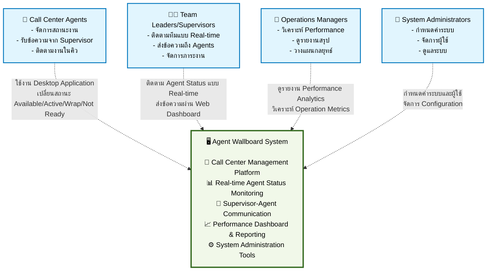
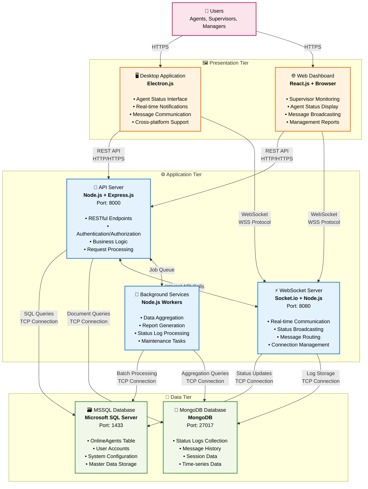

# ตัวอย่าง C1 และ C2 Diagrams สำหรับ Agent Wallboard System

## 📊 C1 - System Context Diagram

### วัตถุประสงค์
แสดงภาพรวมของระบบ Agent Wallboard System ในบริบทของ Call Center Operation โดยระบุผู้ใช้งานหลักและขอบเขตของระบบ

### Mermaid Diagram - C1 System Context

### คำอธิบาย C1 System Context Diagram

**🎯 ความหมายของแผนภาพ:**
- แสดงระบบ Agent Wallboard System เป็นศูนย์กลางของการทำงาน Call Center
- ระบุผู้ใช้งาน 4 กลุ่มหลักและวิธีการใช้งานที่แตกต่างกัน
- เป็น Standalone System ไม่มีการเชื่อมต่อกับระบบภายนอก

**👥 ผู้ใช้งานและหน้าที่:**

1. **Call Center Agents (ผู้ใช้หลัก)**
   - ใช้ Desktop Application เพื่อจัดการสถานะการทำงาน
   - เปลี่ยนสถานะ: Available, Active, Wrap, Not Ready
   - รับการแจ้งเตือนและข้อความจาก Supervisor

2. **Team Leaders/Supervisors (ผู้จัดการทีม)**
   - ใช้ Web Dashboard เพื่อติดตามสถานะทีมแบบ Real-time
   - ส่งข้อความและคำแนะนำไปยัง Agents
   - จัดการและกระจายภาระงาน

3. **Operations Managers (ผู้บริหาร)**
   - ใช้ Management Portal เพื่อดูรายงานและวิเคราะห์
   - ติดตาม KPIs และ Performance Metrics
   - วางแผนกลยุทธ์และปรับปรุงการทำงาน

4. **System Administrators (ผู้ดูแลระบบ)**
   - ใช้ Admin Console เพื่อกำหนดค่าระบบ
   - จัดการบัญชีผู้ใช้และสิทธิ์การเข้าถึง
   - ดูแลรักษาและติดตามประสิทธิภาพระบบ

---

## 🏗️ C2 - Container Diagram

### วัตถุประสงค์
แสดงสถาปัตยกรรมภายในของ Agent Wallboard System โดยแบ่งเป็น Container หลักและระบุเทคโนโลยีที่ใช้ตาม 3-Tier Architecture

### Mermaid Diagram - C2 Container Architecture

### คำอธิบาย C2 Container Diagram

**🏗️ สถาปัตยกรรม 3-Tier ที่สมบูรณ์:**

### 🖼️ **Presentation Tier (Frontend Layer) - 4 Container**

**1. Agent Desktop App (Electron.js)**
- **เทคโนโลยี**: Electron.js framework
- **Port**: 3000 (local development)
- **ผู้ใช้**: Call Center Agents (หลัก)
- **หน้าที่หลัก**:
  - Agent Status Management Interface (Available/Active/Wrap/Not Ready)
  - Real-time notification system และ popup messages
  - Message communication panel สำหรับรับข้อความจาก Supervisor
  - Login/Logout interface พร้อม Agent Code authentication
- **การเชื่อมต่อ**: HTTP REST API + WebSocket สำหรับ real-time updates

**2. Supervisor Dashboard (React.js Web)**
- **เทคโนโลยี**: React.js ใน Web Browser
- **ผู้ใช้**: Team Leaders และ Supervisors
- **หน้าที่หลัก**:
  - Real-time agent monitoring dashboard แสดงสถานะทั้งทีม
  - Message broadcasting interface สำหรับส่งข้อความหา agents
  - Team performance view และ workload distribution
  - Quick action controls สำหรับ team management
- **การเชื่อมต่อ**: HTTPS REST API + Secure WebSocket

**3. Management Portal (React.js Web)**
- **เทคโนโลยี**: React.js ใน Web Browser  
- **ผู้ใช้**: Operations Managers และ Executives
- **หน้าที่หลัก**:
  - Performance analytics และ KPI dashboards
  - Historical reports และ trend analysis
  - Executive dashboard พร้อม high-level insights
  - Business intelligence และ decision support tools
- **การเชื่อมต่อ**: HTTPS REST API สำหรับ report queries

**4. Admin Console (React.js Web)**
- **เทคโนโลยี**: React.js ใน Web Browser
- **ผู้ใช้**: System Administrators
- **หน้าที่หลัก**:
  - System configuration management
  - User account และ permission management
  - Database connection settings
  - Security controls และ audit logs
- **การเชื่อมต่อ**: HTTPS REST API สำหรับ admin operations

### ⚙️ **Application Tier (Backend Layer) - 4 Container**

**1. API Server (Node.js + Express.js)**
- **เทคโนโลยี**: Node.js runtime + Express.js framework
- **Port**: 8000
- **หน้าที่หลัก**:
  - RESTful API endpoints:
    - `/api/agents` - Agent management
    - `/api/status` - Status operations  
    - `/api/messages` - Message handling
    - `/api/reports` - Report generation
  - Business logic processing และ data validation
  - Request/Response handling พร้อม JSON formatting
  - Error handling และ logging
- **การเชื่อมต่อ**: Database connections + Internal service calls

**2. WebSocket Server (Socket.io)**
- **เทคโนโลยี**: Socket.io + Node.js
- **Port**: 8080
- **หน้าที่หลัก**:
  - Real-time bidirectional communication
  - Agent status broadcasting ไปยัง connected clients
  - Message routing และ delivery confirmation
  - Connection pool management พร้อม heartbeat monitoring
  - Event-driven architecture สำหรับ real-time updates
- **การเชื่อมต่อ**: Database updates + Client WebSocket connections

**3. Authentication Service (Node.js + JWT)**
- **เทคโนโลยี**: Node.js + JSON Web Tokens
- **หน้าที่หลัก**:
  - User login/logout processing
  - JWT token generation และ validation
  - Role-based access control (RBAC)
  - Session management และ security enforcement
  - Password hashing และ security compliance
- **การเชื่อมต่อ**: MSSQL user database integration

**4. Background Services (Node.js Workers)**
- **เทคโนโลยี**: Node.js worker processes
- **หน้าที่หลัก**:
  - Scheduled data aggregation jobs
  - Performance report generation (daily/weekly/monthly)
  - Status log processing และ data archiving
  - Database maintenance tasks และ cleanup operations
  - Email notifications และ alert processing
- **การเชื่อมต่อ**: Database batch operations

### 💾 **Data Tier (Database Layer) - 2 Container**

**1. MSSQL Database (Microsoft SQL Server)**
- **เทคโนโลยี**: Microsoft SQL Server
- **Port**: 1433
- **หน้าที่หลัก**:
  - **OnlineAgents Table**: Agent master data (AgentCode, AgentName, LoginTime, Status)
  - **User Accounts**: Authentication credentials และ user profiles
  - **System Configuration**: Application settings และ parameters
  - **Team Management**: Team assignments และ supervisor relationships
  - **ACID Compliance**: Transaction integrity สำหรับ critical operations
- **การเชื่อมต่อ**: SQL queries via connection pooling

**2. MongoDB Database**
- **เทคโนโลยี**: MongoDB NoSQL Database
- **Port**: 27017
- **หน้าที่หลัก**:
  - **StatusLogs Collection**: Time-series agent status changes พร้อม timestamps
  - **Message History**: Communication logs ระหว่าง supervisors และ agents
  - **Session Data**: Connection logs และ user activity tracking
  - **Analytics Data**: Performance metrics และ flexible reporting data
  - **High Performance**: Fast reads/writes สำหรับ real-time operations
- **การเชื่อมต่อ**: Document queries via connection pooling

### 🔄 **Communication Protocols และ Security**

**1. Frontend-Backend Communication**
- **REST API**: HTTP/HTTPS สำหรับ standard CRUD operations
- **WebSocket**: WSS (Secure WebSocket) สำหรับ real-time bidirectional updates
- **Authentication**: JWT Bearer tokens ใน HTTP headers
- **SSL/TLS**: Encrypted connections สำหรับ security compliance

**2. Internal Service Communication**
- **API ↔ WebSocket**: Internal HTTP API calls สำหรับ service coordination
- **API ↔ Background**: Job queue system (Bull/Redis) สำหรับ async task management
- **Service Discovery**: Internal service registry สำหรับ microservice communication
- **Health Checks**: Service monitoring และ auto-recovery mechanisms

**3. Database Connections**
- **Connection Pooling**: Optimized database connection management
- **Transaction Management**: ACID compliance สำหรับ critical business operations
- **Data Consistency**: Eventual consistency strategy ระหว่าง MSSQL และ MongoDB
- **Backup & Recovery**: Automated backup procedures และ disaster recovery

### 🔍 **Key Architecture Decisions**

**1. ทำไมแยก Frontend เป็น 4 Container?**
- **Role-based Access**: แต่ละ user role มี interface ที่เฉพาะเจาะจง
- **Security Separation**: แยก admin functions จาก user functions
- **Performance**: แต่ละ interface optimize สำหรับ specific use case
- **Maintainability**: แยก development และ deployment แยกตาม role

**2. ทำไมใช้ Authentication Service แยก?**
- **Security**: Centralized authentication และ authorization
- **Scalability**: Handle multiple frontend containers
- **Compliance**: Security audit และ compliance requirements
- **Reusability**: Share authentication logic across services

**3. ทำไมใช้ MSSQL + MongoDB Hybrid?**
- **MSSQL**: 
  - Structured master data ที่ต้องการ referential integrity
  - User accounts และ permissions (security-critical)
  - Configuration data ที่ต้องการ ACID compliance
- **MongoDB**: 
  - High-volume real-time logs (status changes, messages)
  - Flexible schema สำหรับ analytics และ reporting
  - Fast read/write performance สำหรับ time-series data

**4. ทำไมแยก API Server และ WebSocket Server?**
- **Separation of Concerns**: REST operations vs Real-time communication
- **Scalability**: Scale แต่ละ service ตาม load patterns
- **Technology Optimization**: แต่ละ service ใช้ library ที่เหมาะสมที่สุด
- **Fault Isolation**: ถึง WebSocket ล่ม REST API ยังทำงานได้

### 📈 **Scalability และ Performance Considerations**

**1. Horizontal Scaling Strategy**
- **Frontend**: Deploy multiple instances หลัง Load Balancer
- **API Server**: Scale instances ตาม CPU usage
- **WebSocket Server**: Implement Redis adapter สำหรับ multi-instance communication
- **Database**: Read replicas สำหรับ MongoDB, Always On สำหรับ MSSQL

**2. Performance Optimization**
- **Caching**: Redis cache layer สำหรับ frequently accessed data
- **Database Indexing**: Optimized indexes สำหรับ real-time queries
- **Connection Pooling**: Efficient database connection management
- **Content Delivery**: Static asset optimization และ compression

**3. Monitoring และ Observability**
- **Application Monitoring**: Performance metrics และ error tracking
- **Infrastructure Monitoring**: Server health และ resource utilization
- **Business Metrics**: Agent productivity และ system usage analytics
- **Alert System**: Proactive notification สำหรับ system issues

### 🔒 **Security Architecture**

**1. Authentication Flow**
- User login → Authentication Service → JWT generation → Frontend storage → API requests with JWT
- Token refresh mechanism สำหรับ session management
- Role-based permissions enforced ใน API layer

**2. Network Security**
- HTTPS everywhere พร้อม SSL certificates
- WebSocket Secure (WSS) สำหรับ real-time connections
- Internal service communication via private networks
- Database connections encrypted และ authenticated

**3. Data Security**
- Password hashing ด้วย bcrypt หรือ similar
- Sensitive data encryption ใน database
- Audit logging สำหรับ security events
- Regular security assessments และ penetration testing

---

## 🎯 สรุป Architecture Overview

Agent Wallboard System ใช้ **3-Tier Architecture** ที่แยกหน้าที่ชัดเจน:

1. **Presentation**: Electron.js (Agents) + React.js (Supervisors/Managers)
2. **Application**: Node.js API + WebSocket + Background Services  
3. **Data**: MSSQL (Master Data) + MongoDB (Real-time Data)

ระบบนี้ออกแบบมาเพื่อรองรับ **Real-time Communication** และ **High Concurrency** สำหรับ Call Center Operation ขนาดกลางถึงใหญ่ โดยสามารถขยายและปรับปรุงได้ในอนาคต