# **การออกแบบ C3: Component Architecture สำหรับ Agent Wallboard System**

## **บทนำ**

การออกแบบ C3 (Component Diagram) เป็นการ "ซูมอิน" จาก C2 Container Diagram เพื่อแสดงโครงสร้างภายในของแต่ละ Container ว่าประกอบด้วย Components อะไรบ้าง และ Components เหล่านี้สื่อสารกันอย่างไร

**เป้าหมายของ C3**: แสดงการแบ่งหน้าที่ความรับผิดชอบภายใน Container และกำหนด Component Interface ที่ชัดเจน

---

## **Step 1: ทบทวน C2 Container Architecture**

### **Diagram: C2 - Container Overview (ฐานสำหรับ C3)**

```mermaid
graph TD
    %% --- Actors ---
    actorAgent["👤 Agent"]
    actorSupervisor["👨‍💼 Supervisor/Manager"]

    subgraph "🖥️ Agent Wallboard System"
        %% --- Presentation Tier ---
        subgraph "🖼️ Presentation Tier"
            desktopApp["Desktop Application<br/>[Electron.js]"]
            webDashboard["Web Application<br/>[React.js SPA]"]
        end

        %% --- Application Tier ---
        subgraph "⚙️ Application Tier"
            apiServer["API Server<br/>[Node.js/Express]"]
            websocketServer["WebSocket Server<br/>[Node.js/Socket.io]"]
            authService["Authentication Service<br/>[Node.js/JWT]"]
            backgroundServices["Background Services<br/>[Node.js Worker]"]
        end

        %% --- Data Tier ---
        subgraph "💾 Data Tier"
            dbMssql["MSSQL Database<br/>[Master Data]"]
            dbMongo["MongoDB<br/>[Event Data]"]
        end
    end

    %% --- Connections ---
    actorAgent --> desktopApp
    actorSupervisor --> webDashboard

    desktopApp & webDashboard --> authService
    desktopApp & webDashboard --> apiServer
    desktopApp & webDashboard --> websocketServer

    apiServer & authService & backgroundServices & websocketServer --> dbMssql & dbMongo
```



**จุดสำคัญ**: เราจะเจาะลึกเข้าไปใน 6 Containers หลัก เพื่อแสดง Component ภายใน

---

## **Step 2: หลักการออกแบบ Component สำหรับระดับ C3**

### **2.1 คำจำกัดความของ Component ในระดับ C3**

**Component** = หน่วยย่อยที่มีหน้าที่เฉพาะในระบบ ซึ่ง:
- มี **Interface** ที่ชัดเจนสำหรับสื่อสารกับ Component อื่น
- มี **Responsibility** เฉพาะด้าน
- สามารถ **ทดสอบ** และ **พัฒนา** แยกจากกันได้

### **2.2 หลักการออกแบบ Component ที่ดี**

1. **Single Responsibility**: แต่ละ Component มีหน้าที่หลักเพียงอย่างเดียว
2. **High Cohesion**: ส่วนประกอบภายใน Component ทำงานร่วมกันอย่างใกล้ชิด
3. **Loose Coupling**: Component พึ่งพากันน้อยที่สุด
4. **Clear Interface**: กำหนดช่องทางการสื่อสารที่ชัดเจน

---

## **Step 3: การออกแบบ Component ใน Application Tier**

### **3.1 ภายใน API Server Container**

**หน้าที่หลัก**: จัดการ Business Logic และให้บริการ REST API

#### **Diagram C3-1: API Server Components**

```mermaid
graph TD
    subgraph "Container: API Server"
        direction LR
        
        subgraph "Request Handling"
            controllers["Controllers<br/>• AgentController<br/>• MessageController<br/>• DashboardController"]
        end
        
        subgraph "Business Logic"
            services["Services<br/>• AgentService<br/>• MessageService<br/>• DashboardService"]
        end
        
        subgraph "Data Access"
            repositories["Repositories<br/>• AgentRepository<br/>• MessageRepository<br/>• UserRepository"]
        end
        
        controllers --> services
        services --> repositories
    end
```



#### **คำอธิบาย Components:**

**Controllers (Request Handling Layer)**:
- **หน้าที่**: รับ HTTP Request, ตรวจสอบ Input, ส่ง Response
- **Interface**: HTTP REST Endpoints
- **ตัวอย่าง**: `PUT /api/agents/{id}/status`, `POST /api/messages`

**Services (Business Logic Layer)**:
- **หน้าที่**: ประมวลผลตรรกะทางธุรกิจ, ตรวจสอบ Business Rules
- **Interface**: Method calls ระหว่าง Components
- **ตัวอย่าง**: `validateStatusChange()`, `calculateTeamMetrics()`

**Repositories (Data Access Layer)**:
- **หน้าที่**: ติดต่อกับ Database, แปลงข้อมูลระหว่าง Object และ Database
- **Interface**: Data access methods
- **ตัวอย่าง**: `findAgentByCode()`, `updateAgentStatus()`

---

### **3.2 ภายใน WebSocket Server Container**

**หน้าที่หลัก**: จัดการการสื่อสารแบบ Real-time

#### **Diagram C3-2: WebSocket Server Components**

```mermaid
graph TD
    subgraph "Container: WebSocket Server"
        direction TB
        
        connectionMgr["Connection Manager<br/>• จัดการ Socket Connections<br/>• User Session Tracking"]
        
        eventProcessor["Event Processor<br/>• รับ Events จาก Clients<br/>• ประมวลผล Business Logic"]
        
        broadcaster["Broadcaster<br/>• ส่งข้อมูลไปยัง Clients<br/>• Room Management"]
        
        connectionMgr --> eventProcessor
        eventProcessor --> broadcaster
        broadcaster -.->|"Broadcast"| connectionMgr
    end
```



#### **คำอธิบาย Components:**

**Connection Manager**:
- **หน้าที่**: จัดการการเชื่อมต่อ WebSocket และ Session ของผู้ใช้
- **Interface**: Socket events (connect, disconnect, authenticate)

**Event Processor**:
- **หน้าที่**: ประมวลผล Events ที่ส่งมาจาก Clients
- **Interface**: Event handlers สำหรับ Events ต่างๆ

**Broadcaster**:
- **หน้าที่**: กระจายข้อมูลไปยังกลุ่ม Clients ที่เหมาะสม
- **Interface**: Broadcasting methods

---

### **3.3 ภายใน Authentication Service Container**

**หน้าที่หลัก**: จัดการการยืนยันตัวตนและสิทธิ์

#### **Diagram C3-3: Authentication Service Components**

```mermaid
graph TD
    subgraph "Container: Authentication Service"
        direction LR
        
        authController["Auth Controller<br/>• Login/Logout Endpoints<br/>• Token Validation"]
        
        tokenMgr["Token Manager<br/>• JWT Generation<br/>• Token Verification<br/>• Token Refresh"]
        
        userValidator["User Validator<br/>• Credential Verification<br/>• Permission Checking"]
        
        authController --> tokenMgr
        authController --> userValidator
    end
```



#### **คำอธิบาย Components:**

**Auth Controller**:
- **หน้าที่**: รับคำขอ Authentication และ Authorization
- **Interface**: HTTP endpoints สำหรับ auth operations

**Token Manager**:
- **หน้าที่**: จัดการ JWT Token lifecycle
- **Interface**: Token generation และ validation methods

**User Validator**:
- **หน้าที่**: ตรวจสอบ credentials และสิทธิ์ผู้ใช้
- **Interface**: Validation methods

---

### **3.4 ภายใน Background Services Container**

**หน้าที่หลัก**: ทำงานเบื้องหลังและ Batch Processing

#### **Diagram C3-4: Background Services Components**

```mermaid
graph TD
    subgraph "Container: Background Services"
        direction TB
        
        scheduler["Job Scheduler<br/>• กำหนดเวลางาน<br/>• Queue Management"]
        
        reportWorker["Report Worker<br/>• สร้างรายงานประจำวัน<br/>• สถิติและ Analytics"]
        
        cleanupWorker["Cleanup Worker<br/>• ลบ Log เก่า<br/>• Database Maintenance"]
        
        scheduler --> reportWorker
        scheduler --> cleanupWorker
    end
```



#### **คำอธิบาย Components:**

**Job Scheduler**:
- **หน้าที่**: จัดตารางงานและ Queue management
- **Interface**: Job scheduling APIs

**Report Worker**:
- **หน้าที่**: สร้างรายงานและคำนวณสถิติ
- **Interface**: Report generation methods

**Cleanup Worker**:
- **หน้าที่**: ทำความสะอาดระบบและบำรุงรักษาข้อมูล
- **Interface**: Maintenance operations

---

## **Step 4: การออกแบบ Component ใน Presentation Tier**

### **4.1 ภายใน Web Application Container**

**หน้าที่หลัก**: Dashboard สำหรับ Supervisor และ Manager

#### **Diagram C3-5: Web Application Components**

```mermaid
graph TD
    subgraph "Container: Web Application (React.js)"
        direction TB
        
        dashboardComponents["Dashboard Components<br/>• AgentGrid<br/>• SummaryStats<br/>• MessagePanel"]
        
        stateManager["State Manager<br/>• Redux Store<br/>• Component State<br/>• Cache Management"]
        
        communicationLayer["Communication Layer<br/>• API Client<br/>• WebSocket Client<br/>• Error Handling"]
        
        dashboardComponents --> stateManager
        stateManager --> communicationLayer
    end
```



#### **คำอธิบาย Components:**

**Dashboard Components**:
- **หน้าที่**: UI Components สำหรับแสดงข้อมูล
- **Interface**: React Component APIs

**State Manager**:
- **หน้าที่**: จัดการ State ของ Application
- **Interface**: State management APIs

**Communication Layer**:
- **หน้าที่**: สื่อสารกับ Backend Services
- **Interface**: HTTP และ WebSocket clients

---

### **4.2 ภายใน Desktop Application Container**

**หน้าที่หลัก**: Agent Desktop App

#### **Diagram C3-6: Desktop Application Components**

```mermaid
graph TD
    subgraph "Container: Desktop Application (Electron.js)"
        direction TB
        
        mainProcess["Main Process<br/>• Window Management<br/>• System Tray<br/>• Auto Updates"]
        
        rendererProcess["Renderer Process<br/>• Agent UI<br/>• Status Control<br/>• Notifications"]
        
        ipcLayer["IPC Layer<br/>• Process Communication<br/>• API Integration<br/>• Event Handling"]
        
        mainProcess --> ipcLayer
        rendererProcess --> ipcLayer
    end
```



#### **คำอธิบาย Components:**

**Main Process**:
- **หน้าที่**: จัดการระบบปฏิบัติการและ Application lifecycle
- **Interface**: Electron Main APIs

**Renderer Process**:
- **หน้าที่**: UI และ User interactions
- **Interface**: Web technologies (HTML, CSS, JS)

**IPC Layer**:
- **หน้าที่**: สื่อสารระหว่าง Process และ Backend
- **Interface**: Electron IPC และ Network APIs

---

## **Step 5: Component Interaction Analysis**

### **5.1 Agent Status Update Flow**

#### **Diagram C3-7: Component Interaction - Status Update**

```mermaid
sequenceDiagram
    participant Agent as Desktop App
    participant API as API Server
    participant WS as WebSocket Server
    participant Supervisor as Web Dashboard

    Agent->>API: PUT /agents/{id}/status
    Note over API: AgentController → AgentService → AgentRepository
    API->>WS: notify("agent.status.changed")
    Note over WS: EventProcessor → Broadcaster
    WS->>Supervisor: emit("status.updated")
    Note over Supervisor: StateManager updates AgentGrid
```



### **5.2 Message Communication Flow**

#### **Diagram C3-8: Component Interaction - Message Flow**

```mermaid
sequenceDiagram
    participant Supervisor as Web Dashboard
    participant API as API Server
    participant WS as WebSocket Server
    participant Agent as Desktop App

    Supervisor->>API: POST /messages
    Note over API: MessageController → MessageService
    API->>WS: notify("message.sent")
    Note over WS: EventProcessor → Broadcaster
    WS->>Agent: emit("new.message")
    Note over Agent: RendererProcess shows notification
```



---

## **Step 6: Component Dependencies และ Interface Design**

### **6.1 Component Dependencies Matrix**

| Component | Depends On | Provides To |
|-----------|------------|-------------|
| Controllers | Services | HTTP Endpoints |
| Services | Repositories | Business Logic |
| Repositories | Database | Data Access |
| Event Processor | Connection Manager | Event Handling |
| Broadcaster | Connection Manager | Real-time Updates |

### **6.2 Key Component Interfaces**

#### **API Server Interface**
```
HTTP REST Endpoints:
- GET /api/agents → ดึงรายการ Agent
- PUT /api/agents/{id}/status → อัปเดตสถานะ
- POST /api/messages → ส่งข้อความ
- GET /api/dashboard/stats → ดึงสถิติ Dashboard
```

#### **WebSocket Server Interface**
```
WebSocket Events:
- agent.status.change (incoming)
- agent.status.updated (outgoing)
- message.send (incoming)
- new.message (outgoing)
- user.connected/disconnected (outgoing)
```

#### **Authentication Service Interface**
```
Authentication Endpoints:
- POST /auth/login → ยืนยันตัวตน
- POST /auth/refresh → ต่ออายุ Token
- POST /auth/logout → ออกจากระบบ
```

---

## **Step 7: การประเมินคุณภาพการออกแบบ C3**

### **7.1 Component Quality Assessment**

#### **✅ Strengths (จุดแข็ง)**
1. **Clear Separation of Concerns**: แต่ละ Component มีหน้าที่ชัดเจน
2. **Logical Grouping**: Component จัดกลุ่มตาม functionality
3. **Scalable Architecture**: สามารถขยายแต่ละส่วนได้อิสระ
4. **Testable Components**: แต่ละ Component ทดสอบได้แยกจากกัน

#### **⚠️ Areas for Improvement (จุดที่ต้องปรับปรุง)**
1. **Error Handling**: ควรมี Component เฉพาะสำหรับจัดการ Error
2. **Monitoring**: ควรเพิ่ม Logging และ Monitoring Components
3. **Caching**: ควรมี Caching Layer สำหรับ Performance

### **7.2 Architecture Pattern Analysis**

#### **Layered Architecture ใน API Server**
- ✅ **ข้อดี**: ง่ายต่อการเข้าใจและบำรุงรักษา
- ⚠️ **ข้อเสีย**: อาจมี Performance overhead จากการผ่าน Layer

#### **Event-Driven Architecture ใน WebSocket Server**
- ✅ **ข้อดี**: เหมาะกับ Real-time requirements
- ⚠️ **ข้อเสีย**: ซับซ้อนในการ Debug

---

## **Step 8: การเตรียมตัวสำหรับ C4 (Code Level)**

### **8.1 สิ่งที่ต้องทำในขั้นตอนต่อไป**

#### **สำหรับ API Server Components:**
1. **Class Diagram**: แสดง Classes และ Methods ใน Controllers, Services, Repositories
2. **Database Schema**: รายละเอียด Tables และ Relationships
3. **API Specification**: OpenAPI/Swagger documentation

#### **สำหรับ WebSocket Server Components:**
1. **Event Schema**: กำหนดรูปแบบข้อมูลใน Events
2. **Connection Management**: Algorithm สำหรับ Room management
3. **Error Handling**: Strategy สำหรับจัดการ Connection failures

#### **สำหรับ Frontend Components:**
1. **Component Tree**: โครงสร้าง React/Electron Components
2. **State Flow**: Redux/State management patterns
3. **UI Wireframes**: รายละเอียด User Interface

### **8.2 Implementation Roadmap**

#### **Phase 1: Foundation (2 สัปดาห์)**
- พัฒนา Authentication Service และ API Server core
- สร้าง Database Schema และ basic CRUD operations

#### **Phase 2: Core Features (3 สัปดาห์)**
- ทำ WebSocket Server และ Real-time communication
- พัฒนา Desktop Application สำหรับ Agent

#### **Phase 3: Dashboard (2 สัปดาห์)**
- สร้าง Web Dashboard สำหรับ Supervisor
- เพิ่ม Background Services สำหรับ Reporting

#### **Phase 4: Polish (1 สัปดาห์)**
- Testing, Bug fixes, Performance tuning
- Documentation และ Deployment

---

## **Step 9: สรุปและประเมินผล C3**

### **9.1 สิ่งที่ได้จากการออกแบบ C3**

#### **1. โครงสร้างที่ชัดเจน**
- แบ่ง Components ตามหน้าที่และความรับผิดชอบ
- กำหนด Interface ระหว่าง Components
- วางพื้นฐานสำหรับการ Implementation

#### **2. ความสามารถในการพัฒนาแบบ Parallel**
- ทีม Frontend และ Backend สามารถทำงานแยกกันได้
- แต่ละ Component สามารถพัฒนาและทดสอบแยกได้
- Interface ที่ชัดเจนทำให้ Integration ง่าย

#### **3. การรองรับ Requirements**
- **US-001** (Real-time monitoring): WebSocket Components
- **US-002** (Agent status update): API Server Components  
- **US-004** (Message communication): Message-related Components
- **US-009** (Reporting): Background Service Components

### **9.2 ความพร้อมสำหรับขั้นตอนต่อไป**

#### **สำหรับทีมพัฒนา:**
- มีแผนผังการทำงานที่ชัดเจน
- ทราบ Dependencies ระหว่าง Components
- สามารถแบ่งงานและประมาณเวลาได้

#### **สำหรับ Project Management:**
- มีพื้นฐานสำหรับการวางแผน Sprint
- สามารถติดตามความคืบหน้าได้
- ระบุ Risk และ Dependencies ที่สำคัญ

---

## **บทสรุป**

การออกแบบ C3 Component Diagram สำหรับ Agent Wallboard System ได้แสดงให้เห็นโครงสร้างภายในของระบบในระดับที่เหมาะสม โดย:

### **ผลลัพธ์หลัก:**
1. **Component Architecture** ที่ชัดเจนใน 6 Containers
2. **Component Interface** ที่กำหนดไว้อย่างเป็นระบบ
3. **Component Interaction** ที่แสดงการทำงานร่วมกัน
4. **Quality Assessment** ที่ระบุจุดแข็งและจุดที่ต้องปรับปรุง

### **ประโยชน์ที่ได้รับ:**
- ทีมพัฒนามีทิศทางการทำงานที่ชัดเจน
- สามารถวางแผนการพัฒนาและทดสอบได้
- มีพื้นฐานที่มั่นคงสำหรับการสร้าง C4 Code Level

การออกแบบนี้เป็นขั้นตอนสำคัญที่เชื่อมต่อระหว่างการคิดระดับสูง (C1-C2) กับการ Implementation จริง (C4) และจะนำไปสู่การสร้าง Agent Wallboard System ที่มีคุณภาพและตอบสนองความต้องการได้อย่างครบถ้วน