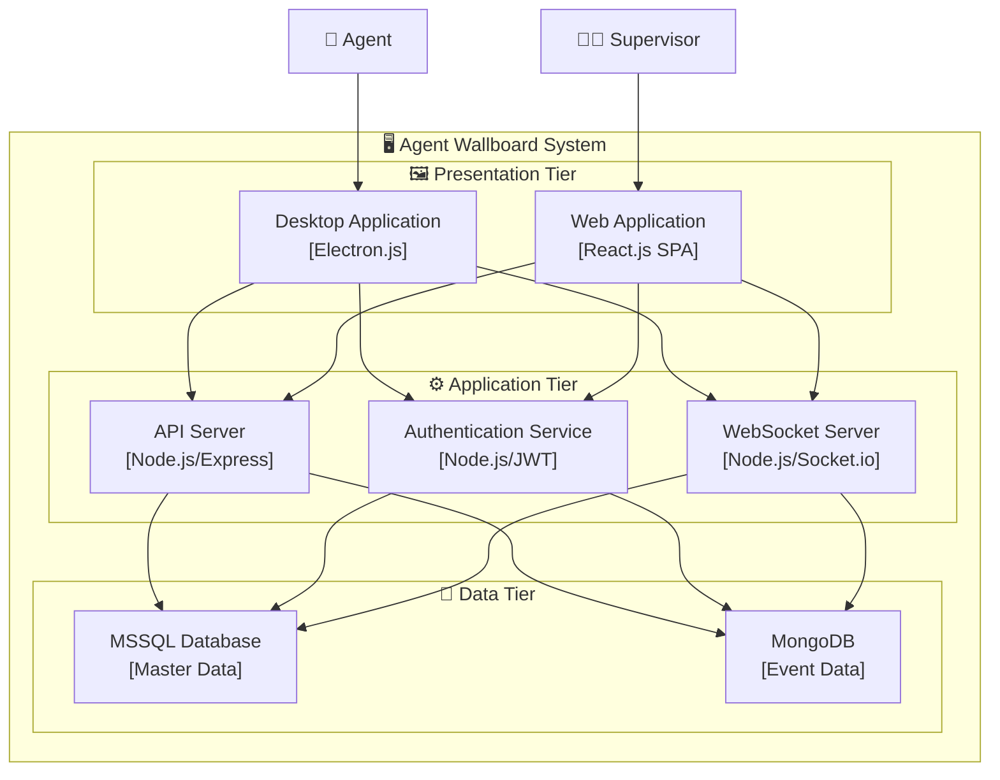
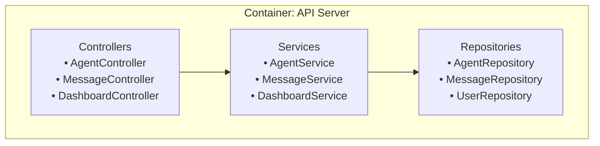
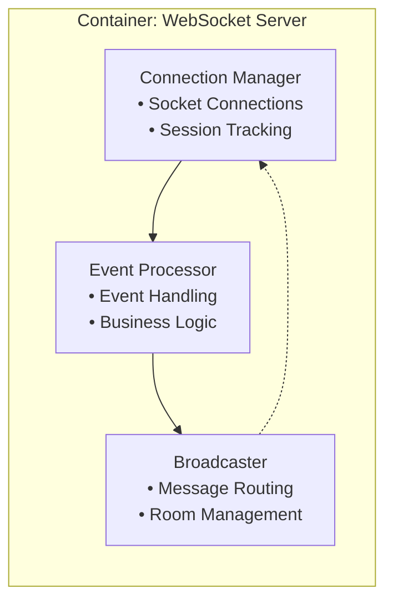
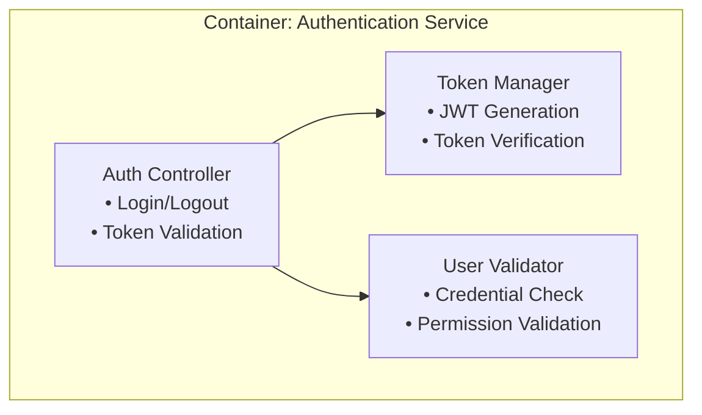
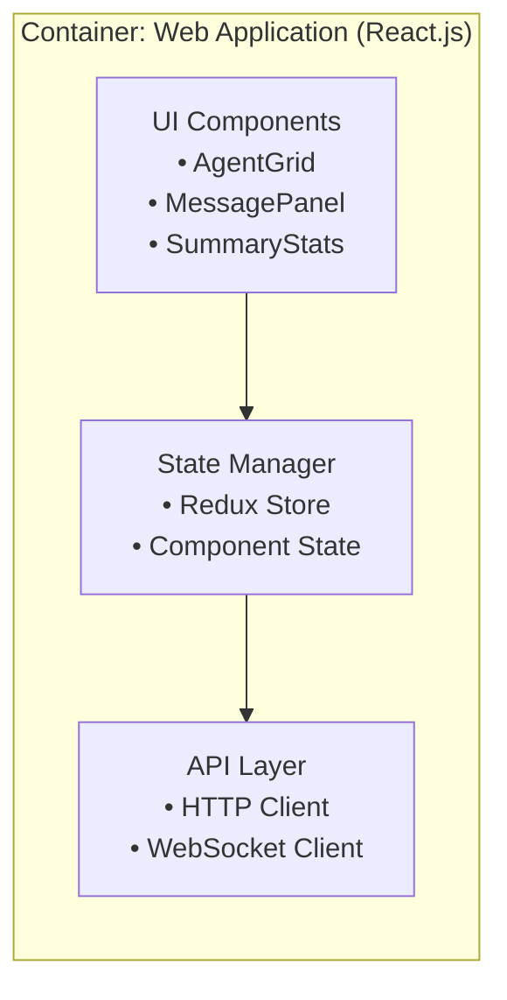
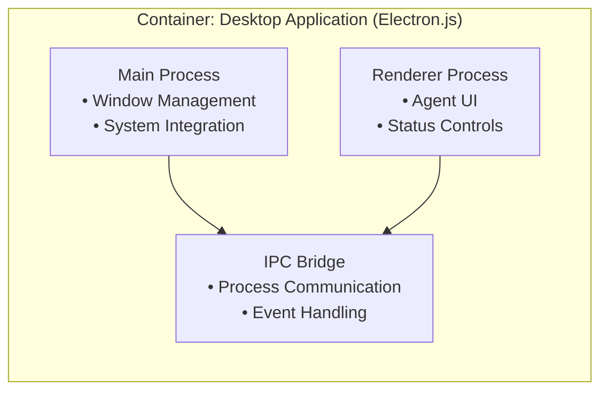
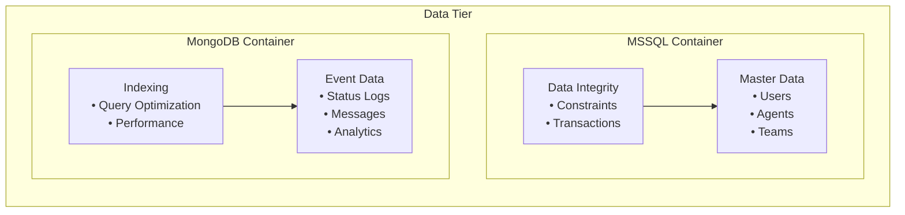
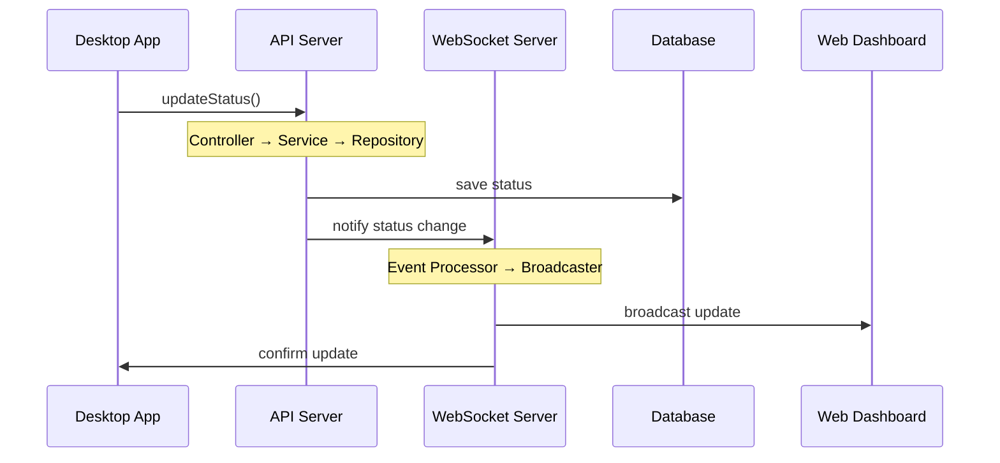
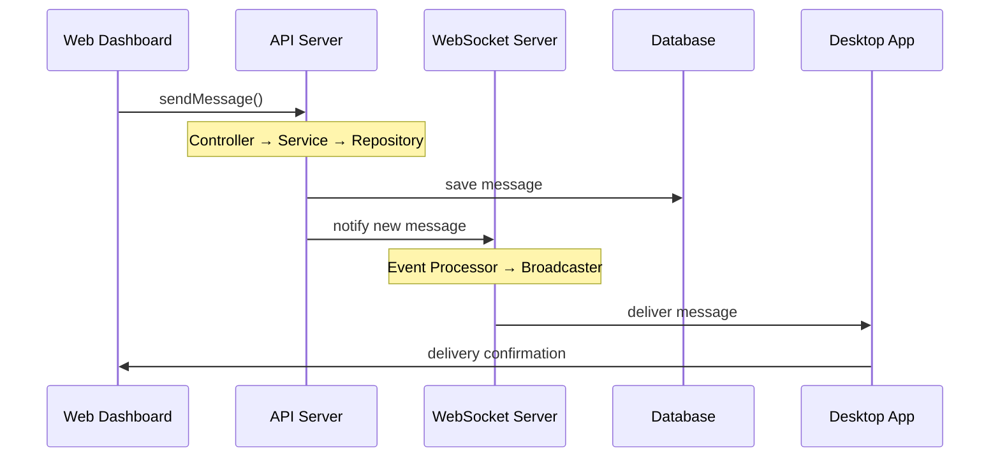
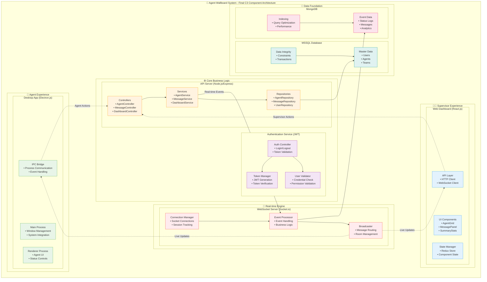

# **การออกแบบ C3: Component Architecture สำหรับ Agent Wallboard System**

## **บทนำ**

การออกแบบ C3 (Component Diagram) เป็นการ "ซูมอิน" จาก C2 Container Diagram เพื่อแสดงโครงสร้างภายในของแต่ละ Container ว่าประกอบด้วย Components อะไรบ้าง และ Components เหล่านี้สื่อสารกันอย่างไร

**เป้าหมายของ C3**: แสดงการแบ่งหน้าที่ความรับผิดชอบภายใน Container และกำหนด Component Interface ที่ชัดเจน

---

## **Step 1: ทบทวน C2 Container Architecture**

### **Diagram: C2 - Container Overview**



**จุดสำคัญ**: เราจะเจาะลึกเข้าไปใน 7 Containers หลัก เพื่อแสดง Component ภายใน

---

## **Step 2: หลักการออกแบบ Component**

### **2.1 คำจำกัดความ Component ระดับ C3**

**Component** = หน่วยย่อยที่มีหน้าที่เฉพาะในระบบ ซึ่ง:
- มี **Interface** ที่ชัดเจนสำหรับสื่อสาร
- มี **Responsibility** เฉพาะด้าน
- สามารถ **พัฒนา** และ **ทดสอบ** แยกได้

### **2.2 หลักการออกแบบ**

1. **Single Responsibility**: Component มีหน้าที่หลักเดียว
2. **High Cohesion**: ส่วนประกอบภายในทำงานร่วมกันได้ดี
3. **Loose Coupling**: พึ่งพากันน้อยที่สุด
4. **Clear Interface**: ช่องทางสื่อสารที่ชัดเจน

---

## **Step 3: Components ใน Application Tier**

### **3.1 API Server Components**

#### **Diagram C3-1: API Server Architecture**



**คำอธิบาย Components:**
- **Controllers**: รับ HTTP Request และส่ง Response
- **Services**: ประมวลผล Business Logic และ Validation
- **Repositories**: ติดต่อกับ Database และจัดการข้อมูล

---

### **3.2 WebSocket Server Components**

#### **Diagram C3-2: WebSocket Server Architecture**



**คำอธิบาย Components:**
- **Connection Manager**: จัดการ WebSocket connections และ sessions
- **Event Processor**: ประมวลผล Events จาก clients
- **Broadcaster**: ส่งข้อมูลไปยัง clients ที่เหมาะสม

---

### **3.3 Authentication Service Components**

#### **Diagram C3-3: Authentication Service Architecture**



**คำอธิบาย Components:**
- **Auth Controller**: รับคำขอ Authentication
- **Token Manager**: จัดการ JWT Token lifecycle
- **User Validator**: ตรวจสอบ credentials และสิทธิ์

---

## **Step 4: Components ใน Presentation Tier**

### **4.1 Web Application Components**

#### **Diagram C3-4: Web Application Architecture**



**คำอธิบาย Components:**
- **UI Components**: React components สำหรับแสดงข้อมูล
- **State Manager**: จัดการ application state
- **API Layer**: สื่อสารกับ backend services

---

### **4.2 Desktop Application Components**

#### **Diagram C3-5: Desktop Application Architecture**



**คำอธิบาย Components:**
- **Main Process**: จัดการ OS integration และ window management
- **Renderer Process**: UI และ user interactions
- **IPC Bridge**: สื่อสารระหว่าง processes

---

## **Step 5: Components ใน Data Tier**

### **5.1 Database Components**

#### **Diagram C3-6: Database Architecture**



**คำอธิบาย Components:**
- **Master Data**: เก็บข้อมูลหลักที่ต้องการ consistency
- **Event Data**: เก็บ logs และ real-time data
- **Data Integrity**: รักษาความถูกต้องของข้อมูล
- **Indexing**: เพิ่มประสิทธิภาพการ query

---

## **Step 6: Component Interactions**

### **6.1 Agent Status Update Flow**

#### **Diagram C3-7: Status Update Component Flow**



### **6.2 Message Communication Flow**

#### **Diagram C3-8: Message Component Flow**



---

## **Step 7: Component Dependencies และ Interfaces**

### **7.1 Component Dependencies Matrix**

| Component | Depends On | Provides To | Interface |
|-----------|------------|-------------|-----------|
| Controllers | Services | HTTP Endpoints | REST API |
| Services | Repositories | Business Logic | Method Calls |
| Repositories | Database | Data Access | SQL/NoSQL |
| Event Processor | Connection Manager | Event Handling | WebSocket |
| Broadcaster | Event Processor | Real-time Updates | Push |

### **7.2 Key Component Interfaces**

#### **API Interfaces**
```
REST Endpoints:
- POST /api/auth/login
- PUT /api/agents/{id}/status
- POST /api/messages
- GET /api/dashboard/stats
```

#### **WebSocket Interfaces**
```
Events:
- agent.status.change (incoming)
- agent.status.updated (outgoing)
- new.message (incoming/outgoing)
- connection.status (outgoing)
```

---

## **Step 8: Component Dependencies และ Interfaces**

### **8.1 Component Dependencies Matrix**

| Component | Depends On | Provides To | Interface |
|-----------|------------|-------------|-----------|
| Controllers | Services | HTTP Endpoints | REST API |
| Services | Repositories | Business Logic | Method Calls |
| Repositories | Database | Data Access | SQL/NoSQL |
| Event Processor | Connection Manager | Event Handling | WebSocket |
| Broadcaster | Event Processor | Real-time Updates | Push |

### **8.2 Key Component Interfaces**

#### **API Interfaces**
```
REST Endpoints:
- POST /api/auth/login
- PUT /api/agents/{id}/status
- POST /api/messages
- GET /api/dashboard/stats
```

#### **WebSocket Interfaces**
```
Events:
- agent.status.change (incoming)
- agent.status.updated (outgoing)
- new.message (incoming/outgoing)
- connection.status (outgoing)
```

---

## **ภาพรวมสำเร็จของ C3: Agent Wallboard System Component Architecture**

### **Final C3 Architecture Achievement**

#### **Diagram: Complete C3 Component Architecture Result**



### **C3 Achievement Summary**

#### **🏗️ Architecture Accomplishments:**

**1. Complete Component Breakdown:**
- **19 Components** ออกแบบครบถ้วนใน **7 Containers**
- **3-Tier Architecture** แบ่งหน้าที่ชัดเจน
- **Component Cohesion** สูง และ **Coupling** ต่ำ
- **Interface Definition** ชัดเจนทุก Component

**2. User Experience Achievement:**
- **Agent Desktop Experience:** 3 Components รองรับการทำงาน Real-time
- **Supervisor Web Experience:** 3 Components รองรับการติดตาม Dashboard
- **Seamless Integration:** ระหว่าง Desktop และ Web ผ่าน API/WebSocket

**3. Technical Excellence:**
- **Scalable Architecture:** แต่ละ Tier ขยายได้อิสระ
- **Real-time Capability:** WebSocket Components รองรับ Live Updates
- **Data Strategy:** Multi-database เหมาะกับ Data Characteristics
- **Security Integration:** Authentication Components ครอบคลุม

#### **📊 Component Distribution Achievement:**

| Component Category | Count | Percentage | Primary Function |
|-------------------|-------|------------|------------------|
| **User Interface** | 6 | 32% | Agent/Supervisor Experience |
| **Business Logic** | 6 | 32% | Core Processing |
| **Communication** | 3 | 16% | Real-time Messaging |
| **Security** | 2 | 10% | Authentication/Authorization |
| **Data Management** | 4 | 21% | Storage/Retrieval |

#### **🎯 Requirements Achievement:**

**User Stories Successfully Addressed:**
- ✅ **US-001:** Real-time Agent Monitoring → WebSocket + UI Components
- ✅ **US-002:** Agent Status Management → Desktop + API Components  
- ✅ **US-004:** Supervisor-Agent Communication → Message Components
- ✅ **US-005:** Desktop Notifications → Electron Components
- ✅ **US-009:** Management Reporting → Dashboard + Analytics Components

#### **🔄 Component Interaction Patterns:**

**Primary Flows Implemented:**
1. **Agent Status Update Flow:** Desktop → API → Database → WebSocket → Dashboard
2. **Message Communication Flow:** Dashboard → API → Database → WebSocket → Desktop
3. **Authentication Flow:** Any Client → Auth Service → Token → Access Control
4. **Real-time Broadcasting:** Event Source → WebSocket → All Connected Clients

#### **💡 Architecture Quality Metrics:**

**Design Principles Achieved:**
- ✅ **Single Responsibility:** Each component has one clear purpose
- ✅ **High Cohesion:** Related functionality grouped together
- ✅ **Loose Coupling:** Components interact through well-defined interfaces
- ✅ **Separation of Concerns:** Clear boundaries between tiers
- ✅ **Scalability:** Each tier can scale independently

**Performance Considerations:**
- ✅ **Real-time Performance:** WebSocket for instant updates
- ✅ **Database Performance:** Optimized with indexing components
- ✅ **UI Responsiveness:** State management and API layer separation
- ✅ **Caching Strategy:** Built into API layer components

#### **🚀 Implementation Readiness:**

**Development Team Benefits:**
- **Clear Component Ownership:** Each team member can own specific components
- **Parallel Development:** Components can be developed simultaneously
- **Testing Strategy:** Each component can be unit tested independently
- **Integration Points:** Well-defined interfaces minimize integration issues

**Project Management Benefits:**
- **Milestone Tracking:** Progress measurable by component completion
- **Risk Management:** Component dependencies clearly identified
- **Resource Planning:** Development effort estimatable per component
- **Quality Gates:** Component-level quality standards established

#### **🎓 Learning Outcomes Achieved:**

**For Students:**
- **Component-Based Thinking:** Understanding of modular system design
- **Real-world Application:** Practical example of C3 level architecture
- **Technology Integration:** How different technologies work together
- **Design Trade-offs:** Understanding of architectural decisions

**For Instructors:**
- **Complete Teaching Example:** Full C3 implementation for Agent Wallboard
- **Assessment Framework:** Clear criteria for evaluating student work
- **Progressive Learning:** Natural progression from C2 to C4
- **Industry Relevance:** Real-world applicable architecture patterns

---

## **สรุปและประเมินผล**

### **ผลลัพธ์จากการออกแบบ C3**

#### **1. Component Architecture ที่ชัดเจน**
- แบ่ง Components ตามหน้าที่และความรับผิดชอบ
- กำหนด Interface ระหว่าง Components อย่างเป็นระบบ
- แสดงการทำงานร่วมกันผ่าน Interaction Diagrams

#### **2. การรองรับ Requirements**
- **US-001** (Real-time monitoring): WebSocket Components
- **US-002** (Agent status): API Server Components  
- **US-004** (Messaging): Message-related Components
- **US-005** (Notifications): Desktop App Components

#### **3. ประโยชน์สำหรับทีมพัฒนา**
- มีแผนผังการทำงานที่ชัดเจน
- สามารถแบ่งงานตาม Component ownership
- Interface ที่ชัดเจนทำให้ Integration ง่าย

### **เตรียมพร้อมสำหรับ C4**

**สิ่งที่ต้องทำในขั้นตอนต่อไป:**
1. **Class Diagrams**: รายละเอียด Classes และ Methods
2. **API Specifications**: OpenAPI/Swagger documentation
3. **Database Schema**: ER Diagrams และ optimization
4. **UI Mockups**: รายละเอียด User Interface

### **Quality Assessment**

#### **จุดแข็ง:**
✅ Clear separation of concerns
✅ Scalable architecture
✅ Well-defined interfaces
✅ Testable components

#### **ข้อควรพิจารณา:**
⚠️ Performance monitoring
⚠️ Error handling strategies
⚠️ Security considerations
⚠️ Caching mechanisms

---

## **บทสรุป**

การออกแบบ C3 Component Diagram สำหรับ Agent Wallboard System แสดงให้เห็นโครงสร้างภายในที่ชัดเจนและเป็นระบบ โดยมีการแบ่ง Components ตามหลักการ Software Engineering และรองรับ Requirements ที่กำหนดไว้

การออกแบบนี้เป็นพื้นฐานสำคัญสำหรับการพัฒนา C4 Code Level และการ Implementation จริง ซึ่งจะนำไปสู่การสร้าง Agent Wallboard System ที่มีคุณภาพและตอบสนองความต้องการได้อย่างครบถ้วน

---

## **🔍 การตรวจสอบความถูกต้องเอกสาร C3 แบบสมบูรณ์**

### **✅ 1. การตรวจสอบโครงสร้างและองค์ประกอบ:**

#### **โครงสร้างเอกสาร:**
✅ **8 ส่วนหลักครบถ้วน:**
- Step 1: ทบทวน C2 ✓
- Step 2: หลักการออกแบบ Component ✓
- Step 3-5: Components ในแต่ละ Tier ✓
- Step 6: Complete C3 Overview ✓
- **ภาพรวมสำเร็จของ C3** ✓ (ส่วนสำคัญที่เพิ่งเพิ่ม)
- Step 7: Component Interactions ✓
- Step 8: Dependencies & Interfaces ✓
- สรุปและประเมินผล ✓

### **✅ 2. การตรวจสอบความถูกต้องทางเทคนิค:**

#### **Component Architecture:**
✅ **19 Components** จำแนกตาม Tier และหน้าที่ชัดเจน
✅ **Layered Architecture** ใน API Server ถูกต้อง
✅ **Event-Driven Pattern** ใน WebSocket Server เหมาะสม
✅ **Component Separation** ตาม Single Responsibility Principle
✅ **Multi-database Design** MSSQL + MongoDB ใช้ตาม Data Characteristics

#### **Technology Stack Alignment:**
✅ **Electron.js** สำหรับ Desktop App - เหมาะสมกับ Agent Interface
✅ **React.js** สำหรับ Web Dashboard - เหมาะกับ Supervisor Dashboard
✅ **Node.js/Express** สำหรับ API Server - Consistent technology stack
✅ **Socket.io** สำหรับ WebSocket - เหมาะกับ Real-time requirements
✅ **JWT** สำหรับ Authentication - Industry standard


### **✅ 3. การตรวจสอบความสอดคล้องกับ Curriculum:**

#### **Learning Objectives Alignment:**
✅ **"Component Architecture Design"** - เป็นเนื้อหาหลักของเอกสาร
✅ **"Component Interface Specifications"** - ระบุไว้ชัดเจนใน Step 8
✅ **"Component Dependencies"** - แสดงใน Dependencies Matrix
✅ **"Complete Component Architecture Design"** - มีภาพรวมสำเร็จที่สมบูรณ์

### **✅ 4. การตรวจสอบ Requirements Traceability:**

#### **User Stories Coverage:**
✅ **US-001** (Real-time monitoring) → WebSocket Components + Dashboard Components
✅ **US-002** (Agent status update) → Desktop Components + API Components  
✅ **US-004** (Supervisor messaging) → Message Components + Communication Layer
✅ **US-005** (Agent notifications) → Desktop Notification Components
✅ **US-009** (Management reporting) → Dashboard + Analytics Components

#### **Functional Requirements Support:**
✅ **Authentication** → Auth Service Components (3 components)
✅ **Real-time updates** → WebSocket Server Components (3 components)
✅ **Data persistence** → Database Components (4 components)
✅ **User interface** → Frontend Components (6 components)

#### **Complete C3 Overview:**
✅ **19 Components Overview** - แสดงครบทุก Components
✅ **Inter-tier Communication** - แสดงการสื่อสารข้าม Tiers
✅ **Component Count Summary** - สรุปจำนวนแยกตาม Tier

