# **การออกแบบสถาปัตยกรรมภาพรวม (ฉบับสมบูรณ์)**

## **Agent Wallboard System**

เอกสารนี้อธิบายการออกแบบสถาปัตยกรรมในระดับสูง 2 ระดับแรกตาม **C4 Model** สำหรับโปรเจกต์ Agent Wallboard System โดยมุ่งเน้นการอธิบายที่มาที่ไปและการตัดสินใจเชิงเทคนิค เพื่อเป็นแนวทางสำหรับนักศึกษาวิศวกรรมซอฟต์แวร์

-----

## 🗺️ C1: System Context Diagram

**เป้าหมาย**: เพื่อแสดงภาพรวมที่ใหญ่ที่สุดของระบบ (The Big Picture) ให้เห็นว่า **Agent Wallboard System** ของเรามีความสัมพันธ์กับ **ใคร (Actors)** และ **ระบบอะไร (External Systems)** ในสภาพแวดล้อมของ Call Center บ้าง

### **Diagram: C1 - System Context**

```mermaid
graph TD
    %% --- Actors (ผู้ใช้งาน) ---
    actorAgent["👤 Call Center Agent"]
    actorSupervisor["👨‍💼 Supervisor"]
    actorManager["👔 Operations Manager"]
    actorAdmin["🔧 IT Administrator"]

    %% --- Main System (ระบบหลัก) ---
    subgraph "ขอบเขตของระบบที่เราจะสร้าง"
        systemBoundary[("🖥️ Agent Wallboard System<br/><br/>ระบบติดตามสถานะ Agent<br/>และสื่อสารแบบ Real-time")]
    end

    %% --- External Systems (ระบบภายนอกที่เกี่ยวข้อง) ---
    subgraph "ระบบภายนอก (External Systems)"
        ad["🏢 Active Directory<br/>(ระบบยืนยันตัวตนกลาง)"]
        network["🌐 Corporate Network<br/>(เครือข่ายภายในองค์กร)"]
    end

    %% --- Relationships (ความสัมพันธ์) ---
    actorAgent -- "ใช้งานผ่าน Desktop App เพื่อ<br/>เปลี่ยนสถานะและรับข้อความ" --> systemBoundary
    actorSupervisor -- "ใช้งานผ่าน Web Dashboard เพื่อ<br/>ติดตามทีมและส่งข้อความ" --> systemBoundary
    actorManager -- "ใช้งานผ่าน Web Dashboard เพื่อ<br/>ดูรายงานสรุปและวิเคราะห์ KPI" --> systemBoundary
    actorAdmin -- "ใช้งานผ่าน Admin Console เพื่อ<br/>จัดการผู้ใช้และตั้งค่าระบบ" --> systemBoundary

    systemBoundary -- "ยืนยันตัวตนผู้ใช้<br/>[Protocol: LDAP]" --> ad
    systemBoundary -- "ทำงานบนเครือข่าย<br/>[Protocol: TCP/IP, HTTPS]" --> network

    %% --- Styling ---
    style systemBoundary fill:#e3f2fd,stroke:#1565c0,stroke-width:3px
    style ad fill:#fffde7,stroke:#f57f17
    style network fill:#f3e5f5,stroke:#4a148c
```

### **คำอธิบาย C1: จากความต้องการสู่ภาพรวม**

#### **1. ผู้ใช้งานหลัก (Actors)**

เรากำหนดผู้ใช้งานจากเอกสาร Persona และ User Stories:

  * **👤 Call Center Agent**: ผู้ใช้งานหลักที่ต้องอัปเดตสถานะ (US-002) และรับข้อความ (US-005) ผ่าน **Desktop App**
  * **👨‍💼 Supervisor**: ผู้ที่ต้องการแก้ปัญหา "Lack of Real-time Visibility" โดยการติดตามทีม (US-001) และส่งข้อความ (US-004) ผ่าน **Web Dashboard**
  * **👔 Operations Manager**: ผู้บริหารที่ต้องการดูรายงานสรุปและ KPI เพื่อการตัดสินใจ (US-009) ผ่าน **Web Dashboard**
  * **🔧 IT Administrator**: ผู้ดูแลที่ต้องติดตั้งและตั้งค่าระบบ (US-010 ถึง US-014) ผ่าน **Admin Console**

#### **2. ระบบหลัก (Our System)**

กล่อง **Agent Wallboard System** คือขอบเขตของโปรเจกต์ทั้งหมดที่เราจะพัฒนากันในวิชานี้

#### **3. ระบบภายนอก (External Systems)**

เพื่อให้ระบบสมจริง เราต้องพึ่งพาระบบอื่นที่มีอยู่แล้วในองค์กร:

  * **🏢 Active Directory (AD)**: แทนที่เราจะสร้างระบบ Login เองทั้งหมด การเชื่อมต่อกับ AD เพื่อยืนยันตัวตน (Authentication) เป็นวิธีที่ปลอดภัยและเป็นมาตรฐานขององค์กร
  * **🌐 Corporate Network**: ระบบของเราเป็นระบบภายใน (Intranet) ดังนั้นการสื่อสารทั้งหมดต้องเป็นไปตามนโยบายความปลอดภัยของเครือข่ายองค์กร

-----

## 🏗️ C2: Container Diagram

**เป้าหมาย**: "ซูมอิน" เข้าไปในระบบจาก C1 เพื่อแสดง "กล่อง" หรือส่วนประกอบทางเทคนิคหลักๆ (เรียกว่า Container) ที่ประกอบกันเป็นระบบ และแสดงเทคโนโลยีที่เลือกใช้สำหรับแต่ละส่วน

### **Diagram: C2 - Container Architecture**

```mermaid
graph TD
    %% --- Actors ---
    actorAgent["👤 Agent<br/>(บน PC ผ่าน Electron App)"]
    actorSupervisor["👨‍💼 Supervisor / Manager<br/>(ผ่าน Web Browser)"]

    subgraph "🖥️ Agent Wallboard System"
        %% --- Presentation Tier ---
        subgraph "🖼️ Tier 1: Presentation (Frontend)"
            desktopApp["<b>1. Desktop Application</b><br/>[Container: Electron.js]<br/>UI สำหรับ Agent"]
            webDashboard["<b>2. Web Application</b><br/>[Container: React.js SPA]<br/>Dashboard สำหรับ Supervisor"]
        end

        %% --- Application Tier ---
        subgraph "⚙️ Tier 2: Application (Backend)"
            apiServer["<b>3. API Server</b><br/>[Container: Node.js/Express]<br/>จัดการ Business Logic, ให้บริการ REST API"]
            websocketServer["<b>4. WebSocket Server</b><br/>[Container: Node.js/Socket.io]<br/>จัดการการสื่อสาร Real-time"]
        end

        %% --- Data Tier ---
        subgraph "💾 Tier 3: Data"
            dbMssql["<b>5. Relational Database</b><br/>[Container: MS SQL Server]<br/>เก็บข้อมูลหลัก (Master Data): Agents, Users"]
            dbMongo["<b>6. NoSQL Database</b><br/>[Container: MongoDB]<br/>เก็บข้อมูลเคลื่อนไหว (Event Data): Logs, Messages"]
        end
    end

    %% --- Connections with Protocols ---
    actorAgent -- "Interacts via GUI" --> desktopApp
    actorSupervisor -- "Interacts via GUI" --> webDashboard

    desktopApp -- "API Calls<br/>[Protocol: HTTPS]" --> apiServer
    webDashboard -- "API Calls<br/>[Protocol: HTTPS]" --> apiServer
    
    desktopApp -- "Real-time Connection<br/>[Protocol: WSS]" --> websocketServer
    webDashboard -- "Real-time Connection<br/>[Protocol: WSS]" --> websocketServer

    apiServer -- "Reads/Writes Master Data<br/>[Protocol: TCP]" --> dbMssql
    apiServer -- "Reads/Writes Event Data<br/>[Protocol: TCP]" --> dbMongo

    websocketServer -- "Reads/Writes Master Data<br/>[Protocol: TCP]" --> dbMssql
    websocketServer -- "Writes Event Data<br/>[Protocol: TCP]" --> dbMongo
```

### **คำอธิบายและเหตุผลเชิงเทคนิค (Architectural Decisions)**

#### **Tier 1: 🖼️ Presentation (ส่วนติดต่อผู้ใช้)**

1.  **Desktop Application (Electron.js)**: สำหรับ Agent โดยเฉพาะ เพื่อให้สามารถส่ง **Desktop Notification** แจ้งเตือนบนหน้าจอได้โดยตรง (ตอบโจทย์ US-005) และทำงานเป็นอิสระจาก Web Browser
2.  **Web Application (React.js)**: สำหรับ Supervisor/Manager เป็น **Single-Page Application (SPA)** ที่โหลดครั้งเดียวและอัปเดตข้อมูลแบบ Real-time ทำให้ประสบการณ์ใช้งานลื่นไหลและตอบสนองเร็ว เหมาะกับการทำ Dashboard (ตอบโจทย์ US-001, US-008)

#### **Tier 2: ⚙️ Application (ส่วนประมวลผล)**

3.  **API Server (Node.js/Express)**: เป็น **"สมอง"** ของระบบ จัดการ Logic ต่างๆ เช่น การยืนยันตัวตน, การบันทึกข้อมูล, การคำนวณสถิติ และให้บริการข้อมูลผ่าน **REST API** ที่เป็นมาตรฐานสากล (ตอบโจทย์ US-011)
4.  **WebSocket Server (Node.js/Socket.io)**: เป็น **"หัวใจ"** ของการทำงานแบบ Real-time ทำหน้าที่ **"ผลัก" (Push)** ข้อมูลที่อัปเดต (เช่น สถานะ Agent ใหม่) ไปยัง Client ทุกตัวที่เชื่อมต่ออยู่ทันที โดยไม่ต้องรอให้ Client ร้องขอ (Polling) ซึ่งเป็นหัวใจของการแก้ปัญหาหลักของระบบ (ตอบโจทย์ US-001, US-004)

#### **Tier 3: 💾 Data (ส่วนจัดเก็บข้อมูล)**

5.  **Relational Database (MS SQL Server)**: ใช้เก็บ **"ข้อมูลหลัก" (Master Data)** ที่มีโครงสร้างชัดเจนและต้องการความถูกต้องสูง เช่น ข้อมูลพนักงาน (Agents), บัญชีผู้ใช้ (Users) (ตอบโจทย์ US-010)
6.  **NoSQL Database (MongoDB)**: ใช้เก็บ **"ข้อมูลเหตุการณ์" (Event Data)** ที่เกิดขึ้นตลอดเวลาและมีปริมาณมหาศาล เช่น ประวัติการเปลี่ยนสถานะทั้งหมด (Status Logs), ประวัติการสนทนา (Message History) ซึ่ง MongoDB มีความยืดหยุ่นและเขียนข้อมูลได้รวดเร็วกว่า

### **การตัดสินใจเชิงสถาปัตยกรรมและข้อดีข้อเสีย (Trade-offs)**

  * **ทำไมต้องแยก API Server และ WebSocket Server?**

      * **เหตุผล:** เพื่อ **Separation of Concerns (การแยกหน้าที่)** และ **Scalability (การขยายระบบ)** การทำงานของ API (Request-Response) และ WebSocket (Persistent Connection) มีลักษณะต่างกันมาก การแยกกันทำให้เราสามารถขยายขนาดของแต่ละส่วนได้อย่างอิสระ
      * **Trade-off:** เพิ่มความซับซ้อนในการดูแลรักษาและการสื่อสารระหว่างสองเซิร์ฟเวอร์นี้

  * **ทำไมต้องใช้ Hybrid Database (MSSQL + MongoDB)?**

      * **เหตุผล:** เพื่อ **"เลือกเครื่องมือให้เหมาะกับงาน" (Right tool for the right job)** MSSQL เก่งเรื่องการรักษาความถูกต้องของข้อมูลหลัก ส่วน MongoDB เก่งเรื่องการจัดการข้อมูล Log ที่มีปริมาณมากและเกิดขึ้นรวดเร็ว
      * **Trade-off:** เพิ่มความซับซ้อนในการดูแลรักษาฐานข้อมูล 2 ระบบ และต้องจัดการเรื่องความสอดคล้องกันของข้อมูล (Data Consistency)

-----

## **ก้าวต่อไป: การเตรียมตัวสำหรับสัปดาห์หน้า (C3-Component & C4-Code)**

เมื่อเราได้ภาพใหญ่ในระดับ C1 และ C2 ที่สมบูรณ์แล้ว ในสัปดาห์หน้าเราจะ "ซูมอิน" เข้าไปอีกระดับเพื่อออกแบบ **C3 (Component)** และ **C4 (Code)** ซึ่งเป็นการลงรายละเอียดว่าในแต่ละ Container (กล่องโปรแกรม) นั้น จะมีโครงสร้างภายในอย่างไร

**สิ่งที่ทุกคนต้องเตรียมตัวและเริ่มคิดออกแบบ:**

#### **1. สำหรับ API Server (Node.js/Express):**

  * **C3 (Component):** เราจะแบ่งโครงสร้างภายใน API Server ออกเป็นส่วนประกอบย่อยๆ ได้อย่างไร?
      * **Controllers:** ส่วนที่รับ Request จาก Frontend
      * **Services:** ส่วนที่จัดการ Business Logic หลักของระบบ
      * **Repositories/DAL (Data Access Layer):** ส่วนที่ทำหน้าที่ติดต่อกับฐานข้อมูล
  * **C4 (Code):** ในแต่ละ Component จะมี Class หรือ Module อะไรบ้าง? มีฟังก์ชัน/เมธอดอะไรที่สำคัญ?
      * **ตัวอย่าง:**
          * `AgentController.js` จะมีฟังก์ชัน `login()`, `updateStatus()`
          * `AgentService.js` จะมีฟังก์ชัน `validateAgent()`, `changeAgentStatus()`
          * `AgentRepository.js` จะมีฟังก์ชัน `findByAgentCode()`, `updateStatusInDB()`
  * **Diagrams ที่ต้องเตรียม:**
      * **UML Class Diagram:** สำหรับ Data Models (เช่น Agent, User)
      * **UML Sequence Diagram:** สำหรับ Flow การทำงานที่สำคัญ เช่น "กระบวนการ Agent Login" หรือ "ขั้นตอนการเปลี่ยนสถานะ"

#### **2. สำหรับ WebSocket Server (Node.js/Socket.io):**

  * **C3 (Component):**
      * **Connection Manager:** จัดการการเชื่อมต่อและตัดการเชื่อมต่อของ Client
      * **Event Handlers:** จัดการเมื่อมี Event เกิดขึ้น เช่น `agent_change_status`
      * **Broadcaster:** ทำหน้าที่ส่งข้อมูลไปยัง Client ที่เกี่ยวข้อง
  * **C4 (Code):**
      * เราต้องนิยาม **Events** ที่จะรับ-ส่งผ่าน WebSocket ให้ชัดเจน เช่น `connection`, `disconnect`, `changeStatus`, `newMessage`
      * กำหนด **Data Structure (Payload)** ของข้อมูลที่จะส่งในแต่ละ Event

#### **3. สำหรับ Frontend (React.js & Electron.js):**

  * **C3 (Component):** เราต้องเริ่มแบ่งหน้าจอ UI ออกเป็น Component ย่อยๆ
      * **ตัวอย่าง:** หน้า Dashboard ของ Supervisor อาจประกอบด้วย `HeaderComponent`, `AgentGridComponent`, `SummaryStatsComponent` และใน `AgentGridComponent` ก็จะประกอบด้วย `AgentCardComponent` หลายๆ อัน
  * **Diagrams ที่ต้องเตรียม:**
      * **Component Diagram:** แสดงความสัมพันธ์ว่า Component ไหนเรียกใช้อันไหน
      * **Wireframes/Mockups:** ร่างหน้าจอ UI ของแต่ละหน้าให้ละเอียดขึ้น

#### **4. สำหรับ Databases (MSSQL & MongoDB):**

  * **C4 (Code/Schema):**
      * **MSSQL:** ออกแบบ Schema ของแต่ละตารางให้ละเอียด (ชื่อคอลัมน์, Data Type, Primary Key, Foreign Key)
      * **MongoDB:** ออกแบบโครงสร้างของ Document ในแต่ละ Collection (Field, Data Type)

**สรุปงานที่ต้องทำในสัปดาห์หน้า:** คือการนำ Container ทั้ง 6 ตัวจาก C2 มาแตกรายละเอียดการออกแบบภายในให้ครบถ้วน โดยใช้ UML Diagrams และการกำหนดโครงสร้างของโค้ดเป็นเครื่องมือหลัก

สัปดาห์หน้าเราจะมาลงรายละเอียดกันในแต่ละส่วน ขอให้ทุกคนเตรียมตัวและเริ่มร่างการออกแบบเบื้องต้นมาให้พร้อมนะครับ\!
