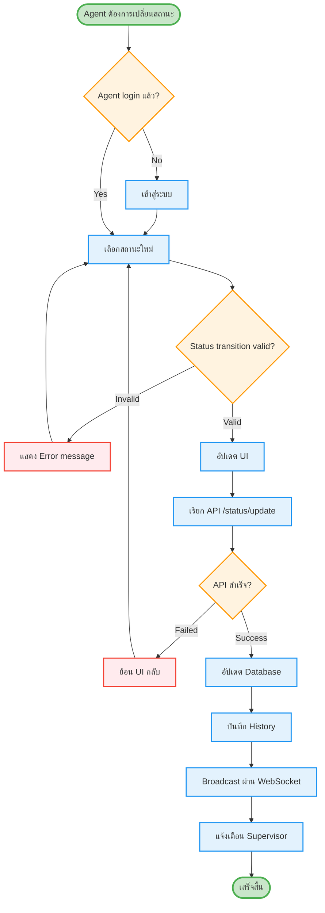
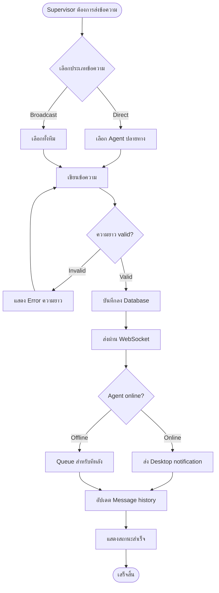
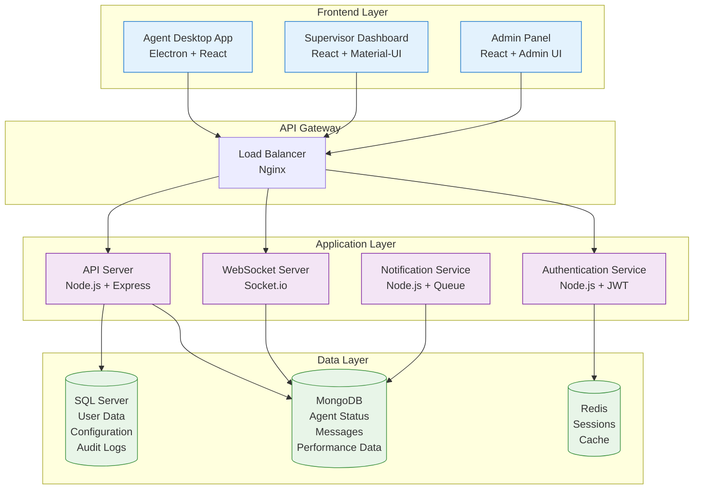
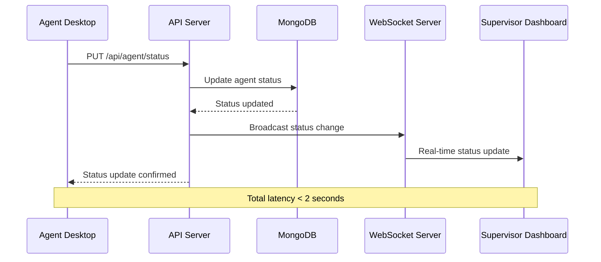
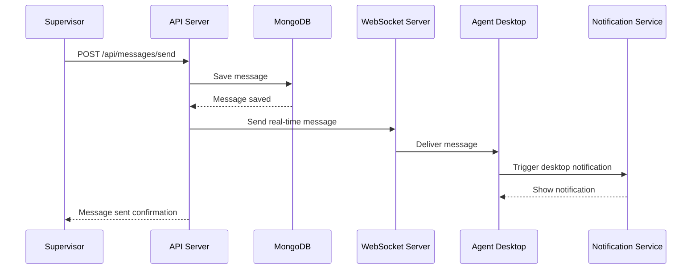
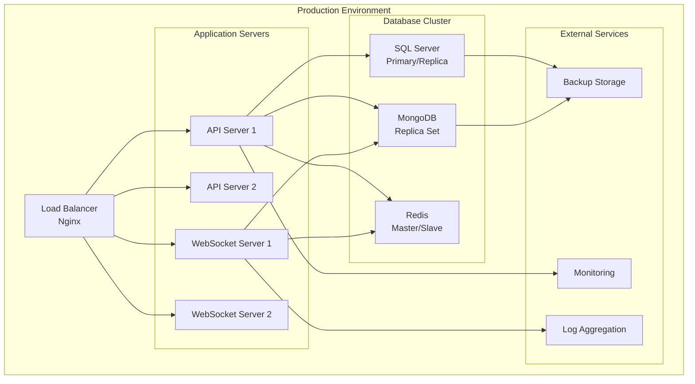

# Agent Wallboard System - Simplified SRS
## Software Requirements Specification สำหรับ C4 Model Design

**Document ID:** SRS-AWS-C4-001  
**Version:** 2.0  
**วันที่:** กันยายน 2025  
**สถานะ:** Ready for C4 Design  
**จัดทำโดย:** อาจารย์ วิชา ENGSE206 - RMUTL  

---

## 📋 1. SRS แบบย่อ - Functional Requirements (10 ข้อหลัก)

### FR-001: Agent Authentication 🔐
**คำอธิบาย:** Agent เข้าสู่ระบบด้วย Agent Code  
**Input:** Agent Code (AG001-AG999)  
**Output:** เข้าสู่ระบบสำเร็จ + Agent Desktop  
**Business Rules:** Agent Code ต้อง Active และไม่ duplicate login

### FR-002: Agent Status Management 🔄
**คำอธิบาย:** Agent เปลี่ยนสถานะการทำงาน  
**Input:** สถานะใหม่ (Available, Busy, Break, Meeting, Offline)  
**Output:** สถานะอัปเดต + แจ้งเตือน Supervisor  
**Business Rules:** Valid status transition + Break time limit 2hr/day

### FR-003: Real-time Status Monitoring 📊
**คำอธิบาย:** Supervisor ดูสถานะ Agent แบบ Real-time  
**Input:** เข้า Supervisor Dashboard  
**Output:** แสดงสถานะทีม + อัปเดตทันที  
**Business Rules:** แสดงเฉพาะ Agent ในทีม + อัปเดตใน 2 วินาที

### FR-004: Direct Message Communication 💬
**คำอธิบาย:** Supervisor ส่งข้อความถึง Agent เฉพาะคน  
**Input:** ข้อความ + Agent ปลายทาง  
**Output:** ข้อความส่งถึง + Desktop notification  
**Business Rules:** ข้อความไม่เกิน 500 ตัวอักษร + เฉพาะ Agent ออนไลน์

### FR-005: Broadcast Messaging 📢
**คำอธิบาย:** Supervisor ส่งข้อความกระจายทั้งทีม  
**Input:** ข้อความกระจาย  
**Output:** ส่งถึง Agent ทุกคนในทีม  
**Business Rules:** เฉพาะ Supervisor + ข้อความไม่เกิน 1000 ตัวอักษร

### FR-006: Team Performance Dashboard 📈
**คำอธิบาย:** Supervisor ดูสถิติประสิทธิภาพทีม  
**Input:** เลือกช่วงเวลา  
**Output:** สถิติทีม (utilization, status breakdown)  
**Business Rules:** อัปเดตทุก 30 วินาที + แสดงข้อมูล real-time

### FR-007: User Management 👥
**คำอธิบาย:** Admin จัดการข้อมูล User  
**Input:** User data (CRUD operations)  
**Output:** User ถูกสร้าง/แก้ไข/ลบ  
**Business Rules:** เฉพาะ Admin + ไม่ลบ User ที่ออนไลน์

### FR-008: Status History Logging 📝
**คำอธิบาย:** บันทึกประวัติการเปลี่ยนสถานะ  
**Input:** การเปลี่ยนสถานะ  
**Output:** บันทึกลง Database + timestamp  
**Business Rules:** เก็บประวัติ 90 วัน + auto archive

### FR-009: Desktop Notifications 🔔
**คำอธิบาย:** Agent รับแจ้งเตือนบน Desktop  
**Input:** ข้อความใหม่จาก Supervisor  
**Output:** Desktop notification + เสียงแจ้งเตือน  
**Business Rules:** เฉพาะ Agent ออนไลน์ + timeout 10 วินาที

### FR-010: System Configuration ⚙️
**คำอธิบาย:** Admin ตั้งค่าระบบ  
**Input:** Configuration parameters  
**Output:** ระบบทำงานตามค่าใหม่  
**Business Rules:** มี backup config + validate input

---

## 🎭 2. Use Case Diagram พร้อมรายละเอียด

### 2.1 Use Case Diagram (13 Use Cases)

```mermaid
graph TB
    %% Actors
    Agent[👤 Agent]
    Supervisor[👥 Supervisor] 
    Manager[🏢 Operations Manager]
    Admin[⚙️ System Admin]
    
    %% System boundary
    subgraph "Agent Wallboard System"
        %% Agent Use Cases
        UC01[UC-01: Login System<br/>FR-001]
        UC02[UC-02: Manage Agent Status<br/>FR-002]
        UC05[UC-05: Receive Notifications<br/>FR-009]
        
        %% Supervisor Use Cases  
        UC03[UC-03: Monitor Team Status<br/>FR-003]
        UC04[UC-04: Send Messages<br/>FR-004, FR-005]
        UC06[UC-06: View Team Dashboard<br/>FR-006]
        UC07[UC-07: Track Attendance<br/>Extension]
        
        %% Operations Manager Use Cases
        UC08[UC-08: Generate Reports<br/>FR-006, FR-008]
        
        %% System Admin Use Cases
        UC09[UC-09: Setup Database<br/>Infrastructure]
        UC10[UC-10: Configure API Server<br/>Infrastructure]
        UC11[UC-11: Manage WebSocket<br/>FR-003, FR-004]
        UC12[UC-12: Deploy Application<br/>Infrastructure]
        UC13[UC-13: Environment Config<br/>FR-010]
    end
    
    %% Actor relationships
    Agent --> UC01
    Agent --> UC02  
    Agent --> UC05
    
    Supervisor --> UC01
    Supervisor --> UC03
    Supervisor --> UC04
    Supervisor --> UC06
    Supervisor --> UC07
    
    Manager --> UC06
    Manager --> UC08
    
    Admin --> UC09
    Admin --> UC10
    Admin --> UC11
    Admin --> UC12
    Admin --> UC13
    
    %% Include relationships
    UC02 -.->|include| UC01
    UC03 -.->|include| UC11
    UC04 -.->|include| UC11
    
    %% Extend relationships
    UC07 -.->|extend| UC01
    UC08 -.->|extend| UC06
    
    %% Styling
    classDef actor fill:#e1f5fe,stroke:#01579b,stroke-width:2px
    classDef usecase fill:#f3e5f5,stroke:#4a148c,stroke-width:2px
    classDef infrastructure fill:#fff3e0,stroke:#f57c00,stroke-width:2px
    
    class Agent,Supervisor,Manager,Admin actor
    class UC01,UC02,UC03,UC04,UC05,UC06,UC07,UC08 usecase
    class UC09,UC10,UC11,UC12,UC13 infrastructure
```



### 2.2 Complete Use Case Descriptions (ครบ 13 Use Cases)

#### UC-01: Login System
**Actor:** Agent, Supervisor  
**Description:** ผู้ใช้เข้าสู่ระบบด้วย Agent Code  
**Precondition:** Agent Code ต้องมีอยู่ในระบบและ Active  
**Main Flow:**
1. ผู้ใช้เปิด Desktop App (Agent) หรือ Web Dashboard (Supervisor)
2. กรอก Agent Code (AG001-AG999) หรือ Supervisor Code (SP001-SP999)
3. ระบบตรวจสอบ authentication กับ SQL Server
4. ระบบสร้าง JWT session และเก็บใน Redis
5. แสดง Dashboard ตามบทบาท (Agent/Supervisor)
6. ตั้งสถานะเริ่มต้นเป็น "Available" (สำหรับ Agent)
**Postcondition:** ผู้ใช้เข้าสู่ระบบสำเร็จและพร้อมใช้งาน

#### UC-02: Manage Agent Status
**Actor:** Agent  
**Description:** Agent เปลี่ยนสถานะการทำงาน  
**Precondition:** Agent ต้อง login แล้ว (UC-01)  
**Main Flow:**
1. Agent คลิกที่ Status dropdown บน Desktop App
2. เลือกสถานะใหม่ (Available/Busy/Break/Meeting/Offline)
3. ระบบ validate status transition ตาม business rules
4. อัปเดต agent status ใน MongoDB
5. Log การเปลี่ยนแปลงลง SQL Server
6. Broadcast ผ่าน WebSocket (UC-11) ไปยัง Supervisor
7. แสดง confirmation notification
**Alternative Flow:** ถ้า Break time เกิน 2hr/day → แสดง warning
**Postcondition:** สถานะถูกอัปเดตและ Supervisor ได้รับแจ้งเตือน

#### UC-03: Monitor Team Status
**Actor:** Supervisor  
**Description:** Supervisor ดูสถานะทีมแบบ real-time  
**Precondition:** Supervisor login และมี Agent ในทีม  
**Main Flow:**
1. เข้าสู่ Supervisor Web Dashboard
2. ระบบโหลดรายการ Agent ในทีมจาก SQL Server
3. ระบบดึงสถานะปัจจุบันจาก MongoDB
4. แสดงสถานะ Agent ในรูป Grid Cards
5. Establish WebSocket connection (UC-11)
6. อัปเดต real-time เมื่อมีการเปลี่ยนแปลงจาก UC-02
7. แสดง team summary statistics
**Include:** UC-11 (WebSocket connection จำเป็น)
**Postcondition:** Supervisor เห็นสถานะปัจจุบันของทีมแบบ real-time

#### UC-04: Send Messages
**Actor:** Supervisor  
**Description:** ส่งข้อความถึง Agent (Direct/Broadcast)  
**Precondition:** Supervisor login และมี Agent ในทีม  
**Main Flow:**
1. เลือกประเภทข้อความ (Direct/Broadcast)
2. **Direct Message:** เลือก Agent ปลายทาง
3. **Broadcast:** เลือกทั้งทีม
4. พิมพ์ข้อความ (Direct: ≤500 chars, Broadcast: ≤1000 chars)
5. เลือก priority level (Normal/Urgent/Critical)
6. กดปุ่ม Send
7. ระบบบันทึกลง MongoDB
8. ส่งผ่าน WebSocket (UC-11) ไปยัง Agent
9. Agent รับ desktop notification (UC-05)
**Include:** UC-11 (WebSocket สำหรับ real-time delivery)
**Alternative Flow:** ถ้า Agent offline → queue message
**Postcondition:** ข้อความถูกส่งและบันทึกแล้ว

#### UC-05: Receive Notifications
**Actor:** Agent  
**Description:** Agent รับการแจ้งเตือนบน Desktop  
**Precondition:** Agent ออนไลน์และมีข้อความใหม่  
**Main Flow:**
1. ระบบได้รับข้อความจาก UC-04
2. ตรวจสอบ Agent ออนไลน์หรือไม่
3. ส่ง desktop notification พร้อมเสียงตาม priority
4. แสดงการแจ้งเตือนเป็นเวลา 10 วินาที
5. Agent สามารถคลิกเพื่อเปิดข้อความ
6. Mark ข้อความเป็น "อ่านแล้ว" ใน MongoDB
**Alternative Flow:** ถ้า Agent offline → queue notification ใน MongoDB
**Postcondition:** Agent ได้รับแจ้งเตือนและสามารถตอบสนองได้

#### UC-06: View Team Dashboard
**Actor:** Supervisor, Operations Manager  
**Description:** ดูสถิติและประสิทธิภาพของทีม  
**Precondition:** ผู้ใช้ login และมีข้อมูลประวัติ  
**Main Flow:**
1. คลิกแท็บ "Team Performance"
2. เลือกช่วงเวลา (วันนี้/สัปดาห์นี้/เดือนนี้/กำหนดเอง)
3. ระบบคำนวณ metrics จาก MongoDB:
   - Team utilization percentage
   - Status breakdown (pie chart)
   - Timeline chart แสดงการเปลี่ยนแปลง
   - Agent ranking table
4. แสดงผลในรูป charts และ tables
5. สามารถ Export เป็น Excel/PDF
**Extend:** UC-08 (Advanced reporting features)
**Postcondition:** ผู้ใช้เห็นภาพรวมประสิทธิภาพทีม

#### UC-07: Track Attendance
**Actor:** Supervisor  
**Description:** ติดตามเวลาเข้า-ออกงานของ Agent  
**Precondition:** Supervisor login และมี Agent ในทีม  
**Main Flow:**
1. Agent login ระบบบันทึกเวลาเข้างาน
2. Agent logout ระบบบันทึกเวลาออกงาน
3. Supervisor สามารถดูรายงานการเข้างาน
4. แสดงสถิติ: เวลาเข้า, เวลาออก, ชั่วโมงทำงาน
5. สามารถ Export attendance report
**Extend:** UC-01 (เพิ่มฟีเจอร์ attendance tracking เมื่อ login)
**Postcondition:** ระบบมีข้อมูลการเข้างานที่ถูกต้อง

#### UC-08: Generate Reports
**Actor:** Operations Manager  
**Description:** สร้างรายงานขั้นสูงสำหรับผู้บริหาร  
**Precondition:** Operations Manager login และมีข้อมูลประวัติ  
**Main Flow:**
1. เลือกประเภทรายงาน (Performance/Productivity/Attendance)
2. กำหนดช่วงเวลาและ parameters
3. ระบบประมวลผลข้อมูลจาก MongoDB และ SQL Server
4. สร้างรายงานในรูป PDF/Excel
5. แสดง executive summary
6. สามารถ schedule รายงานประจำ
**Extend:** UC-06 (เพิ่ม advanced reporting บน dashboard)
**Postcondition:** ผู้บริหารได้รายงานที่ต้องการ

#### UC-09: Setup Database
**Actor:** System Admin  
**Description:** ติดตั้งและกำหนดค่า Database  
**Precondition:** Admin มีสิทธิ์และ infrastructure พร้อม  
**Main Flow:**
1. ติดตั้ง SQL Server สำหรับ user data
2. ติดตั้ง MongoDB สำหรับ real-time data
3. ติดตั้ง Redis สำหรับ cache และ sessions
4. สร้าง database schema และ collections
5. กำหนด indexes สำหรับ performance
6. ทำ initial data seeding
7. ทดสอบ database connections
**Postcondition:** Database พร้อมใช้งานสำหรับ application

#### UC-10: Configure API Server
**Actor:** System Admin  
**Description:** ติดตั้งและกำหนดค่า API Server  
**Precondition:** Database setup เรียบร้อย (UC-09)  
**Main Flow:**
1. Deploy Node.js API Server
2. กำหนดค่า environment variables
3. ตั้งค่า database connections
4. กำหนด API endpoints และ middleware
5. ติดตั้ง security measures (HTTPS, CORS)
6. ทดสอบ API endpoints
7. ตั้งค่า monitoring และ logging
**Postcondition:** API Server พร้อมให้บริการ

#### UC-11: Manage WebSocket
**Actor:** System Admin  
**Description:** จัดการ WebSocket Server สำหรับ real-time communication  
**Precondition:** API Server พร้อมใช้งาน (UC-10)  
**Main Flow:**
1. ติดตั้ง Socket.io WebSocket server
2. กำหนดค่า connection handling
3. ตั้งค่า room management สำหรับ teams
4. กำหนด event handlers สำหรับ real-time updates
5. ทดสอบ WebSocket connections
6. Monitor connection performance
**Include:** Required by UC-03, UC-04 สำหรับ real-time features
**Postcondition:** WebSocket Server พร้อมสำหรับ real-time communication

#### UC-12: Deploy Application
**Actor:** System Admin  
**Description:** Deploy applications ไปยัง production environment  
**Precondition:** All infrastructure components พร้อม  
**Main Flow:**
1. Build Agent Desktop App (Electron)
2. Build Supervisor Web Dashboard (React)
3. Deploy applications ไปยัง target servers
4. กำหนดค่า load balancers
5. ทดสอบ end-to-end functionality
6. สร้าง deployment documentation
7. Train end users
**Postcondition:** System พร้อมใช้งานใน production

#### UC-13: Environment Configuration
**Actor:** System Admin  
**Description:** กำหนดค่าระบบและ parameters ต่างๆ  
**Precondition:** System deployed เรียบร้อย (UC-12)  
**Main Flow:**
1. เข้าสู่ Admin Panel
2. กำหนดค่า business rules (break time limits, message length)
3. ตั้งค่า notification settings (duration, sound)
4. กำหนด performance parameters (update intervals)
5. ตั้งค่า security policies
6. Backup configuration settings
7. ทดสอบการทำงานของระบบ
**Postcondition:** ระบบทำงานตาม configuration ที่กำหนด

---

## 🔄 3. Activity Diagrams พร้อมคำอธิบาย

### 3.1 Agent Status Change Process



**คำอธิบาย Activity Diagram:**
- **Optimistic UI Update:** อัปเดต UI ทันทีก่อนเรียก API เพื่อ UX ที่ดี
- **Error Handling:** มี rollback mechanism เมื่อ API call ล้มเหลว
- **Real-time Broadcasting:** ใช้ WebSocket ส่งอัปเดตไปยัง Supervisor
- **Audit Trail:** บันทึกทุกการเปลี่ยนแปลงลง database

### 3.2 Message Sending Workflow



---

## 🏗️ 4. System Architecture และ Technical Design

### 4.1 System Components Overview

#### **Frontend Applications:**
- **Agent Desktop App:** Electron + React สำหรับ Agent interface
- **Supervisor Web Dashboard:** React.js + Material-UI สำหรับ team monitoring
- **Admin Panel:** React.js + Admin framework สำหรับ system management

#### **Backend Services:**
- **API Server:** Node.js + Express REST API สำหรับ business logic
- **WebSocket Server:** Socket.io สำหรับ real-time communication
- **Authentication Service:** JWT-based authentication + session management
- **Notification Service:** Desktop notification handling + message queue

#### **Database:**
- **Primary Database:** SQL Server สำหรับ user data, configuration, audit logs
- **Real-time Database:** MongoDB สำหรับ agent status, messaging, history dashboard

### 4.2 Technology Stack



---

## 📊 5. Data Flow Architecture

### 5.1 Real-time Status Update Flow



### 5.2 Message Communication Flow



### 5.3 Database Distribution Strategy

**SQL Server (Structured Data):**
- User accounts และ authentication
- System configuration
- Audit logs และ compliance data
- Team assignments และ permissions

**MongoDB (Real-time Data):**
- Agent status changes และ history
- Message conversations
- Performance metrics และ analytics
- Dashboard data aggregations

**Redis (Cache Layer):**
- User sessions และ JWT tokens
- Real-time agent status cache
- WebSocket connection mapping
- Rate limiting counters

---

## 📏 6. Non-Functional Requirements

### 6.1 Performance Requirements
- **Response Time:** API calls < 200ms, Dashboard load < 3 seconds
- **Real-time Updates:** Status changes propagate within 2 seconds
- **Throughput:** Support 500 concurrent agents, 50 supervisors
- **Scalability:** Horizontal scaling capability with load balancers

### 6.2 Security Requirements
- **Authentication:** JWT tokens with 8-hour expiry
- **Authorization:** Role-based access control (RBAC)
- **Data Encryption:** HTTPS/WSS for all communications
- **Audit Trail:** Complete logging of all user activities

### 6.3 Reliability Requirements
- **Availability:** 99.5% uptime (3.65 hours downtime/month)
- **Data Integrity:** Transaction rollback on failures
- **Error Recovery:** Automatic retry mechanisms
- **Backup Strategy:** Daily backups with 30-day retention

### 6.4 Usability Requirements
- **User Interface:** Intuitive design requiring < 30 minutes training
- **Accessibility:** Screen reader support, keyboard navigation
- **Cross-platform:** Windows, macOS, Linux support for desktop app
- **Browser Compatibility:** Chrome, Firefox, Safari, Edge (latest 2 versions)

---

## 📋 7. Requirements Traceability Matrix

| FR ID | Requirement | Use Cases | Components | Database | Priority |
|-------|-------------|-----------|------------|----------|----------|
| FR-001 | Agent Authentication | UC-01 | Auth Service, API Server | SQL Server | High |
| FR-002 | Status Management | UC-02 | API Server, WebSocket | MongoDB | High |
| FR-003 | Real-time Monitoring | UC-05 | WebSocket Server | MongoDB, Redis | High |
| FR-004 | Direct Messaging | UC-06, UC-03 | API Server, WebSocket, Notification | MongoDB | High |
| FR-005 | Broadcast Messaging | UC-07, UC-03 | API Server, WebSocket | MongoDB | Medium |
| FR-006 | Team Performance | UC-08 | API Server | MongoDB | Medium |
| FR-007 | User Management | UC-09 | API Server | SQL Server | Medium |
| FR-008 | History Logging | UC-11, UC-12 | API Server | SQL Server, MongoDB | Medium |
| FR-009 | Desktop Notifications | UC-04, UC-13 | Notification Service | MongoDB | Medium |
| FR-010 | System Configuration | UC-10 | API Server | SQL Server | Low |

---

## 🚀 8. Implementation Strategy

### 8.1 Development Phases (12 สัปดาห์)

**Phase 1: Foundation (Weeks 1-3)**
- ✅ Database setup (SQL Server + MongoDB)
- ✅ Authentication service implementation
- ✅ Basic API server structure
- ✅ Agent login/logout functionality

**Phase 2: Core Features (Weeks 4-6)**
- ✅ Agent status management
- ✅ WebSocket server implementation
- ✅ Real-time status monitoring
- ✅ Basic supervisor dashboard

**Phase 3: Communication (Weeks 7-9)**
- ✅ Direct messaging system
- ✅ Broadcast messaging
- ✅ Desktop notifications
- ✅ Message history

**Phase 4: Administration (Weeks 10-12)**
- ✅ Admin panel development
- ✅ User management
- ✅ System configuration
- ✅ Performance dashboard
- ✅ Testing และ deployment

### 8.2 Technology Decisions

**Frontend Framework:** React.js
- **Rationale:** Large community, extensive ecosystem, good performance

**Backend Framework:** Node.js + Express
- **Rationale:** JavaScript full-stack, excellent for real-time applications

**Real-time Communication:** Socket.io
- **Rationale:** Proven WebSocket library with fallback support

**Databases:** SQL Server + MongoDB
- **Rationale:** SQL for structured data, MongoDB for flexible real-time data

**Desktop App:** Electron
- **Rationale:** Cross-platform support, web technology reuse

### 8.3 Deployment Architecture



---

## 📚 9. ภาคผนวก (Appendices)

### 9.1 Database Schema Summary

**SQL Server Tables:**
```sql
Users (UserID, AgentCode, FullName, Role, TeamID, Status)
Teams (TeamID, TeamName, SupervisorID)
SystemConfig (ConfigKey, ConfigValue, Description)
AuditLogs (LogID, UserID, Action, Timestamp, Details)
UserSessions (SessionID, UserID, LoginTime, IsActive)
```

**MongoDB Collections:**
```javascript
// Agent Status Collection
agentStatus {
  agentId: "AG001",
  status: "Available",
  timestamp: ISODate(),
  duration: 3600,
  metadata: {}
}

// Messages Collection
messages {
  messageId: ObjectId(),
  senderId: "SP001",
  recipientId: "AG001", // null for broadcast
  type: "direct", // or "broadcast"
  content: "Message content",
  priority: "normal",
  sentAt: ISODate(),
  readAt: ISODate()
}

// Performance Metrics Collection
performance {
  teamId: 1,
  date: ISODate(),
  metrics: {
    totalAgents: 15,
    utilization: 87.5,
    statusBreakdown: {
      available: 8,
      busy: 4,
      break: 2,
      offline: 1
    }
  }
}
```

### 9.2 API Endpoints Summary

**Authentication:**
```
POST /api/auth/login
POST /api/auth/logout  
GET  /api/auth/validate
```

**Agent Management:**
```
GET  /api/agents
PUT  /api/agents/{id}/status
GET  /api/agents/{id}/history
```

**Messaging:**
```
POST /api/messages/send
GET  /api/messages/inbox/{userId}
PUT  /api/messages/{id}/read
```

**Team & Admin:**
```
GET  /api/teams/{id}/performance
POST /api/admin/users
PUT  /api/admin/config
GET  /api/admin/logs
```

### 9.3 WebSocket Events

**Agent Events:**
```javascript
// Outgoing
'agent:status-change'
'agent:heartbeat'

// Incoming  
'agent:status-updated'
'agent:message-received'
'agent:notification'
```

**Supervisor Events:**
```javascript
// Outgoing
'supervisor:join-team'
'supervisor:send-message'

// Incoming
'supervisor:agent-status-changed'  
'supervisor:team-stats-updated'
```

### 9.4 Business Rules Reference

**Status Transitions:**
- Available ↔ Busy ↔ Break ↔ Meeting ↔ Offline
- Break time limit: 2 hours/day
- Auto-logout after 8 hours inactive

**Message Constraints:**
- Direct message: max 500 characters
- Broadcast message: max 1000 characters  
- Delivery timeout: 30 seconds

**Performance Metrics:**
- Team utilization = (Available + Busy time) / Total online time
- Update frequency: every 30 seconds
- History retention: 90 days

---


### 🎯 สรุปเอกสาร SRS:

✅ **13 Use Cases** ตรงตาม project knowledge  
✅ **4 Actors** (Agent, Supervisor, Operations Manager, System Admin)  
✅ **Complete Use Case Descriptions** พร้อม Precondition/Postcondition  
✅ **Proper Relationships** (Include/Extend/Dependencies)  
✅ **Traceability** กับ 10 Functional Requirements  
✅ **Technical Architecture** ที่สามารถ implement ได้จริง  

### 🎭 **Use Case Diagram และ Actors:**


#### **Agent Use Cases (3 ข้อ):**
- UC-01: Login System
- UC-02: Manage Agent Status  
- UC-05: Receive Notifications

#### **Supervisor Use Cases (5 ข้อ):**
- UC-01: Login System (shared)
- UC-03: Monitor Team Status
- UC-04: Send Messages (รวม Direct + Broadcast)
- UC-06: View Team Dashboard
- UC-07: Track Attendance (extend)

#### **Operations Manager Use Cases (2 ข้อ):**
- UC-06: View Team Dashboard (shared)
- UC-08: Generate Reports

#### **System Admin Use Cases (5 ข้อ):**
- UC-09: Setup Database
- UC-10: Configure API Server
- UC-11: Manage WebSocket
- UC-12: Deploy Application
- UC-13: Environment Configuration

### 🔗 **Relationships ที่ถูกต้อง:**
- **Include:** UC-02 includes UC-01, UC-03 includes UC-11, UC-04 includes UC-11
- **Extend:** UC-07 extends UC-01, UC-08 extends UC-06
- **Dependencies:** Infrastructure Use Cases (UC-09→UC-10→UC-11→UC-12→UC-13)

### 📊 **Traceability กับ 10 Functional Requirements:**
- **ครอบคลุม FR ทั้งหมด** โดยไม่ซ้ำซ้อน
- **แต่ละ Use Case มี Traceability** กลับไปยัง FR ที่เกี่ยวข้อง
- **Infrastructure Use Cases** รองรับ technical requirements

---

## ✅ สรุป - Ready for C4 Model Design

เอกสาร SRS นี้ได้ออกแบบครบถ้วนสำหรับการนำไปสร้าง **C4 Model Architecture Diagrams** ต่อไป:

### 🎯 **ข้อมูลพร้อมสำหรับ C4 Model:**

1. **System Context (C1):** ระบุ Users, External Systems, และ Scope ชัดเจน
2. **Container Diagram (C2):** กำหนด Technology Stack และ Communication protocols
3. **Component Diagram (C3):** แยก Components ภายใน Container แต่ละตัว
4. **Code Diagram (C4):** Class structure และ Implementation details

### 📊 **Key Architecture Decisions:**
- **Frontend:** Electron (Desktop) + React (Web) 
- **Backend:** Node.js + Express + Socket.io
- **Database:** SQL Server (Structured) + MongoDB (Real-time)
- **Communication:** REST API + WebSocket + JWT Authentication

### 🔧 **Implementation Ready:**
- Functional Requirements ครบ 10 ข้อ
- Use Cases มี traceability ชัดเจน
- Technology Stack เป็น mainstream และ proven
- Database design แยก concerns ตาม data types
- Timeline 12 สัปดาห์ feasible สำหรับ prototype

**เอกสารนี้พร้อมสำหรับขั้นตอนถัดไป: การออกแบบ C1-C4 Architecture Diagrams! 🚀**

---
