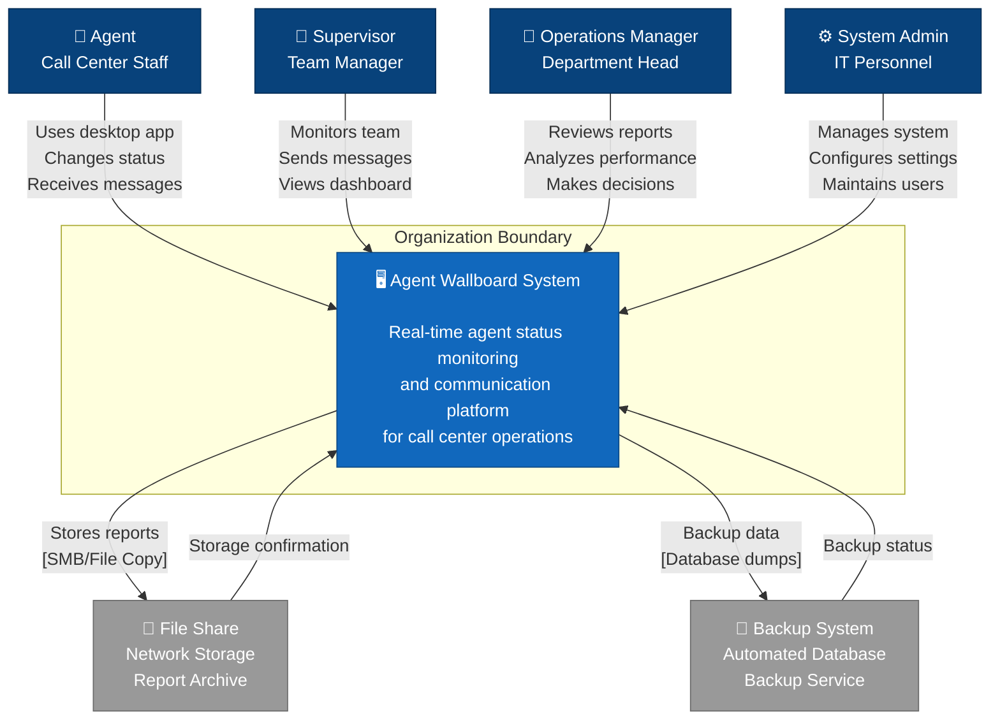
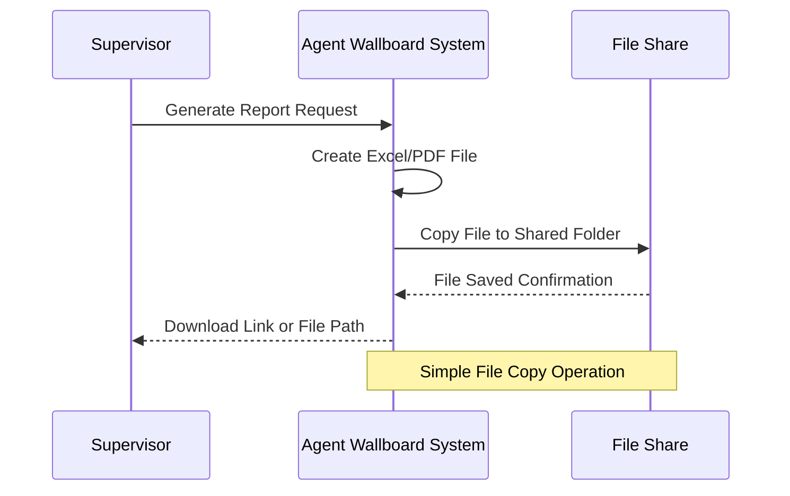
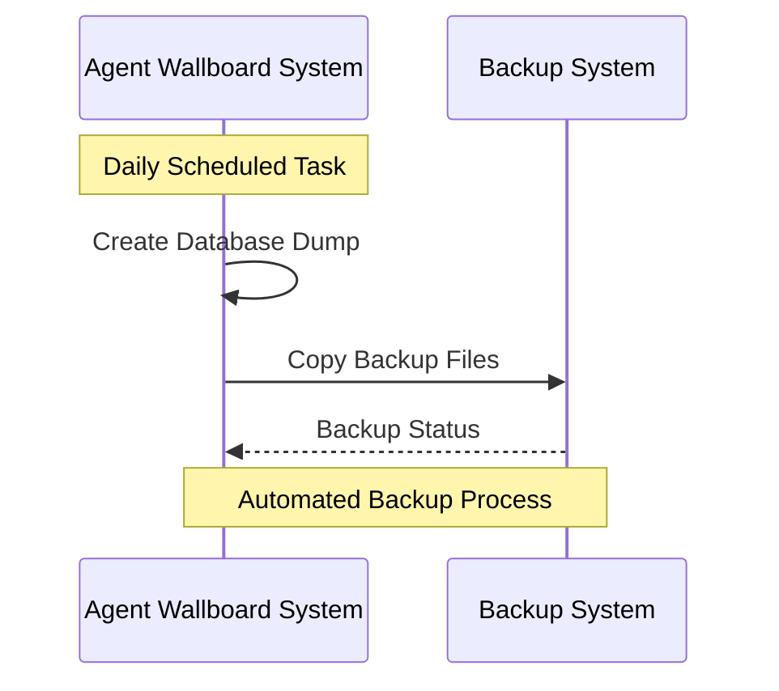

# Agent Wallboard System - C1 System Context Diagram
## Software Architecture - C4 Model Level 1

**Document ID:** C1-AWS-001  
**Version:** 1.0  
**วันที่:** กันยายน 2025  
**จัดทำโดย:** อาจารย์ ENGSE206 - RMUTL  

---

## 📊 1. C1 System Context Diagram

### 1.1 System Context Overview



### 1.2 System Context Description

**Agent Wallboard System** เป็นระบบ real-time monitoring และ communication platform ที่ออกแบบให้เรียบง่าย สำหรับนักศึกษาสามารถพัฒนาได้จริง โดยให้ความสามารถในการ:

- **ติดตามสถานะ Agent แบบ Real-time:** แสดงสถานะการทำงานของ Agent ทุกคนในทีมแบบทันที
- **การสื่อสารแบบ Two-way:** Supervisor สามารถส่งข้อความถึง Agent และ Agent สามารถรับแจ้งเตือนได้
- **การวิเคราะห์ประสิทธิภาพ:** สร้างรายงานและสถิติการทำงานของทีม
- **การจัดการระบบ:** Admin สามารถจัดการผู้ใช้และกำหนดค่าระบบได้

---

## 👥 2. Actors และ External Systems

### 2.1 Primary Users (People)

#### 👤 **Agent (Call Center Staff)**
**จำนวน:** 200-500 คน  
**บทบาท:** พนักงาน call center ที่ใช้งานระบบผ่าน desktop application  
**การใช้งานหลัก:**
- เข้าสู่ระบบด้วย Agent Code (แบบ simple login)
- เปลี่ยนสถานะการทำงาน (Available, Busy, Break, Meeting, Offline)
- รับและอ่านข้อความจาก Supervisor
- ได้รับการแจ้งเตือนแบบ real-time

**เทคโนโลยีที่ใช้:** Electron Desktop Application บน Windows/Mac/Linux

#### 👥 **Supervisor (Team Manager)**  
**จำนวน:** 20-50 คน  
**บทบาท:** หัวหน้าทีมที่ดูแลและจัดการ Agent ในทีม  
**การใช้งานหลัก:**
- ติดตามสถานะ Agent ทั้งทีมแบบ real-time
- ส่งข้อความถึง Agent เฉพาะคนหรือกระจายทั้งทีม
- ดู dashboard ประสิทธิภาพทีม
- ติดตามเวลาเข้า-ออกงานของ Agent

**เทคโนโลยีที่ใช้:** Web Dashboard ผ่าน Browser (Chrome, Firefox, Safari, Edge)

#### 🏢 **Operations Manager (Department Head)**
**จำนวน:** 5-10 คน  
**บทบาท:** ผู้บริหารระดับแผนกที่ต้องการข้อมูลเชิงลึก  
**การใช้งานหลัก:**
- ดูรายงานประสิทธิภาพโดยรวม
- วิเคราะห์ trend และ pattern ของทีม
- สร้างรายงานเพื่อเสนอผู้บริหารระดับสูง
- กำหนด KPI และ performance targets

**เทคโนโลยีที่ใช้:** Web Dashboard พร้อม Advanced Analytics

#### ⚙️ **System Admin (IT Personnel)**
**จำนวน:** 2-5 คน  
**บทบาท:** ผู้ดูแลระบบ IT และการจัดการเทคโนโลยี  
**การใช้งานหลัก:**
- จัดการผู้ใช้และสิทธิ์การเข้าถึง (simple user management)
- กำหนดค่าระบบและ business rules
- ติดตาม system performance และ health
- ดูแล backup และ maintenance

**เทคโนโลยีที่ใช้:** Admin Panel และ System Management Tools

### 2.2 External Systems (เฉพาะที่จำเป็น)

#### 📁 **File Share (Network Storage)**
**ประเภท:** Network Attached Storage (NAS) หรือ Shared Folder  
**วิธีการเชื่อมต่อ:** Simple file copy หรือ SMB protocol  
**ข้อมูลที่แลกเปลี่ยน:**
- Export reports (Excel, PDF)
- Configuration backups
- Log files archives

**เหตุผลที่ต้องเชื่อมต่อ:** เพื่อจัดเก็บไฟล์ที่ user สามารถเข้าถึงได้จากระบบอื่น

#### 💾 **Backup System (Simple Database Backup)**
**ประเภท:** Automated Database Backup Script หรือ Simple Backup Tool  
**วิธีการเชื่อมต่อ:** Database dump commands และ scheduled tasks  
**ข้อมูลที่แลกเปลี่ยน:**
- SQL Server database backups
- MongoDB collection exports
- Application log backups

**เหตุผลที่ต้องเชื่อมต่อ:** เพื่อความปลอดภัยของข้อมูลและ disaster recovery

---

## 🎯 3. Key Interactions และ Data Flows

### 3.1 Primary User Workflows

#### **Agent Daily Workflow:**
```
1. Agent เปิด Desktop App และ login ด้วย Agent Code
2. ระบบตรวจสอบ credentials จาก local database
3. Agent เปลี่ยนสถานะตลอดวันตามการทำงาน
4. Agent รับข้อความและแจ้งเตือนจาก Supervisor
5. ระบบ log ทุกการทำงานเพื่อ performance tracking
6. Agent logout เมื่อเลิกงาน
```

#### **Supervisor Management Workflow:**
```
1. Supervisor เข้า Web Dashboard
2. ดูสถานะ real-time ของ Agent ทั้งทีม
3. ส่งข้อความหรือประกาศให้ Agent
4. ดู performance dashboard และ analytics
5. Export รายงานไปยัง File Share
6. ติดตาม team productivity
```

### 3.2 Simple Integration Patterns

#### **File Export Flow:**


#### **Backup Flow:**


### 3.3 Data Exchange Protocols

| External System | Protocol | Data Format | Frequency | Security |
|----------------|----------|-------------|-----------|-----------|
| File Share | SMB/File Copy | Binary Files | Daily/Weekly | File System Permissions |
| Backup System | File Copy/Script | Database Dumps | Daily | Local File Security |

---

## 📋 4. System Boundaries และ Constraints

### 4.1 System Scope (What's Inside)

✅ **Agent Wallboard System รับผิดชอบ:**
- Real-time agent status tracking
- Message communication system
- Performance analytics และ reporting
- Simple user management และ authentication
- Basic system configuration และ administration
- Desktop notifications และ alerts

### 4.2 External Dependencies (What's Outside)

❌ **ระบบอื่นที่ไม่ได้รวมอยู่ใน scope:**
- **VoIP Phone System:** ระบบโทรศัพท์และ call routing
- **CRM System:** ระบบจัดการข้อมูลลูกค้า
- **HR System:** ระบบบริหารงานบุคคลและ payroll
- **Network Infrastructure:** อุปกรณ์เครือข่ายและ connectivity
- **Operating Systems:** Windows, macOS, Linux
- **External Identity Management:** Active Directory, LDAP
- **Email Systems:** SMTP servers, email notifications

### 4.3 Key Assumptions (สำหรับนักศึกษา)

🔍 **สมมติฐานสำคัญ:**
- ระบบจะรันบน local network (LAN) เท่านั้น
- Users มี basic computer skills สำหรับใช้งาน desktop/web applications
- มี IT support team สำหรับ basic system administration
- มี simple file sharing และ backup infrastructure อยู่แล้ว
- ไม่ต้องการ enterprise-grade security หรือ compliance

### 4.4 Business Constraints (เหมาะสำหรับนักศึกษา)

📊 **ข้อจำกัดทางธุรกิจ:**
- **Performance:** รองรับ 100-200 concurrent users (ไม่ใหญ่มาก)
- **Availability:** 95% uptime (ไม่ต้อง high availability)
- **Security:** Basic authentication และ data protection
- **Budget:** ใช้ open-source และ cost-effective technologies
- **Timeline:** 12 สัปดาห์สำหรับ prototype ที่ใช้งานได้

---

## 🚀 5. Benefits และ Value Proposition

### 5.1 Business Benefits

#### **สำหรับ Call Center Management:**
- **เพิ่มประสิทธิภาพ:** ลด time-to-response และปรับปรุง agent utilization
- **ลดต้นทุน:** ใช้ open-source technologies และ simple architecture
- **ปรับปรุง Quality:** real-time monitoring ทำให้จัดการทีมได้ดีขึ้น
- **Easy Implementation:** สามารถพัฒนาและ deploy ได้เร็ว

#### **สำหรับ Agents:**
- **ใช้งานง่าย:** interface ที่เรียบง่ายและ intuitive
- **Communication:** ได้รับข้อมูลและแจ้งเตือนทันที
- **Transparency:** เห็นสถานะตัวเองและทำความเข้าใจ expectations

#### **สำหรับ Students/Developers:**
- **ลดความซับซ้อน:** straightforward architecture แทนการใช้หลาย tools
- **ง่ายต่อการ learn:** modern technology stack และ good documentation
- **Scalable:** สามารถขยายระบบได้ตามการเติบโต

### 5.2 Technical Advantages

#### **Architecture Benefits:**
- **Real-time Performance:** WebSocket สำหรับ instant updates
- **Cross-platform:** รองรับทั้ง desktop และ web
- **Simple Design:** แยก components ทำให้ maintain ง่าย
- **Student-friendly:** ใช้ technologies ที่เรียนรู้ง่าย

#### **Operational Benefits:**
- **Easy Deployment:** simple setup และ configuration
- **Basic Monitoring:** essential logging และ performance tracking
- **Simple Security:** basic authentication และ data protection
- **Cost-effective:** ใช้ open-source tools และ minimal infrastructure

---

## ✅ 6. Summary และ Next Steps

### 6.1 System Context Summary

**Agent Wallboard System** เป็น simple platform ที่:

🎯 **เชื่อมต่อ 4 กลุ่มผู้ใช้หลัก** (Agent, Supervisor, Operations Manager, System Admin)  
🔗 **ผสานรวมกับ 2 external systems เท่านั้น** (File Share, Backup)  
📊 **ให้บริการ 3 ฟีเจอร์หลัก** (Real-time Monitoring, Communication, Analytics)  
⚡ **รองรับ real-time operations** สำหรับ call center environment  
🎓 **เหมาะสำหรับนักศึกษา** ที่สามารถพัฒนาได้จริงใน 12 สัปดาห์

### 6.2 Key Success Factors

✅ **Simplicity:** ออกแบบให้เรียบง่าย ไม่ซับซ้อนเกินความจำเป็น  
✅ **Student-friendly:** ใช้ technologies ที่เรียนรู้ง่าย  
✅ **Performance:** real-time updates ภายใน 2 วินาที  
✅ **Reliability:** 95% uptime และ simple error handling  
✅ **Implementable:** สามารถพัฒนาได้จริงโดยนักศึกษา  

### 6.3 Next Steps: C2 Container Diagram

การออกแบบ **C2 Container Diagram** ในขั้นต่อไปจะแสดง:

🏗️ **Simple Technology Stack:** React, Node.js, SQL Server, MongoDB  
📦 **Container Architecture:** Web App, Desktop App, API Server, Databases  
🌐 **Communication Protocols:** HTTP REST, WebSocket, Database connections  
🔒 **Basic Security:** Simple authentication, Basic data protection  

**Agent Wallboard System Context Diagram นี้เป็นพื้นฐานที่เรียบง่ายและเหมาะสำหรับการพัฒนาโดยนักศึกษา!** 🚀 System configuration และ administration
- Desktop notifications และ alerts

### 4.2 External Dependencies (What's Outside)

❌ **ระบบอื่นที่ไม่ได้รวมอยู่ใน scope:**
- **VoIP Phone System:** ระบบโทรศัพท์และ call routing
- **CRM System:** ระบบจัดการข้อมูลลูกค้า
- **HR System:** ระบบบริหารงานบุคคลและ payroll
- **Network Infrastructure:** อุปกรณ์เครือข่ายและ connectivity
- **Operating Systems:** Windows, macOS, Linux

### 4.3 Key Assumptions

🔍 **สมมติฐานสำคัญ:**
- องกรณ์มี Active Directory หรือ identity management system อยู่แล้ว
- มี network connectivity ที่เสถียรระหว่าง client และ server
- Users มี basic computer skills สำหรับใช้งาน desktop/web applications
- มี IT support team สำหรับ system administration
- มี backup และ monitoring infrastructure อยู่แล้ว

### 4.4 Business Constraints

📊 **ข้อจำกัดทางธุรกิจ:**
- **Compliance:** ต้องเป็นไปตาม data privacy regulations
- **Performance:** รองรับ 500 concurrent users พร้อมกัน
- **Availability:** 99.5% uptime (ลงไม่เกิน 3.65 ชั่วโมง/เดือน)
- **Security:** ข้อมูลต้องเข้ารหัสทั้ง at-rest และ in-transit
- **Budget:** ใช้ open-source และ cost-effective technologies

---

## 🚀 5. Benefits และ Value Proposition

### 5.1 Business Benefits

#### **สำหรับ Call Center Management:**
- **เพิ่มประสิทธิภาพ:** ลด time-to-response และปรับปรุง agent utilization
- **ลดต้นทุน:** ลดการใช้ communication tools แยกและ manual tracking
- **ปรับปรุง Quality:** real-time monitoring ทำให้จัดการทีมได้ดีขึ้น
- **Data-driven Decisions:** analytics และ reports สำหรับการตัดสินใจ

#### **สำหรับ Agents:**
- **ใช้งานง่าย:** interface ที่เรียบง่ายและ intuitive
- **Communication:** ได้รับข้อมูลและแจ้งเตือนทันที
- **Transparency:** เห็นสถานะตัวเองและทำความเข้าใจ expectations

#### **สำหรับ IT Department:**
- **ลดความซับซ้อน:** centralized system แทนการใช้หลาย tools
- **ง่ายต่อการ maintain:** modern technology stack และ good documentation
- **Scalable:** สามารถขยายระบบได้ตามการเติบโต

### 5.2 Technical Advantages

#### **Architecture Benefits:**
- **Real-time Performance:** WebSocket สำหรับ instant updates
- **Cross-platform:** รองรับทั้ง desktop และ web
- **Modular Design:** แยก components ทำให้ maintain ง่าย
- **Integration Ready:** APIs สำหรับเชื่อมต่อระบบอื่น

#### **Operational Benefits:**
- **High Availability:** load balancing และ failover capabilities
- **Monitoring:** comprehensive logging และ performance tracking
- **Security:** enterprise-grade security measures
- **Backup:** automated backup และ disaster recovery

---

## ✅ 6. Summary และ Next Steps

### 6.1 System Context Summary

**Agent Wallboard System** เป็น centralized platform ที่:

🎯 **เชื่อมต่อ 4 กลุ่มผู้ใช้หลัก** (Agent, Supervisor, Operations Manager, System Admin)  
🔗 **ผสานรวมกับ 5 external systems** (AD, Email, File Share, Backup, Monitoring)  
📊 **ให้บริการ 3 ฟีเจอร์หลัก** (Real-time Monitoring, Communication, Analytics)  
⚡ **รองรับ real-time operations** สำหรับ call center environment  

### 6.2 Key Success Factors

✅ **User Adoption:** ออกแบบ UI/UX ที่ใช้งานง่าย  
✅ **Performance:** real-time updates ภายใน 2 วินาที  
✅ **Reliability:** 99.5% uptime และ automatic failover  
✅ **Integration:** seamless connection กับ existing systems  
✅ **Scalability:** รองรับการเติบโตของทีม  

### 6.3 Next Steps: C2 Container Diagram

การออกแบบ **C2 Container Diagram** ในขั้นต่อไปจะแสดง:

🏗️ **Technology Stack Details:** React, Node.js, SQL Server, MongoDB  
📦 **Container Architecture:** Web App, Desktop App, API Server, Databases  
🌐 **Communication Protocols:** HTTP REST, WebSocket, Database connections  
🔒 **Security Boundaries:** Authentication, Authorization, Data encryption  

**Agent Wallboard System Context Diagram นี้เป็นพื้นฐานที่แข็งแกร่งสำหรับการออกแบบ C2-C4 ต่อไป!** 🚀