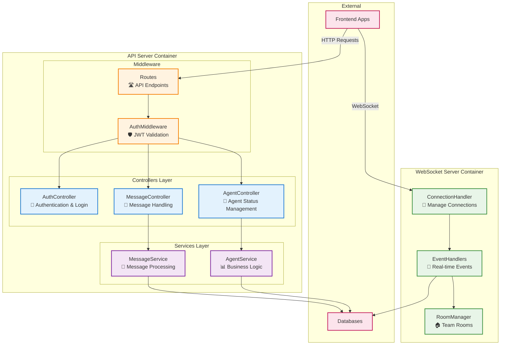
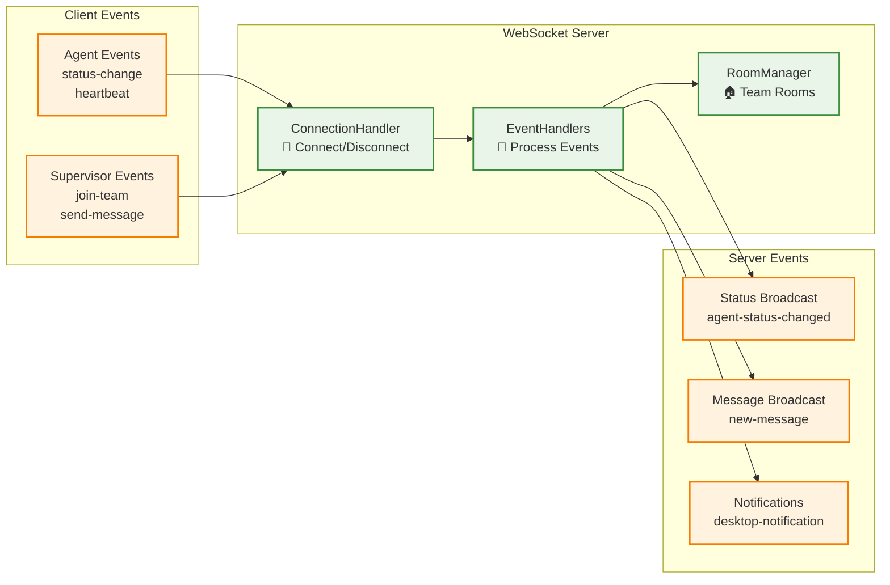

# Section 2: Backend Components 
### **Agent Wallboard System - C4 Model Level 3**

**Document ID:** C3-AWS-BACKEND-001  
**Version:** 1.0  
**วันที่:** กันยายน 2025  
**จัดทำโดย:** อาจารย์ ENGSE206 - RMUTL  

---

### 2.1 Backend Architecture Overview



---

## 🔧 2.2 API Server Components

### 2.2.1 Controllers Layer (HTTP Request Handlers)

#### 🔐 **AuthController.js**
**Purpose:** จัดการการ login/logout และ authentication  
**Key Functions:**
- รับ login request และตรวจสอบ credentials
- สร้าง JWT token สำหรับ authenticated users
- จัดการ logout และ invalidate tokens

---

#### 👤 **AgentController.js**
**Purpose:** จัดการ agent status และข้อมูล agent  
**Key Functions:**
- อัปเดตสถานะ agent (Available, Busy, Break, etc.)
- ดึงข้อมูล agent และประวัติสถานะ
- validate การเปลี่ยนสถานะตาม business rules

---

#### 💬 **MessageController.js**
**Purpose:** จัดการการส่งและรับข้อความ  
**Key Functions:**
- ส่งข้อความ direct ถึง agent เฉพาะคน
- ส่งข้อความ broadcast ถึงทั้งทีม
- ดึงข้อความใน inbox ของ agent

---

### 2.2.2 Services Layer (Business Logic)

#### 📊 **AgentService.js**
**Purpose:** ประมวลผล business logic สำหรับ agent operations  
**Key Functions:**
- validate status transitions ตาม business rules
- บันทึกประวัติการเปลี่ยนสถานะ
- คำนวณสถิติและ performance metrics

---

#### 📨 **MessageService.js**
**Purpose:** ประมวลผล business logic สำหรับ messaging system  
**Key Functions:**
- validate message content และ recipients
- จัดการ broadcast messages ถึงทั้งทีม
- track message delivery status

---

### 2.2.3 Middleware Components

#### 🛡️ **AuthMiddleware.js**
**Purpose:** ตรวจสอบ JWT token และ user authorization  
**Key Functions:**
- ตรวจสอบ JWT token ใน request headers
- validate token และแปลงเป็น user object
- ป้องกัน unauthorized access

---

#### 🛣️ **Routes.js**
**Purpose:** กำหนด API endpoints และเชื่อมต่อกับ controllers  
**Key Functions:**
- define URL routes สำหรับแต่ละ API endpoint
- apply middleware สำหรับ authentication และ authorization
- organize routes by functionality

---

## ⚡ 2.3 WebSocket Server Components

### 2.3.1 WebSocket Architecture Overview



### 2.3.2 WebSocket Components Detail

#### 🔌 **ConnectionHandler.js**
**Purpose:** จัดการ WebSocket connections และ authentication  
**Key Functions:**
- ตรวจสอบ JWT token เมื่อ client connect
- จัดการ connect/disconnect events
- maintain active connections list

---

#### 📡 **EventHandlers.js**
**Purpose:** ประมวลผล WebSocket events และ business logic  
**Key Functions:**
- handle agent status change events
- process message sending events
- broadcast updates to relevant clients

---

#### 🏠 **RoomManager.js**
**Purpose:** จัดการ Socket.io rooms สำหรับ team-based communication  
**Key Functions:**
- organize clients into team rooms
- manage room membership
- facilitate team-specific broadcasting


**2. Project Structure:**
```
backend/
├── controllers/
│   ├── AuthController.js
│   ├── AgentController.js
│   └── MessageController.js
├── services/
│   ├── AgentService.js
│   └── MessageService.js
├── middleware/
│   └── AuthMiddleware.js
├── websocket/
│   ├── ConnectionHandler.js
│   ├── EventHandlers.js
│   └── RoomManager.js
├── models/
│   ├── index.js
│   └── User.js
├── routes/
│   └── index.js
├── config/
│   └── database.js
└── server.js
```

---

## ✅ 2.8 Summary

### 2.8.1 Backend Components Overview

**🎯 Key Components Created:**
- ✅ **3 Controllers:** Auth, Agent, Message
- ✅ **2 Services:** AgentService, MessageService  
- ✅ **2 Middleware:** Authentication, Authorization
- ✅ **3 WebSocket Components:** ConnectionHandler, EventHandlers, RoomManager

### 2.8.2 Technology Stack Used

**📚 Core Technologies:**
- **Node.js + Express:** REST API server
- **Socket.io:** Real-time WebSocket communication
- **JWT:** Simple token-based authentication
- **bcrypt:** Password hashing
- **Sequelize:** SQL Server ORM
- **Mongoose:** MongoDB ODM

### 2.8.3 Key Features Implemented

**🔧 API Server Features:**
- JWT-based authentication
- Role-based authorization (Agent, Supervisor, Admin)
- Agent status management with business rules
- Message sending (direct + broadcast)
- Input validation and error handling

**⚡ WebSocket Features:**
- Real-time status updates
- Live message delivery
- Team-based room management
- Connection authentication
- Event-driven architecture

### 2.8.4 Ready for Integration

**🔗 Integration Points:**
- **Frontend Apps:** Ready to consume REST APIs
- **Database:** Clear data access patterns
- **Real-time Updates:** WebSocket events defined
- **Security:** Authentication and authorization in place

### 2.8.5 Next Steps

**📝 What's Next:**
- **Section 1:** Frontend Components (React components, state management)
- **Section 3:** Database Components (SQL Server + MongoDB schemas)
- **Testing:** Unit tests และ integration tests
- **Deployment:** Production setup และ monitoring

**Backend Components พร้อมแล้วสำหรับการ integrate กับ Frontend และ Database!** 🚀

---
