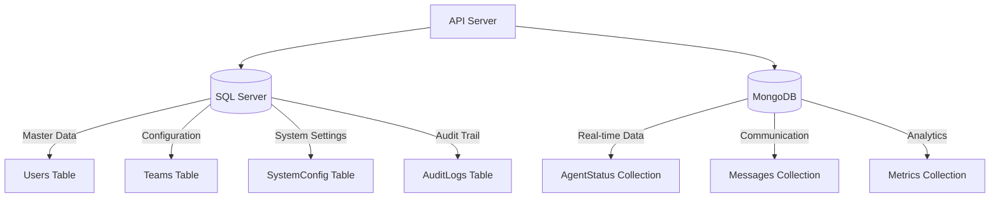

# Section 3: Database Components
### **Agent Wallboard System - C4 Model Level 3**

**Document ID:** C3-AWS-DB-001  
**Version:** 1.0  
**วันที่:** กันยายน 2025  
**จัดทำโดย:** อาจารย์ ENGSE206 - RMUTL (ดอยสะเก็ด)

---

## 📋 3.1 Database Architecture Overview

### 3.1.1 Database Strategy - Hybrid Database Approach

Agent Wallboard System ใช้ **Multi-Database Architecture** โดยแบ่งการจัดเก็บข้อมูลตามลักษณะและความต้องการ:

### 3.1.2 Database Selection Rationale

| **SQL Server (MSSQL)** | **MongoDB** |
|------------------------|-------------|
| **ใช้สำหรับ:** Structured, ACID-compliant data | **ใช้สำหรับ:** Real-time, high-volume data |
| • User management และ authentication | • Agent status changes (ความถี่สูง) |
| • Team configurations และ hierarchy | • Message communications |
| • System settings และ business rules | • Performance metrics และ analytics |
| • Audit logs และ compliance data | • Session logs และ temporary data |

**เหตุผล:** 
- **MSSQL**: รองรับ ACID transactions, complex relationships, enterprise security
- **MongoDB**: รองรับ high-frequency writes, flexible schema, real-time queries

### 3.1.3 Mapping กับ User Stories และ Functional Requirements

**SQL Server รองรับ User Stories:**
- **US-001 (Agent Login)**: Users table สำหรับ authentication
- **US-006 (Agent Management)**: Users และ Teams tables สำหรับ hierarchy
- **US-012 (System Configuration)**: SystemConfig table สำหรับ settings
- **US-010 (Admin Functions)**: AuditLogs สำหรับ compliance

**MongoDB รองรับ User Stories:**
- **US-002 (Status Monitoring)**: AgentStatus collection สำหรับ real-time tracking
- **US-004 (Message Communication)**: Messages collection สำหรับ notifications
- **US-008 (Analytics)**: Metrics collection สำหรับ performance reports
- **US-003 (Real-time Updates)**: High-frequency document updates

---

## 📋 3.2 Section Summary

### 3.2.1 Database Components รวม

**SQL Server Components:**
- ✅ 4 Core Tables (Users, Teams, SystemConfig, AuditLogs)
- ✅ Relationship Management และ ACID Compliance
- ✅ Security และ Audit Trail
- ✅ Stored Procedures และ Performance Optimization

**MongoDB Components:**
- ✅ 3 Core Collections (AgentStatus, Messages, Metrics)
- ✅ Real-time Data Management
- ✅ Flexible Schema และ High Performance
- ✅ TTL Indexes และ Auto-cleanup

**Integration Layer:**
- ✅ Database Access Layer (DAL)
- ✅ Connection Management
- ✅ Cross-Database Operations
- ✅ Error Handling และ Resilience

### 3.2.2 Implementation Readiness

Database Components ได้รับการออกแบบให้:
- **รองรับ Requirements:** ครบทั้ง 14 User Stories และ 10 Functional Requirements
- **เตรียมพร้อมสำหรับ Development:** มี code examples ที่ใช้งานได้จริง
- **มีความยืดหยุ่น:** รองรับการเปลี่ยนแปลงในอนาคต
- **มีประสิทธิภาพ:** Optimized สำหรับ real-time operations
- **ปลอดภัย:** มี security measures และ compliance support
- **สอดคล้องกับ Backend Components:** ใช้ DatabaseManager จาก Section 2

### 3.2.3 Connection กับ Backend Components

**การเชื่อมต่อกับ Section 2:**
- **AgentService.js** → **SQLServerRepository** (Users, Teams tables)
- **AgentService.js** → **MongoDBRepository** (AgentStatus collection)
- **MessageService.js** → **MongoDBRepository** (Messages collection)
- **AuthController.js** → **SQLServerRepository** (Users table + AuditLogs)
- **WebSocket EventHandlers** → **MongoDBRepository** (Real-time status updates)

**Cross-Database Operations:**
- User authentication (SQL) + Status updates (MongoDB)
- Team hierarchy (SQL) + Performance metrics (MongoDB)
- System configuration (SQL) + Message routing (MongoDB)

### Next Steps

พร้อมสำหรับ:
1. **Database Implementation:** สร้าง tables และ collections จริง
2. **Data Migration:** ย้ายข้อมูลจากระบบเก่า (ถ้ามี)
3. **Testing:** Integration testing ระหว่าง databases
4. **Monitoring:** ติดตั้ง database monitoring tools
5. **Deployment:** Deploy ไปยัง production environment

**Database Architecture นี้เป็นพื้นฐานที่มั่นคงสำหรับ Agent Wallboard System! 🚀**