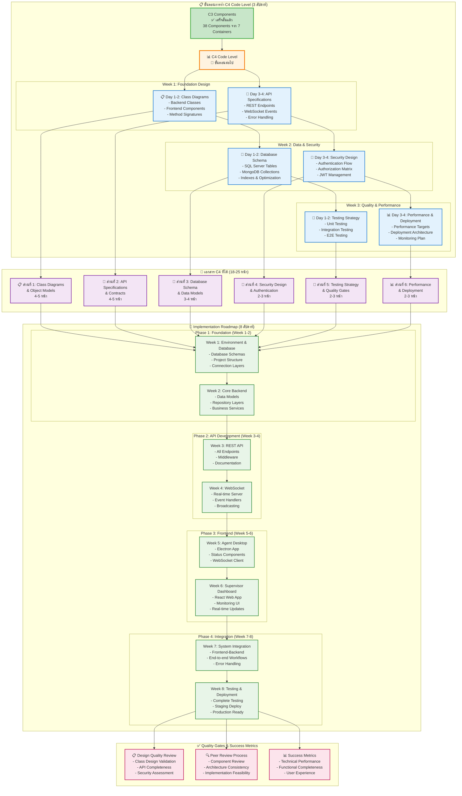
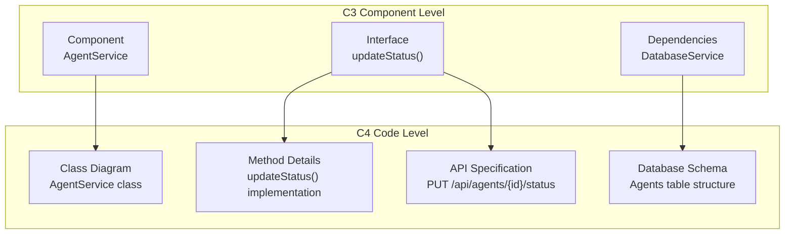

# แผนงานและแนวทางการออกแบบ C4 Code Level
## สำหรับนักศึกษาวิศวกรรมซอฟต์แวร์ ปี 2

---

## บทนำ

การออกแบบ C4 Code Level คือการแปลง C3 Components ให้เป็นรายละเอียดระดับโค้ดจริง รวมถึง Class Diagrams, API Specifications, และ Database Schema เพื่อให้นักพัฒนาสามารถเขียนโค้ดได้ทันที

**เป้าหมาย:** สร้างเอกสารทางเทคนิคที่ครบถ้วนและใช้งานได้จริง

---

## C4 Code Level Implementation Plan Overview
### ภาพรวมแผนงานการออกแบบและพัฒนาระบบ



### 📊 สรุปภาพรวมแผนงาน C4 Implementation

#### 🎯 เป้าหมายหลัก
- แปลง **C3 Components** (38 components) เป็น **Code-level specifications**
- สร้างเอกสารทางเทคนิคที่ **developers ใช้งานได้ทันที**
- เตรียม **Implementation roadmap** ที่เป็นไปได้จริง

#### ⏰ Timeline สรุป
- **C4 Design Phase:** 3 สัปดาห์
- **Implementation Phase:** 8 สัปดาห์  
- **Total Project Duration:** 11 สัปดาห์

---

## 📋 ภาพรวม: จาก C3 Components สู่ระบบที่ใช้งานจริง

### สถานะปัจจุบัน: C3 Components เสร็จสมบูรณ์แล้ว ✅
- **Section 1:** Frontend Components (7 หน้า) - UI mockups, React code, UML
- **Section 2:** Backend Components (7 หน้า) - API endpoints, WebSocket, Services  
- **Section 3:** Database Components (6 หน้า) - MSSQL + MongoDB, DAL

### สิ่งที่เรามีแล้วจาก C3

จาก C3 Component Architecture เราได้:
- **38 Components** แบ่งเป็น 7 Containers
- **Component Interfaces** ที่กำหนดไว้แล้ว
- **Communication Patterns** ที่ชัดเจน
- **Dependencies Matrix** ที่สมบูรณ์

### การเชื่อมต่อจาก C3 สู่ C4



---

## Step 1: การวางแผนการทำงาน C4 (2-3 สัปดาห์)

### 1.1 โครงสร้างเอกสาร C4 ที่แนะนำ

**เอกสาร C4 Code Level (18-25 หน้า) แบ่งเป็น 6 ส่วน:**

```
📄 C4 Code Level Documentation
├── 📋 ส่วนที่ 1: Class Diagrams & Object Models (4-5 หน้า)
├── 🔗 ส่วนที่ 2: API Specifications & Contracts (4-5 หน้า)
├── 💾 ส่วนที่ 3: Database Schema & Data Models (3-4 หน้า)
├── 🔐 ส่วนที่ 4: Security Design & Authentication (2-3 หน้า)
├── 🧪 ส่วนที่ 5: Testing Strategy & Quality Gates (2-3 หน้า)
└── 📊 ส่วนที่ 6: Performance & Deployment Specifications (2-3 หน้า)
```

### 1.2 แผนการทำงานแบบสัปดาห์

#### **สัปดาห์ที่ 1: Foundation Design**
- ส่วนที่ 1: Class Diagrams (2-3 วัน)
- ส่วนที่ 2: API Specifications (2-3 วัน)

#### **สัปดาห์ที่ 2: Data & Security**
- ส่วนที่ 3: Database Schema (2-3 วัน)
- ส่วนที่ 4: Security Design (2-3 วัน)

#### **สัปดาห์ที่ 3: Quality & Integration**
- ส่วนที่ 5: Testing Strategy (2-3 วัน)
- ส่วนที่ 6: Performance & Deployment (2-3 วัน)

---

## Step 2: ส่วนที่ 1 - Class Diagrams & Object Models

### 2.1 เป้าหมายและขอบเขต

**สิ่งที่ต้องสร้าง:**
- Class Diagrams สำหรับทุก Component ใน C3
- Method signatures พร้อม parameters และ return types
- Relationships ระหว่าง classes (inheritance, composition, aggregation)
- Data Transfer Objects (DTOs) และ Model classes

### 2.2 แผนการทำงานรายละเอียด

#### **วันที่ 1: Backend Classes**

**AgentService Class Diagram:**
```typescript
class AgentService {
  // Properties
  private databaseService: IDatabaseService
  private eventBus: IEventBus
  private validationService: IValidationService
  
  // Constructor
  constructor(databaseService: IDatabaseService, eventBus: IEventBus)
  
  // Public Methods
  public async updateStatus(agentId: string, newStatus: AgentStatus, reason?: string): Promise<AgentStatusResult>
  public async getCurrentStatus(agentId: string): Promise<AgentStatus>
  public async getStatusHistory(agentId: string, timeRange: DateRange): Promise<AgentStatusHistory[]>
  public async validateStatusTransition(currentStatus: AgentStatus, newStatus: AgentStatus): Promise<ValidationResult>
  
  // Private Methods
  private async logStatusChange(agentId: string, oldStatus: AgentStatus, newStatus: AgentStatus): Promise<void>
  private async notifyStatusChange(agentId: string, newStatus: AgentStatus): Promise<void>
}
```

**ทำสำหรับ Components เหล่านี้:**
- AgentService, MessageService
- AuthController, AgentController, MessageController
- DatabaseService, WebSocketService

#### **วันที่ 2: Frontend Classes**

**StatusComponent Class:**
```typescript
interface StatusComponentProps {
  agentId: string
  initialStatus: AgentStatus
  onStatusChange: (newStatus: AgentStatus) => void
}

interface StatusComponentState {
  currentStatus: AgentStatus
  isLoading: boolean
  statusHistory: AgentStatusHistory[]
  error: string | null
}

class StatusComponent extends React.Component<StatusComponentProps, StatusComponentState> {
  private apiService: APIService
  private webSocketService: WebSocketService
  
  constructor(props: StatusComponentProps)
  
  public componentDidMount(): void
  public componentWillUnmount(): void
  public render(): JSX.Element
  
  private handleStatusChange = async (newStatus: AgentStatus): Promise<void>
  private setupWebSocketListeners = (): void
  private cleanupWebSocketListeners = (): void
  private validateStatusTransition = (newStatus: AgentStatus): boolean
}
```

#### **วันที่ 3: Database Models**

**Entity Relationship Models:**
```typescript
// SQL Server Models
interface User {
  userId: number
  agentCode: string
  firstName: string
  lastName: string
  email: string
  passwordHash: string
  role: UserRole
  teamId: number
  isActive: boolean
  createdAt: Date
  updatedAt: Date
}

interface Team {
  teamId: number
  teamName: string
  description: string
  supervisorId: number
  maxAgents: number
  isActive: boolean
}

// MongoDB Models
interface AgentStatusDocument {
  _id: ObjectId
  agentId: string
  status: AgentStatus
  previousStatus: AgentStatus
  timestamp: Date
  reason?: string
  sessionId: string
  metadata: {
    ipAddress: string
    userAgent: string
  }
}

interface MessageDocument {
  _id: ObjectId
  senderId: string
  recipientId: string | null // null for broadcast
  messageType: MessageType
  subject: string
  content: string
  priority: MessagePriority
  isRead: boolean
  sentAt: Date
  readAt?: Date
  expiresAt: Date
}
```

### 2.3 คำแนะนำการสร้าง Class Diagrams

#### **เครื่องมือที่แนะนำ:**
- **PlantUML** (text-based, version control friendly)
- **Lucidchart** (visual, collaborative)
- **Draw.io** (free, web-based)
- **Visual Studio Code + PlantUML extension**

#### **หลักการออกแบบ Class:**
1. **Single Responsibility** - แต่ละ class มีหน้าที่เดียว
2. **Clear Naming** - ชื่อ class และ method สื่อความหมาย
3. **Consistent Patterns** - ใช้ naming convention เดียวกัน
4. **Proper Encapsulation** - private/public/protected ที่เหมาะสม

---

## Step 3: ส่วนที่ 2 - API Specifications & Contracts

### 3.1 เป้าหมายและขอบเขต

**สิ่งที่ต้องสร้าง:**
- REST API Endpoints สำหรับทุก HTTP operations
- WebSocket Events และ message formats
- Request/Response schemas
- Error handling specifications
- Authentication และ authorization requirements

### 3.2 แผนการทำงานรายละเอียด

#### **วันที่ 1: REST API Design**

**Authentication Endpoints:**
```yaml
# OpenAPI 3.0 Specification
paths:
  /api/auth/login:
    post:
      summary: Agent login
      requestBody:
        required: true
        content:
          application/json:
            schema:
              type: object
              properties:
                agentCode:
                  type: string
                  pattern: '^AG[0-9]{3}$'
                  example: 'AG001'
                password:
                  type: string
                  minLength: 6
                rememberMe:
                  type: boolean
                  default: false
              required:
                - agentCode
                - password
      responses:
        '200':
          description: Login successful
          content:
            application/json:
              schema:
                type: object
                properties:
                  success:
                    type: boolean
                  token:
                    type: string
                  user:
                    $ref: '#/components/schemas/User'
                  expiresIn:
                    type: number
        '401':
          description: Invalid credentials
          content:
            application/json:
              schema:
                $ref: '#/components/schemas/ErrorResponse'
```

**Agent Management Endpoints:**
```yaml
  /api/agents/{agentId}/status:
    put:
      summary: Update agent status
      security:
        - BearerAuth: []
      parameters:
        - name: agentId
          in: path
          required: true
          schema:
            type: string
      requestBody:
        required: true
        content:
          application/json:
            schema:
              type: object
              properties:
                status:
                  type: string
                  enum: [Available, Busy, Break, Meeting, Training, Offline]
                reason:
                  type: string
                  maxLength: 255
              required:
                - status
      responses:
        '200':
          description: Status updated successfully
        '400':
          description: Invalid status transition
        '401':
          description: Unauthorized
        '403':
          description: Forbidden
```

#### **วันที่ 2: WebSocket Events Design**

**Event Specifications:**
```typescript
// Agent Events (Client to Server)
interface AgentStatusChangeEvent {
  eventType: 'agent:status-change'
  payload: {
    agentId: string
    newStatus: AgentStatus
    reason?: string
    timestamp: string
  }
}

interface AgentHeartbeatEvent {
  eventType: 'agent:heartbeat'
  payload: {
    agentId: string
    timestamp: string
    metadata: {
      activeWindows: number
      cpuUsage: number
    }
  }
}

// Server Events (Server to Client)
interface StatusBroadcastEvent {
  eventType: 'status:broadcast'
  payload: {
    agentId: string
    agentName: string
    status: AgentStatus
    timestamp: string
    teamId: string
  }
}

interface MessageNotificationEvent {
  eventType: 'message:notification'
  payload: {
    messageId: string
    senderId: string
    senderName: string
    subject: string
    content: string
    priority: MessagePriority
    timestamp: string
  }
}
```

#### **วันที่ 3: Error Handling & Validation**

**Standardized Error Response:**
```typescript
interface APIErrorResponse {
  success: false
  error: {
    code: string
    message: string
    details?: any
    timestamp: string
    requestId: string
  }
}

// Error Codes
enum APIErrorCodes {
  // Authentication Errors
  INVALID_CREDENTIALS = 'AUTH_001',
  TOKEN_EXPIRED = 'AUTH_002',
  TOKEN_INVALID = 'AUTH_003',
  INSUFFICIENT_PERMISSIONS = 'AUTH_004',
  
  // Agent Errors
  AGENT_NOT_FOUND = 'AGENT_001',
  INVALID_STATUS_TRANSITION = 'AGENT_002',
  AGENT_ALREADY_ACTIVE = 'AGENT_003',
  
  // Message Errors
  MESSAGE_TOO_LONG = 'MSG_001',
  RECIPIENT_NOT_FOUND = 'MSG_002',
  MESSAGE_EXPIRED = 'MSG_003',
  
  // System Errors
  DATABASE_ERROR = 'SYS_001',
  WEBSOCKET_ERROR = 'SYS_002',
  RATE_LIMIT_EXCEEDED = 'SYS_003'
}
```

### 3.3 API Documentation Tools

**แนะนำ:**
- **Swagger/OpenAPI 3.0** - สำหรับ REST API documentation
- **AsyncAPI** - สำหรับ WebSocket event documentation
- **Postman Collections** - สำหรับ API testing
- **Insomnia** - สำหรับ API development และ testing

---

## Step 4: ส่วนที่ 3 - Database Schema & Data Models

### 4.1 เป้าหมายและขอบเขต

**สิ่งที่ต้องสร้าง:**
- SQL Server database schema พร้อม tables, indexes, constraints
- MongoDB collections พร้อม document structures
- Data relationships และ foreign keys
- Database performance optimization
- Migration scripts และ seed data

### 4.2 แผนการทำงานรายละเอียด

#### **วันที่ 1: SQL Server Schema Design**

**Tables Structure:**
```sql
-- Users table
CREATE TABLE Users (
    UserId INT IDENTITY(1,1) PRIMARY KEY,
    AgentCode NVARCHAR(10) UNIQUE NOT NULL,
    FirstName NVARCHAR(50) NOT NULL,
    LastName NVARCHAR(50) NOT NULL,
    Email NVARCHAR(100) UNIQUE NOT NULL,
    PasswordHash NVARCHAR(255) NOT NULL,
    Role NVARCHAR(20) CHECK (Role IN ('Agent', 'Supervisor', 'Manager', 'Admin')) NOT NULL,
    TeamId INT,
    IsActive BIT DEFAULT 1,
    CreatedAt DATETIME2 DEFAULT GETDATE(),
    UpdatedAt DATETIME2 DEFAULT GETDATE(),
    LastLoginAt DATETIME2,
    
    CONSTRAINT FK_Users_TeamId FOREIGN KEY (TeamId) REFERENCES Teams(TeamId)
);

-- Teams table
CREATE TABLE Teams (
    TeamId INT IDENTITY(1,1) PRIMARY KEY,
    TeamName NVARCHAR(100) NOT NULL,
    Description NVARCHAR(500),
    SupervisorId INT,
    MaxAgents INT DEFAULT 10,
    IsActive BIT DEFAULT 1,
    CreatedAt DATETIME2 DEFAULT GETDATE(),
    
    CONSTRAINT FK_Teams_SupervisorId FOREIGN KEY (SupervisorId) REFERENCES Users(UserId)
);

-- System Configuration table
CREATE TABLE SystemConfig (
    ConfigId INT IDENTITY(1,1) PRIMARY KEY,
    ConfigKey NVARCHAR(100) UNIQUE NOT NULL,
    ConfigValue NVARCHAR(MAX) NOT NULL,
    ConfigType NVARCHAR(50) DEFAULT 'String',
    Description NVARCHAR(500),
    IsEditable BIT DEFAULT 1,
    CreatedAt DATETIME2 DEFAULT GETDATE(),
    UpdatedAt DATETIME2 DEFAULT GETDATE()
);

-- Audit Logs table
CREATE TABLE AuditLogs (
    LogId BIGINT IDENTITY(1,1) PRIMARY KEY,
    UserId INT,
    Action NVARCHAR(100) NOT NULL,
    TableName NVARCHAR(100),
    RecordId NVARCHAR(50),
    OldValues NVARCHAR(MAX),
    NewValues NVARCHAR(MAX),
    IPAddress NVARCHAR(45),
    UserAgent NVARCHAR(500),
    Timestamp DATETIME2 DEFAULT GETDATE(),
    
    CONSTRAINT FK_AuditLogs_UserId FOREIGN KEY (UserId) REFERENCES Users(UserId)
);
```

**Indexes for Performance:**
```sql
-- Performance indexes
CREATE INDEX IX_Users_AgentCode ON Users(AgentCode);
CREATE INDEX IX_Users_Email ON Users(Email);
CREATE INDEX IX_Users_TeamId_Role ON Users(TeamId, Role);
CREATE INDEX IX_AuditLogs_Timestamp ON AuditLogs(Timestamp DESC);
CREATE INDEX IX_AuditLogs_UserId_Timestamp ON AuditLogs(UserId, Timestamp DESC);
```

#### **วันที่ 2: MongoDB Collections Design**

**Collections Structure:**
```javascript
// AgentStatus Collection
{
  _id: ObjectId,
  agentId: "AG001", // Reference to Users.AgentCode
  status: "Available", // Available, Busy, Break, Meeting, Training, Offline
  previousStatus: "Offline",
  startTime: ISODate("2025-09-25T08:00:00Z"),
  endTime: ISODate("2025-09-25T17:00:00Z"), // null if currently active
  reason: "Scheduled break",
  sessionId: "session_uuid_here",
  location: {
    ipAddress: "192.168.1.100",
    userAgent: "Mozilla/5.0...",
    buildingFloor: "3F",
    deskNumber: "3F-A-15"
  },
  metadata: {
    loginTime: ISODate("2025-09-25T08:00:00Z"),
    expectedShiftEnd: ISODate("2025-09-25T17:00:00Z"),
    breakTimeUsed: 1800, // seconds
    totalOnlineTime: 28800 // seconds
  },
  createdAt: ISODate("2025-09-25T08:00:00Z"),
  updatedAt: ISODate("2025-09-25T12:30:00Z")
}

// Messages Collection  
{
  _id: ObjectId,
  messageType: "broadcast", // direct, broadcast, system
  senderId: "SP001", // Reference to Users.AgentCode
  senderName: "John Supervisor",
  recipientType: "team", // individual, team, all
  recipientIds: ["AG001", "AG002", "AG003"], // Array of AgentCodes
  teamId: 1, // Reference to Teams.TeamId
  subject: "Team Meeting Reminder",
  content: "Please join the team meeting at 2:00 PM",
  priority: "normal", // low, normal, high, urgent
  attachments: [
    {
      fileName: "meeting-agenda.pdf",
      fileSize: 245760,
      contentType: "application/pdf",
      downloadUrl: "https://storage.example.com/files/meeting-agenda.pdf"
    }
  ],
  readStatus: {
    "AG001": {
      isRead: true,
      readAt: ISODate("2025-09-25T10:15:00Z")
    },
    "AG002": {
      isRead: false,
      readAt: null
    }
  },
  deliveryStatus: "delivered", // sent, delivered, failed
  expiresAt: ISODate("2025-09-25T14:00:00Z"),
  createdAt: ISODate("2025-09-25T10:00:00Z"),
  updatedAt: ISODate("2025-09-25T10:15:00Z")
}

// Performance Metrics Collection
{
  _id: ObjectId,
  metricType: "team_performance", // agent_performance, team_performance, system_health
  scope: {
    type: "team", // agent, team, system
    id: "1", // TeamId or AgentId
    name: "Customer Service Team"
  },
  timeFrame: {
    startTime: ISODate("2025-09-25T00:00:00Z"),
    endTime: ISODate("2025-09-25T23:59:59Z"),
    interval: "daily", // hourly, daily, weekly, monthly
    timezone: "Asia/Bangkok"
  },
  metrics: {
    agentCount: {
      total: 8,
      active: 6,
      available: 4,
      busy: 2,
      break: 0,
      offline: 2
    },
    utilization: {
      percentage: 87.5,
      availableTime: 25200, // seconds
      busyTime: 21600, // seconds
      breakTime: 3600, // seconds
      offlineTime: 7200 // seconds
    },
    performance: {
      averageHandleTime: 240, // seconds
      serviceLevel: 92.3, // percentage
      firstCallResolution: 85.7, // percentage
      customerSatisfaction: 4.2 // out of 5
    },
    messaging: {
      messagesSent: 25,
      messagesReceived: 40,
      averageResponseTime: 150, // seconds
      broadcastMessages: 5
    }
  },
  calculatedAt: ISODate("2025-09-25T23:59:59Z"),
  createdAt: ISODate("2025-09-25T23:59:59Z")
}
```

**MongoDB Indexes:**
```javascript
// AgentStatus Collection Indexes
db.AgentStatus.createIndex({ "agentId": 1, "createdAt": -1 });
db.AgentStatus.createIndex({ "status": 1, "startTime": 1 });
db.AgentStatus.createIndex({ "sessionId": 1 });
db.AgentStatus.createIndex({ "createdAt": 1 }, { expireAfterSeconds: 7776000 }); // 90 days TTL

// Messages Collection Indexes
db.Messages.createIndex({ "recipientIds": 1, "createdAt": -1 });
db.Messages.createIndex({ "senderId": 1, "createdAt": -1 });
db.Messages.createIndex({ "teamId": 1, "messageType": 1 });
db.Messages.createIndex({ "expiresAt": 1 }, { expireAfterSeconds: 0 }); // TTL Index

// Performance Metrics Collection Indexes
db.PerformanceMetrics.createIndex({ "scope.type": 1, "scope.id": 1, "timeFrame.startTime": 1 });
db.PerformanceMetrics.createIndex({ "metricType": 1, "calculatedAt": -1 });
```

#### **วันที่ 3: Data Migration & Seeding**

**Sample Data Scripts:**
```sql
-- Sample Users
INSERT INTO Users (AgentCode, FirstName, LastName, Email, PasswordHash, Role, TeamId) VALUES
('AG001', 'Sarah', 'Johnson', 'sarah.johnson@company.com', '$2b$10$hashed_password_here', 'Agent', 1),
('AG002', 'Mike', 'Chen', 'mike.chen@company.com', '$2b$10$hashed_password_here', 'Agent', 1),
('SP001', 'John', 'Supervisor', 'john.supervisor@company.com', '$2b$10$hashed_password_here', 'Supervisor', 1),
('MG001', 'Lisa', 'Manager', 'lisa.manager@company.com', '$2b$10$hashed_password_here', 'Manager', NULL);

-- Sample Teams
INSERT INTO Teams (TeamName, Description, SupervisorId, MaxAgents) VALUES
('Customer Service', 'Handle customer inquiries and support tickets', 3, 15),
('Technical Support', 'Provide technical assistance and troubleshooting', 3, 10),
('Sales Support', 'Support sales team with customer questions', 3, 8);

-- Sample System Configuration
INSERT INTO SystemConfig (ConfigKey, ConfigValue, ConfigType, Description) VALUES
('MAX_BREAK_TIME_MINUTES', '120', 'Integer', 'Maximum break time allowed per day in minutes'),
('WEBSOCKET_HEARTBEAT_INTERVAL', '30', 'Integer', 'WebSocket heartbeat interval in seconds'),
('MESSAGE_RETENTION_DAYS', '90', 'Integer', 'Number of days to retain messages'),
('AUTO_LOGOUT_MINUTES', '480', 'Integer', 'Auto logout after inactive time in minutes');
```

---

## Step 5: ส่วนที่ 4 - Security Design & Authentication

### 5.1 เป้าหมายและขอบเขต

**สิ่งที่ต้องออกแบบ:**
- Authentication flow และ authorization matrix
- JWT token management และ refresh mechanism
- Password security และ hashing strategy
- API security และ rate limiting
- WebSocket security และ connection validation
- Data encryption และ privacy protection

### 5.2 แนวทางการออกแบบ Security

#### **Authentication Flow:**
```typescript
interface AuthenticationFlow {
  // Step 1: Initial Login
  login: {
    input: {
      agentCode: string
      password: string
      rememberMe: boolean
    }
    process: [
      'Validate input format',
      'Check rate limiting',
      'Verify credentials against database',
      'Generate JWT access token',
      'Generate refresh token',
      'Log successful login',
      'Return tokens and user info'
    ]
    output: {
      accessToken: string
      refreshToken: string
      expiresIn: number
      user: UserInfo
    }
  }
  
  // Step 2: Token Validation
  validateToken: {
    input: {
      token: string
    }
    process: [
      'Verify JWT signature',
      'Check token expiration',
      'Validate user still active',
      'Check permissions for requested resource'
    ]
    output: {
      valid: boolean
      user: UserInfo
      permissions: string[]
    }
  }
  
  // Step 3: Token Refresh
  refreshToken: {
    input: {
      refreshToken: string
    }
    process: [
      'Validate refresh token',
      'Generate new access token',
      'Optionally rotate refresh token',
      'Log token refresh'
    ]
    output: {
      accessToken: string
      refreshToken: string
      expiresIn: number
    }
  }
}
```

#### **Authorization Matrix:**
```typescript
interface PermissionMatrix {
  Agent: {
    canUpdateOwnStatus: true
    canViewOwnHistory: true
    canReadMessages: true
    canUpdateOthersStatus: false
    canSendMessages: false
    canViewTeamData: false
    canManageUsers: false
  }
  
  Supervisor: {
    canUpdateOwnStatus: true
    canViewOwnHistory: true
    canReadMessages: true
    canUpdateTeamStatus: true // Only team members
    canSendMessages: true // To team members
    canViewTeamData: true
    canManageTeamMembers: true
    canManageUsers: false
  }
  
  Manager: {
    canUpdateOwnStatus: true
    canViewAllHistory: true
    canReadAllMessages: true
    canViewAllTeamData: true
    canGenerateReports: true
    canManageUsers: false
  }
  
  Admin: {
    canDoEverything: true
    canManageUsers: true
    canConfigureSystem: true
    canViewAuditLogs: true
    canManageTeams: true
  }
}
```

---

## Step 6: ส่วนที่ 5 - Testing Strategy & Quality Gates

### 6.1 เป้าหมายและขอบเขต

**สิ่งที่ต้องวางแผน:**
- Unit testing strategy สำหรับแต่ละ component
- Integration testing สำหรับ API และ database
- End-to-end testing สำหรับ user workflows
- Performance testing และ load testing
- Security testing และ vulnerability assessment

### 6.2 Testing Strategy รายระดับ

#### **Unit Testing (Component Level):**
```typescript
// Example: AgentService Unit Tests
describe('AgentService', () => {
  let agentService: AgentService;
  let mockDatabaseService: jest.Mocked<IDatabaseService>;
  let mockEventBus: jest.Mocked<IEventBus>;
  
  beforeEach(() => {
    mockDatabaseService = createMockDatabaseService();
    mockEventBus = createMockEventBus();
    agentService = new AgentService(mockDatabaseService, mockEventBus);
  });
  
  describe('updateStatus', () => {
    test('should successfully update agent status', async () => {
      // Arrange
      const agentId = 'AG001';
      const newStatus = AgentStatus.Break;
      const reason = 'Lunch break';
      
      mockDatabaseService.updateAgentStatus.mockResolvedValue(true);
      
      // Act
      const result = await agentService.updateStatus(agentId, newStatus);
      
      // Assert
      expect(result.success).toBe(false);
      expect(result.error).toBe('Invalid status transition from Offline to Break');
    });
  });
  
  describe('getStatusHistory', () => {
    test('should return paginated status history', async () => {
      // Test implementation for getStatusHistory
    });
  });
});
```

#### **Integration Testing (API Level):**
```typescript
// Example: API Integration Tests
describe('Agent Status API', () => {
  let app: Express;
  let testAgent: User;
  let authToken: string;
  
  beforeAll(async () => {
    app = await createTestApp();
    testAgent = await createTestUser({ role: 'Agent' });
    authToken = await generateTestToken(testAgent);
  });
  
  test('PUT /api/agents/:id/status should update agent status', async () => {
    const response = await request(app)
      .put(`/api/agents/${testAgent.id}/status`)
      .set('Authorization', `Bearer ${authToken}`)
      .send({
        status: 'Break',
        reason: 'Lunch break'
      });
      
    expect(response.status).toBe(200);
    expect(response.body.success).toBe(true);
    expect(response.body.data.status).toBe('Break');
  });
  
  test('should reject unauthorized status updates', async () => {
    const otherAgent = await createTestUser({ role: 'Agent' });
    
    const response = await request(app)
      .put(`/api/agents/${otherAgent.id}/status`)
      .set('Authorization', `Bearer ${authToken}`)
      .send({ status: 'Available' });
      
    expect(response.status).toBe(403);
    expect(response.body.error.code).toBe('INSUFFICIENT_PERMISSIONS');
  });
});
```

#### **End-to-End Testing (User Workflow):**
```typescript
// Example: E2E Test with Playwright
test.describe('Agent Status Management Flow', () => {
  test('Agent can login and change status', async ({ page }) => {
    // Step 1: Login
    await page.goto('/login');
    await page.fill('[data-testid=agent-code]', 'AG001');
    await page.fill('[data-testid=password]', 'password123');
    await page.click('[data-testid=login-button]');
    
    // Step 2: Verify dashboard loads
    await expect(page.locator('[data-testid=agent-dashboard]')).toBeVisible();
    await expect(page.locator('[data-testid=current-status]')).toContainText('Available');
    
    // Step 3: Change status to Break
    await page.click('[data-testid=status-dropdown]');
    await page.click('[data-testid=status-break]');
    await page.fill('[data-testid=break-reason]', 'Lunch break');
    await page.click('[data-testid=confirm-status]');
    
    // Step 4: Verify status changed
    await expect(page.locator('[data-testid=current-status]')).toContainText('Break');
    await expect(page.locator('[data-testid=status-timer]')).toBeVisible();
  });
});
```

---

## Step 7: ส่วนที่ 6 - Performance & Deployment Specifications

### 7.1 Performance Requirements

#### **Response Time Targets:**
```typescript
interface PerformanceTargets {
  API: {
    authentication: '< 200ms (95th percentile)'
    statusUpdate: '< 100ms (95th percentile)'
    dataRetrieval: '< 300ms (95th percentile)'
    reporting: '< 2000ms (95th percentile)'
  }
  
  WebSocket: {
    connectionTime: '< 1000ms'
    messageDelivery: '< 500ms'
    statusBroadcast: '< 200ms'
    heartbeatResponse: '< 100ms'
  }
  
  Frontend: {
    initialLoad: '< 3000ms'
    pageNavigation: '< 500ms'
    componentRender: '< 100ms'
    formSubmission: '< 1000ms'
  }
  
  Database: {
    simpleQuery: '< 50ms (average)'
    complexQuery: '< 500ms (average)'
    writeOperation: '< 100ms (average)'
    batchOperation: '< 2000ms'
  }
}
```

#### **Scalability Targets:**
```typescript
interface ScalabilityTargets {
  concurrent: {
    agents: 200
    supervisors: 50  
    totalConnections: 300
    webSocketConnections: 250
  }
  
  throughput: {
    apiRequestsPerSecond: 1000
    statusUpdatesPerSecond: 100
    messagesPerSecond: 50
    databaseOperationsPerSecond: 500
  }
  
  storage: {
    dailyStatusRecords: 50000
    dailyMessages: 5000
    monthlyGrowthRate: '10%'
    retentionPeriod: '90 days'
  }
}
```

### 7.2 Deployment Architecture

#### **Development Environment:**
```yaml
# docker-compose.yml for Development
version: '3.8'
services:
  # Backend Services
  api-server:
    build: ./backend
    ports:
      - "3001:3001"
    environment:
      - NODE_ENV=development
      - DB_SQL_HOST=sqlserver
      - DB_MONGO_HOST=mongodb
    depends_on:
      - sqlserver
      - mongodb
      
  websocket-server:
    build: ./backend
    ports:
      - "3002:3002"
    environment:
      - NODE_ENV=development
      - WEBSOCKET_PORT=3002
    depends_on:
      - mongodb
      
  # Frontend Applications  
  agent-desktop:
    build: ./desktop-app
    volumes:
      - ./desktop-app:/app
    environment:
      - ELECTRON_ENV=development
      
  supervisor-dashboard:
    build: ./web-dashboard
    ports:
      - "3000:3000"
    volumes:
      - ./web-dashboard:/app
      
  # Databases
  sqlserver:
    image: mcr.microsoft.com/mssql/server:2019-latest
    environment:
      SA_PASSWORD: "YourStrong@Passw0rd"
      ACCEPT_EULA: "Y"
    ports:
      - "1433:1433"
    volumes:
      - sqlserver-data:/var/opt/mssql
      
  mongodb:
    image: mongo:5.0
    ports:
      - "27017:27017"
    environment:
      MONGO_INITDB_ROOT_USERNAME: admin
      MONGO_INITDB_ROOT_PASSWORD: password
    volumes:
      - mongodb-data:/data/db

volumes:
  sqlserver-data:
  mongodb-data:
```

#### **Production Environment:**
```yaml
# Production Deployment with Kubernetes
apiVersion: apps/v1
kind: Deployment
metadata:
  name: agent-wallboard-api
spec:
  replicas: 3
  selector:
    matchLabels:
      app: agent-wallboard-api
  template:
    metadata:
      labels:
        app: agent-wallboard-api
    spec:
      containers:
      - name: api-server
        image: agent-wallboard/api:latest
        ports:
        - containerPort: 3001
        env:
        - name: NODE_ENV
          value: "production"
        - name: DB_SQL_CONNECTION
          valueFrom:
            secretKeyRef:
              name: database-secrets
              key: sql-connection
        resources:
          requests:
            memory: "256Mi"
            cpu: "250m"
          limits:
            memory: "512Mi" 
            cpu: "500m"
        readinessProbe:
          httpGet:
            path: /health
            port: 3001
          initialDelaySeconds: 10
          periodSeconds: 5
        livenessProbe:
          httpGet:
            path: /health
            port: 3001
          initialDelaySeconds: 30
          periodSeconds: 10
```

---

## Step 8: Quality Gates & Review Process

### 8.1 Quality Checklist สำหรับนักศึกษา

#### **Design Quality Review:**
```
📋 C4 Code Level Design Review Checklist

🔧 Class Diagrams & Object Models:
[ ] Classes มี single responsibility ที่ชัดเจน
[ ] Method signatures สมบูรณ์ (parameters, return types)
[ ] Relationships ระหว่าง classes ถูกต้อง (inheritance, composition)
[ ] Naming conventions สอดคล้องกัน
[ ] Encapsulation เหมาสม (private/public/protected)

📡 API Specifications:
[ ] REST endpoints ครอบคลุม use cases ทั้งหมด
[ ] Request/Response schemas ชัดเจน
[ ] Error handling มีมาตรฐาน
[ ] Authentication/Authorization requirements ระบุชัดเจน
[ ] WebSocket events และ message formats สมบูรณ์

💾 Database Schema:
[ ] Tables/Collections ออกแบบ normalize เหมาะสม
[ ] Indexes ครอบคลุม common queries
[ ] Constraints และ foreign keys ถูกต้อง
[ ] Data types เหมาะสมกับ use cases
[ ] Migration scripts และ seed data ครบถ้วน

🔐 Security Design:
[ ] Authentication flow ชัดเจนและปลอดภัย
[ ] Authorization matrix ครอบคลุมทุก roles
[ ] Password security และ token management ถูกต้อง
[ ] API security และ rate limiting เหมาะสม
[ ] Data encryption requirements ระบุชัดเจน

🧪 Testing Strategy:
[ ] Unit testing plan ครอบคลุม components
[ ] Integration testing scenarios ชัดเจน
[ ] E2E testing workflows ครบถ้วน
[ ] Performance testing requirements ระบุ
[ ] Test data และ mocking strategy เหมาะสม

📊 Performance & Deployment:
[ ] Performance targets เป็นไปได้และวัดผลได้
[ ] Scalability requirements เหมาะสมกับ scope
[ ] Deployment architecture ใช้งานได้จริง
[ ] Monitoring และ logging requirements ชัดเจน
[ ] Disaster recovery plan เบื้องต้น
```

### 8.2 Peer Review Process

#### **รูปแบบการ Review:**
```
🔍 Peer Review Template

Reviewer: [ชื่อผู้ review]
Document Section: [ส่วนที่ review]
Review Date: [วันที่]

Design Quality (1-5):
[ ] Completeness - ครบถ้วนตาม requirements
[ ] Clarity - เข้าใจง่าย implementation ได้
[ ] Consistency - สอดคล้องกับ C3 components
[ ] Feasibility - สามารถพัฒนาได้จริง
[ ] Maintainability - maintain และ extend ได้

Technical Issues Found:
- [รายการปัญหาที่พบ]
- [Suggestions for improvement]

Positive Aspects:
- [จุดเด่นของ design]
- [Best practices ที่ใช้]

Recommendations:
- [ข้อแนะนำการปรับปรุง]
- [Additional considerations]

Overall Rating: [1-5]
Approved for Implementation: [Yes/No]
```

---

## Step 9: Implementation Roadmap (ขั้นตอนต่อจาก C4)

### 9.1 จาก C4 Design สู่ Code Implementation

#### **Phase 1: Foundation Setup (สัปดาห์ที่ 1-2)**
```
Week 1: Environment & Database
✅ Setup development environment
✅ Create database schemas (SQL Server + MongoDB)
✅ Setup basic project structure
✅ Implement database connection layers
✅ Create seed data scripts

Week 2: Core Backend Services
✅ Implement data models and DTOs
✅ Create repository layers
✅ Implement core business services (AgentService, MessageService)
✅ Setup basic authentication
✅ Create API controllers with basic endpoints
```

#### **Phase 2: API Development (สัปดาห์ที่ 3-4)**
```
Week 3: REST API Implementation
✅ Complete all REST endpoints
✅ Implement middleware (auth, validation, error handling)
✅ Add comprehensive input validation
✅ Setup API documentation (Swagger)
✅ Write unit tests for services

Week 4: WebSocket Implementation
✅ Setup WebSocket server
✅ Implement connection management
✅ Create event handlers
✅ Add real-time broadcasting
✅ Test WebSocket functionality
```

#### **Phase 3: Frontend Development (สัปดาห์ที่ 5-6)**
```
Week 5: Agent Desktop Application
✅ Setup Electron + React project
✅ Implement login and authentication
✅ Create status management components
✅ Add message receiving functionality
✅ Setup WebSocket client connection

Week 6: Supervisor Dashboard
✅ Setup React web application
✅ Implement dashboard layout
✅ Create agent monitoring components
✅ Add message sending functionality
✅ Integrate real-time updates
```

#### **Phase 4: Integration & Testing (สัปดาห์ที่ 7-8)**
```
Week 7: System Integration
✅ Connect frontend with backend APIs
✅ Implement end-to-end workflows
✅ Add error handling and loading states
✅ Setup integration testing
✅ Performance optimization

Week 8: Testing & Deployment
✅ Complete unit and integration tests
✅ Setup end-to-end testing
✅ Deploy to staging environment
✅ User acceptance testing
✅ Production deployment preparation
```

### 9.2 Success Metrics

#### **การวัดผลสำเร็จของโปรเจค:**
```
📊 Success Metrics

Technical Metrics:
✅ API Response Time < 200ms (95th percentile)
✅ WebSocket Message Delivery < 500ms
✅ System Uptime > 99%
✅ Code Coverage > 80%
✅ Zero Critical Security Vulnerabilities

Functional Metrics:
✅ All Use Cases implemented and tested
✅ 100% of C4 design specifications met
✅ User workflows complete without errors
✅ Real-time updates working correctly
✅ Data consistency maintained

User Experience Metrics:
✅ Login time < 3 seconds
✅ Status change < 1 second
✅ Dashboard load < 2 seconds
✅ Zero data loss incidents
✅ Intuitive user interface

Learning Objectives:
✅ Students can explain C4 model levels
✅ Students can design REST APIs
✅ Students understand WebSocket programming
✅ Students can implement database design
✅ Students can write comprehensive tests
```

---

## สรุปและข้อแนะนำสำหรับนักศึกษา

### สิ่งที่ได้เรียนรู้จาก C4 Code Level

**1. ความเชื่อมโยงจาก Architecture สู่ Implementation:**
- C3 Components กลายเป็น Classes และ Methods
- Interface Specifications กลายเป็น API Documentation
- Communication Patterns กลายเป็น Code Implementation

**2. การคิดเชิงระบบ (Systems Thinking):**
- เข้าใจว่าแต่ละส่วนเชื่อมโยงกันอย่างไร
- ความสำคัญของ Interface Design
- การวางแผนการทำงานเป็นขั้นตอน

**3. Quality Assurance และ Professional Practice:**
- ความสำคัญของ Testing Strategy
- การออกแบบ Security ตั้งแต่เริ่มต้น
- Performance considerations ใน Design Phase

### แนวทางการเรียนรู้ต่อ

**สำหรับนักศึกษาที่ต้องการพัฒนาต่อ:**
1. **ศึกษา Design Patterns** - Gang of Four patterns และการประยุกต์ใช้
2. **เรียนรู้ DevOps** - CI/CD, Docker, Kubernetes
3. **พัฒนา Testing Skills** - TDD, BDD, Test Automation
4. **ศึกษา Cloud Architecture** - AWS, Azure, Google Cloud

**การประยุกต์ใช้ในโปรเจคอื่น:**
- ใช้ C4 Model สำหรับโปรเจคส่วนตัว
- ฝึกออกแบบ API ด้วย OpenAPI Specification
- ฝึกเขียน Technical Documentation
- ใช้ Testing Strategy ในการพัฒนาซอฟต์แวร์

C4 Code Level Design เป็นการเชื่อมต่อระหว่าง High-Level Architecture และ Code Implementation ที่แท้จริง โดยให้ความละเอียดที่เพียงพอสำหรับนักพัฒนาในการเริ่มต้นเขียนโค้ดได้ทันที ในขณะเดียวกันก็รักษาความชัดเจนของ Architecture Design ไว้

**C4 Code Level นี้จะเป็นพื้นฐานสำคัญสำหรับการเป็น Software Architect และ Senior Developer ในอนาคต**