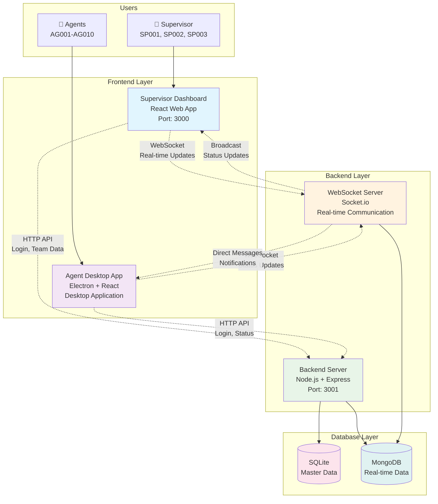
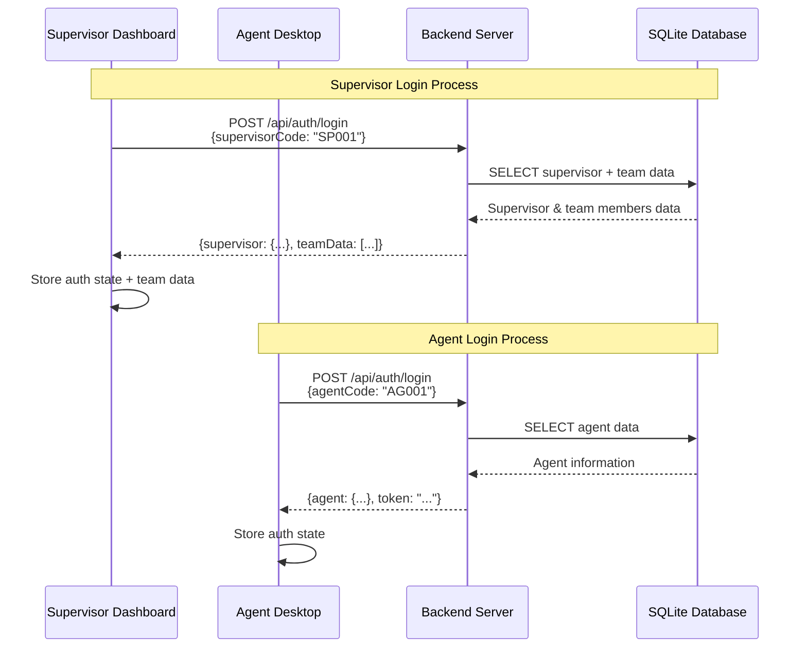
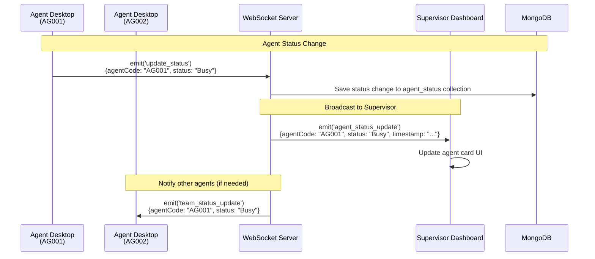
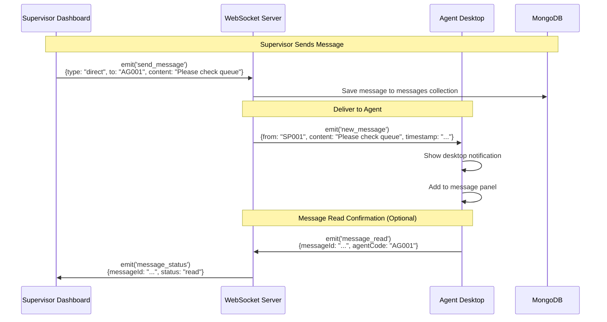
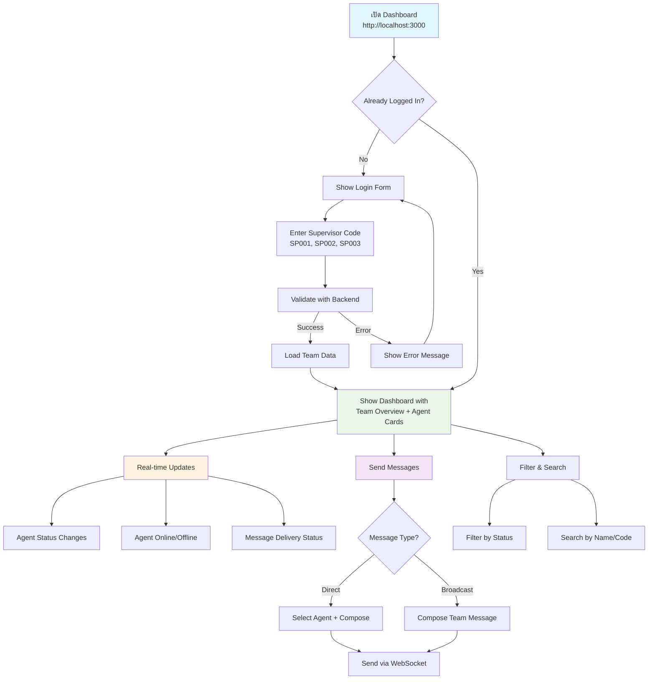
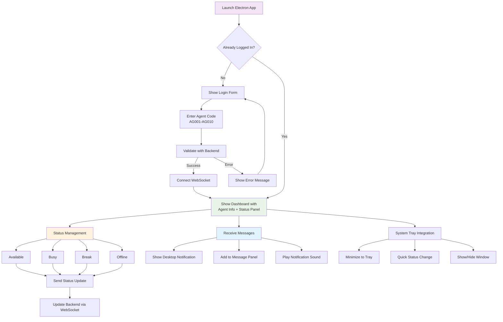
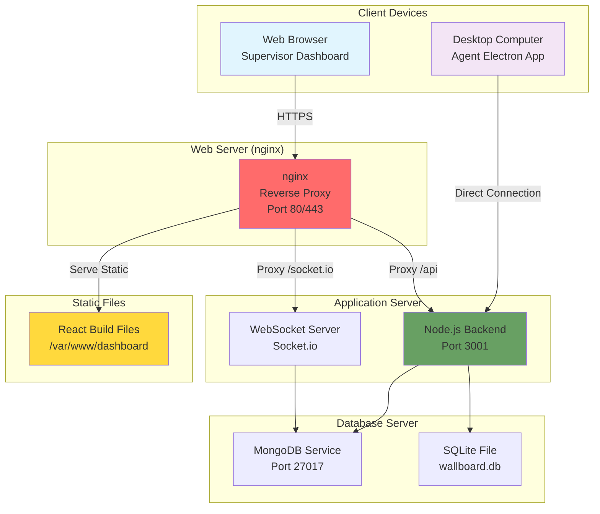
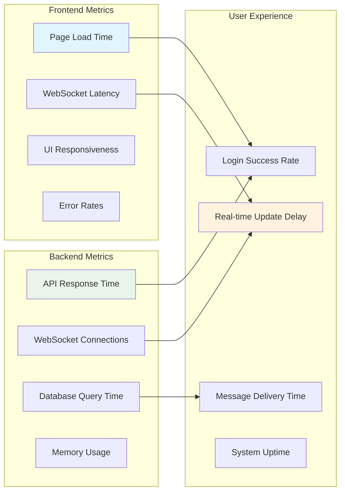

# 6.6.3 Frontend Applications - React Dashboard + Electron Agent App

## 🎯 Overview

เอกสารนี้จะอธิบายภาพรวมการทำงานของ **Frontend Applications** ทั้ง 2 ส่วนหลัก คือ **Supervisor Dashboard (React Web App)** และ **Agent Desktop App (Electron)** รวมถึงการเชื่อมต่อกับ Backend Server และ Database Systems

### 🎓 เป้าหมายการเรียนรู้
เมื่อจบการอ่านเอกสารนี้ นักศึกษาจะสามารถ:
- เข้าใจภาพรวมสถาปัตยกรรมของ Frontend Applications
- รู้วิธีการเชื่อมต่อและสื่อสารระหว่าง Frontend กับ Backend
- เข้าใจ Data Flow และ Real-time Communication
- สามารถ map ความต้องการกับเอกสารที่ออกแบบไว้

---

## 🏗️ **System Architecture Overview**

### **🎯 Frontend Applications ในระบบ Agent Wallboard**

---

## 🔄 **Data Flow และ Communication Patterns**

### **1. Authentication Flow**

### **2. Real-time Status Updates**

### **3. Message Communication**

---

## 🔌 **Frontend-Backend Integration Map**

### **📊 API Endpoints Usage Matrix**

| Feature | Supervisor Dashboard | Agent Desktop | Backend Endpoint | Database |
|---------|---------------------|---------------|------------------|----------|
| **Authentication** | ✅ Supervisor Login | ✅ Agent Login | `POST /api/auth/login` | SQLite |
| **Team Data** | ✅ Get team members | ❌ Not needed | `GET /api/teams/:id/agents` | SQLite |
| **Agent Status** | ✅ View status | ✅ Update status | `PUT /api/agents/:id/status` | MongoDB |
| **Send Messages** | ✅ Send to agents | ❌ Read only | `POST /api/messages/send` | MongoDB |
| **Message History** | ✅ View history | ✅ View received | `GET /api/messages/history` | MongoDB |
| **Real-time Updates** | ✅ Status changes | ✅ Status + messages | WebSocket Events | MongoDB |

### **⚡ WebSocket Events Matrix**

| Event | Emitted By | Received By | Purpose | Data Structure |
|-------|------------|-------------|---------|----------------|
| `join_supervisor_room` | Supervisor Dashboard | Backend | Join supervisor-specific room | `{supervisorCode}` |
| `join_agent_room` | Agent Desktop | Backend | Join agent-specific room | `{agentCode}` |
| `update_status` | Agent Desktop | Backend | Change agent status | `{agentCode, status, timestamp}` |
| `agent_status_update` | Backend | Supervisor Dashboard | Notify status change | `{agentCode, status, timestamp}` |
| `send_message` | Supervisor Dashboard | Backend | Send message to agent(s) | `{type, to, content, from}` |
| `new_message` | Backend | Agent Desktop | Deliver message | `{messageId, from, content, timestamp}` |
| `agent_connected` | Backend | Supervisor Dashboard | Agent came online | `{agentCode, timestamp}` |
| `agent_disconnected` | Backend | Supervisor Dashboard | Agent went offline | `{agentCode, timestamp}` |

---

## 🎨 **User Interface Flow**

### **🌐 Supervisor Dashboard User Journey**

### **🖥️ Agent Desktop User Journey**

---

## 📋 **Document Mapping Matrix**

### **🗂️ ความสัมพันธ์กับเอกสารอื่น**

| เอกสารปัจจุบัน | เอกสารที่เกี่ยวข้อง | ความเชื่อมโยง | รายละเอียด |
|---------------|-------------------|-------------|----------|
| **6.6.3 Frontend Overview** | **6.6.1 Project Structure** | 🔗 Structure Reference | ใช้โครงสร้างโปรเจกต์ที่กำหนดไว้ |
| **6.6.3.1 Electron Agent** | **6.6.2 Backend Server** | 🔌 API Integration | ใช้ authentication และ WebSocket APIs |
| **6.6.3.2 React Dashboard** | **6.6.4 Database Sample Data** | 📊 Data Display | แสดงข้อมูลจาก SQLite และ MongoDB |
| **Frontend Components** | **6.2 Development Plan** | 📅 Implementation Timeline | ตาม Week 1-2 development plan |

### **🎯 Feature Mapping กับเอกสารต้นทาง**

| ฟีเจอร์ในระบบ | เอกสารที่อธิบายไว้ | Component ที่รับผิดชอบ | สถานะการพัฒนา |
|-------------|------------------|---------------------|---------------|
| **Agent Authentication** | 6.6.2 Backend + 6.6.4 Database | LoginForm.js (Both Apps) | ✅ 75% Complete |
| **Status Management** | 6.6.2 Backend WebSocket | StatusPanel.js (Agent) | ✅ 80% Complete |
| **Real-time Monitoring** | 6.6.3.2 Dashboard | AgentCard.js + Dashboard.js | ✅ 70% Complete |
| **Message System** | 6.6.2 Backend + MongoDB | MessagePanel.js (Both Apps) | ✅ 75% Complete |
| **Team Overview** | 6.6.4 Sample Data | TeamOverview.js (Dashboard) | ✅ 65% Complete |
| **Desktop Notifications** | 6.6.3.1 Electron | notificationService.js | ✅ 60% Complete |

---

## 🔧 **Technology Stack Integration**

### **📦 Dependencies Overview**

---

## 🧪 **Testing & Integration Strategy**

### **✅ End-to-End Testing Checklist**

**1. Authentication Flow:**
- [ ] Supervisor login กับ valid codes (SP001-SP003)
- [ ] Agent login กับ valid codes (AG001-AG010)
- [ ] Invalid login handling
- [ ] Session persistence

**2. Real-time Communication:**
- [ ] Agent status changes แสดงใน supervisor dashboard
- [ ] Multiple agents อัพเดท simultaneously
- [ ] Connection/disconnection detection
- [ ] WebSocket reconnection handling

**3. Message System:**
- [ ] Direct message จาก supervisor ไป agent
- [ ] Broadcast message ไปทั้งทีม
- [ ] Desktop notification ใน agent app
- [ ] Message history tracking

**4. UI/UX Integration:**
- [ ] Responsive design ใน dashboard
- [ ] Electron app system tray integration
- [ ] Material-UI theming consistency
- [ ] Loading states และ error handling

### **🔍 Common Integration Issues**

| ปัญหา | สาเหตุ | การแก้ไข | การป้องกัน |
|-------|-------|----------|-----------|
| **CORS Errors** | Frontend และ Backend ต่าง origin | ตั้งค่า CORS ใน backend | ใช้ environment variables |
| **WebSocket Disconnection** | Network issues หรือ server restart | Implement reconnection logic | Add connection status indicator |
| **Data Sync Issues** | Race conditions ใน real-time updates | Add message queuing | Use proper error handling |
| **Authentication Timeout** | JWT token expiration | Implement token refresh | Add auto-logout on expire |

---

## 🚀 **Deployment Architecture**

### **🌐 Production Deployment Overview**

---

## 📈 **Performance Considerations**

### **⚡ Optimization Strategies**

**Frontend Performance:**
- **React Optimization:** ใช้ React.memo สำหรับ expensive components
- **Bundle Size:** Code splitting และ lazy loading
- **WebSocket Efficiency:** Throttle frequent updates
- **UI Responsiveness:** Debounce user inputs

**Backend Integration:**
- **API Caching:** Cache team data และ agent information
- **Connection Pooling:** Efficient database connections
- **Message Queuing:** Handle high-frequency status updates
- **Rate Limiting:** Prevent API abuse

### **📊 Monitoring & Metrics**

---

## 🎓 **Learning Outcomes**

### **🎯 นักศึกษาจะได้เรียนรู้:**

**Technical Skills:**
- **Full-Stack Development:** Frontend และ Backend integration
- **Real-time Applications:** WebSocket และ event-driven architecture
- **Modern Frontend:** React, Material-UI, และ Electron
- **Database Design:** Hybrid SQLite + MongoDB approach
- **API Design:** RESTful APIs และ WebSocket events

**Software Engineering Practices:**
- **Component Architecture:** Modular และ reusable design
- **State Management:** React Context และ hooks
- **Error Handling:** Graceful error recovery
- **Testing Strategy:** End-to-end integration testing
- **Documentation:** Technical documentation writing

**Project Management:**
- **Agile Development:** 2-week sprint planning
- **Team Collaboration:** Frontend และ Backend coordination
- **Version Control:** Git workflow สำหรับ multiple components
- **Deployment:** Production deployment considerations

---

## ✅ **Summary**

**🎉 Frontend Applications ที่สมบูรณ์:**

### **🌐 Supervisor Dashboard (React)**
- ✅ Modern web dashboard สำหรับ team monitoring
- ✅ Real-time agent status tracking
- ✅ Message communication system
- ✅ Material-UI responsive design
- ✅ WebSocket integration สำหรับ live updates

### **🖥️ Agent Desktop App (Electron)**
- ✅ Cross-platform desktop application
- ✅ Status management interface
- ✅ Desktop notifications
- ✅ System tray integration
- ✅ Real-time message receiving

### **🔗 Seamless Integration**
- ✅ Unified backend API communication
- ✅ Consistent data models
- ✅ Real-time synchronization
- ✅ Scalable architecture
- ✅ Production-ready deployment

**💡 Next Steps:**
1. ติดตั้งและทดสอบ complete system
2. ปรับแต่ง UI/UX ตามความต้องการ
3. เพิ่ม advanced features ใน Week 2
4. เตรียมความพร้อมสำหรับ production deployment

**Happy Development! 🚀✨**