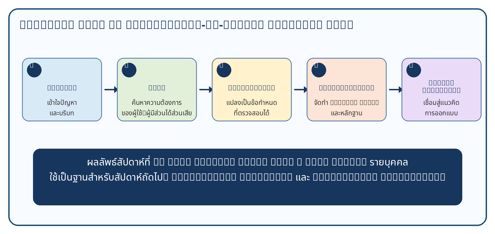
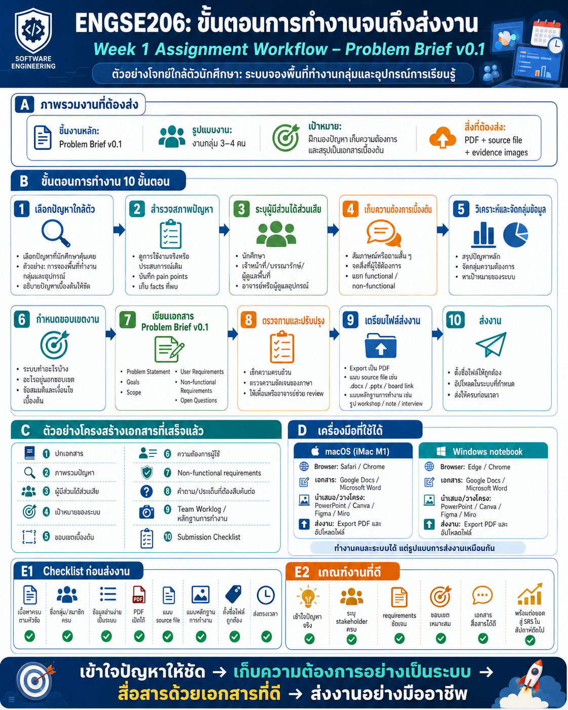

# Week 01: Problem Brief Kick-off

## ชื่อหน่วยเรียน
**หน่วยที่ 1: ฐานคิดของวิศวกรรมความต้องการและความเข้าใจปัญหา**

## ชื่อบทเรียน
**1.1 บทบาทของ Requirements และ Design ใน SDLC**

## CLO ที่พัฒนา
- CLO1: อธิบายและวิเคราะห์บทบาท requirements/design ใน SDLC รวมถึง stakeholder, scope, constraint และ ethics

## เอกสารสำหรับใช้สอนและทำงาน

| สำหรับ | เอกสาร |
|---|---|
| อาจารย์ | [Teacher Guide](teacher-guide.md) |
| นักศึกษา | [Student Assignment](student-assignment.md) |
| งานทั้ง 10 โจทย์ | [Case Cards](case-cards/README.md) |
| แม่แบบที่นักศึกษากรอก | [Student Work Template](student-work-template/README.md) |
| ตัวอย่างงานเสร็จแล้ว | [Sample Completed Work](sample-completed/README.md) |
| เกณฑ์ให้คะแนน | [Grading Rubric](grading-rubric.md) |
| Checklist ส่งงาน | [Submission Checklist](submission-checklist.md) |
| ภาพ infographic ขั้นตอน | [Assignment Workflow](assets/week01-assignment-steps.png) |
| ภาพ OS และการส่งงาน | [OS and Submission Guide](assets/week01-os-submission.png) |

## เป้าหมาย

หลังจบสัปดาห์ นักศึกษาต้องเข้าใจความแตกต่างระหว่าง **problem, requirement, specification, design และ implementation** และเริ่มสร้าง `Problem Brief v0.1` จาก Case Project ที่กลุ่มได้รับ

## แผนสอนทฤษฎี 2 ชั่วโมง

| เวลา | กิจกรรม | สาระสำคัญ |
|---:|---|---|
| 0–15 นาที | เปิดรายวิชาและภาพปลายทาง | Requirement-to-Design Package และใช้ Case เดิมต่อเนื่องทั้งเทอม |
| 15–35 นาที | เชื่อมความรู้เดิม | ENGSE203/204/205 ให้ “สร้างได้”; ENGSE206 ช่วยให้ “สร้างสิ่งที่ถูกต้อง” |
| 35–65 นาที | Mini lecture | problem vs requirement vs specification vs design vs implementation |
| 65–85 นาที | Think-Pair-Share | แยกประโยคที่เป็นปัญหา/ความต้องการ/วิธีแก้จากกรณีตัวอย่าง |
| 85–100 นาที | Artefact Roadmap | Problem Brief → Evidence → SRS → Architecture → UX/UI → Detailed Design |
| 100–120 นาที | Brief งานกลุ่ม | Case Card, Git, output, rubric และ deadline |

## แผน Workshop 3 ชั่วโมง

| เวลา | กิจกรรม | Output |
|---:|---|---|
| 0–15 นาที | อ่าน Case Card / ตั้งชื่อโครงการ | Team profile |
| 15–40 นาที | แยก Facts / Assumptions / Pain Points | Facts and pain points |
| 40–65 นาที | ระบุ stakeholder | Stakeholder list |
| 65–90 นาที | ระบุเป้าหมายและ success indicator | Goals |
| 90–100 นาที | พัก | - |
| 100–130 นาที | กำหนด scope | In scope / out of scope / constraints |
| 130–155 นาที | ร่าง requirement เริ่มต้น + NFR | 5 UR + 3 NFR |
| 155–170 นาที | ระบุ open questions | Question list |
| 170–180 นาที | ตรวจงาน/commit/push/exit ticket | Repo evidence |

## ผลงานที่ต้องส่ง

- `docs/01-problem-brief-v0.1.md`
- `docs/02-team-worklog.md` หรือ section worklog ใน Problem Brief
- หลักฐานกิจกรรมใน `evidence/week-01/` ถ้ามี
- commit/push ใน repository ของกลุ่ม
- Exit Ticket รายบุคคล

## ภาพประกอบ

## การประเมิน

- Problem Brief v0.1 งานกลุ่ม: 4 คะแนนดิบ → A3 Requirements Portfolio
- Exit Ticket รายบุคคล: 1 คะแนนดิบ → A1 Learning Check

ดูเกณฑ์เต็มได้ที่ [Grading Rubric](grading-rubric.md)
