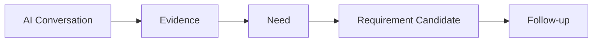

# ENGSE206 Week 04 — Student Workshop Guide

## AI Evidence Rehearsal: From Conversation to Evidence, Need and Requirement Candidate

> คู่มือนี้เป็น Markdown version ของ `ENGSE206_Week04_Workshop_AI_Evidence_Rehearsal_Student_Guide.pdf` สำหรับใช้ใน GitHub/Team Repo ได้โดยตรง

## 1. เป้าหมายของ Lab

หลังจบ lab นี้ ทีมต้องแสดงให้ได้ว่า requirement candidate ไม่ได้ “คิดขึ้นเอง” แต่มีร่องรอยจากบทสนทนา AI stakeholder จำลอง



## 2. ก่อนเริ่ม

อ่านไฟล์เหล่านี้จาก Course Repo:

- `cases/<assigned-case>.md`
- `weeks/week-04-stakeholder-simulation-negotiation/role-packs/<assigned-case>.md`
- `weeks/week-04-stakeholder-simulation-negotiation/prompt-pack.md`
- ตัวอย่าง: `campus_resource_booking_case/week04-campus-resource-booking-example/`

เปิด/เตรียมไฟล์เหล่านี้ใน Team Repo:

- `evidence/week-04/ai-conversation-excerpt.md`
- `docs/04-evidence-log.md`
- `docs/04-requirement-candidates.md`
- `project-management/ai-use-log.md`
- `submissions/week-04-submission.md`

## 3. ขั้นตอนจับมือทำ

### Step 1 — เลือก stakeholder role

เริ่มจาก 1 role ก่อน เช่น Student, Officer, Instructor, Admin แล้วถ้าทันค่อยเพิ่ม role ที่ 2

บันทึกใน `evidence/week-04/ai-conversation-excerpt.md`:

| รายการ | ควรกรอกอะไร |
|---|---|
| Case | ชื่อ case ของกลุ่ม |
| Role | บทบาทที่ให้ AI จำลอง |
| Goal | อยากรู้อะไรจาก role นี้ |
| Source | case card และ role pack ที่ใช้ |

### Step 2 — ใช้ prompt ให้ AI รับบท

คัดลอก prompt จาก `prompt-pack.md` แล้วแทนที่ `[ROLE]`, `[CASE]`, `[GOAL]` ด้วย case ของกลุ่ม

กติกาสำคัญ:

- ให้ AI ตอบเป็น stakeholder role เดียว
- ถ้าไม่รู้ ให้ตอบว่า “ไม่ทราบ/ต้องถามบทบาทอื่น”
- ห้ามให้ AI แต่ง policy, ตัวเลข, ชื่อจริง หรือข้อมูลส่วนบุคคล
- ทุกคำตอบถือเป็น simulation จนกว่าจะตรวจสอบ

### Step 3 — ถามคำถามแบบไม่ชี้นำ

ใช้คำถามจาก Week03 interview guide ของทีมก่อน แล้วเพิ่มคำถามตรวจหลักฐาน เช่น:

| เป้าหมาย | ตัวอย่างคำถาม |
|---|---|
| หาเหตุการณ์จริง/จำลอง | “ช่วยเล่าเหตุการณ์ล่าสุดที่ทำให้เกิดปัญหานี้ได้ไหม” |
| หา pain point | “ช่วงไหนของงานที่เสียเวลาหรือสับสนที่สุด” |
| หา constraint | “มีกฎหรือเงื่อนไขอะไรที่ระบบต้องระวัง” |
| หา unknown | “เรื่องนี้ใครเป็นคนยืนยันได้” |
| ยืนยันความเข้าใจ | “ถ้าทีมสรุปว่า ... ถูกต้องไหม” |

### Step 4 — คัดเฉพาะบทสนทนาที่ใช้เป็น evidence

ไม่ต้อง paste ทั้ง chat ยาว ๆ ให้คัดเฉพาะช่วงที่นำไปใช้ได้ เช่น:

```text
Q: เวลานักศึกษาจะจองห้องหรืออุปกรณ์ จุดไหนที่สับสนที่สุด?
A: ส่วนใหญ่ไม่รู้ว่าว่างจริงหรือไม่ ต้องถามเจ้าหน้าที่ก่อน และบางครั้งมีคนจองซ้ำช่วงเวลาเดียวกัน
```

### Step 5 — แยก Evidence

บันทึกใน `docs/04-evidence-log.md`

| E-ID | Source/Role | Evidence quote or summary | Tag | Interpreted Need | Follow-up |
|---|---|---|---|---|---|
| E-01 | AI: Student | ไม่รู้ว่าว่างจริงหรือไม่ ต้องถามเจ้าหน้าที่ก่อน | NEED | ผู้ใช้ต้องตรวจสอบสถานะทรัพยากรก่อนจอง | ต้องรู้ว่า status มาจากแหล่งใด |

Tag ที่ใช้ใน Week04:

- `FACT` = ข้อเท็จจริงจาก case card หรือ stakeholder ระบุชัด
- `NEED` = ปัญหา/ความต้องการที่มาจาก evidence
- `CONSTRAINT` = กฎ เงื่อนไข ขอบเขต
- `UNKNOWN` = ยังไม่รู้ ต้องถามต่อ
- `ASSUMPTION` = ทีมคิดเอง ต้องตรวจสอบ

### Step 6 — เขียน Need แบบสั้น

Need ควรเขียนเป็น “ปัญหา/เป้าหมายของ stakeholder” ไม่ใช่ชื่อ feature ทันที

ตัวอย่าง:

| Evidence | Need ที่ดี | ยังไม่ดีเพราะเป็น solution เร็วเกินไป |
|---|---|---|
| “ไม่รู้ว่าว่างจริงหรือไม่” | ผู้ใช้ต้องเห็นสถานะว่าง/ไม่ว่างก่อนจอง | ต้องมีปุ่มจองสีเขียว |
| “คำขอไม่ครบทำให้เจ้าหน้าที่ถามกลับ” | เจ้าหน้าที่ต้องได้รับข้อมูลคำขอที่จำเป็นตั้งแต่ต้น | ต้องทำฟอร์ม 5 หน้า |

### Step 7 — แปลง Need เป็น Requirement Candidate

สูตรเขียนเบื้องต้น:

```text
RC-xx: The system should [capability] so that [stakeholder/need], based on [E-ID].
Status: Candidate / Needs Validation
```

ตัวอย่าง:

| RC-ID | Requirement Candidate | Evidence | Status |
|---|---|---|---|
| RC-01 | ระบบควรแสดงสถานะว่าง/ไม่ว่างของห้องและอุปกรณ์ก่อนผู้ใช้ส่งคำขอจอง | E-01 | Candidate |

### Step 8 — ตรวจ trace

ถามเพื่อนในทีม:

1. RC แต่ละข้ออ้าง E-ID ได้หรือไม่
2. E-ID เป็น evidence จริงหรือเป็นความเห็นของทีม
3. มีคำว่า “ต้อง” หรือ “อนุมัติแล้ว” เกินหลักฐานหรือไม่
4. มี unknown ที่ควรตามต่อใน Week05 หรือไม่

## 4. สิ่งที่ต้องส่ง

ใน Team Repo ต้องมี:

- `evidence/week-04/ai-conversation-excerpt.md`
- `docs/04-evidence-log.md`
- `docs/04-requirement-candidates.md`
- `project-management/ai-use-log.md`
- `submissions/week-04-submission.md`

Commit message:

```text
checkpoint(w04): extract evidence from ai conversation
submit(w04): evidence and requirement candidates
```

## 5. Definition of Done

- [ ] ใช้ case card และ role pack ของกลุ่ม
- [ ] มีบทสนทนา AI ที่คัดเฉพาะส่วนสำคัญ
- [ ] มี evidence อย่างน้อย 5 รายการ
- [ ] evidence แต่ละรายการมี E-ID, source, tag, need/follow-up
- [ ] มี requirement candidates 4–6 ข้อ
- [ ] requirement candidate ทุกข้ออ้าง E-ID
- [ ] แยก unknown/assumption ออกจาก requirement
- [ ] บันทึกการใช้ AI ใน `project-management/ai-use-log.md`
- [ ] กรอก `submissions/week-04-submission.md`
