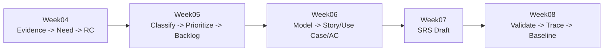

# ENGSE206 Week 05 Learning Blueprint TH

> **หัวข้อสัปดาห์:** Requirement Analysis, Classification and Prioritization  
> **คำถามหลักของนักศึกษา:** Requirement ใดสำคัญ อยู่ประเภทใด และควรทำก่อน-หลังอย่างไร?  
> **สถานะเอกสาร:** Blueprint สำหรับใช้ผลิตเอกสารประกอบการสอน, slide, lab, case study, template และ git repo update  
> **แกนการเรียนรู้:** `Requirement Candidate -> Functional/NFR/Constraint -> Priority -> Backlog v0.1`

## 1. ตำแหน่งของ Week05 ในภาพรวมวิชา

Week05 เป็นสัปดาห์แรกของระยะที่ 2 **Define/Specify** โดยยังไม่ใช่การเขียน SRS เต็มฉบับและยังไม่ใช่การออกแบบระบบ เป้าหมายคือทำให้ Requirement Candidate จาก Week04 กลายเป็นรายการ requirement ที่จัดประเภท จัดลำดับ และตรวจสอบย้อนกลับได้



| ระยะ | Week | คำถามหลัก | ผลงานหลัก |
|---|---:|---|---|
| Discover | 1-4 | เรารู้อะไรจากปัญหา ผู้เกี่ยวข้อง คำถาม และหลักฐาน? | Problem Brief, Scope, Interview Plan, Evidence + RC |
| Define/Specify | 5-8 | Requirement ใดควรระบุ จัดลำดับ ทำเป็น model และตรวจสอบอย่างไร? | Backlog, Requirement Model, SRS Draft, Traceability |
| Design | 10-13 | Requirement ที่ยืนยันแล้วควรถูกแปลงเป็น design อย่างไร? | Design Strategy, Architecture, Prototype, Detailed Design |

## 2. Source Register และสิ่งที่ใช้เป็นฐาน

| Source | บทบาทใน Week05 | สถานะ/ข้อสังเกต |
|---|---|---|
| `examples/campus-resource-booking/week-04/ENGSE206_Week04_Campus_Resource_Booking_Completed_Example.md` | Input หลัก: `E-ID`, `N-ID`, `RC-ID`, rationale และ Week05 readiness gate | ใช้เป็น completed example ตั้งต้น |
| `examples/campus-resource-booking/week-04/04-requirement-candidates.md` | รายละเอียด candidate ที่จะนำมาจัดประเภท/จัดลำดับ | ต้องไม่คัดลอกโดยไม่อ้าง trace |
| `templates/05-requirement-backlog.md` | โครงสร้างไฟล์ส่งงาน Week05 | ควรปรับเพิ่มช่อง RC source, rationale, confidence และ open question |
| `resources/engse206-project-template/docs/05-requirement-backlog.md` | ไฟล์ใน Team Repo ที่นักศึกษาต้องทำจริง | ต้อง update ให้ตรงกับ lab และ submission |
| `weeks/week-05-requirement-analysis-prioritization/README.md` | คำสั่งสัปดาห์ปัจจุบัน | มีแกน Card Sorting + Prioritization แล้ว แต่ควรผูกกับ Week04 evidence มากขึ้น |
| `weeks/week-05-requirement-analysis-prioritization/assignment-contract.md` | ข้อตกลงการส่งงาน | ระบุ output paths แล้ว แต่ยังควรเพิ่ม checklist/rubric/prompt pack |
| `docs/course-calendar.md` และ `docs/artefact-roadmap.md` | ภาพรวม 15+2 และ artefact สะสม | ใช้ยืนยัน handoff Week05 -> Week06 |

## 3. Design Brief

| รายการ | รายละเอียด |
|---|---|
| รายวิชา | ENGSE206 การกำหนดความต้องการและการออกแบบทางซอฟต์แวร์ |
| Week | Week05 |
| หน่วย | 3.1 Requirement Analysis, Classification and Prioritization |
| เวลา | ทฤษฎี 2 ชั่วโมง + Workshop/Lab 3 ชั่วโมง |
| Learner level | นักศึกษาปี 2-3 ที่เพิ่งผ่าน Discover Phase และเริ่มจัดระเบียบ requirements |
| Previous input | Week04 Evidence Log, Need/Conflict, Requirement Candidate |
| Current output | Requirement Backlog v0.1 ที่จัดประเภทและจัดลำดับแล้ว |
| Next handoff | Week06 Requirement Model Pack: User Story / Use Case / Acceptance Criteria |
| Course repo role | สื่อสอน, คำสั่ง, template, rubric, completed example |
| Team repo role | ไฟล์งานจริงของทีม: `docs/05-requirement-backlog.md`, evidence, worklog, submission |

## 4. Learning Outcomes

เมื่อจบ Week05 นักศึกษาควรสามารถทำได้ดังนี้

| LO-ID | Learning Outcome | Evidence ที่ตรวจได้ | Handoff |
|---|---|---|---|
| W05-LO1 | ตรวจ Requirement Candidate โดยอ้างกลับไปยัง Evidence/Need จาก Week04 ได้ | Backlog แต่ละแถวมี RC-ID, E-ID/N-ID และ rationale | ป้องกัน requirement ที่ไม่มีหลักฐานใน Week06 |
| W05-LO2 | แยกประเภท requirement เป็น Functional, NFR, Constraint, Business Rule หรือ Issue ได้ | ตาราง classification พร้อมเหตุผล | ใช้กำหนดชนิด model และ acceptance criteria |
| W05-LO3 | จัดลำดับความสำคัญด้วย value, risk, urgency และ dependency ได้ | Priority พร้อม rationale ไม่ใช่คะแนนลอย | ใช้เลือก requirement ชุดเล็กสำหรับ Week06 |
| W05-LO4 | แยก requirement ที่พร้อมใช้ต่อออกจาก assumption/unknown/policy issue ได้ | Status: Ready / Needs Follow-up / Hold | ลดการเดาหรือสร้าง rule เองก่อน SRS |
| W05-LO5 | สร้าง Requirement Backlog v0.1 ที่อ่านและตรวจสอบได้ใน Team Repo | `docs/05-requirement-backlog.md` + submission checklist | เป็น input โดยตรงของ Week06 |

## 5. แนวคิดหลักของ Week05

จำกัดให้ไม่เกิน 3 แนวคิดหลัก เพื่อไม่ให้สัปดาห์นี้หนักเกินไป

| แนวคิด | คำอธิบายสำหรับนักศึกษา | คำถามตรวจความเข้าใจ |
|---|---|---|
| Requirement Type | ข้อนี้บอกว่าระบบต้องทำอะไร คุณภาพต้องเป็นอย่างไร หรือมีข้อจำกัดอะไร | เป็น FR, NFR, Constraint, Business Rule หรือ Issue เพราะอะไร? |
| Priority | ความสำคัญที่มีเหตุผลจากคุณค่า ความเสี่ยง ความเร่งด่วน และ dependency | ถ้ายังไม่ทำข้อนี้ในรุ่นแรก จะเกิดผลกระทบอะไร? |
| Backlog | รายการ requirement ที่มี ID, trace, type, priority, rationale และสถานะ | แถวนี้ตรวจย้อนกลับไป Week04 ได้หรือไม่? |

## 6. Scope ของ Week05

| Week05 ทำ | Week05 ยังไม่ทำ |
|---|---|
| ตรวจ RC จาก Week04 | ไม่เขียน SRS เต็มฉบับ |
| แยกประเภท FR/NFR/Constraint/Business Rule/Issue | ไม่ออกแบบหน้าจอ ฐานข้อมูล หรือ architecture |
| จัดลำดับด้วย MoSCoW หรือ scoring แบบง่าย | ไม่ตัดสิน policy ที่ยังไม่มีหลักฐาน |
| แยก Ready / Needs Follow-up / Hold | ไม่ประกาศ requirement ว่า approved/baselined |
| สร้าง Backlog v0.1 | ไม่ทำ Use Case เต็มชุดจนกว่า Week06 |

## 7. Learning Flow

| ช่วง | เวลา | กิจกรรม | Output |
|---|---:|---|---|
| 1. Recall | 15 นาที | ทบทวน Week04: Evidence -> Need -> RC | เลือก RC 3-5 ข้อที่มี trace |
| 2. Mini Lecture | 35 นาที | อธิบาย FR/NFR/Constraint/Business Rule/Issue | นักศึกษาแยกตัวอย่างได้ |
| 3. Worked Example | 30 นาที | ใช้ Campus Resource Booking แปลง RC -> Backlog | เห็นวิธีคิดจากหลักฐาน |
| 4. Card Sorting | 40 นาที | ทีมจัดกลุ่ม RC ของตนเอง | Classification draft |
| 5. Prioritization | 45 นาที | ให้ priority ด้วย value/risk/urgency/dependency | Priority + rationale |
| 6. Backlog Build | 35 นาที | กรอก `docs/05-requirement-backlog.md` | Backlog v0.1 |
| 7. Peer Review | 35 นาที | แลกตรวจ trace/type/priority/status | Revision notes |
| 8. Submission | 25 นาที | Commit, push, กรอก submission | Week05 checkpoint |

> ถ้าเวลาในชั้นเรียนน้อย ให้ลดจำนวน RC ที่ทำละเอียดเหลือ 3-5 ข้อก่อน แล้วให้เติม backlog ที่เหลือเป็นการบ้าน

## 8. Activity Model

### Activity A: Trace Check

นักศึกษาเลือก Requirement Candidate จาก Week04 แล้วตอบ 4 ข้อ

1. RC นี้มาจาก Evidence/Need ใด?
2. Evidence นั้นเป็น fact, simulated need, constraint, unknown หรือ assumption?
3. RC นี้เขียนเกินหลักฐานหรือไม่?
4. มีเรื่องใดต้องถามต่อก่อนยืนยัน?

**Output:** ตาราง `RC Trace Check`

### Activity B: Requirement Type Card Sorting

ให้ทีมเขียน RC ลงเป็น card แล้วจัดกลุ่ม

| Type | วิธีสังเกต | ตัวอย่างคำถาม |
|---|---|---|
| Functional Requirement | ระบบต้องทำ action หรือ behavior | ระบบต้องทำอะไรให้ใคร? |
| Non-functional Requirement | คุณภาพของระบบหรือบริการ | ต้องเร็ว ปลอดภัย ใช้ง่าย ตรวจสอบได้แค่ไหน? |
| Constraint | ข้อจำกัดที่ระบบต้องเคารพ | มีกฎ platform policy data หรือเวลาใดบังคับอยู่? |
| Business Rule | กฎการดำเนินงาน | เงื่อนไขอนุมัติ ยกเลิก หรือสถานะคืออะไร? |
| Issue / Unknown | ยังไม่รู้หรือยังยืนยันไม่ได้ | ใครต้องตอบ? ต้องใช้หลักฐานอะไร? |

**Output:** `Classification Draft`

### Activity C: Prioritization

แนะนำใช้ MoSCoW แบบง่าย และให้บันทึกเหตุผลทุกครั้ง

| Priority | เกณฑ์ใช้งาน |
|---|---|
| Must | ขาดไม่ได้ต่อเป้าหมายหลัก ความปลอดภัย กฎ หรือ workflow สำคัญ |
| Should | สำคัญมาก แต่ยังมี workaround ชั่วคราว |
| Could | มีคุณค่า แต่เลื่อนได้โดยไม่ทำให้ระบบรุ่นแรกเสียเป้าหมาย |
| Won't yet | ยังไม่ทำใน scope นี้ แต่ต้องบันทึกเหตุผลและติดตาม |

เพื่อให้เหตุผลไม่ลอย ให้พิจารณา 4 มิติ

| Dimension | คำถาม |
|---|---|
| Value | ข้อนี้ช่วย stakeholder หลักอย่างไร? |
| Risk | ถ้าไม่ทำจะเกิดความเสี่ยงหรือความเสียหายใด? |
| Urgency | ต้องใช้เร็วแค่ไหนใน workflow? |
| Dependency | ต้องทำก่อนข้ออื่นหรือรอหลักฐาน/ระบบอื่น? |

**Output:** `Priority + Rationale`

### Activity D: Backlog v0.1 Build

กรอก requirement ที่ผ่าน trace/type/priority ลงใน backlog

**Output path ใน Team Repo:** `docs/05-requirement-backlog.md`

## 9. Backlog Schema ที่ควรใช้

แนะนำให้ปรับ template Week05 ให้มี field เหล่านี้ เพื่อสอดคล้องกับ Week04 และ Week06

| Field | ความหมาย | ตัวอย่าง |
|---|---|---|
| Requirement ID | ID ใหม่ของ Week05 | `FR-SCRB-01` |
| Source RC | candidate ต้นทางจาก Week04 | `RC-01` |
| Evidence/Need Trace | หลักฐานที่อ้างได้ | `E-01, E-02 -> N-AVAIL` |
| Requirement Statement | ประโยค requirement ที่ปรับให้ชัด | `ระบบต้องให้ผู้ใช้ตรวจสอบช่วงเวลาว่างก่อนยื่นคำขอจอง` |
| Type | FR/NFR/Constraint/Business Rule/Issue | `Functional` |
| Priority | Must/Should/Could/Won't yet | `Must` |
| Rationale | เหตุผลจาก value/risk/urgency/dependency | ลดการจองซ้ำและเป็น flow หลัก |
| Status | Ready / Needs Follow-up / Hold | `Ready for Week06` |
| Open Question | สิ่งที่ยังต้องถามต่อ | ต้องยืนยันข้อมูลขั้นต่ำของแบบฟอร์ม |
| Week06 Use | จะนำไปทำ model แบบใด | Use Case / User Story / AC / Quality Scenario |

## 10. ตัวอย่างจาก Campus Resource Booking

| Requirement ID | Source RC | Requirement Statement | Type | Priority | Rationale | Status |
|---|---|---|---|---|---|---|
| FR-SCRB-01 | RC-01 | ระบบต้องให้ผู้ขอใช้ค้นหาและดูสถานะห้อง/อุปกรณ์ตามช่วงเวลา ก่อนยื่นคำขอจอง | Functional | Must | เป็น capability หลักที่ลดปัญหาจองซ้ำและตอบ need เรื่อง availability | Ready for Week06 |
| BR-SCRB-01 | RC-03 | ระบบต้องตรวจข้อมูลขั้นต่ำก่อนส่งคำขอเข้าสู่การพิจารณา | Business Rule | Must | ลดคำขอไม่ครบและลดงานถามกลับของเจ้าหน้าที่ | Needs Follow-up |
| FR-SCRB-02 | RC-04 | ระบบต้องรองรับคำขอ exception พร้อมเหตุผลและผู้มีอำนาจพิจารณา | Functional | Should | รองรับกรณีพิเศษโดยไม่ทำ auto override ที่ไม่มี policy | Needs Follow-up |
| NFR-SCRB-01 | RC-08 | ระบบต้องใช้ข้อมูล identity/role เท่าที่จำเป็นต่อการยืนยันตัวตนและสิทธิ์ | NFR/Constraint | Must | สอดคล้องกับ data minimization และลดการเก็บข้อมูลเกินจำเป็น | Needs IT/Policy Review |
| ISSUE-SCRB-01 | E-08 | ยังไม่มีตัวเลขยืนยันเรื่อง no-show, quota, booking duration และ penalty | Issue | Won't yet | ห้ามสร้าง rule เองโดยไม่มี policy source | Hold |

## 11. Definition of Done

งาน Week05 ถือว่าเสร็จเมื่อมีสิ่งต่อไปนี้

- [ ] มี Requirement Backlog v0.1 ที่ `docs/05-requirement-backlog.md`
- [ ] ทุก requirement มี Source RC และ Evidence/Need Trace
- [ ] แยก type ได้อย่างมีเหตุผล ไม่รวม issue/unknown เป็น requirement โดยไม่ตรวจสอบ
- [ ] มี priority และ rationale ครบ
- [ ] มี status: Ready / Needs Follow-up / Hold
- [ ] มี open question สำหรับเรื่องที่ยังไม่รู้
- [ ] มี Week06 Use ระบุว่าข้อนี้จะไปทำ User Story, Use Case, Acceptance Criteria หรือ Quality Scenario
- [ ] มี worklog และ commit history ที่เห็นการทำงานของทีม
- [ ] มี `submissions/week-05-submission.md`

## 12. Rubric แบบสั้น 4 คะแนน

| เกณฑ์ | คะแนน | Evidence ที่ผู้สอนตรวจ |
|---|---:|---|
| Traceability | 1 | requirement อ้าง RC/E/N ได้จริง |
| Classification | 1 | type ถูกต้องและมีเหตุผล |
| Prioritization | 1 | priority มี rationale จาก value/risk/urgency/dependency |
| Backlog Quality | 1 | ID, statement, status, open question และ Week06 use ครบ |

## 13. Common Misconceptions

| ความเข้าใจผิด | วิธีแก้ในชั้นเรียน |
|---|---|
| Requirement คือ solution ที่ทีมอยากทำ | ให้ถามกลับว่า stakeholder need คืออะไร และหลักฐานอยู่ตรงไหน |
| NFR คืออะไรก็ได้ที่ไม่ใช่ function | ให้เชื่อม NFR กับ quality attribute และ acceptance measure |
| Priority คือสิ่งที่ทีมชอบก่อน | ให้บังคับเขียน rationale จาก value/risk/urgency/dependency |
| Unknown แปลว่าคิดเองได้ | ให้แยกเป็น Issue/Hold และระบุ owner/follow-up |
| Constraint กับ Business Rule เหมือนกัน | Constraint คือข้อจำกัดภายนอกหรือเงื่อนไขบังคับ; Business Rule คือกฎการทำงานของ domain |

## 14. Responsible AI Guidance

ใช้ AI ได้ในฐานะผู้ช่วยตรวจและตั้งคำถาม แต่ผู้เรียนต้องรับผิดชอบการตัดสินใจเอง

| ใช้ AI ได้ | ต้องตรวจเอง |
|---|---|
| ช่วยเสนอคำถามตรวจ trace | Evidence จริงอยู่ในไฟล์ Week04 หรือไม่ |
| ช่วยแนะนำ type เบื้องต้น | Type ถูกต้องตามความหมายของ requirement หรือไม่ |
| ช่วยชี้ว่าประโยคกำกวมตรงไหน | มีการเขียนเกินหลักฐานหรือไม่ |
| ช่วยตรวจ consistency ของ backlog | Priority และ rationale สมเหตุสมผลหรือไม่ |

Prompt ตัวอย่าง:

```text
คุณเป็นผู้ช่วยตรวจ Requirement Backlog สำหรับนักศึกษาวิชา ENGSE206
โปรดตรวจแต่ละแถวว่า
1) อ้าง Evidence/Need ได้หรือไม่
2) Type เป็น FR/NFR/Constraint/Business Rule/Issue เหมาะสมหรือไม่
3) Priority มีเหตุผลหรือเป็นความรู้สึก
4) มี Open Question ใดที่ไม่ควรเดาเป็น requirement

ห้ามเพิ่ม fact หรือ policy ใหม่ที่ไม่มีในข้อมูลที่ให้
```

## 15. สิ่งที่ต้องทำต่อเพื่อผลิต Week05 Teaching Package

ตารางนี้เป็น production checklist สำหรับทำสื่อและ repo update ในขั้นถัดไป

| ลำดับ | Artifact | ไฟล์/ตำแหน่งที่ควรสร้างหรือปรับ | จุดประสงค์ | Priority |
|---:|---|---|---|---|
| 1 | Teaching Notes TH | `weeks/week-05-requirement-analysis-prioritization/ENGSE206_Week05_เอกสารประกอบการสอน_TH.md` หรือ `.docx` | อธิบายทฤษฎี FR/NFR/Constraint/Priority พร้อมตัวอย่าง | Must |
| 2 | Teaching Slides | `weeks/week-05-requirement-analysis-prioritization/slides/ENGSE206_Week05_Requirement_Backlog_Slides.pptx` | ใช้สอน 2 ชั่วโมง อ่านง่ายแบบ projector | Must |
| 3 | Student Lab Guide | `weeks/week-05-requirement-analysis-prioritization/student-lab-guide.md` | ขั้นตอน workshop 3 ชั่วโมงแบบทำตามได้ | Must |
| 4 | Activity Pack | `weeks/week-05-requirement-analysis-prioritization/activities/` | card sorting, trace check, prioritization worksheet | Must |
| 5 | Prompt Pack | `weeks/week-05-requirement-analysis-prioritization/prompt-pack.md` | prompt สำหรับตรวจ trace/type/priority โดยไม่ให้ AI invent fact | Should |
| 6 | Rubric | `weeks/week-05-requirement-analysis-prioritization/rubric.md` | rubric 4 คะแนน + checklist | Must |
| 7 | Case Study Guide | `weeks/week-05-requirement-analysis-prioritization/case-study-campus-resource-booking.md` | สาธิตจาก Week04 completed example ไป Backlog v0.1 | Must |
| 8 | Completed Example Week05 | `examples/campus-resource-booking/week-05/` | ตัวอย่าง Backlog v0.1 ที่อธิบายเหตุผลครบ | Must |
| 9 | Template Update | `templates/05-requirement-backlog.md` | เพิ่ม Source RC, Trace, Rationale, Status, Week06 Use | Must |
| 10 | Student Repo Template Update | `resources/engse206-project-template/docs/05-requirement-backlog.md` | ให้ Team Repo ใช้โครงเดียวกับ lab | Must |
| 11 | Submission Template | `resources/engse206-project-template/submissions/week-05-submission.md` | checklist ส่งงาน Week05 | Must |
| 12 | Weekly Guide Update | `resources/engse206-project-template/weekly/week-05-requirement-analysis-prioritization.md` | บอกนักศึกษาว่าต้องทำไฟล์ใดใน repo | Must |
| 13 | Structure Checker | `resources/engse206-project-template/scripts/check-project-structure.py` | ตรวจ path ใหม่ เช่น `submissions/week-05-submission.md` | Should |
| 14 | README/Manifest Update | `README.md`, `MANIFEST.md`, `docs/artefact-roadmap.md` | ให้ link และสถานะตรงกับ Week05 package | Should |
| 15 | ZIP/Release Package | `deliverables/engse206-week05-requirement-backlog-package.zip` | ส่งเป็นชุดพร้อมใช้ | Could |

## 16. ลำดับการทำงานที่แนะนำ

เพื่อให้สอน Week05 ได้ทันและไม่หลุดจาก Week04 ควรทำตามลำดับนี้

1. **ปรับ Template/Repo ก่อน:** `templates/05-requirement-backlog.md`, project template, submission file
2. **สร้าง Completed Example Week05:** ใช้ Campus Resource Booking จาก Week04 แปลงเป็น Backlog v0.1
3. **สร้าง Student Lab Guide:** ให้นักศึกษาทำตามจาก RC ของกลุ่มตนเอง
4. **สร้าง Rubric + Checklist:** ให้ตรวจได้ทันในห้อง
5. **สร้าง Teaching Notes:** ทฤษฎีสั้นแต่พออธิบาย type/priority/rationale
6. **สร้าง Slides:** สรุปภาพรวมและ workshop flow
7. **ตรวจ link/path:** Course Repo -> Team Repo -> Submission -> Week06 handoff
8. **Zip หรือ release package:** เมื่อทุกไฟล์ synchronize แล้ว

## 17. Repository Handoff

### Course Repo ควรมี

```text
weeks/week-05-requirement-analysis-prioritization/
├── ENGSE206_Week05_Learning_Blueprint_TH.md
├── README.md
├── assignment-contract.md
├── student-lab-guide.md
├── prompt-pack.md
├── rubric.md
├── case-study-campus-resource-booking.md
├── activities/
│   ├── w05-trace-check.md
│   ├── w05-card-sorting.md
│   └── w05-prioritization-matrix.md
└── slides/
    └── ENGSE206_Week05_Requirement_Backlog_Slides.pptx
```

### Examples ควรมี

```text
examples/campus-resource-booking/week-05/
├── 05-requirement-backlog.md
├── 05-prioritization-rationale.md
├── 05-open-questions-and-issues.md
└── submission-week-05.md
```

### Team Repo ควรมี

```text
docs/05-requirement-backlog.md
evidence/week-05/
project-management/team-worklog.md
project-management/decision-log.md
project-management/risk-and-issue-log.md
submissions/week-05-submission.md
```

## 18. Week06 Readiness Gate

ก่อนจบ Week05 นักศึกษาต้องตอบได้ว่า

- requirement ข้อใดพร้อมนำไปทำ User Story หรือ Use Case
- NFR ข้อใดต้องกลายเป็น Acceptance Criteria หรือ Quality Scenario
- Constraint/Business Rule ใดต้องสะท้อนใน model
- issue ใดยังห้ามนำไปเขียนเป็น rule
- backlog ข้อใดมี priority สูงเพราะ value/risk/urgency/dependency ไม่ใช่เพราะทีมอยากทำ

รายการที่ผ่าน gate จะถูกใช้เป็น input ของ Week06:

```text
Requirement Backlog v0.1
-> Week06 Requirement Model Pack
-> User Story / Use Case / Acceptance Criteria / Quality Scenario
```

## 19. Quality Gates สำหรับ Blueprint นี้

- [x] ต่อจาก Week04 completed example โดยตรง
- [x] ไม่กระโดดไป SRS หรือ Design เร็วเกินไป
- [x] มี outcome, activity, evidence, assessment และ handoff
- [x] ระบุ exact path ของ Course Repo และ Team Repo
- [x] มี production checklist สำหรับ teaching notes, slides, activities, lab, case study และ git repo update
- [x] มี Week06 readiness gate

